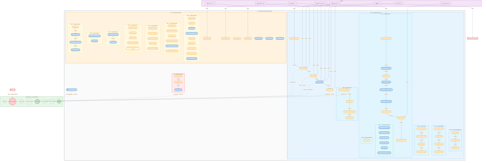

# prueba

```mermaid
%%{init: {'theme': 'base', 'themeVariables': {'primaryColor': '#E8F4FD', 'primaryBorderColor': '#2196F3', 'secondaryColor': '#FFF3E0', 'tertiaryColor': '#E8F5E9', 'lineColor': '#455A64', 'fontSize': '12px'}}}%%

flowchart TD

%% ============================================================
%% PROCESO AMBIENTAL (fuera del sistema)
%% ============================================================
    ENV_ENF([fa:fa-virus Enfermar]):::ambiental
    ENV_FISC([fa:fa-search Fiscalizar Establecimiento]):::ambiental

%% ============================================================
%% SD — SISTEMA DE HOSPITALIZACION DOMICILIARIA
%% ============================================================
    subgraph SD["SD — Sistema de Hospitalizacion Domiciliaria"]
        direction TB

        HOSP([fa:fa-hospital Hospitalizar en Domicilio]):::procesoFisico

        %% --- SD1: Hospitalizar en Domicilio (in-zoom secuencial) ---
        subgraph SD1["SD1 — Hospitalizar en Domicilio"]
            direction TB

            AE([Autorizar Establecimiento]):::procesoInfo
            EE([Evaluar Elegibilidad]):::procesoInfo
            IP([Ingresar Paciente]):::procesoInfo
            TD([Tratar en Domicilio]):::procesoFisico
            EP([Egresar Paciente]):::procesoInfo

            AE -->|secuencia| EE -->|secuencia| IP -->|secuencia| TD -->|secuencia| EP

            %% --- SD1.1: Autorizar Establecimiento ---
            subgraph SD1_1["SD1.1 — Autorizar Establecimiento"]
                direction TB
                PS([Presentar Solicitud]):::procesoInfo
                EVA([Evaluar Antecedentes]):::procesoInfo
                OA([Otorgar Autorizacion]):::procesoInfo

                PS -->|secuencia| EVA -->|secuencia| OA
            end

            %% --- SD1.2: Evaluar Elegibilidad ---
            subgraph SD1_2["SD1.2 — Evaluar Elegibilidad"]
                direction TB
                ECC([Evaluar Condicion Clinica]):::procesoInfo
                ED([Evaluar Domicilio]):::procesoInfo
                ERA([Evaluar Red de Apoyo]):::procesoInfo
                VC([Verificar Consentimiento]):::procesoInfo

                ECC -->|secuencia| ED -->|secuencia| ERA -->|secuencia| VC
            end

            %% --- SD1.3: Ingresar Paciente ---
            subgraph SD1_3["SD1.3 — Ingresar Paciente"]
                direction TB
                FPT([Formular Plan Terapeutico]):::procesoInfo
                FPC([Formular Plan de Cuidados]):::procesoInfo
                RI([Registrar Ingreso]):::procesoInfo
                ERC([Entregar Resumen Clinico]):::procesoInfo

                FPT -->|secuencia| FPC -->|secuencia| RI -->|secuencia| ERC
            end

            %% --- SD1.4: Tratar en Domicilio ---
            subgraph SD1_4["SD1.4 — Tratar en Domicilio"]
                direction TB
                PVD([Programar Visita Domiciliaria]):::procesoInfo
                EVD([Ejecutar Visita Domiciliaria]):::procesoFisico
                EVO([Evaluar Evolucion]):::procesoInfo
                AT([Administrar Tratamiento]):::procesoFisico
                GCE([Gestionar Cuidados de Enfermeria]):::procesoFisico
                OTK([Otorgar Terapia Kinesiologica]):::procesoFisico
                EPF([Educar Paciente y Familia]):::procesoInfo
                RAD([Regular a Distancia]):::procesoInfo
                REC([Registrar Evolucion Clinica]):::procesoInfo

                PVD -->|secuencia| EVD -->|secuencia| EVO -->|secuencia| AT
                AT -->|secuencia| GCE -->|secuencia| OTK -->|secuencia| EPF
                EPF -->|secuencia| RAD -->|secuencia| REC

                %% --- SD1.4.1: Administrar Tratamiento (unfolding) ---
                subgraph SD1_4_1["SD1.4.1 — Administrar Tratamiento"]
                    direction LR
                    MVP([Manejar Via Venosa Periferica]):::procesoFisico
                    MVC([Manejar Via Venosa Central]):::procesoFisico
                    MCU([Manejar Cateter Urinario]):::procesoFisico
                    MTR([Manejar Traqueostomia]):::procesoFisico
                    TM([Tomar Muestras]):::procesoFisico
                    APA([Aplicar Precauciones de Aislamiento]):::procesoFisico
                end

                %% --- SD1.4.2: Regular a Distancia ---
                subgraph SD1_4_2["SD1.4.2 — Regular a Distancia"]
                    direction LR
                    ATIC([Atender con TIC]):::procesoInfo
                end
            end

            %% --- SD1.5: Egresar Paciente ---
            subgraph SD1_5["SD1.5 — Egresar Paciente"]
                direction TB
                DCE([Determinar Causal de Egreso]):::procesoInfo
                EPI([Elaborar Epicrisis]):::procesoInfo
                AES([Aplicar Encuesta de Satisfaccion]):::procesoInfo
                CFC([Cerrar Ficha Clinica]):::procesoInfo

                DCE -->|secuencia| EPI -->|secuencia| AES -->|secuencia| CFC
            end
        end

        %% --- SD2: Operaciones del Sistema (unfolding) ---
        subgraph SD2["SD2 — Operaciones del Sistema"]
            direction TB

            DT_P([Dirigir Tecnicamente]):::procesoInfo
            CO_P([Coordinar Operaciones]):::procesoInfo
            GR_P([Gestionar Registros]):::procesoInfo
            CP_P([Capacitar Personal]):::procesoInfo
            GRES_P([Gestionar Residuos]):::procesoFisico
            ME_P([Mantener Equipos]):::procesoFisico
            AF_P([Abastecer Farmacia]):::procesoFisico

            %% --- SD2.1: Dirigir Tecnicamente (unfolding) ---
            subgraph SD2_1["SD2.1 — Dirigir Tecnicamente"]
                direction LR
                AM([Aprobar Manuales]):::procesoInfo
                ATU([Aprobar Turnos]):::procesoInfo
                MS([Mantener Stock]):::procesoFisico
                VME([Verificar Mantencion de Equipos]):::procesoFisico
                SI([Supervisar IAAS]):::procesoInfo
                GCA([Gestionar Calidad]):::procesoInfo
                GCAP([Gestionar Capacitacion]):::procesoInfo
                CDE([Coordinar con Derivadores]):::procesoInfo
                ATO([Asegurar Traslado Oportuno]):::procesoFisico
            end

            %% --- SD2.2: Coordinar Operaciones (unfolding) ---
            subgraph SD2_2["SD2.2 — Coordinar Operaciones"]
                direction LR
                SM([Supervisar Manuales]):::procesoInfo
                SPC([Supervisar Procesos Clinicos]):::procesoInfo
                GP([Gestionar Personal]):::procesoInfo
                SCC([Supervisar Calidad de Cuidados]):::procesoInfo
                GIO([Gestionar Insumos Operacionales]):::procesoFisico
                CCA([Coordinar Continuidad Asistencial]):::procesoInfo
            end

            %% --- SD2.3: Gestionar Registros (unfolding) ---
            subgraph SD2_3["SD2.3 — Gestionar Registros"]
                direction LR
                MFC([Mantener Ficha Clinica]):::procesoInfo
                RCO([Registrar Consentimiento]):::procesoInfo
                MRC([Mantener Resumen Clinico]):::procesoInfo
                RL([Registrar Llamadas]):::procesoInfo
                RCF([Resguardar Confidencialidad]):::procesoInfo
            end

            %% --- SD2.4: Capacitar Personal (unfolding) ---
            subgraph SD2_4["SD2.4 — Capacitar Personal"]
                direction LR
                IPN([Inducir Personal Nuevo]):::procesoInfo
                CIA([Capacitar en IAAS]):::procesoInfo
                CRC([Capacitar en RCP]):::procesoInfo
                CUD([Certificar Uso de Desfibrilador]):::procesoInfo
                CHC([Capacitar en Humanizacion del Cuidado]):::procesoInfo
            end

            %% --- SD2.5: Gestionar Residuos (in-zoom) ---
            subgraph SD2_5["SD2.5 — Gestionar Residuos"]
                direction TB
                ALT([Almacenar Transitoriamente]):::procesoFisico
                RR([Retirar Residuos]):::procesoFisico
                ALT -->|secuencia| RR
            end

            %% --- SD2.6: Mantener Equipos (unfolding) ---
            subgraph SD2_6["SD2.6 — Mantener Equipos"]
                direction LR
                EMP([Ejecutar Mantencion Preventiva]):::procesoFisico
                REQ([Reparar Equipo]):::procesoFisico
            end

            %% --- SD2.7: Abastecer Farmacia (in-zoom) ---
            subgraph SD2_7["SD2.7 — Abastecer Farmacia"]
                direction TB
                CS([Controlar Stock]):::procesoInfo
                ADM([Adquirir Medicamentos]):::procesoFisico
                ACF([Almacenar con Cadena de Frio]):::procesoFisico
                DED([Dispensar en Domicilio]):::procesoFisico
                CS -->|secuencia| ADM -->|secuencia| ACF -->|secuencia| DED
            end
        end

        %% --- SD3: Manejar Emergencia (in-zoom) ---
        subgraph SD3["SD3 — Manejar Emergencia"]
            direction TB
            DA([Detectar Agudizacion]):::procesoInfo
            CR([Coordinar Reingreso]):::procesoInfo
            TP([Trasladar Paciente]):::procesoFisico
            DA -->|secuencia| CR -->|secuencia| TP
        end
    end

%% ============================================================
%% FLUJO DE ESTADO: CONDICION CLINICA DEL PACIENTE
%% ============================================================
    subgraph ESTADOS["Condicion Clinica — Ciclo de Estados"]
        direction LR
        S_EST((estable)):::estado
        S_AGU((agudo-reagudizado)):::estadoInicial
        S_ING((ingresado)):::estado
        S_TRA((en-tratamiento)):::estado
        S_REC((recuperado)):::estadoFinal
        S_EGR((egresado)):::estado
        S_REI((reinternado)):::estado
        S_FAL((fallecido)):::estadoFinal
    end

%% ============================================================
%% TRANSICIONES DE ESTADO (proceso → cambio de estado)
%% ============================================================
    ENV_ENF -.->|"estable → agudo-reagudizado"| S_AGU
    EE -.->|"condition: estable"| S_EST
    IP -.->|"estable → ingresado"| S_ING
    TD -.->|"ingresado → en-tratamiento"| S_TRA
    EP -.->|"en-tratamiento → egresado"| S_EGR
    DCE -.->|"determina causal"| S_EGR
    TP -.->|"en-tratamiento → reinternado"| S_REI
    HOSP -.->|"agudo-reagudizado → recuperado"| S_REC

%% ============================================================
%% AGENTES (quien maneja que)
%% ============================================================
    subgraph AGENTES["Agentes"]
        direction LR
        AG_DT[fa:fa-user-md Director Tecnico]:::agente
        AG_CO[fa:fa-user Coordinador]:::agente
        AG_MAD[fa:fa-stethoscope Medico Atencion Directa]:::agente
        AG_EC[fa:fa-heartbeat Enfermero Clinico]:::agente
        AG_KI[fa:fa-running Kinesiologo]:::agente
        AG_TS[fa:fa-hands-helping Trabajador Social]:::agente
        AG_MR[fa:fa-phone-alt Medico Regulador]:::agente
        AG_SE[fa:fa-landmark SEREMI]:::agente
    end

%% Agent links principales
    AG_SE -->|maneja| AE
    AG_SE -->|maneja| ENV_FISC
    AG_MAD -->|maneja| EE
    AG_MAD -->|maneja| IP
    AG_MAD -->|maneja| TD
    AG_MAD -->|maneja| EP
    AG_EC -->|maneja| EE
    AG_EC -->|maneja| IP
    AG_EC -->|maneja| TD
    AG_EC -->|maneja| EP
    AG_TS -->|maneja| EE
    AG_KI -->|maneja| TD
    AG_DT -->|maneja| DT_P
    AG_CO -->|maneja| CO_P
    AG_DT -->|maneja| CP_P
    AG_MR -->|maneja| RAD
    AG_CO -->|maneja| PVD

%% ============================================================
%% ESTILOS
%% ============================================================
    classDef procesoFisico fill:#E3F2FD,stroke:#1565C0,stroke-width:2px,color:#0D47A1
    classDef procesoInfo fill:#FFF8E1,stroke:#F9A825,stroke-width:2px,color:#E65100
    classDef ambiental fill:#FFEBEE,stroke:#C62828,stroke-width:2px,stroke-dasharray:5 5,color:#B71C1C
    classDef estado fill:#E8F5E9,stroke:#2E7D32,stroke-width:1px,color:#1B5E20
    classDef estadoInicial fill:#FFCDD2,stroke:#C62828,stroke-width:2px,color:#B71C1C
    classDef estadoFinal fill:#C8E6C9,stroke:#2E7D32,stroke-width:3px,color:#1B5E20
    classDef agente fill:#F3E5F5,stroke:#7B1FA2,stroke-width:1px,color:#4A148C

    style SD fill:#FAFAFA,stroke:#90A4AE,stroke-width:3px
    style SD1 fill:#E8F4FD,stroke:#42A5F5,stroke-width:2px
    style SD1_1 fill:#E1F5FE,stroke:#039BE5,stroke-width:1px
    style SD1_2 fill:#E1F5FE,stroke:#039BE5,stroke-width:1px
    style SD1_3 fill:#E1F5FE,stroke:#039BE5,stroke-width:1px
    style SD1_4 fill:#E1F5FE,stroke:#039BE5,stroke-width:1px
    style SD1_4_1 fill:#E0F7FA,stroke:#00ACC1,stroke-width:1px
    style SD1_4_2 fill:#E0F7FA,stroke:#00ACC1,stroke-width:1px
    style SD1_5 fill:#E1F5FE,stroke:#039BE5,stroke-width:1px
    style SD2 fill:#FFF3E0,stroke:#FB8C00,stroke-width:2px
    style SD2_1 fill:#FFF8E1,stroke:#FFC107,stroke-width:1px
    style SD2_2 fill:#FFF8E1,stroke:#FFC107,stroke-width:1px
    style SD2_3 fill:#FFF8E1,stroke:#FFC107,stroke-width:1px
    style SD2_4 fill:#FFF8E1,stroke:#FFC107,stroke-width:1px
    style SD2_5 fill:#FFF8E1,stroke:#FFC107,stroke-width:1px
    style SD2_6 fill:#FFF8E1,stroke:#FFC107,stroke-width:1px
    style SD2_7 fill:#FFF8E1,stroke:#FFC107,stroke-width:1px
    style SD3 fill:#FFEBEE,stroke:#EF5350,stroke-width:2px
    style ESTADOS fill:#E8F5E9,stroke:#66BB6A,stroke-width:2px
    style AGENTES fill:#F3E5F5,stroke:#AB47BC,stroke-width:2px
```