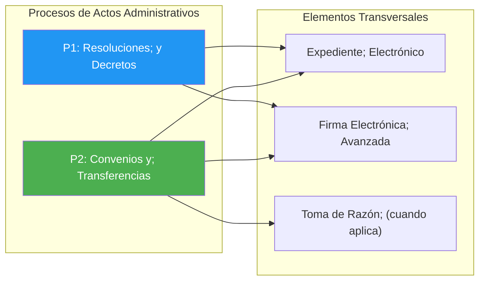
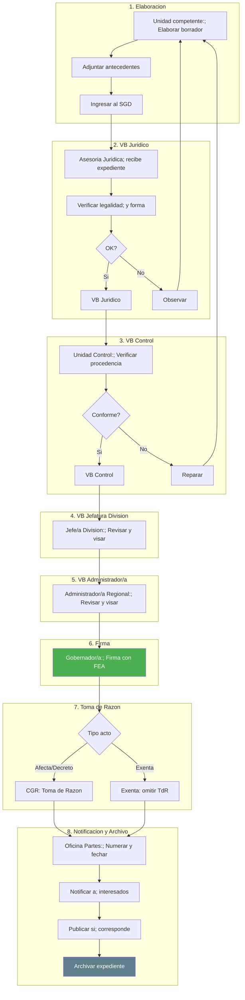
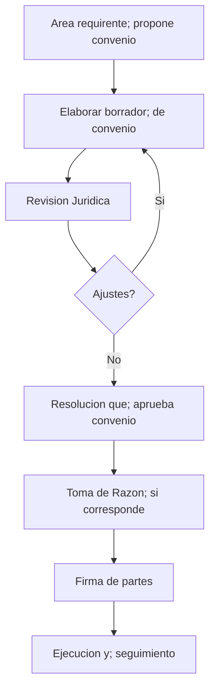
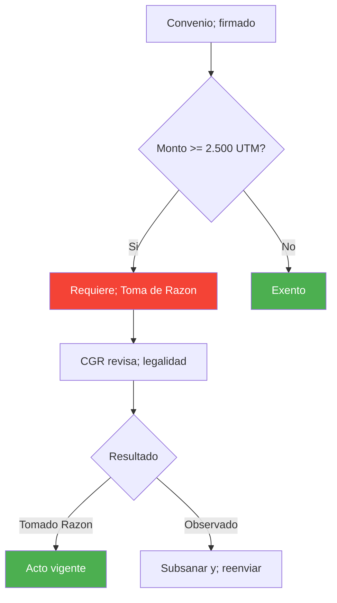
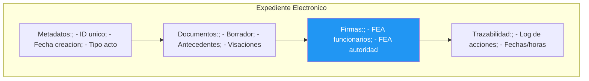

---
_manifest:
  urn: urn:gn:kb:bpmn-actos-administrativos
  provenance:
    created_by: FS
    created_at: '2026-03-15'
    source: BPMN D01 Tramitación Actos Administrativos GORE Ñuble, reconciliado con
      ssot-actos-admin v1.1.1
version: 1.0.0
status: published
tags:
- actos-administrativos
- resoluciones
- convenios
- gore-nuble
- tramitacion
lang: es
extensions:
  gn:
    family: guide
  kora:
    shard_index: 1
    shard_count: 1
    shard_root_urn: urn:gn:kb:bpmn-actos-administrativos
---

# Tramitación de Actos Administrativos — GORE Ñuble

## Visión General

| Atributo | Valor |
|---|---|
| Criticidad | Alta |
| Dueño funcional | Unidad Jurídica |
| Procesos | 2 |
| Subprocesos | ~14 fases |

Dos procesos principales:

1. **P1 — Resoluciones**: tramitación de resoluciones (exentas y afectas) y decretos. 8 etapas canónicas de aprobación.
2. **P2 — Convenios y Transferencias**: tramitación de convenios y transferencias de recursos.

Elementos transversales: expediente electrónico, firma electrónica avanzada (FEA) y toma de razón (cuando aplica).

## Tipos de acto administrativo

| Tipo | Sujeto a TdR | Subtipos |
|---|---|---|
| Decreto | Sí | — |
| Resolución | Depende del monto | Exenta (< umbral CGR), Afecta (>= umbral CGR) |
| Oficio | No | — |

Umbral Toma de Razón CGR para GORE Ñuble: **2.500 UTM** (base legal: Res. 7/2019 CGR).

## Mapa de Procesos

## Etapas de aprobación (8 canónicas)

SLA: 15 días hábiles.

| Seq | Etapa | Actor |
|-----|-------|-------|
| 1 | Elaboración (Borrador) | Unidad competente |
| 2 | V.B. Jurídico | Asesoría Jurídica |
| 3 | V.B. Control | Unidad de Control |
| 4 | V.B. Jefatura División | Jefe/a de División |
| 5 | V.B. Administrador/a Regional | Administrador/a Regional |
| 6 | Firma Gobernador/a (FEA) | Gobernador/a Regional |
| 7 | Toma de Razón CGR | Contraloría General (solo Resoluciones Afectas y Decretos) |
| 8 | Notificación y Archivo | Oficina de Partes |

Resoluciones Exentas (monto < 2.500 UTM): omiten etapa 7 (TdR); pasan directamente de Firma a Notificación.

### Diagrama de Flujo

## Convenios y Transferencias

Proceso para la tramitación de convenios y transferencias asociadas a actos administrativos.

### Diagrama de Flujo

### Contenido Mínimo del Convenio

| Elemento | Descripción |
|---|---|
| Partes | GORE + Entidad receptora |
| Objeto | Descripción del programa/proyecto |
| Monto | Valor total y calendario |
| Plazos | Duración y fechas clave |
| Obligaciones | Deberes de cada parte |
| Rendición | Modalidad, plazos, SISREC |
| Restitución | Condiciones de devolución |
| Probidad | Cláusulas anticorrupción |

### Criterios de Toma de Razón

Resolución aprobatoria del convenio se somete a TdR CGR cuando el monto supera el umbral (2.500 UTM para GORE Ñuble).

## Expediente Electrónico

Estructura del expediente electrónico conforme a Ley 21.180 de Transformación Digital del Estado.

### Principios TDE Aplicables

| Principio | Aplicación |
|---|---|
| Equivalencia funcional | Documento digital = papel |
| Neutralidad tecnológica | Sin dependencia de proveedor |
| Interoperabilidad | Comunicación entre sistemas |
| Seguridad | Integridad, autenticidad, no repudio |

## Normativa Aplicable

| Norma | Alcance |
|---|---|
| Ley 19.880 LBPA | Procedimiento administrativo |
| Ley 21.180 TDE | Expediente electrónico |
| Ley 19.799 | Firma electrónica |
| Res. 7/2019 CGR | Umbrales Toma de Razón |
| Resolución 30/2015 CGR | Rendiciones |
| Ley 19.886 | Contratación pública |

## Sistemas de Información

| Sistema | Función |
|---|---|
| SYS-DOCDIGITAL | Gestión documental, expediente |
| SYS-FIRMAGOB | Firma Electrónica Avanzada |
| SYS-SIGFE | Registro de compromisos |
| SYS-TRANSPARENCIA | Publicación |
