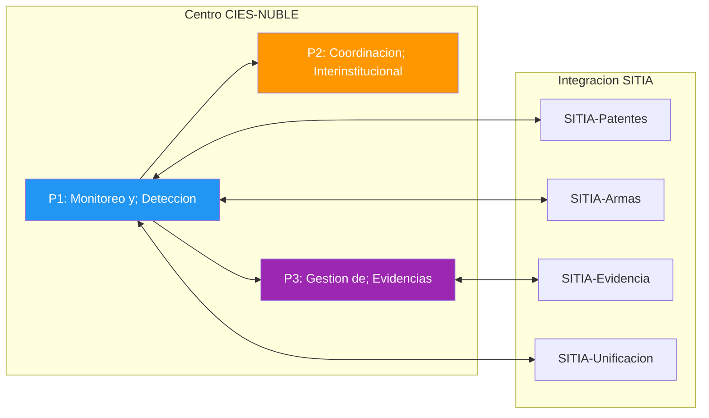
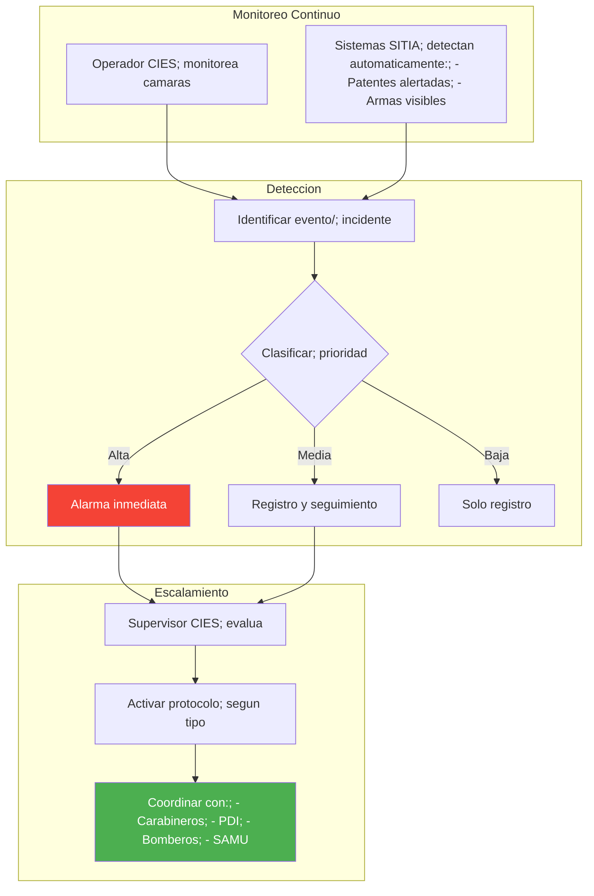
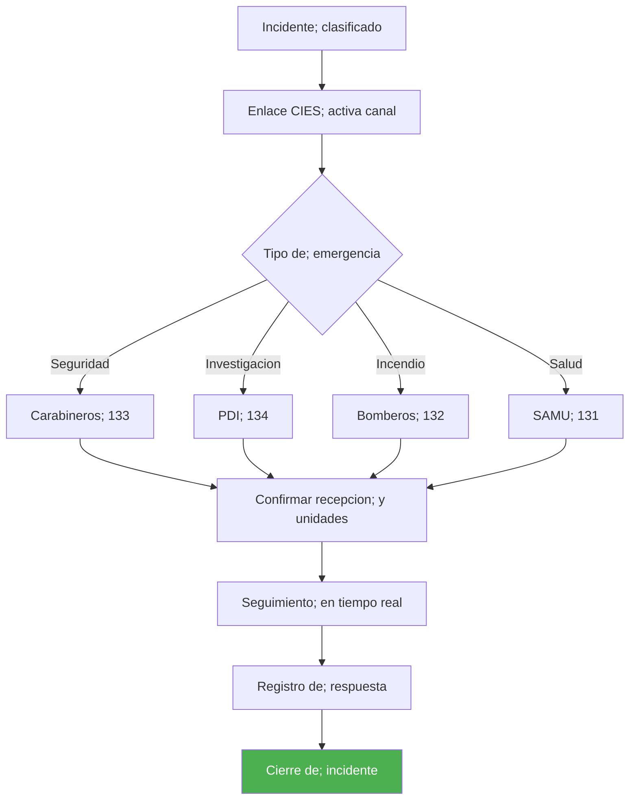
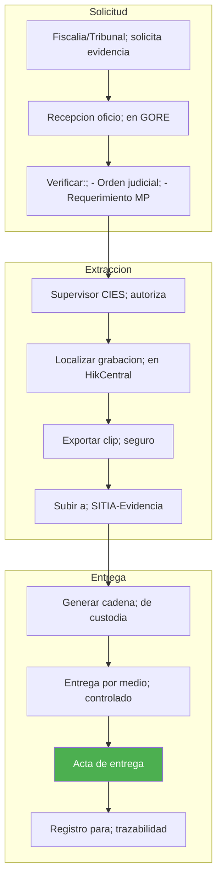
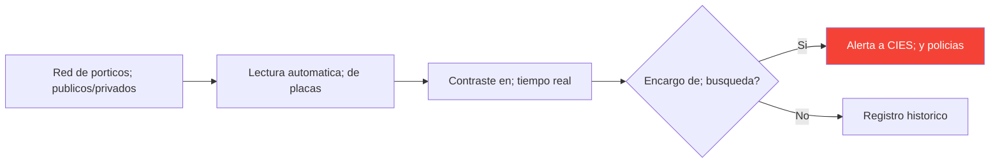
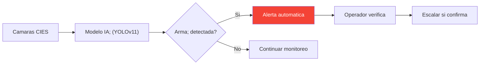
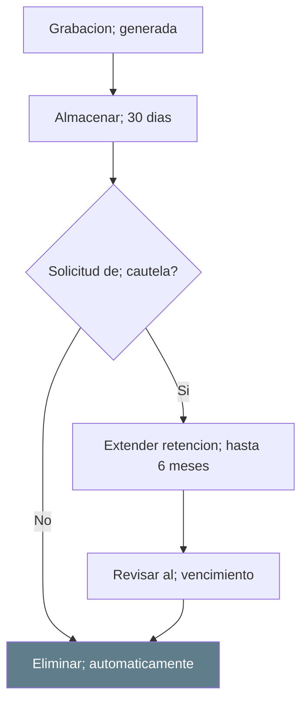

---
_manifest:
  urn: urn:gn:kb:bpmn-cies-sitia
  provenance:
    created_by: FS
    created_at: '2026-03-15'
    source: BPMN D09 Gestión Operativa CIES/SITIA GORE Ñuble
version: 1.0.0
status: published
tags:
- seguridad-publica
- cies
- sitia
- videovigilancia
- gore-nuble
lang: es
extensions:
  gn:
    family: guide
  kora:
    shard_index: 1
    shard_count: 1
    shard_root_urn: urn:gn:kb:bpmn-cies-sitia
---

# Gestion Operativa CIES/SITIA -- GORE Nuble

## Vision General

El Centro Integrado de Emergencias y Seguridad (CIES) de GORE Nuble opera con criticidad alta bajo la responsabilidad del Supervisor CIES. El dominio comprende 3 procesos principales y aproximadamente 8 subprocesos que articulan monitoreo por videovigilancia, coordinacion interinstitucional y gestion de evidencias digitales.

- **Cobertura**: 16 horas (08:00-00:00), con proyeccion a regimen 24/7.
- **Ubicacion**: Sala de monitoreo GORE Nuble.
- **Coordinacion**: Policias, servicios de emergencia y 21 municipios de la region.
- **Marco legal**: Ley 21.427 (Sistema Nacional de Seguridad), Ley 20.965 (Camaras de vigilancia), Ley 20.502 (ONEMI/funcionamiento).

## Mapa de Procesos

## Monitoreo, Deteccion y Escalamiento

Proceso P1. Sistema principal: HikCentral VMS. Operadores CIES monitorean camaras en tiempo real mientras los subsistemas SITIA ejecutan deteccion automatica de patentes alertadas y armas visibles. Los eventos detectados se clasifican por prioridad y escalan segun protocolo.

### Flujo

### Clasificacion de Incidentes

| Prioridad | Tipo | Accion |
|-----------|------|--------|
| **Alta** | Delito en curso, emergencia vital | Activacion inmediata |
| **Media** | Sospecha, situacion anomala | Seguimiento y evaluacion |
| **Baja** | Evento menor, registro | Solo documentar |

## Coordinacion Interinstitucional

Proceso P2. Entidades coordinadas: Carabineros, PDI, Bomberos, SAMU, Municipios. Una vez clasificado el incidente, el enlace CIES activa el canal correspondiente segun tipo de emergencia, confirma recepcion y unidades despachadas, realiza seguimiento en tiempo real y registra la respuesta hasta cierre del incidente.

### Flujo

### Protocolos de Comunicacion

| Canal | Uso |
|-------|-----|
| Radio VHF | Comunicacion directa policias |
| Lineas directas | Centrales de emergencia |
| WhatsApp institucional | Coordinacion municipal |
| Plataforma SITIA | Integracion nacional |

## Gestion de Evidencias Digitales

Proceso P3. Plataforma: SITIA-Evidencia (Genetec Clearance). La solicitud de evidencia se origina en Fiscalia o Tribunal mediante oficio, que se verifica contra orden judicial o requerimiento del Ministerio Publico. El Supervisor CIES autoriza la extraccion, se localiza la grabacion en HikCentral, se exporta el clip seguro, se sube a SITIA-Evidencia, se genera cadena de custodia, se entrega por medio controlado con acta y se registra para trazabilidad.

### Flujo

### Cadena de Custodia Digital

| Elemento | Verificacion |
|----------|-------------|
| Hash de archivo | Integridad |
| Metadatos | Fecha/hora/camara |
| Log de accesos | Quien manipulo |
| Firma digital | Autenticidad |

## Capacidades SITIA

### SITIA-Patentes

Red de porticos publicos y privados con lectura automatica de placas. El sistema contrasta en tiempo real contra bases de encargos de busqueda. Si hay coincidencia, genera alerta inmediata a CIES y policias; en caso contrario, registra en historico.

### SITIA-Armas

Camaras CIES alimentan modelo de IA (YOLOv11) para deteccion automatica de armas. Ante deteccion positiva se genera alerta automatica, un operador verifica y escala si confirma.

## Privacidad y Retencion

### Politica de Retencion

| Aspecto | Regla |
|---------|-------|
| Retencion normal | 30 dias |
| Eliminacion | Segura e irreversible |
| Cautela ciudadana | Hasta 6 meses (victima/testigo) |

### Cumplimiento Normativo

Las grabaciones se almacenan por 30 dias. Ante solicitud de cautela ciudadana, la retencion se extiende hasta 6 meses. Al vencimiento, se ejecuta eliminacion automatica segura. La Ley 19.628 establece que el tratamiento de datos personales debe respetar principios de licitud, finalidad y proporcionalidad.

## Sostenibilidad Operativa

### Modelo de Financiamiento

| Componente | Fuente |
|------------|--------|
| Personal CIES | Presupuesto anual GORE |
| Mantencion equipos | Garantia 22 meses + presupuesto |
| Servicios SITIA | Convenio marco con SPD |

### Mantencion

Ciclo trimestral: revision de equipos, actualizaciones de software y reporte de estado.

## Normativa Aplicable

| Norma | Alcance |
|-------|---------|
| Ley 21.427 | Sistema Nacional de Seguridad |
| Ley 20.965 | Camaras de vigilancia |
| Ley 20.502 | ONEMI/funcionamiento |
| Ley 19.628 | Proteccion de la vida privada |
| Ley 21.719 | Datos personales |
| Ley 21.730 | Ministerio de Seguridad Publica; SEREMI Seguridad Publica regional |

## Sistemas de Informacion

| Sistema | Funcion |
|---------|---------|
| HikCentral | VMS gestion de camaras |
| SITIA | Plataforma nacional de integracion |
| SITIA-Evidencia | Gestion de evidencias (Genetec Clearance) |
| SITIA-Patentes | Lectura automatica de placas |
| SITIA-Armas | Deteccion de armas por IA (YOLOv11) |
