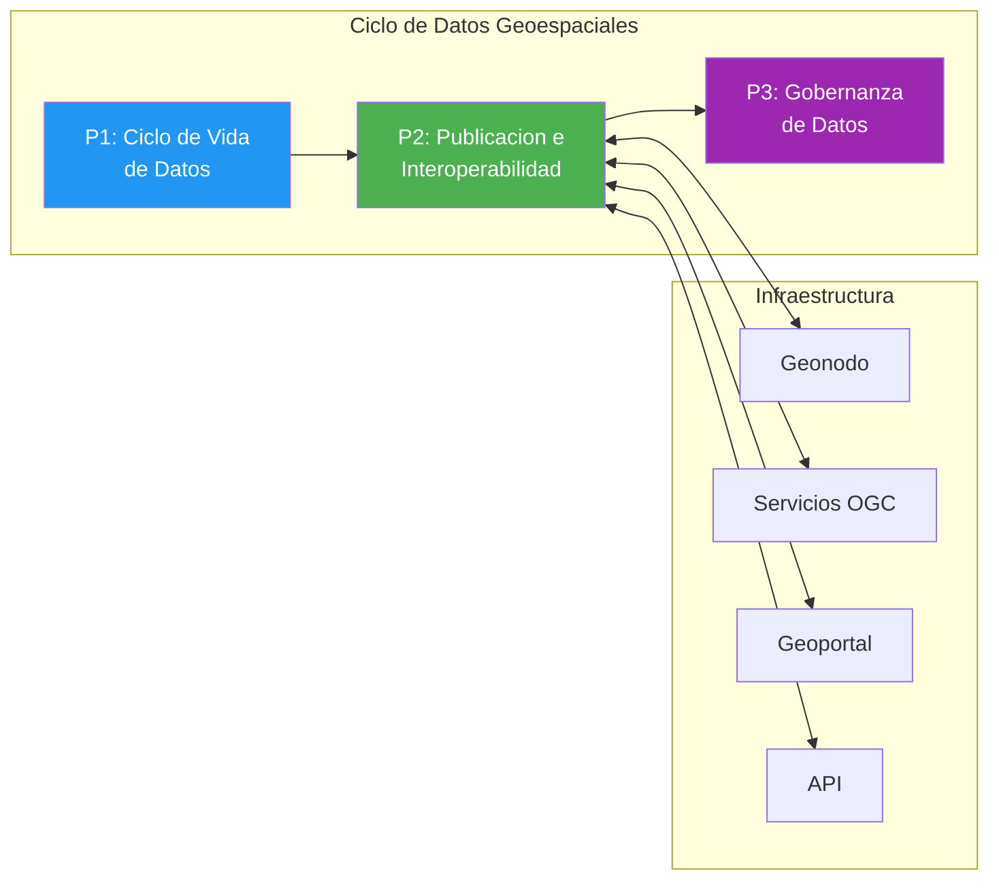
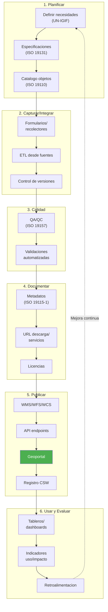
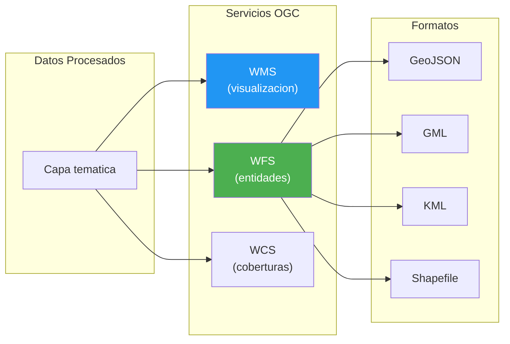
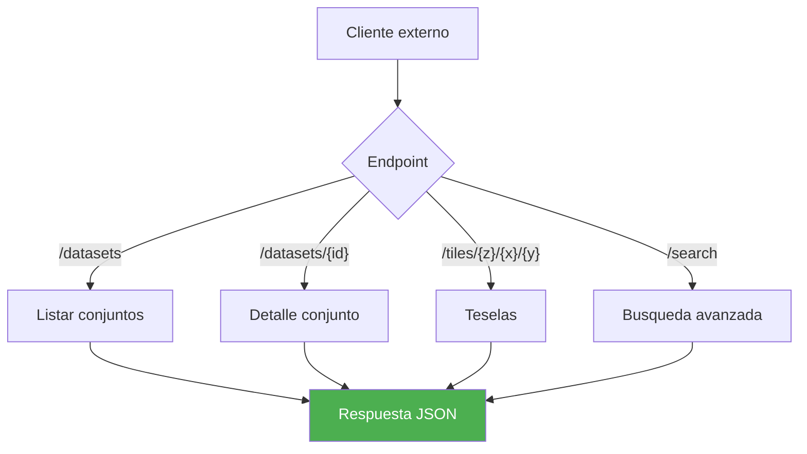
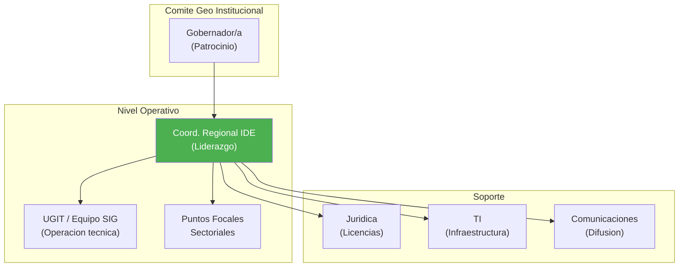
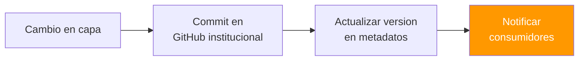
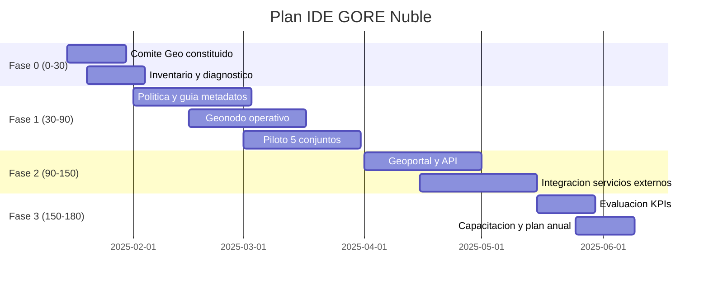

---
_manifest:
  urn: "urn:gn:kb:bpmn-geoespacial-ide"
  provenance:
    created_by: "FS"
    created_at: "2026-03-15"
    source: "BPMN D10 Gestión Información Geoespacial IDE/Geonodo GORE Ñuble"
version: "1.0.0"
status: published
tags: [geoespacial, ide, geonodo, sig, gore-nuble, interoperabilidad]
lang: es
extensions:
  gn:
    family: guide
---

# Gestión de Información Geoespacial (IDE/Geonodo) — GORE Ñuble

## Visión General

El dominio de Gestión de Información Geoespacial articula la Infraestructura de Datos Espaciales (IDE) y el Geonodo del Gobierno Regional de Ñuble. Tiene criticidad media, es liderado por el Coordinador Regional IDE y se estructura en 3 procesos con aproximadamente 10 subprocesos.

Los tres procesos cubren el ciclo completo de la información geoespacial institucional:

- **P1 — Ciclo de Vida de Datos Geoespaciales**: planificación, captura, calidad, documentación, publicación y evaluación de uso.
- **P2 — Publicación e Interoperabilidad**: servicios OGC (WMS/WFS/WCS), API REST institucional y Geoportal público.
- **P3 — Gobernanza de Datos Geoespaciales**: estructura de roles, trazabilidad, versionamiento y licenciamiento.

## Marco Estratégico

| Aspecto | Alineamiento |
|---|---|
| ERD Ñuble | Gestión territorial informada |
| PROT Ñuble | Plan Regional de Ordenamiento Territorial; vinculante (Art. 17 LOC) |
| IDE Chile | Interoperabilidad nacional |
| ISO/TC 211 | Estándares geoespaciales |
| OGC | Servicios web abiertos |

## Mapa de Procesos

## Ciclo de Vida de Datos Geoespaciales

El proceso P1 estructura el flujo completo de datos geoespaciales en 6 fases secuenciales con retroalimentación de mejora continua.

### Diagrama de Flujo

### Responsables por Etapa

| Etapa | Responsable |
|---|---|
| Planificar | Coord. Regional IDE |
| Capturar/Calidad | UGIT / Equipo SIG |
| Documentar/Publicar | UGIT / Equipo SIG |
| Usar y Evaluar | Divisiones usuarias |

## Publicación e Interoperabilidad

El proceso P2 expone los datos geoespaciales procesados a través de servicios estandarizados OGC, una API REST institucional y un Geoportal público.

### Servicios OGC

### API Institucional

### Geoportal

| Funcionalidad | Descripción |
|---|---|
| Búsqueda | Por tema, palabra clave, ubicación |
| Previsualización | Visor WMS integrado |
| Descarga | Múltiples formatos |
| Tutoriales | Guías por perfil de usuario |

## Gobernanza de Datos Geoespaciales

El proceso P3 define la estructura de roles, los mecanismos de trazabilidad y el régimen de licenciamiento de las capas geoespaciales institucionales.

### Roles de Gobernanza

### Trazabilidad y Versionamiento

El flujo de trazabilidad opera en cuatro pasos: un cambio en una capa geoespacial genera un commit en el repositorio GitHub institucional, se actualiza la versión en los metadatos asociados y se notifica a los consumidores afectados.

### Licenciamiento

| Tipo de Capa | Licencia Recomendada |
|---|---|
| Datos abiertos | CC BY 4.0 |
| Bases de datos | ODbL |
| Datos restringidos | Acuerdo específico |

## Ética de Datos Geoespaciales

| Principio | Aplicación |
|---|---|
| Minimización | Evitar granularidad innecesaria |
| Anonimización | Cuando corresponda |
| Transparencia | Declarar origen y licencias |
| No estigmatización | Evitar visualizaciones dañinas |
| Calidad | Tratarla como deber público |

## Plan de Implementación

Plan de despliegue en 180 días, organizado en 4 fases progresivas desde la constitución del Comité Geo hasta la evaluación de KPIs y capacitación.

## Normativa Aplicable

| Norma | Alcance |
|---|---|
| ISO 19115-1 | Metadatos |
| ISO 19157 | Calidad de datos |
| ISO 19131 | Especificaciones |
| Política IDE Chile | Interoperabilidad nacional |
| Ley 21.455 | Cambio climático (datos) |

## Sistemas de Información

| Sistema | Función |
|---|---|
| Geonodo | Plataforma geoespacial |
| CSW | Catálogo de metadatos |
| Servicios OGC | WMS/WFS/WCS |
| Geoportal | Portal público |
| API Geoespacial | API REST |
| GitHub Institucional | Versionamiento |
