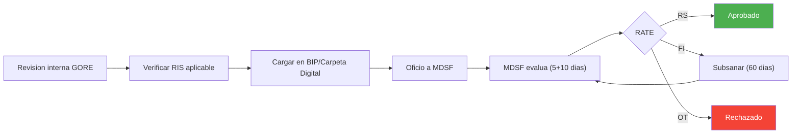
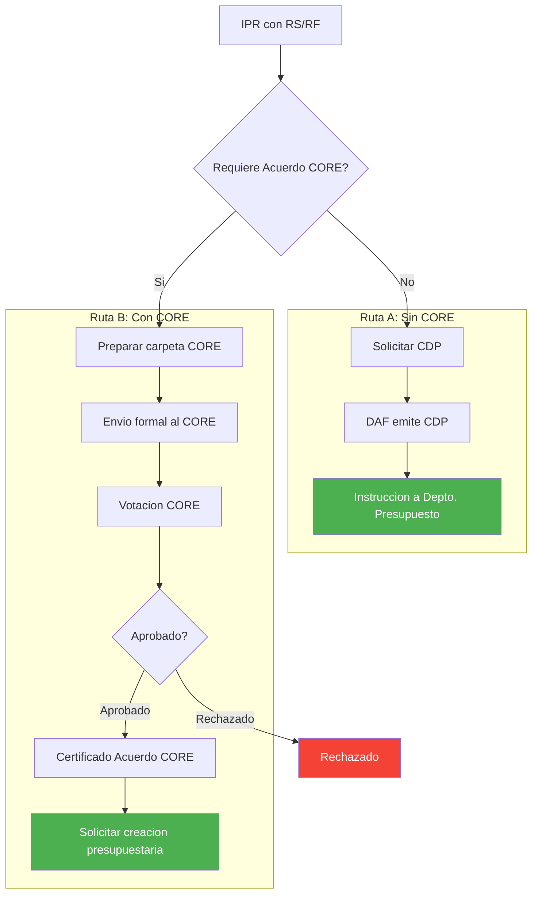

---
_manifest:
  urn: urn:gn:kb:gestion-ipr-p02
  provenance:
    created_by: FS
    created_at: '2026-03-15'
    source: kb_gn_019_gestion_ipr.md + D03_gestion_ipr_koda.yml
version: 1.1.0
status: published
tags:
- gestion-ipr
- ciclo-vida
- inversión-regional
- gore-nuble
- dipir
- evaluacion-tecnica
- seguimiento
lang: es
extensions:
  gn:
    family: guide
  kora:
    shard_index: 2
    shard_count: 4
    shard_root_urn: urn:gn:kb:gestion-ipr
---

# Gestión Operacional de Intervenciones Públicas Regionales (IPR) - Parte 02

## 3.1 Track A – SNI (Análisis Estándar y Enriquecido, Niveles 2 y 3)

Evalúa IDI de mayor envergadura que requieren RS de MDSF.

**Paso 1 – Analista GORE (DIPIR)**

- Revisión de fondo considerando antecedentes de Fase 1
- Verificar cumplimiento de RIS y metodologías SNI aplicables
- Asegurar calidad de estudios preinversionales (Perfil, Prefactibilidad, etc.)
- Elaborar Acta de Admisibilidad interna GORE
- Output: `ADMISIBLE PARA ENVÍO A MDSF` o `INADMISIBLE`

**Paso 2 – Jefatura DIPIR / Gobernador/a**

- Elaborar y visar oficio solicitando evaluación ex ante al SEREMI MDSF
- Gestionar cadena de V°B° interno y firma del Gobernador/a
- Output: oficio despachado a MDSF

**Paso 3 – Jefatura de Preinversión (DIPIR)**

- Registrar formalmente la "Informar Postulación" en el BIP
- Output: iniciativa `ENVIADO A MDSF` en BIP

**Paso 4 – Analista MDSF**

- Evaluación de admisibilidad (plazo orientativo: 5 días)
- Análisis técnico-económico ATE (plazo orientativo: 10 días)
- Output: RATE `RS`, `FI` u `OT`

**Paso 5 – Unidad Formuladora / Analista GORE**

- Si RS: registrar aprobación técnica y preparar paso a financiamiento
- Si FI u OT: apoyar a la Unidad Formuladora en subsanar observaciones (plazo máx. 60 días hábiles)
- Output: `APROBADO TÉCNICAMENTE (RS)` o `OBSERVACIONES SUBSANADAS`

**Paso 6 – Jefatura de Preinversión (DIPIR)**

- Monitorear BIP para obtener resultado de MDSF
- Informar cartera con RS a Jefatura DIPIR para preparación de presentación al Gobernador/a
- Output: cartera RS disponible para priorización

## 3.2 Track B – Programas Públicos Regionales (Glosa 06)

Evalúa programas de gasto corriente/mixto ejecutados por el GORE según proceso bifásico DIPRES/SES.

Aplica también a: programas en continuidad, subvenciones 8% FNDR, transferencias a entidades públicas, ayudas tempranas por emergencia, programas FRPD bajo Res. 33 (Innovación).

Hasta un **5%** del monto total puede destinarse a gastos de administración en el GORE. Personal a honorarios contratado en la entidad receptora cesa su vínculo al finalizar el convenio.

**Paso 1 – División Proponente GORE / DIPIR**

- Elaborar Formulario de Perfil de Programa Público GORE
- Definir contraparte única GORE frente a DIPRES/SES
- Output: Formulario de Perfil enviado a DIPRES/SES

**Paso 2 – DIPRES / SES**

- Evaluar si la iniciativa corresponde a un programa y si es pertinente
- Output: aprobado (solicitud formal a GORE para elaborar Diseño) o rechazado (proceso se detiene)

**Paso 3 – División Proponente GORE / DIPIR** (solo si DIPRES/SES solicita Diseño)

- Elaborar Formulario de Diseño con Metodología de Marco Lógico
- Output: Formulario de Diseño enviado

**Paso 4 – DIPRES / SES**

- Revisión iterativa de diseño; emisión de observaciones y recepción de subsanaciones
- Output: calificación final `RF`, `OT` o `FI`

**Paso 5 – División Proponente GORE / DIPIR**

- Subsanar observaciones hasta lograr RF
- Solo RF habilita el programa para solicitar financiamiento
- Output: `APROBADO TÉCNICAMENTE (RF)`

## 3.3 Track C – Vías Simplificadas y Procedimientos Especiales

```mermaid
flowchart TD
 subgraph FRIL["FRIL"]
 F1["Postular GESDOC+BIP"]
 F2["Admisibilidad"]
 F3["Evaluacion tecnica"]
 F4["RS (60 dias)"]
 F1 --> F2 --> F3 --> F4
 end

 subgraph FRPD["FRPD"]
 R1["Postular formulario online"]
 R2["Adm. Administrativa"]
 R3["Adm. Tecnica/Ranking"]
 R4["Evaluacion GORE"]
 R5["RS"]
 R1 --> R2 --> R3 --> R4 --> R5
 end

 subgraph C33["Circular 33"]
 C1["Postular GESDOC+BIP"]
 C2["Admisibilidad"]
 C3["Revision tecnica"]
 C4["RS/FI/OT"]
 C1 --> C2 --> C3 --> C4
 end
```

### Proyectos < 5.000 UTM (Exención de RS)

**Paso 1 – Unidad Formuladora**

- Postular proyecto en BIP a etapa Ejecución o Diseño con descriptor "Proyecto menor a 5.000 UTM"
- Verificar que no existan causales de exclusión (fraccionamiento, EIA/CMN, problemas de terreno, etc.)
- Output: IDI postulada con descriptor específico

**Paso 2 – Unidad Formuladora**

- Cargar en BIP estudio preinversional simplificado y demás antecedentes exigidos
- Output: Carpeta Digital completa

**Paso 3 – Institución Financiera (GORE)**

- Enviar carta de responsabilidad a MDSF declarando ausencia de impedimentos y fraccionamiento
- Output: carta enviada a MDSF

**Paso 4 – DIPIR GORE**

- Verificar cumplimiento del procedimiento y antecedentes
- La aprobación técnica la otorga el propio GORE
- Output: `APROBADO TÉCNICAMENTE (Exento RS)`

### Proyectos de Conservación

**Paso 1 – Unidad Formuladora**

- Postular IDI en BIP con proceso "Conservación"
- Costo total ≤ **30%** del costo de reposición del activo
- Cargar antecedentes: Memoria, Certificado de Conservación, etc.
- Output: IDI postulada correctamente

**Paso 2 – Analista GORE (DIPIR)**

- Revisar coherencia de postulación con instructivo de conservación
- Output: V°B° para envío a MDSF

**Paso 3 – Jefatura DIPIR / GORE**

- Enviar oficio a MDSF solicitando evaluación de admisibilidad
- Output: IDI `ENVIADA A MDSF` en BIP

**Paso 4 – Analista MDSF**

- Verificar que IDI clasifique como conservación
- Emitir RATE AD
- Output: `APROBADO TÉCNICAMENTE (AD)`

### FRIL, 8% FNDR, FRPD y Circular 33

Mecanismos con lógicas de evaluación propias detalladas en sus guías específicas:

- **FRIL:** evaluación de mérito realizada por el GORE según instructivo; aprobación técnica interna. Considerar informe favorable del MDSF cuando aplique financiamiento vía transferencias de capital, según glosa aplicable
- **8% FNDR:** concurso público con bases y pautas específicas; selección por puntaje. No financia programas públicos complejos, sino actividades acotadas. Exigir garantías (pagaré) a instituciones privadas adjudicatarias. Asignaciones directas excepcionales: aplicar límites y condiciones de la glosa vigente, previo acuerdo del CORE cuando corresponda
- **FRPD (Royalty):** evaluado según bases del concurso FRPD. Tipología Innovación exenta de evaluación ex-ante Glosa 06 (Res. 33/2024 MCTCI)
- **Circular 33 (ANF, Estudios):** tramitación vía DIPRES; V°B° DIPRES como aprobación técnica GORE

## Fase 3 – Financiamiento y Aprobación Presupuestaria

Gestiona la asignación de recursos presupuestarios para IPR con aprobación técnica, incluyendo aprobación CORE cuando aplique. Base: LOC GORE Art. 36 y 78; Glosa 01, Partida 31, Ley Presupuestos 2026.

### Criterios para Acuerdo CORE

| Condición | Requiere CORE |
|---|---|
| Monto > 7.000 UTM | Sí |
| Nuevo programa/proyecto | Sí |
| Aumento costo ≤ 10% (tope 7.000 UTM) | No |
| Uso 3% emergencia (Glosa 14) | No |
| Regularización de ingresos | No |

### 4.1 Modificaciones Presupuestarias sin Acuerdo Obligatorio CORE

**Paso 1 – Jefatura DIPIR**

- Analizar cartera de IPR con aprobación técnica
- Solicitar al Depto. Presupuesto la emisión del CDP
- Output: solicitud de CDP enviada

**Paso 2 – Jefatura Depto. Presupuesto (DAF)**

- Verificar disponibilidad de fondos
- Elaborar y enviar CDP a unidad solicitante
- Output: CDP emitido

**Paso 3 – Jefatura de Preinversión / Unidad Patrocinante**

- Recibir CDP
- Enviar memo al Depto. Presupuesto instruyendo iniciar tramitación de modificación presupuestaria
- Output: `ENVIADO A FINANCIAMIENTO`

### 4.2 Iniciativas con Aprobación Obligatoria del CORE

Aplica a la mayoría de proyectos de inversión (> 7.000 UTM) y otras IPR definidas políticamente.

**Paso 1 – Jefatura DIPIR**

- Analizar cartera de IPR con aprobación técnica
- Solicitar preparación de documentación para CORE
- Output: `INSTRUCCIÓN PARA PREPARAR ENVÍO A CORE`

**Paso 2 – Jefatura de Preinversión (DIPIR)**

- Elaborar carpeta CORE (oficios, fichas IDI, antecedentes de respaldo)
- Output: `CARTERA DISPONIBLE PARA ENVÍO A CORE`

**Paso 3 – Jefatura DIPIR / Gobernador/a**

- Presentar cartera al Gobernador/a para V°B° final
- Firmar oficio y enviar formalmente cartera al CORE
- Output: `CARTERA ENVIADA A CORE`

**Paso 4 – CORE**

- Analizar cartera en comisiones y sesión plenaria
- Votar aprobación o rechazo del financiamiento
- Output: `IPR APROBADAS/RECHAZADAS`

**Paso 5 – Secretario/a Ejecutivo CORE**

- Comunicar resultados y emitir Certificado de Acuerdo CORE (usando formato estandarizado indicado por DIPRES para el año presupuestario vigente)
- Output: `CERTIFICADO CORE OK`

**Paso 6 – Jefatura DIPIR / Jefatura Preinversión**

- Con certificado CORE, solicitar al Depto. Presupuesto la creación de asignación presupuestaria
- Output: `ENVIADA A CREACIÓN PPT.`
