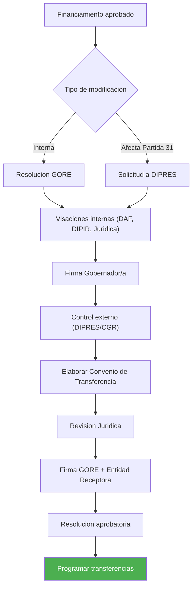
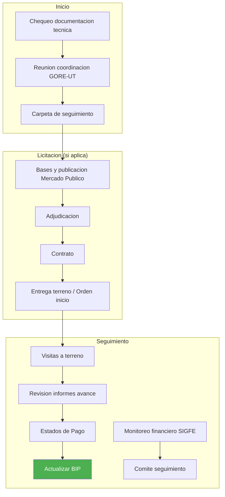
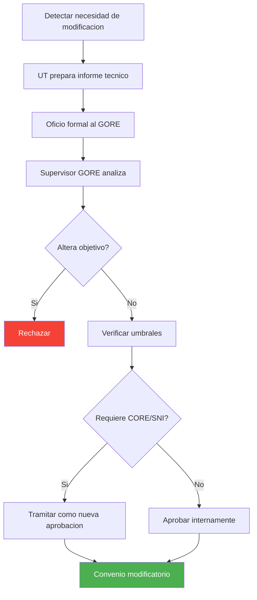

---
_manifest:
  urn: urn:gn:kb:gestion-ipr-p03
  provenance:
    created_by: FS
    created_at: '2026-03-15'
    source: kb_gn_019_gestion_ipr.md + D03_gestion_ipr_koda.yml
version: 1.1.0
status: published
tags:
- gestion-ipr
- ciclo-vida
- inversión-regional
- gore-nuble
- dipir
- evaluacion-tecnica
- seguimiento
lang: es
extensions:
  gn:
    family: guide
  kora:
    shard_index: 3
    shard_count: 4
    shard_root_urn: urn:gn:kb:gestion-ipr
---

# Gestión Operacional de Intervenciones Públicas Regionales (IPR) - Parte 03

## Fase 4 – Gestión Presupuestaria y Formalización

Traduce la aprobación de financiamiento en actos administrativos y convenios que permitan ejecutar y transferir recursos.

### 5.1 Tramitación de Actos Administrativos (Decretos y Resoluciones)

Tipo de acto según si la modificación afecta solo presupuesto interno o Partida 31 nacional.

**Paso 1 – Profesional Depto. Presupuesto**

- Elaborar borrador de Resolución (modificación interna) o solicitud a DIPRES para Decreto (afecta Partida 31)
- Output: borrador de Resolución / solicitud de Decreto

**Paso 2 – DAF / DIPIR / Unidad de Control**

- El acto debe obtener V°B° internos (Jurídico, Jefatura Presupuesto, Jefatura DIPIR, Administrador/a Regional)
- Output: acto visado internamente

**Paso 3 – Gobernador/a**

- Firmar resolución interna o oficio a DIPRES para tramitación del Decreto
- Output: acto firmado

**Paso 4 – GORE / DIPRES / CGR**

- Si Resolución GORE: enviar a DIPRES para visación y a CGR para Toma de Razón
- Si Decreto DIPRES: DIPRES elabora, envía a CGR para Toma de Razón y publica
- Output: `RESOLUCIÓN/DECRETO CON TOMA DE RAZÓN`

### 5.2 Elaboración y Firma de Convenio

La transferencia de recursos solo puede materializarse después de la total tramitación del convenio. Base: Arts. 23-26 Normas Generales Ley de Presupuestos 2026.

**Paso 1 – Profesional Depto. Presupuesto**

- Con asignación presupuestaria asegurada, elaborar borrador de Convenio de Transferencia
- Contenido mínimo: partes, objeto, monto, plazos, productos, obligaciones, rendición de cuentas, restitución
- Para transferencia a institución privada: verificar régimen de concurso y convenio, condiciones de asignación directa excepcional, según normas vigentes
- Acreditar objeto social/fines pertinentes de la institución receptora
- Incluir cláusulas de rendición vía SISREC CGR, restitución y prohibición de gastos no permitidos, según glosa aplicable
- Para ejecutoras de políticas públicas que superen el umbral correspondiente: exigir garantías y requisitos adicionales
- Output: borrador de Convenio

**Paso 2 – DIPIR / Jurídico / Unidad Técnica Receptora**

- Revisar y visar borrador del convenio
- Output: convenio visado internamente

**Paso 3 – Gabinete / Oficina de Partes**

- Coordinar firma del convenio entre Gobernador/a y representante legal de entidad receptora
- Output: `CONVENIO FIRMADO`

### 5.3 Formalización Final y Devengo Presupuestario

**Paso 1 – Profesional Depto. Presupuesto**

- Elaborar Resolución que aprueba el convenio y lo deja formalmente vigente
- Output: borrador de Resolución de aprobación

**Paso 2 – GORE / CGR**

- Firmar resolución
- Si corresponde según normativa CGR: enviar a CGR para Toma de Razón
- Output: `CONVENIO FORMALIZADO (TRAMITADO)`

**Paso 3 – Profesional DAF / DIPIR**

- Con convenio tramitado, obligación se vuelve exigible
- Programar transferencias considerando reglas de devengo:
 - Transferencias a privados y municipios: devengo cuando obligación es exigible (convenio tramitado)
 - Transferencias a otros servicios públicos no consolidables: devengo cuando se aprueba la rendición de cuentas
- Output: `TRANSFERENCIA PROGRAMADA`

## Fase 5 – Ejecución y Seguimiento

Monitorea el desarrollo de la IPR, asegurando cumplimiento técnico y uso correcto de recursos. Base: Ley 19.886 (Compras Públicas); Res. 30/2015 CGR.

### 6.1 Inicio del Proyecto y Reuniones de Coordinación

**Paso 1 – División Patrocinante / Depto. Inversiones**

- Antes del inicio, chequear documentación técnica aprobada (EE.TT., planos, etc.)
- Output: revisión conforme de antecedentes

**Paso 2 – División Patrocinante / Depto. Presupuesto / Unidad Técnica Receptora**

- Convocar reunión formal GORE–UT receptora
- Aclarar roles, responsabilidades, plazos, hitos de control y procedimientos de rendición
- Output: acta de reunión con acuerdos

**Paso 3 – Supervisor/a del Proyecto (GORE)**

- Crear carpeta de seguimiento (digital/física) con todos los antecedentes del proyecto
- Output: carpeta de seguimiento creada

### 6.2 Licitación y Adjudicación

Cuando corresponda, aplicar exigencias de licitación pública obligatoria:

- Proyectos y programas de inversión: licitación pública obligatoria > **1.000 UTM**, salvo excepciones por emergencia
- Estudios básicos: licitación pública obligatoria > **500 UTM**, salvo excepciones por emergencia

**Paso 1 – Unidad Técnica Receptora**

- Elaborar bases de licitación y publicar en Mercado Público
- Gestionar proceso de licitación para contratar ejecución
- Output: licitación adjudicada

**Paso 2 – Unidad Técnica Receptora**

- Firmar contrato con adjudicatario
- Output: contrato firmado

**Paso 3 – Unidad Técnica Receptora**

- Formalizar inicio de ejecución física (Entrega de Terreno u Orden de Inicio)
- Output: acta de Entrega de Terreno u Orden de Inicio

### 6.3 Seguimiento y Supervisión

**Paso 1 – Supervisor/a del Proyecto (GORE)**

- Realizar visitas a terreno periódicas
- Revisar informes de avance de la UT
- Gestionar Estados de Pago cuando aplique
- Actualizar BIP con % de avance físico
- Output: informes de visita y supervisión, avance en BIP

**Paso 2 – Analista Financiero (DAF/DIPIR)**

- Monitorear ejecución presupuestaria en SIGFE
- Revisar rendiciones de cuentas en SISREC
- Alertar sobre sub-ejecución o desviaciones
- Output: informes de ejecución financiera

**Paso 3 – Comité de Seguimiento (si aplica)**

- Realizar reuniones periódicas GORE–UT para revisar estado integral de la IPR
- Output: actas de reunión con acuerdos y planes de acción

## Fase 6 – Gestión de Modificaciones

Gestiona formalmente cambios durante la ejecución, asegurando viabilidad y legalidad. Base: LOC GORE Art. 36; Glosa 01, Ley Presupuestos 2026.

### 7.1 Solicitud de Modificación

**Paso 1 – Unidad Técnica Receptora**

- Detectar necesidad de modificación (sobrecosto, obra adicional, imprevisto, etc.)
- Preparar informe técnico y financiero que justifique la modificación
- Output: informe de solicitud de modificación

**Paso 2 – Unidad Técnica Receptora**

- Enviar oficio al Gobernador/a solicitando formalmente la modificación, adjuntando informe y antecedentes (nuevos presupuestos, planos, etc.)
- Output: solicitud formal ingresada al GORE

### 7.2 Evaluación de la Modificación (Reevaluación)

**Paso 1 – Supervisor/a GORE / Analista DIPIR**

- Analizar pertinencia y justificación técnica de la modificación
- Verificar que no altere sustancialmente el objetivo del proyecto
- Output: informe técnico GORE sobre modificación

**Paso 2 – DIPIR / DIPLADE**

- Si el cambio es significativo: reevaluar conveniencia de la IPR
- Verificar si el nuevo costo total supera umbrales que exigen nuevo pronunciamiento CORE o SNI
- Output: pronunciamiento técnico sobre viabilidad de modificación

**Paso 3 – Jefatura DIPIR / GORE**

- Con base en informes técnicos, aprobar o rechazar la modificación
- Output: decisión formal sobre modificación

### 7.3 Tramitación de la Modificación

**Paso 1 – DIPIR / CORE** (solo si modificación implica aumento de presupuesto)

- Repetir proceso de solicitud de financiamiento y, si aplica, paso por CORE
- Output: fondos adicionales aprobados

**Paso 2 – DAF / Depto. Presupuesto**

- Tramitar modificación presupuestaria (Resolución/Decreto)
- Modificar convenio de transferencia según corresponda
- Output: convenio y presupuesto modificados y tramitados
