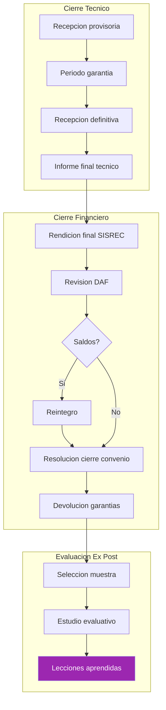

---
_manifest:
  urn: urn:gn:kb:gestion-ipr-p04
  provenance:
    created_by: FS
    created_at: '2026-03-15'
    source: kb_gn_019_gestion_ipr.md + D03_gestion_ipr_koda.yml
version: 1.1.0
status: published
tags:
- gestion-ipr
- ciclo-vida
- inversión-regional
- gore-nuble
- dipir
- evaluacion-tecnica
- seguimiento
lang: es
extensions:
  gn:
    family: guide
  kora:
    shard_index: 4
    shard_count: 4
    shard_root_urn: urn:gn:kb:gestion-ipr
---

# Gestión Operacional de Intervenciones Públicas Regionales (IPR) - Parte 04

## Fase 7 – Cierre y Evaluación Ex-Post

Formaliza la finalización de la IPR y genera lecciones aprendidas mediante evaluación ex-post cuando corresponda. Base: Res. 30/2015 CGR.

### 8.1 Cierre Técnico

**Paso 1 – Unidad Técnica Receptora**

- Realizar recepción provisoria y definitiva de obras al contratista
- Tras el período de garantía, formalizar recepción definitiva
- Output: Acta de Recepción Definitiva de Obras

**Paso 2 – Unidad Técnica / Supervisor GORE**

- Elaborar informe final de ejecución (productos, metas, resultados)
- Validar informe por parte del Supervisor GORE
- Output: informe final técnico aprobado

### 8.2 Cierre Financiero y Administrativo

**Paso 1 – Unidad Técnica Receptora**

- Presentar rendición final de cuentas en SISREC CGR, sin saldos por rendir
- Output: rendición final presentada

**Paso 2 – Analista Financiero GORE (DAF)**

- Revisar y aprobar rendición final según guía específica
- Solicitar reintegro de saldos no utilizados o gastos rechazados
- Pronunciarse de manera fundada sobre la rendición dentro del plazo máximo aplicable, salvo que el convenio establezca un plazo diferente
- Output: rendición final aprobada y saldos reintegrados

**Paso 3 – Profesional Depto. Presupuesto**

- Elaborar resolución que aprueba la rendición de cuentas y declara cierre del convenio
- Output: Resolución de Cierre de Convenio

**Paso 4 – DAF / Entidad Receptora**

- Una vez cerrado el convenio, gestionar devolución de garantías
- Output: garantías devueltas

### 8.3 Evaluación Ex-Post

**Paso 1 – MDSF / GORE**

- Seleccionar IPR relevantes para evaluación ex-post
- Output: muestra de IPR a evaluar

**Paso 2 – Equipo Evaluador Externo/Interno**

- Realizar estudio comparando situación "con proyecto" vs. "sin proyecto"
- Output: Informe de Evaluación Ex-Post

**Paso 3 – GORE / SNI**

- Utilizar conclusiones y lecciones aprendidas para mejorar formulación y evaluación de futuras IPR
- Output: lecciones aprendidas incorporadas al ciclo de inversión

## Sistemas de Información

| Sistema | Fases de uso |
|---|---|
| BIP-SNI | P1, P2, P5, P7 |
| GESDOC | P1, P2 |
| SIGFE | P3, P4, P5, P7 |
| SISREC | P7 |
