---
_manifest:
  urn: "urn:gn:kb:gestion-ipr"
  provenance:
    created_by: "FS"
    created_at: "2026-03-15"
    source: "kb_gn_019_gestion_ipr.md + D03_gestion_ipr_koda.yml"
version: "1.1.0"
status: published
tags: [gestion-ipr, ciclo-vida, inversión-regional, gore-nuble, dipir, evaluacion-tecnica, seguimiento]
lang: es
extensions:
  gn:
    family: guide
---

# Gestión Operacional de Intervenciones Públicas Regionales (IPR)

## Resumen

Guía operacional completa para la gestión de Intervenciones Públicas Regionales (IPR) en el GORE Ñuble, desde el ingreso hasta el cierre y evaluación ex-post. Estandariza el flujo completo de fases, actores, decisiones y documentos clave, con trazabilidad normativa en cada hito.

### Mapa del Ciclo de Vida IPR

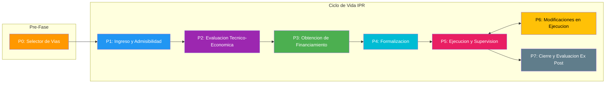

### Reconciliación con modelo canónico SSOT

Este artefacto usa el modelo operativo de 8 fases (P0-P7, fuente BPMN D03) que desagrega ejecución, modificaciones y cierre como fases separadas. El [modelo canónico SSOT](urn:gn:kb:ssot-ipr-lifecycle) define 6 fases (F0-F5) donde ejecución y modificaciones son subprocesos de F4 (Formalización).

| Operativo (este artefacto) | Canónico SSOT |
|---|---|
| P0 Selector de Vías | — (pre-fase, sin equivalente) |
| P1 Ingreso y Admisibilidad | F0 Postulación + F1 Admisibilidad |
| P2 Evaluación Técnico-Económica | F2 Evaluación |
| P3 Obtención de Financiamiento | F3 Priorización |
| P4 Gestión Presupuestaria y Formalización | F4 Formalización |
| P5 Ejecución y Supervisión | F4 (subproceso) |
| P6 Modificaciones en Ejecución | F4 (subproceso) |
| P7 Cierre y Evaluación Ex-Post | F5 Cierre |

Tracks de evaluación: este artefacto usa 4 tracks (A-D) que agrupan los 7 tracks canónicos SSOT (A, B, C, D1, D2, E1, E2). Track C aquí agrupa FRIL + Circular 33 + 8% FNDR + FRPD.

## Glosario Operativo

| Sigla | Nombre | Definición |
|---|---|---|
| IPR | Intervención Pública Regional | Término paraguas para cualquier acción (proyecto, programa, estudio) financiada por el GORE para objetivos de desarrollo |
| IDI | Iniciativa de Inversión | Tipo de IPR asociada a proyectos de capital (obras, activos) |
| PPR | Programa Público Regional | Tipo de IPR de gasto corriente o mixto (servicios, subvenciones) |
| RS | Recomendación Satisfactoria | Resultado favorable de evaluación SNI/MDSF para IDI de mayor envergadura |
| RF | Recomendación Favorable | Resultado favorable de evaluación de programas en Glosa 06 u otros mecanismos |
| AD | Admisible para financiamiento | Resultado favorable de evaluación MDSF para proyectos de conservación; habilita financiamiento sin ser RS |
| CDP | Certificado de Disponibilidad Presupuestaria | Documento del Depto. Presupuesto que acredita fondos para financiar una IPR |
| BIP | Banco Integrado de Proyectos | Sistema para registro y seguimiento de IDI |
| SIGFE | Sistema de Información para la Gestión Financiera del Estado | Sistema contable-financiero donde se registra ejecución presupuestaria |
| SISREC | Sistema de Rendición Electrónica de Cuentas | Plataforma de la CGR para rendiciones de cuentas de transferencias |
| DIPIR | División de Presupuesto e Inversión Regional | División GORE responsable de presupuesto de inversión y gestión de IPR |
| DIPLADE | División de Planificación y Desarrollo Regional | División que lidera planificación y presidencia del CDR |
| CORE | Consejo Regional | Órgano colegiado que aprueba o rechaza financiamiento de IPR |
| CDR | Comité Directivo Regional | Instancia técnico-política interna para filtro de pertinencia estratégica de IPR |
| MDSF | Ministerio de Desarrollo Social y Familia | Organismo responsable de evaluación técnico-económica de IDI en el SNI |

**Estados de admisibilidad IPR:** PRE-ADMISIBLE CDR, NO PRE-ADMISIBLE CDR, ADMISIBLE, ADMISIBLE CON OBSERVACIONES, INADMISIBLE.

**Estados de financiamiento IPR:** PARA REVISIÓN TÉCNICA, EN CARTERA PRE-ADMISIBLE, ENVIADO A MDSF, APROBADO TÉCNICAMENTE (RS/RF/AD/Exento RS), CARTERA ENVIADA A CORE, CERTIFICADO CORE OK, ENVIADO A FINANCIAMIENTO, TRANSFERENCIA PROGRAMADA, CONVENIO FORMALIZADO.

## Base Legal del Proceso

- LOC GORE (Art. 16, 24, 36, 78)
- DL N°1.263/1975 (Art. 19 bis)
- Ley 20.530 (Crea MDSF)
- Glosas 01, 06, 07 Ley de Presupuestos 2026 (Partida 31)
- Normas Generales Ley de Presupuestos 2026 (Art. 23-26)
- Res. 30/2015 CGR (Rendiciones)
- Normativa DIPRES/MDSF sobre SNI, BIP, procedimientos especiales

## P0 – Selector de Vías de Financiamiento

Pre-fase de decisión estratégica que orienta la selección de la vía de financiamiento antes de la formulación de la IPR. Permite identificar el mecanismo adecuado según propósito, tipo de ejecutor, monto y condiciones específicas de la iniciativa.

### Árbol de Decisión

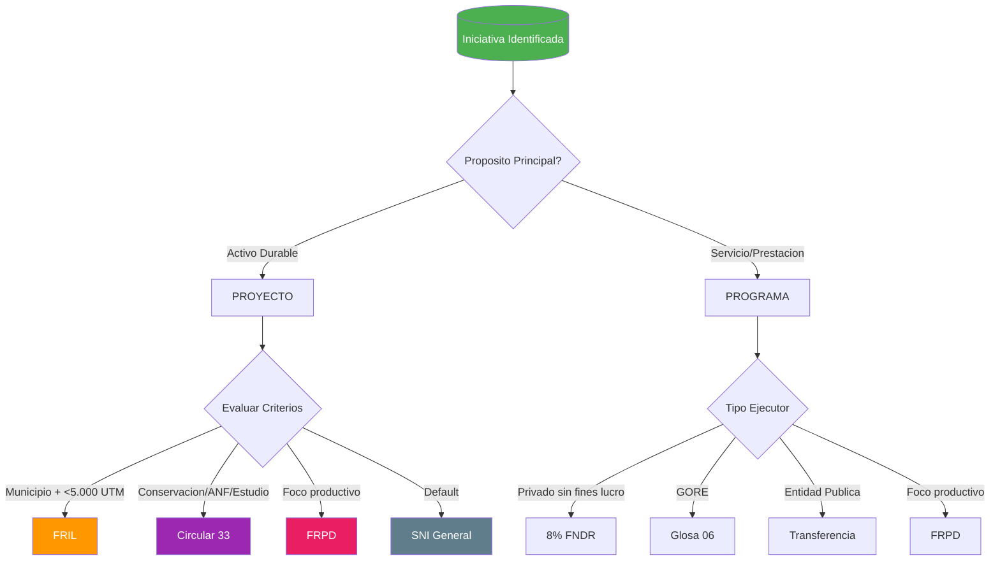

### Matriz de Decisión

| Vía | Tipo | Ejecutor | Monto | Condición Clave |
|---|---|---|---|---|
| FRIL | Proyecto | Municipalidad | < 5.000 UTM | Infraestructura menor |
| Circular 33 | Proyecto | Variable | Variable | Conservación, ANF, estudios |
| FRPD | Ambos | Habilitado | Variable | Foco productivo/innovación |
| SNI General | Proyecto | Variable | Variable | Default |
| 8% FNDR | Actividad | Privado s/f lucro | Variable | Concurso |
| Glosa 06 | Programa | GORE | Variable | Ejecución directa |
| Transferencia | Programa | Entidad pública | Variable | ITF interno |

## Fase 1 – Ingreso, Pertinencia y Admisibilidad

Recepciona, registra y filtra postulaciones para decidir cuáles avanzan a evaluación técnica. Base: LOC GORE Art. 16 y 24.

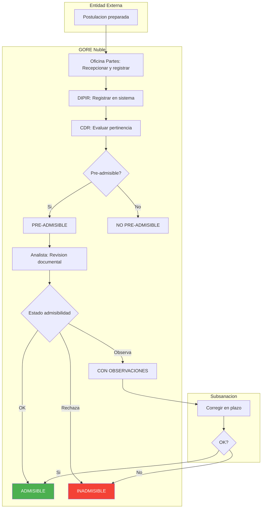

### 2.1 Recepción y Registro

**Paso 1 – Unidad Formuladora (Externa)**

- Preparar y presentar IPR según guías del mecanismo de financiamiento
- Ingresar oficio conductor firmado por máxima autoridad de la entidad postulante
- La calidad de la formulación inicial es crítica para el resto del ciclo
- Output: oficio y antecedentes completos presentados al GORE

**Paso 2 – Oficina de Partes GORE**

- Recepcionar oficio y documentación física/digital
- Asignar número de ingreso único en sistema de gestión documental (SGDOC)
- Derivar antecedentes completos a Jefatura DIPIR
- Output: postulación registrada y derivada formalmente a DIPIR

**Paso 3 – Jefatura DIPIR**

- Registrar datos básicos de la IPR en sistema de seguimiento interno
- Poner la postulación a disposición del CDR
- Output: postulación disponible para revisión del CDR

### 2.2 Análisis de Pertinencia Estratégica (Filtro Político-Técnico)

Evalúa alineación de la IPR con prioridades estratégicas antes de invertir en evaluación técnica. Responsable principal: CDR. Composición del CDR: Jefaturas de División, Jefatura de Rezago, Administrador/a Regional.

**Paso 1 – Jefatura DIPLADE**

- Recibir listado de postulaciones ingresadas
- Convocar a sesión del CDR como presidente de la instancia
- Output: CDR convocado con cartera de IPR a revisar

**Paso 2 – CDR**

- Analizar cada IPR desde perspectiva técnico-política
- Evaluar coherencia con ERD y prioridades estratégicas del GORE
- Evaluar viabilidad preliminar y pertinencia
- Generar acta de sesión con categorización y observaciones por IPR
- Output: `PRE-ADMISIBLE CDR` o `NO PRE-ADMISIBLE CDR`

**Paso 3 – Jefatura DIPIR**

- Recibir acta del CDR
- Para IPR PRE-ADMISIBLES: evaluar marco presupuestario disponible y cartera de inversiones vigente
- Priorizar IPR para revisión técnica según relevancia y factibilidad de financiamiento
- Output: `PARA REVISIÓN TÉCNICA` o `EN CARTERA PRE-ADMISIBLE`

### 2.3 Revisión de Admisibilidad Formal (Filtro Documental)

Verifica requisitos formales y documentales exigidos por el mecanismo de financiamiento. El resultado condiciona el paso a evaluación técnica.

**Paso 1 – Jefatura de Preinversión (DIPIR)**

- Recibir instrucción de Jefatura DIPIR para iniciar revisión
- Asignar la IPR a analista competente según tipología
- Formalizar apoyos interdivisionales si se requieren
- Output: IPR derivada formalmente a analista

**Paso 2 – Analista de Preinversión (DIPIR)**

- Realizar revisión documental exhaustiva
- Verificar cumplimiento de requisitos de la guía operativa del mecanismo
- Comprobar correcta carga en Carpeta Digital del BIP cuando aplique
- Output: `ADMISIBLE`, `ADMISIBLE CON OBSERVACIONES` o `INADMISIBLE`

**Paso 3 – Unidad Formuladora** (solo si estado = ADMISIBLE CON OBSERVACIONES)

- Corregir antecedentes dentro del plazo definido por el GORE
- No subsanar en plazo puede derivar en estado INADMISIBLE
- Output: documentación subsanada

**Paso 4 – Jefatura de Preinversión (DIPIR)**

- Si estado final es INADMISIBLE: elaborar y despachar oficio de inadmisibilidad
- Si ADMISIBLE o subsanada: declarar estado PARA EVALUACIÓN TÉCNICA
- Output: `INADMISIBLE INFORMADO` o `LISTA PARA FASE 2`

## Fase 2 – Evaluación Técnica y Económica

Analiza en profundidad la IPR para determinar calidad, viabilidad y conveniencia, aplicando principio de proporcionalidad. Proceso y criterios varían según nivel de proporcionalidad y mecanismo de financiamiento. Base: Art. 19 bis DL N°1.263/1975; Ley 20.530 (Crea MDSF).

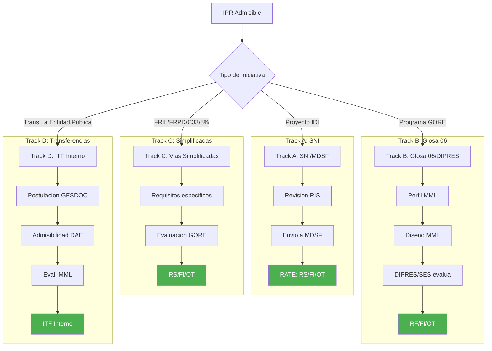

### 3.1 Track A – SNI (Análisis Estándar y Enriquecido, Niveles 2 y 3)

Evalúa IDI de mayor envergadura que requieren RS de MDSF.

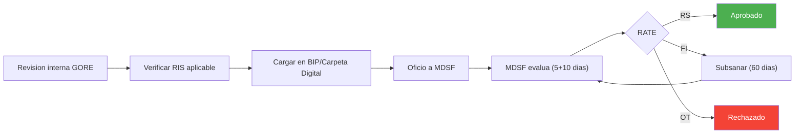

**Paso 1 – Analista GORE (DIPIR)**

- Revisión de fondo considerando antecedentes de Fase 1
- Verificar cumplimiento de RIS y metodologías SNI aplicables
- Asegurar calidad de estudios preinversionales (Perfil, Prefactibilidad, etc.)
- Elaborar Acta de Admisibilidad interna GORE
- Output: `ADMISIBLE PARA ENVÍO A MDSF` o `INADMISIBLE`

**Paso 2 – Jefatura DIPIR / Gobernador/a**

- Elaborar y visar oficio solicitando evaluación ex ante al SEREMI MDSF
- Gestionar cadena de V°B° interno y firma del Gobernador/a
- Output: oficio despachado a MDSF

**Paso 3 – Jefatura de Preinversión (DIPIR)**

- Registrar formalmente la "Informar Postulación" en el BIP
- Output: iniciativa `ENVIADO A MDSF` en BIP

**Paso 4 – Analista MDSF**

- Evaluación de admisibilidad (plazo orientativo: 5 días)
- Análisis técnico-económico ATE (plazo orientativo: 10 días)
- Output: RATE `RS`, `FI` u `OT`

**Paso 5 – Unidad Formuladora / Analista GORE**

- Si RS: registrar aprobación técnica y preparar paso a financiamiento
- Si FI u OT: apoyar a la Unidad Formuladora en subsanar observaciones (plazo máx. 60 días hábiles)
- Output: `APROBADO TÉCNICAMENTE (RS)` o `OBSERVACIONES SUBSANADAS`

**Paso 6 – Jefatura de Preinversión (DIPIR)**

- Monitorear BIP para obtener resultado de MDSF
- Informar cartera con RS a Jefatura DIPIR para preparación de presentación al Gobernador/a
- Output: cartera RS disponible para priorización

### 3.2 Track B – Programas Públicos Regionales (Glosa 06)

Evalúa programas de gasto corriente/mixto ejecutados por el GORE según proceso bifásico DIPRES/SES.

Aplica también a: programas en continuidad, subvenciones 8% FNDR, transferencias a entidades públicas, ayudas tempranas por emergencia, programas FRPD bajo Res. 33 (Innovación).

Hasta un **5%** del monto total puede destinarse a gastos de administración en el GORE. Personal a honorarios contratado en la entidad receptora cesa su vínculo al finalizar el convenio.

**Paso 1 – División Proponente GORE / DIPIR**

- Elaborar Formulario de Perfil de Programa Público GORE
- Definir contraparte única GORE frente a DIPRES/SES
- Output: Formulario de Perfil enviado a DIPRES/SES

**Paso 2 – DIPRES / SES**

- Evaluar si la iniciativa corresponde a un programa y si es pertinente
- Output: aprobado (solicitud formal a GORE para elaborar Diseño) o rechazado (proceso se detiene)

**Paso 3 – División Proponente GORE / DIPIR** (solo si DIPRES/SES solicita Diseño)

- Elaborar Formulario de Diseño con Metodología de Marco Lógico
- Output: Formulario de Diseño enviado

**Paso 4 – DIPRES / SES**

- Revisión iterativa de diseño; emisión de observaciones y recepción de subsanaciones
- Output: calificación final `RF`, `OT` o `FI`

**Paso 5 – División Proponente GORE / DIPIR**

- Subsanar observaciones hasta lograr RF
- Solo RF habilita el programa para solicitar financiamiento
- Output: `APROBADO TÉCNICAMENTE (RF)`

### 3.3 Track C – Vías Simplificadas y Procedimientos Especiales

```mermaid
flowchart TD
    subgraph FRIL["FRIL"]
        F1["Postular GESDOC+BIP"]
        F2["Admisibilidad"]
        F3["Evaluacion tecnica"]
        F4["RS (60 dias)"]
        F1 --> F2 --> F3 --> F4
    end

    subgraph FRPD["FRPD"]
        R1["Postular formulario online"]
        R2["Adm. Administrativa"]
        R3["Adm. Tecnica/Ranking"]
        R4["Evaluacion GORE"]
        R5["RS"]
        R1 --> R2 --> R3 --> R4 --> R5
    end

    subgraph C33["Circular 33"]
        C1["Postular GESDOC+BIP"]
        C2["Admisibilidad"]
        C3["Revision tecnica"]
        C4["RS/FI/OT"]
        C1 --> C2 --> C3 --> C4
    end
```

#### Proyectos < 5.000 UTM (Exención de RS)

**Paso 1 – Unidad Formuladora**

- Postular proyecto en BIP a etapa Ejecución o Diseño con descriptor "Proyecto menor a 5.000 UTM"
- Verificar que no existan causales de exclusión (fraccionamiento, EIA/CMN, problemas de terreno, etc.)
- Output: IDI postulada con descriptor específico

**Paso 2 – Unidad Formuladora**

- Cargar en BIP estudio preinversional simplificado y demás antecedentes exigidos
- Output: Carpeta Digital completa

**Paso 3 – Institución Financiera (GORE)**

- Enviar carta de responsabilidad a MDSF declarando ausencia de impedimentos y fraccionamiento
- Output: carta enviada a MDSF

**Paso 4 – DIPIR GORE**

- Verificar cumplimiento del procedimiento y antecedentes
- La aprobación técnica la otorga el propio GORE
- Output: `APROBADO TÉCNICAMENTE (Exento RS)`

#### Proyectos de Conservación

**Paso 1 – Unidad Formuladora**

- Postular IDI en BIP con proceso "Conservación"
- Costo total ≤ **30%** del costo de reposición del activo
- Cargar antecedentes: Memoria, Certificado de Conservación, etc.
- Output: IDI postulada correctamente

**Paso 2 – Analista GORE (DIPIR)**

- Revisar coherencia de postulación con instructivo de conservación
- Output: V°B° para envío a MDSF

**Paso 3 – Jefatura DIPIR / GORE**

- Enviar oficio a MDSF solicitando evaluación de admisibilidad
- Output: IDI `ENVIADA A MDSF` en BIP

**Paso 4 – Analista MDSF**

- Verificar que IDI clasifique como conservación
- Emitir RATE AD
- Output: `APROBADO TÉCNICAMENTE (AD)`

#### FRIL, 8% FNDR, FRPD y Circular 33

Mecanismos con lógicas de evaluación propias detalladas en sus guías específicas:

- **FRIL:** evaluación de mérito realizada por el GORE según instructivo; aprobación técnica interna. Considerar informe favorable del MDSF cuando aplique financiamiento vía transferencias de capital, según glosa aplicable
- **8% FNDR:** concurso público con bases y pautas específicas; selección por puntaje. No financia programas públicos complejos, sino actividades acotadas. Exigir garantías (pagaré) a instituciones privadas adjudicatarias. Asignaciones directas excepcionales: aplicar límites y condiciones de la glosa vigente, previo acuerdo del CORE cuando corresponda
- **FRPD (Royalty):** evaluado según bases del concurso FRPD. Tipología Innovación exenta de evaluación ex-ante Glosa 06 (Res. 33/2024 MCTCI)
- **Circular 33 (ANF, Estudios):** tramitación vía DIPRES; V°B° DIPRES como aprobación técnica GORE

## Fase 3 – Financiamiento y Aprobación Presupuestaria

Gestiona la asignación de recursos presupuestarios para IPR con aprobación técnica, incluyendo aprobación CORE cuando aplique. Base: LOC GORE Art. 36 y 78; Glosa 01, Partida 31, Ley Presupuestos 2026.

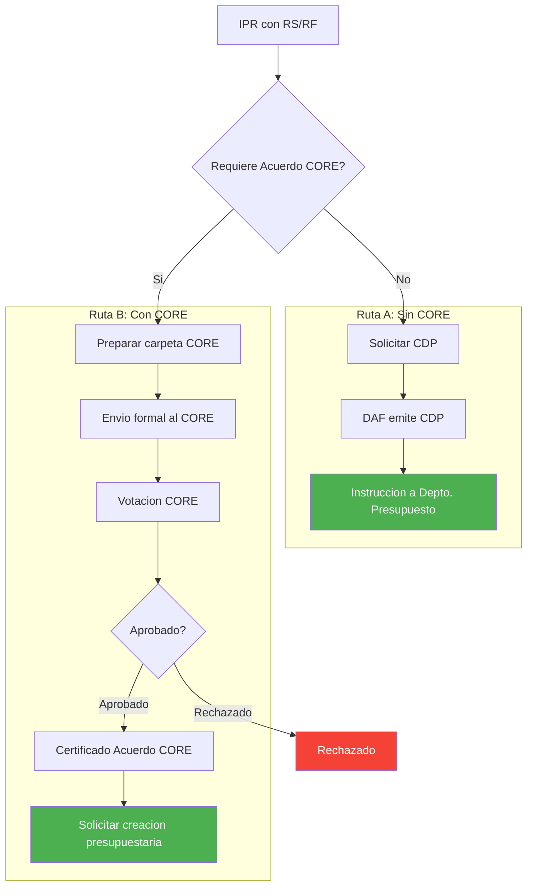

### Criterios para Acuerdo CORE

| Condición | Requiere CORE |
|---|---|
| Monto > 7.000 UTM | Sí |
| Nuevo programa/proyecto | Sí |
| Aumento costo ≤ 10% (tope 7.000 UTM) | No |
| Uso 3% emergencia (Glosa 14) | No |
| Regularización de ingresos | No |

### 4.1 Modificaciones Presupuestarias sin Acuerdo Obligatorio CORE

**Paso 1 – Jefatura DIPIR**

- Analizar cartera de IPR con aprobación técnica
- Solicitar al Depto. Presupuesto la emisión del CDP
- Output: solicitud de CDP enviada

**Paso 2 – Jefatura Depto. Presupuesto (DAF)**

- Verificar disponibilidad de fondos
- Elaborar y enviar CDP a unidad solicitante
- Output: CDP emitido

**Paso 3 – Jefatura de Preinversión / Unidad Patrocinante**

- Recibir CDP
- Enviar memo al Depto. Presupuesto instruyendo iniciar tramitación de modificación presupuestaria
- Output: `ENVIADO A FINANCIAMIENTO`

### 4.2 Iniciativas con Aprobación Obligatoria del CORE

Aplica a la mayoría de proyectos de inversión (> 7.000 UTM) y otras IPR definidas políticamente.

**Paso 1 – Jefatura DIPIR**

- Analizar cartera de IPR con aprobación técnica
- Solicitar preparación de documentación para CORE
- Output: `INSTRUCCIÓN PARA PREPARAR ENVÍO A CORE`

**Paso 2 – Jefatura de Preinversión (DIPIR)**

- Elaborar carpeta CORE (oficios, fichas IDI, antecedentes de respaldo)
- Output: `CARTERA DISPONIBLE PARA ENVÍO A CORE`

**Paso 3 – Jefatura DIPIR / Gobernador/a**

- Presentar cartera al Gobernador/a para V°B° final
- Firmar oficio y enviar formalmente cartera al CORE
- Output: `CARTERA ENVIADA A CORE`

**Paso 4 – CORE**

- Analizar cartera en comisiones y sesión plenaria
- Votar aprobación o rechazo del financiamiento
- Output: `IPR APROBADAS/RECHAZADAS`

**Paso 5 – Secretario/a Ejecutivo CORE**

- Comunicar resultados y emitir Certificado de Acuerdo CORE (usando formato estandarizado indicado por DIPRES para el año presupuestario vigente)
- Output: `CERTIFICADO CORE OK`

**Paso 6 – Jefatura DIPIR / Jefatura Preinversión**

- Con certificado CORE, solicitar al Depto. Presupuesto la creación de asignación presupuestaria
- Output: `ENVIADA A CREACIÓN PPT.`

## Fase 4 – Gestión Presupuestaria y Formalización

Traduce la aprobación de financiamiento en actos administrativos y convenios que permitan ejecutar y transferir recursos.

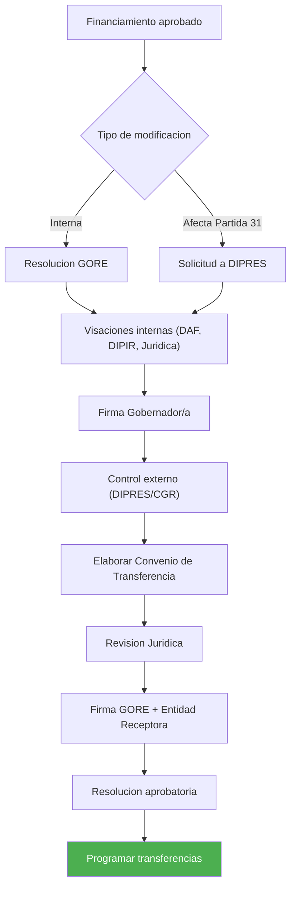

### 5.1 Tramitación de Actos Administrativos (Decretos y Resoluciones)

Tipo de acto según si la modificación afecta solo presupuesto interno o Partida 31 nacional.

**Paso 1 – Profesional Depto. Presupuesto**

- Elaborar borrador de Resolución (modificación interna) o solicitud a DIPRES para Decreto (afecta Partida 31)
- Output: borrador de Resolución / solicitud de Decreto

**Paso 2 – DAF / DIPIR / Unidad de Control**

- El acto debe obtener V°B° internos (Jurídico, Jefatura Presupuesto, Jefatura DIPIR, Administrador/a Regional)
- Output: acto visado internamente

**Paso 3 – Gobernador/a**

- Firmar resolución interna o oficio a DIPRES para tramitación del Decreto
- Output: acto firmado

**Paso 4 – GORE / DIPRES / CGR**

- Si Resolución GORE: enviar a DIPRES para visación y a CGR para Toma de Razón
- Si Decreto DIPRES: DIPRES elabora, envía a CGR para Toma de Razón y publica
- Output: `RESOLUCIÓN/DECRETO CON TOMA DE RAZÓN`

### 5.2 Elaboración y Firma de Convenio

La transferencia de recursos solo puede materializarse después de la total tramitación del convenio. Base: Arts. 23-26 Normas Generales Ley de Presupuestos 2026.

**Paso 1 – Profesional Depto. Presupuesto**

- Con asignación presupuestaria asegurada, elaborar borrador de Convenio de Transferencia
- Contenido mínimo: partes, objeto, monto, plazos, productos, obligaciones, rendición de cuentas, restitución
- Para transferencia a institución privada: verificar régimen de concurso y convenio, condiciones de asignación directa excepcional, según normas vigentes
- Acreditar objeto social/fines pertinentes de la institución receptora
- Incluir cláusulas de rendición vía SISREC CGR, restitución y prohibición de gastos no permitidos, según glosa aplicable
- Para ejecutoras de políticas públicas que superen el umbral correspondiente: exigir garantías y requisitos adicionales
- Output: borrador de Convenio

**Paso 2 – DIPIR / Jurídico / Unidad Técnica Receptora**

- Revisar y visar borrador del convenio
- Output: convenio visado internamente

**Paso 3 – Gabinete / Oficina de Partes**

- Coordinar firma del convenio entre Gobernador/a y representante legal de entidad receptora
- Output: `CONVENIO FIRMADO`

### 5.3 Formalización Final y Devengo Presupuestario

**Paso 1 – Profesional Depto. Presupuesto**

- Elaborar Resolución que aprueba el convenio y lo deja formalmente vigente
- Output: borrador de Resolución de aprobación

**Paso 2 – GORE / CGR**

- Firmar resolución
- Si corresponde según normativa CGR: enviar a CGR para Toma de Razón
- Output: `CONVENIO FORMALIZADO (TRAMITADO)`

**Paso 3 – Profesional DAF / DIPIR**

- Con convenio tramitado, obligación se vuelve exigible
- Programar transferencias considerando reglas de devengo:
  - Transferencias a privados y municipios: devengo cuando obligación es exigible (convenio tramitado)
  - Transferencias a otros servicios públicos no consolidables: devengo cuando se aprueba la rendición de cuentas
- Output: `TRANSFERENCIA PROGRAMADA`

## Fase 5 – Ejecución y Seguimiento

Monitorea el desarrollo de la IPR, asegurando cumplimiento técnico y uso correcto de recursos. Base: Ley 19.886 (Compras Públicas); Res. 30/2015 CGR.

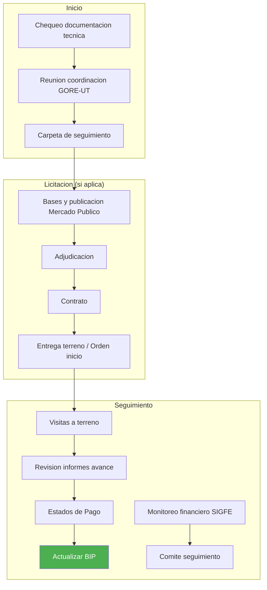

### 6.1 Inicio del Proyecto y Reuniones de Coordinación

**Paso 1 – División Patrocinante / Depto. Inversiones**

- Antes del inicio, chequear documentación técnica aprobada (EE.TT., planos, etc.)
- Output: revisión conforme de antecedentes

**Paso 2 – División Patrocinante / Depto. Presupuesto / Unidad Técnica Receptora**

- Convocar reunión formal GORE–UT receptora
- Aclarar roles, responsabilidades, plazos, hitos de control y procedimientos de rendición
- Output: acta de reunión con acuerdos

**Paso 3 – Supervisor/a del Proyecto (GORE)**

- Crear carpeta de seguimiento (digital/física) con todos los antecedentes del proyecto
- Output: carpeta de seguimiento creada

### 6.2 Licitación y Adjudicación

Cuando corresponda, aplicar exigencias de licitación pública obligatoria:

- Proyectos y programas de inversión: licitación pública obligatoria > **1.000 UTM**, salvo excepciones por emergencia
- Estudios básicos: licitación pública obligatoria > **500 UTM**, salvo excepciones por emergencia

**Paso 1 – Unidad Técnica Receptora**

- Elaborar bases de licitación y publicar en Mercado Público
- Gestionar proceso de licitación para contratar ejecución
- Output: licitación adjudicada

**Paso 2 – Unidad Técnica Receptora**

- Firmar contrato con adjudicatario
- Output: contrato firmado

**Paso 3 – Unidad Técnica Receptora**

- Formalizar inicio de ejecución física (Entrega de Terreno u Orden de Inicio)
- Output: acta de Entrega de Terreno u Orden de Inicio

### 6.3 Seguimiento y Supervisión

**Paso 1 – Supervisor/a del Proyecto (GORE)**

- Realizar visitas a terreno periódicas
- Revisar informes de avance de la UT
- Gestionar Estados de Pago cuando aplique
- Actualizar BIP con % de avance físico
- Output: informes de visita y supervisión, avance en BIP

**Paso 2 – Analista Financiero (DAF/DIPIR)**

- Monitorear ejecución presupuestaria en SIGFE
- Revisar rendiciones de cuentas en SISREC
- Alertar sobre sub-ejecución o desviaciones
- Output: informes de ejecución financiera

**Paso 3 – Comité de Seguimiento (si aplica)**

- Realizar reuniones periódicas GORE–UT para revisar estado integral de la IPR
- Output: actas de reunión con acuerdos y planes de acción

## Fase 6 – Gestión de Modificaciones

Gestiona formalmente cambios durante la ejecución, asegurando viabilidad y legalidad. Base: LOC GORE Art. 36; Glosa 01, Ley Presupuestos 2026.

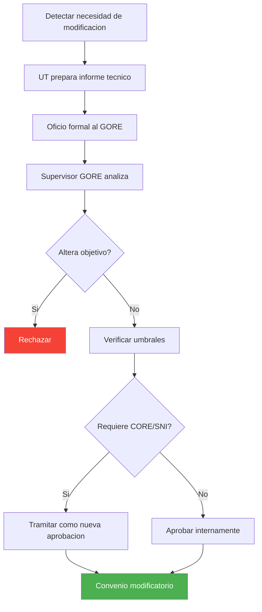

### 7.1 Solicitud de Modificación

**Paso 1 – Unidad Técnica Receptora**

- Detectar necesidad de modificación (sobrecosto, obra adicional, imprevisto, etc.)
- Preparar informe técnico y financiero que justifique la modificación
- Output: informe de solicitud de modificación

**Paso 2 – Unidad Técnica Receptora**

- Enviar oficio al Gobernador/a solicitando formalmente la modificación, adjuntando informe y antecedentes (nuevos presupuestos, planos, etc.)
- Output: solicitud formal ingresada al GORE

### 7.2 Evaluación de la Modificación (Reevaluación)

**Paso 1 – Supervisor/a GORE / Analista DIPIR**

- Analizar pertinencia y justificación técnica de la modificación
- Verificar que no altere sustancialmente el objetivo del proyecto
- Output: informe técnico GORE sobre modificación

**Paso 2 – DIPIR / DIPLADE**

- Si el cambio es significativo: reevaluar conveniencia de la IPR
- Verificar si el nuevo costo total supera umbrales que exigen nuevo pronunciamiento CORE o SNI
- Output: pronunciamiento técnico sobre viabilidad de modificación

**Paso 3 – Jefatura DIPIR / GORE**

- Con base en informes técnicos, aprobar o rechazar la modificación
- Output: decisión formal sobre modificación

### 7.3 Tramitación de la Modificación

**Paso 1 – DIPIR / CORE** (solo si modificación implica aumento de presupuesto)

- Repetir proceso de solicitud de financiamiento y, si aplica, paso por CORE
- Output: fondos adicionales aprobados

**Paso 2 – DAF / Depto. Presupuesto**

- Tramitar modificación presupuestaria (Resolución/Decreto)
- Modificar convenio de transferencia según corresponda
- Output: convenio y presupuesto modificados y tramitados

## Fase 7 – Cierre y Evaluación Ex-Post

Formaliza la finalización de la IPR y genera lecciones aprendidas mediante evaluación ex-post cuando corresponda. Base: Res. 30/2015 CGR.

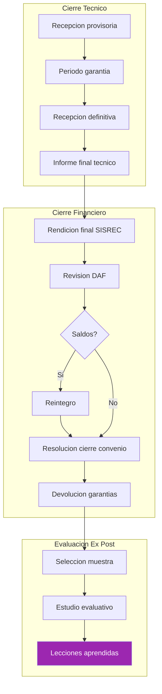

### 8.1 Cierre Técnico

**Paso 1 – Unidad Técnica Receptora**

- Realizar recepción provisoria y definitiva de obras al contratista
- Tras el período de garantía, formalizar recepción definitiva
- Output: Acta de Recepción Definitiva de Obras

**Paso 2 – Unidad Técnica / Supervisor GORE**

- Elaborar informe final de ejecución (productos, metas, resultados)
- Validar informe por parte del Supervisor GORE
- Output: informe final técnico aprobado

### 8.2 Cierre Financiero y Administrativo

**Paso 1 – Unidad Técnica Receptora**

- Presentar rendición final de cuentas en SISREC CGR, sin saldos por rendir
- Output: rendición final presentada

**Paso 2 – Analista Financiero GORE (DAF)**

- Revisar y aprobar rendición final según guía específica
- Solicitar reintegro de saldos no utilizados o gastos rechazados
- Pronunciarse de manera fundada sobre la rendición dentro del plazo máximo aplicable, salvo que el convenio establezca un plazo diferente
- Output: rendición final aprobada y saldos reintegrados

**Paso 3 – Profesional Depto. Presupuesto**

- Elaborar resolución que aprueba la rendición de cuentas y declara cierre del convenio
- Output: Resolución de Cierre de Convenio

**Paso 4 – DAF / Entidad Receptora**

- Una vez cerrado el convenio, gestionar devolución de garantías
- Output: garantías devueltas

### 8.3 Evaluación Ex-Post

**Paso 1 – MDSF / GORE**

- Seleccionar IPR relevantes para evaluación ex-post
- Output: muestra de IPR a evaluar

**Paso 2 – Equipo Evaluador Externo/Interno**

- Realizar estudio comparando situación "con proyecto" vs. "sin proyecto"
- Output: Informe de Evaluación Ex-Post

**Paso 3 – GORE / SNI**

- Utilizar conclusiones y lecciones aprendidas para mejorar formulación y evaluación de futuras IPR
- Output: lecciones aprendidas incorporadas al ciclo de inversión

## Sistemas de Información

| Sistema | Fases de uso |
|---|---|
| BIP-SNI | P1, P2, P5, P7 |
| GESDOC | P1, P2 |
| SIGFE | P3, P4, P5, P7 |
| SISREC | P7 |
