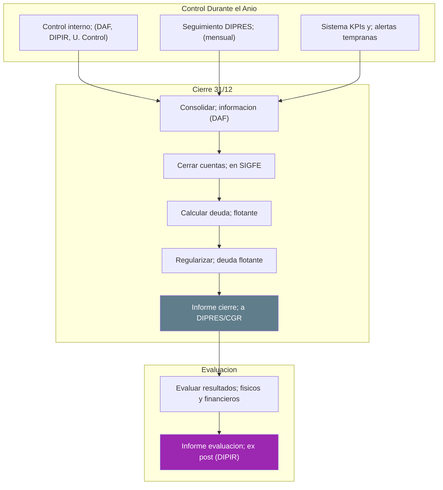
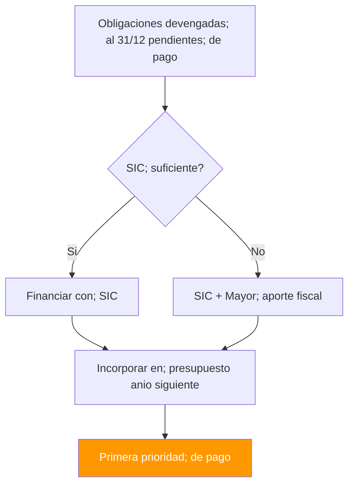

---
_manifest:
  urn: urn:gn:kb:gestion-prpto-p03
  provenance:
    created_by: FS
    created_at: '2026-03-15'
    source: kb_gn_018_gestion_prpto.md + D02_ciclo_presupuestario_koda.yml + kb_gn_043_manual_presupuesto_koda.yml
version: 1.1.0
status: published
tags:
- presupuesto
- gore
- gestion-financiera
- ciclo-presupuestario
- daf-dipir
lang: es
extensions:
  gn:
    family: normative
  kora:
    shard_index: 3
    shard_count: 4
    shard_root_urn: urn:gn:kb:gestion-prpto
---

# Gestión Financiera y Operativa del Presupuesto Regional GORE 2026 - Parte 03

## Subtítulo 33 — Transferencias de Capital

- Transferencia de recursos a terceros para ejecutar proyectos de inversión; subtítulo de mayor peso.
- Base: Glosa 11 Partida 31.
- Cada transferencia debe formalizarse en convenio con objeto, monto, plazos, obligaciones, seguimiento y garantías.
- Ítems: 01 Al Sector Privado; 03 A Otras Entidades Públicas; 04 A Empresas Públicas no Financieras; 05 A Empresas Públicas Financieras; 06 A Gobiernos Extranjeros; 07 A Organismos Internacionales.

**Convenio Mandato vs. Convenio de Transferencia:** Cuando el GORE no es la unidad técnica ejecutora, la inversión se canaliza mediante dos modalidades de convenio con naturaleza jurídica y operativa distinta. El **Convenio Mandato** es aquel en que el GORE encarga la ejecución de una iniciativa a un tercero con capacidad técnica (MOP, SERVIU, Municipalidad u otra entidad pública habilitada); los recursos se transfieren contra avance mediante Estados de Pago, y la entidad mandataria actúa como unidad técnica bajo supervisión del GORE. El **Convenio de Transferencia** entrega recursos para ejecución directa por parte del beneficiario (subvenciones, fondos concursables, programas Glosa 06); la rendición es estricta vía SISREC/CGR. La distinción es relevante para determinar el momento de devengo, los requisitos de rendición y el grado de control que ejerce el GORE sobre la ejecución.

**Iniciativas adicionales permitidas (Glosa 11):**
- PMU/PMB en coordinación con SUBDERE.
- Infraestructura social/deportiva en inmuebles: bienes comunes de comunidades agrícolas; condominios de viviendas sociales; conformados según leyes N°15.020, N°16.640 y N°19.253; inmuebles fiscales en tuición de organizaciones privadas sin fines de lucro con fines sociales.
- Caminos comunitarios en territorios Ley N°19.253 o de comunidades agrícolas.
- Fachadas de inmuebles privados con protección patrimonial.
- Protección/puesta en valor de Monumentos Nacionales, Inmuebles de Conservación Histórica, zonas de conservación, UNESCO y Lista Tentativa (incluye ejecución con sector privado).
- Subsidios a empresas (públicas o privadas) para inversión social (electrificación, gas, energía, telefonía/comunicaciones), evaluadas por MDSF.
- APR/sanitarios rurales/desalinización: transferencia por resolución fundada del Gobernador Regional con efectos sin esperar total tramitación; requiere pronunciamiento técnico favorable Subdirección SSR.
- Transferencias a municipalidades y empresas sanitarias para monitoreo, mantenciones, diseño de soluciones y trabajos preventivos ante filtraciones de redes agua potable/alcantarillado; incluye pavimentación post recambio de redes; previa visación del órgano competente regional.
- Proyectos de Construcción de Infraestructura Sanitaria: rige límite de costo art. 8° DS N°829/1998 Ministerio del Interior y sus modificaciones.

**FRIL:**
- Proyectos municipales con costo total inferior a 4.545 UTM (Glosa 12 Partida 31) no requieren informe favorable MDSF; se debe ingresar al SNI la información necesaria.
- GORE puede aprobar por resolución instructivos o bases (metodología distribución entre comunas, procedimientos de ejecución, entrega de recursos, rendición y otros).
- Una vez aprobados los montos por municipio, el compromiso debe informarse mediante oficio al municipio respectivo.
- Guía Operativa FRIL SUBDERE: Resolución Exenta N°15.051 de 29-12-2023.

## Subtítulo 34 — Servicio de Deuda

- Pagos asociados principalmente a la Deuda Flotante del año anterior.
- Uso de Ítem 34.07.
- Los GORE no pueden endeudarse sin ley especial.
- Alto nivel de deuda flotante recurrente indica gestión deficiente.

## Glosas Relevantes y Fondos Especiales

### FNDR

- Principal fuente de financiamiento de inversión regional.
- Distribución referencial: 90% asignado por ley, 10% gestionado por SUBDERE/DIPRES.
- DIPIR programa cartera para ejecutar 90%; DAF vigila uso autorizado de giros.

### FRPD (Fondo Regional para la Productividad y el Desarrollo)

- Reemplaza al FIC; orientado a innovación, competitividad, ciencia y tecnología.
- Base: Glosa 13 Partida 31 Ley 21.796; Art. 13 Ley 21.591 (Royalty Minero); Decreto N°1699 de 06-12-2025 MH; Resolución Exenta N°33/2024 MinCiencia; Resolución Exenta N°08/2025 Subsecretaría de Economía.
- Provisión FRPD en Ítem 33.03 en presupuesto inicial; reasignación a iniciativas específicas vía modificaciones presupuestarias.
- Tipología Innovación y Competitividad (Res. Ex. N°33 SUBDERE 2024) exenta de evaluación ex-ante Glosa 06.
- Pueden transferirse directamente recursos a iniciativas seleccionadas mediante concurso convocado por CORFO o ANID cuyas instituciones ejecutoras estén en Resolución Exenta N°33/2024 MinCiencia.
- Pueden efectuarse creaciones y modificaciones de asignaciones para pago de compromisos de arrastre de iniciativas del Fondo de Innovación y Competitividad.
- Participación en financiamiento de iniciativas de Programas de Desarrollo Productivo Sostenible (Ministerio de Economía) y Programa de Financiamiento Estructural I+D+i Universitario (Ministerio de Ciencia).
- DIPIR gestiona fondo; DAF maneja provisión y control financiero.

### Asociatividad Regional

- GORE puede participar en corporaciones y fundaciones (Art. 101 LOC GORE; Glosa 08 Partida 31 Ley 21.796).
- Aporte máximo GORE: 5% del presupuesto de inversión.
- Aportes para funcionamiento son anuales; no proceden convenios plurianuales.
- Cofinanciamiento máximo 50% con recursos GORE.
- Aportes privados pueden ser no pecuniarios, valorizados en convenio.
- Informe al término del primer trimestre: razón social; misión/objetivos/productos; directorio; organigrama; instituciones que financian; vínculo con objetivos del GORE; planificación anual con resultados esperados.
- Informe trimestral (dentro de 30 días): número de profesionales, remuneración y perfil; concursos de contratación; recursos transferidos/ejecutados; indicadores de gestión.
- Cuenta pública anual; estados financieros publicados; régimen Ley N°20.285.

### Universidades Regionales (Glosa 05 Partida 31)

- Habilita transferencias a universidades del DFL N°4 de 1981 con casa central en la región.
- Ejecución íntegra por la propia universidad, preferentemente con sede en la región.
- Solo para fines dentro del ámbito de competencia del establecimiento adjudicatario.
- Pueden exceptuarse del mecanismo de concursabilidad de la ley.

### Equidad e Inversion Territorial

- Fondo de Equidad Interregional: integrado al programa de inversión.
- Planes de Zonas Extremas y Territorios Rezagados: financiados con programa especial de Asociatividad y Planes Especiales.

## Control y Seguimiento

### Control Interno

- Unidad de Control o auditoría interna del GORE.
- Revisión ex-ante de actos administrativos de contenido financiero; visación de resoluciones; revisión de rendiciones.

### Control CGR

- Toma de Razón de resoluciones y decretos presupuestarios.
- Auditorías e investigaciones especiales (control posterior).
- DIPIR y DAF mantienen antecedentes ordenados para fiscalizaciones.

### Seguimiento DIPRES

- Monitoreo mensual de ejecución presupuestaria mediante informes, reuniones y alertas de baja ejecución.
- GORE gestiona calendario de hitos para asegurar cumplimiento.

### Transparencia y Control Social

- Publicar mensualmente en sitio web del GORE la cartera de proyectos financiados con inversión regional.
- Publicar acuerdos del CORE en máximo 5 días hábiles.
- Informar trimestralmente uso de recursos de inversión regional: beneficiarios, comuna, instituciones receptoras, monto, productos del convenio y aplicación regional.
- Informar y publicar trimestralmente destino de recursos FNDR a proyectos de desarrollo económico y proyectos adjudicados por sectores.
- Informar trimestralmente proyectos adjudicados o contratados con cargo a Subtítulos 24, 31 y 33 (nombre, monto estimado, postulantes, pauta de evaluación, seleccionado, presupuesto aprobado, votación CORE).
- Informar trimestralmente transferencias con cargo al Fondo de Vinculación con la Comunidad (8%): beneficiario, comuna, objeto, montos totales y fecha.
- Informar trimestralmente iniciativas y proyectos de inversión que superen 500 UTM: proyecto, antecedentes, montos, plazo de ejecución e identidad del receptor.
- Informar trimestralmente disponibilidad presupuestaria para universidades reconocidas por el Estado para FRPD.
- Publicar de forma permanente en transparencia activa (literal k, art. 7 Ley N°20.285) montos recibidos y ejecución presupuestaria del FRPD, incluyendo detalle de transferencias.
- Publicar información en formato digital legible y procesable (no solo imágenes).
- Publicar en transparencia activa las actas de evaluación de comisiones evaluadoras de licitaciones (Ley N°19.886).

## Requerimientos de Información Partida 31 — 2026

| ID | Periodicidad | Actor | Destinatario | Contenido |
|----|-------------|-------|-------------|-----------|
| INFO-REQ-01 | Semestral | SUBDERE | CEMP | Montos para proyectos de conectividad digital en zonas rezagadas no cubiertas por Fondo de Desarrollo para las Telecomunicaciones |
| INFO-REQ-02 | Mensual + 5 días hábiles | GORES | Web propia | Cartera de proyectos de inversión; acuerdos del CORE dentro de 5 días hábiles |
| INFO-REQ-03 | Trimestral | GORES | CEMP + Comisión Gobierno Interior Cámara + SUBDERE | a) Uso de recursos de inversión (beneficiarios, comuna, instituciones, monto, productos, aplicación regional); b) Destino FNDR a proyectos de desarrollo económico y adjudicados por sectores |
| INFO-REQ-04 | Trimestral | GORES | — | Disponibilidad presupuestaria FRPD para universidades; solicitudes de asignación directa recibidas para I+D/innovación/desarrollo científico y aeroespacial |
| INFO-REQ-05 | Trimestral | Cada GORE | Web propia + senadores y diputados de la región | Proyectos adjudicados/contratados cargo Subtítulo 24 y Subtítulos 31 y 33: nombre, monto estimado, postulantes, pauta de evaluación, seleccionado, presupuesto aprobado, votación CORE |
| INFO-REQ-06 | Trimestral | SUBDERE | Web propia | Distribución recursos entre regiones, criterios, cartera de proyectos, costo de cada proyecto, ejecución presupuestaria Plan Especial de Zonas Extremas por región |
| INFO-REQ-07 | A más tardar 30-04-2026 | DIPRES | CEMP + Comisión Gobierno Interior Cámara + Comisión Gobierno Descentralización Senado | Saldos iniciales de caja incorporados al presupuesto de cada GORE (funcionamiento e inversión) |
| INFO-REQ-08 | Semestral | GORES | CEMP + Comisión Vivienda y Bienes Nacionales Cámara | Avances en compra de terrenos para viviendas sociales |
| INFO-REQ-09 | Permanente | Cada GORE beneficiario FRPD | Transparencia Activa | Montos recibidos e informes de ejecución presupuestaria FRPD, incluido detalle de transferencias; conforme literal k, art. 7° Ley N°20.285 |
| INFO-REQ-10 | Antes del 30-09-2026 | DIPRES | CEMP + GORES | Criterios para asignación de recursos adicionales dentro de Partida 31, nivel de ejecución por región y decisiones de distribución |
| INFO-REQ-11 | Trimestral | SUBDERE | GORE Maule + CEMP | Estado de implementación Fondo de Apoyo al Transporte Público y la Conectividad Regional en la región del Maule |
| INFO-REQ-12 | Trimestral | GORE | Comisiones de Gobierno Descentralización y Hacienda del Senado; Comisiones Gobierno Interior y Hacienda de la Cámara | Iniciativas y proyectos de inversión >500 UTM: proyecto, antecedentes, montos, plazo de ejecución, identidad del receptor |
| INFO-REQ-12B | Hasta último día hábil de marzo 2026 | GORE | Comisiones de Hacienda de ambas Cámaras | Nombre y cargo del responsable de evacuar la información y de quien lo subrogará |
| INFO-REQ-13 | Trimestral | Gobernador regional | Comisiones de Gobierno Descentralización y Hacienda del Senado; Comisiones Gobierno Interior y Hacienda de la Cámara | Transferencias con cargo al Fondo de Vinculación con la Comunidad: beneficiario, comuna, objeto, montos totales, fecha de cada transferencia |
| INFO-REQ-13B | Hasta último día hábil de marzo 2026 | GORE | Comisiones de Hacienda de ambas Cámaras | Nombre y cargo del responsable y de quien lo subrogará |
| INFO-REQ-14 | Semestral | GORES | CEMP | Informe consolidado ejecución presupuestaria y avance de iniciativas financiadas a través de Planes Especiales de Zonas Extremas |
| INFO-REQ-15 | Anual | GORES | CEMP | Recursos destinados a abastecimiento mediante camiones aljibe en situaciones de emergencia hídrica |
| INFO-REQ-16 | Anual | GORE | CEMP | Acciones de coordinación con Dirección de Obras Hidráulicas para atender emergencias APR: tiempos de respuesta y mecanismos de seguimiento |

## GORE Ñuble — Programa 19 (2026)

- Dotación máxima de vehículos: 5
- Gastos en personal: M$ 4.222.003
- Dotación máxima de personal: 101
- Horas extraordinarias: M$ 9.928
- Viáticos territorio nacional: M$ 19.802; exterior: M$ 17.100
- Convenios con personas naturales: N° 3; M$ 115.294
- Funciones críticas: N° 2; M$ 23.242
- Monto máximo publicidad: M$ 84.272

**Informes específicos 2026:**
- Trimestral a Comisión Especial Mixta de Presupuestos: convenios y montos para compra/distribución de agua vía camiones aljibe, comunas, población beneficiada y acciones para incentivar competencia.
- Trimestral a Comisiones de Economía del Senado y de la Cámara: proyectos de inversión a implementarse en Ñuble y efecto en generación de empleo regional.

## Cierre Presupuestario

### Deuda Flotante

- Obligaciones devengadas en el año pero pendientes de pago al 31 de diciembre.
- DAF calcula, registra y tramita incorporación en el año siguiente mediante creación del ítem 34.07.
- Art. 34 Ley 21.796: permite exceder las sumas fijadas para este ítem.
- Si SIC supera deuda flotante: financiamiento 100% con SIC (solo Resolución GORE).
- Si SIC es insuficiente: se usa todo el SIC y la diferencia con mayor aporte fiscal (Resolución GORE + Decreto DIPRES).

### Evaluación y Cierre

- DAF: ajustes contables, Informe de Ejecución Anual, nuevo SIC.
- DIPIR: evalúa ejecución física de proyectos, identifica logros/retrasos/cuellos de botella; retroalimenta la siguiente formulación.
- Cierre en SIGFE (DAF) y actualización estado final en BIP (DIPIR).

## Sistemas de Información

| Sistema | Responsable | Función Principal |
|---------|-------------|-------------------|
| SIGFE | DAF | Gestión financiera central: registro de todas las etapas del gasto (preafectación, compromiso, devengo, pago), control presupuestario en línea, generación de reportes para DIPRES y gestión de pagos |
| BIP-SNI | DIPIR | Inversión pública: evaluación ex-ante y Recomendación Satisfactoria, seguimiento físico-financiero de iniciativas, planificación multianual (ARI). Interoperabilidad limitada con SIGFE; requiere conciliaciones manuales |
| Transparencia | GORE (DAF/DIPIR) | Publicación de información: cartera de proyectos, acuerdos CORE, ejecución presupuestaria, transferencias FRPD y reportes trimestrales conforme Ley N°20.285 y glosas de Partida 31 |
