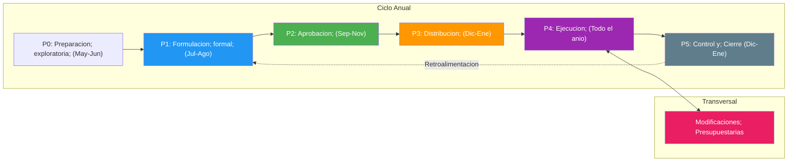
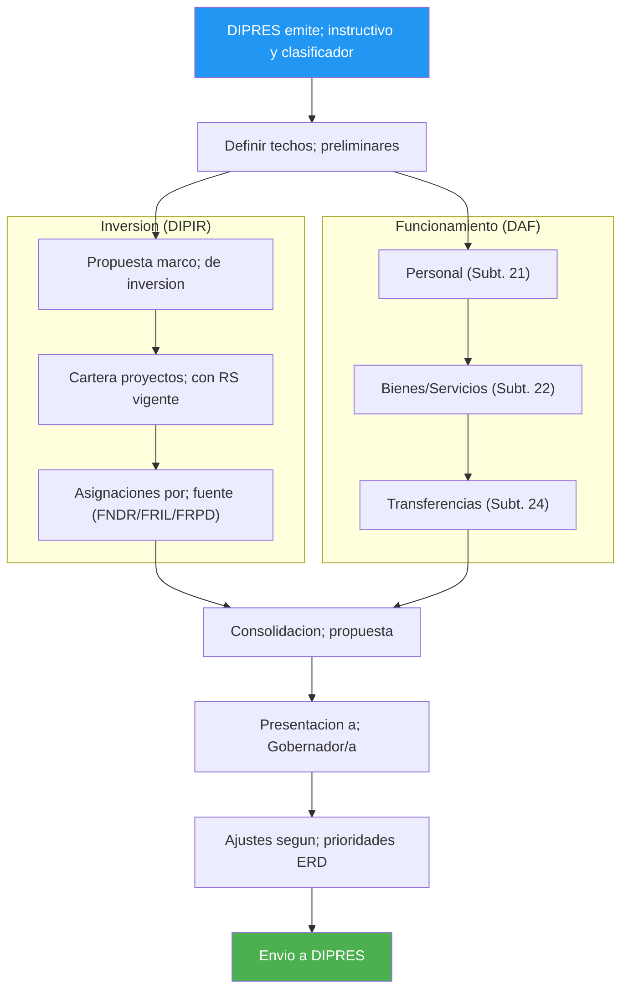

---
_manifest:
  urn: urn:gn:kb:gestion-prpto
  provenance:
    created_by: FS
    created_at: '2026-03-15'
    source: kb_gn_018_gestion_prpto.md + D02_ciclo_presupuestario_koda.yml + kb_gn_043_manual_presupuesto_koda.yml
version: 1.1.0
status: published
tags:
- presupuesto
- gore
- gestion-financiera
- ciclo-presupuestario
- daf-dipir
lang: es
extensions:
  gn:
    family: normative
  kora:
    shard_index: 1
    shard_count: 4
    shard_root_urn: urn:gn:kb:gestion-prpto
---

# Gestión Financiera y Operativa del Presupuesto Regional GORE 2026

## Resumen

Guía técnico-operativa para la gestión completa del presupuesto regional en Gobiernos Regionales (foco GORE Ñuble), alineada a Ley de Presupuestos 2026 (Ley N° 21.796) y glosas/requerimientos de información de Partida 31. Cubre el ciclo completo: formulación → aprobación → ejecución → modificaciones → control → cierre. Marco normativo: D.F.L. N°1-19.175, D.L. N°1.263/1975, normativa DIPRES y CGR.

## Glosario Clave

| Sigla | Nombre | Definición |
|-------|--------|-----------|
| GORE | Gobierno Regional | Entidad pública autónoma con personalidad jurídica y patrimonio propio, encargada de la administración superior de la región |
| CORE | Consejo Regional | Órgano colegiado del GORE con facultades normativas, resolutivas y fiscalizadoras |
| DAF | División de Administración y Finanzas | División responsable de gestión administrativa interna, finanzas, presupuesto de funcionamiento y pagos del GORE |
| DIPIR | División de Presupuesto e Inversión Regional | División encargada del presupuesto de inversión, programación y seguimiento de iniciativas de inversión y programas regionales |
| DIPRES | Dirección de Presupuestos | Órgano técnico del Ministerio de Hacienda; formulación, ejecución y control del Presupuesto del Sector Público |
| CGR | Contraloría General de la República | Órgano de control; ejerce control de legalidad previo (Toma de Razón) y posterior sobre actos presupuestarios del GORE |
| MDSF | Ministerio de Desarrollo Social y Familia | Responsable de evaluación técnico-económica de iniciativas de inversión en el SNI |
| SIGFE | Sistema de Información para la Gestión Financiera del Estado | Sistema contable-presupuestario oficial donde se registra la ejecución del presupuesto del GORE |
| BIP | Banco Integrado de Proyectos | Plataforma del SNI para registro y seguimiento de iniciativas de inversión pública |
| SNI | Sistema Nacional de Inversiones | Marco y plataforma para evaluación técnico-económica de proyectos de inversión pública |
| FNDR | Fondo Nacional de Desarrollo Regional | Principal fuente de financiamiento de la inversión regional |
| FRIL | Fondo Regional de Iniciativa Local | Fondo para proyectos de infraestructura de menor escala, ejecutados principalmente por municipalidades |
| FRPD | Fondo Regional para la Productividad y el Desarrollo | Fondo financiado con royalty minero para innovación, competitividad y desarrollo productivo |
| ARI | Anteproyecto Regional de Inversiones | Instrumento de planificación que estima la inversión pública en la región para el año siguiente |
| PROPIR | Programa Público de Inversión en la Región | Instrumento que organiza y monitorea el gasto público regional del año en curso |
| SISREC | Sistema de Rendición Electrónica de Cuentas | Plataforma de CGR para gestionar rendiciones de cuentas de transferencias |

## Marco Normativo

**Jerarquía:** Ley > Decreto > Resolución > Oficio Circular > Instructivo

- D.F.L. N°1-19.175 (LOC GORE)
- D.L. N°1.263/1975 (Administración Financiera del Estado)
- Ley N° 21.796 (Ley de Presupuestos 2026, Diario Oficial 12-12-2025, CVE 2741100)
- Normas DIPRES: oficios circulares, instructivos de ejecución
- Normas CGR: resoluciones, instructivos

### Cambios estructurales desde 2025 (vigentes en 2026)

Fuente: Oficio Circular N°11 DIPRES 2025

- Creación de 16 programas presupuestarios (uno por región) que integran funcionamiento e inversión.
- Creación de programa especial "Asociatividad y Planes Especiales" para asociatividad regional, zonas extremas y territorios rezagados.
- Causa: profundización del proceso de descentralización fiscal.
- Impacto: requiere coordinación estrecha DAF-DIPIR para gestionar un solo programa integrado.

## Conceptos Presupuestarios Fundamentales

### Presupuesto del Sector Público

Estimación financiera de ingresos y gastos del sector público para un año, que compatibiliza recursos disponibles con metas y objetivos (Art. 11, D.L. N°1.263/1975).

**Principios:**
- Universalidad: todos los ingresos y gastos del Estado deben reflejarse en el presupuesto (Art. 4°, D.L. N°1.263/1975).
- Anualidad: el ejercicio presupuestario coincide con el año calendario (Art. 12, D.L. N°1.263/1975).

### Clasificación Institucional

Estructura: **Partida → Capítulo → Programa**

- **Partida:** nivel superior (ej. Partida 31 - Gobiernos Regionales)
- **Capítulo:** subdivisión de la Partida; un capítulo por cada GORE
- **Programa:** división del Capítulo asociada a funciones específicas (ej. Programa 01 Funcionamiento, 02 Inversión Regional, 03 Asociatividad y Planes Especiales)

### Clasificación por Objeto

Estructura: **Subtítulo → Ítem → Asignación → Sub-asignación**

- Subtítulos de gasto: 21 Gastos en Personal, 22 Bienes y Servicios de Consumo, 33 Transferencias de Capital
- Subtítulos de ingreso: 08 Otros Ingresos Corrientes, 09 Aporte Fiscal, 15 Saldo Inicial de Caja

### Clasificación por Grado de Afectación

| Etapa | Descripción |
|-------|-------------|
| Preafectación | Intenciones de gasto sin obligación a terceros (llamados a licitación, cotizaciones) |
| Afectación | Obligación sujeta a perfeccionamiento (adjudicación, selección de proveedor) |
| Compromiso Cierto | Obligación recíproca formalizada (orden de compra, contrato, nombramiento) |
| Compromiso Implícito | Gasto y devengo simultáneos (servicios básicos, peajes) |

## Ciclo Presupuestario

**Etapas:** 1) Formulación, 2) Aprobación / Distribución Inicial, 3) Ejecución, 4) Modificaciones, 5) Control y Seguimiento, 6) Cierre

- **Rol DAF:** financiero-administrativo
- **Rol DIPIR:** estratégico-programático de inversión

## Formulación

**DIPIR — Inversión:**
- Elaborar proyecto de presupuesto de inversiones; asesorar al Gobernador en selección de proyectos.
- Coordinar ARI y PROPIR; recopilar iniciativas de servicios públicos (plataforma Chileindica).
- Alinear con Estrategia Regional de Desarrollo (ERD) y coordinar con DIPLADE.

**DIPIR — Oferta Programática:**
- Diseñar programas públicos con Metodología de Marco Lógico.
- Preparar antecedentes para evaluación ex-ante (DIPRES/MDSF) de programas Glosa 06.
- Identificar programas nuevos o sustancialmente reformulados con evaluación obligatoria.
- Base: Glosa 06 Partida 31 Ley 21.796; Oficio Circular N°22 DIPRES.

**DAF — Proyecciones y Clasificación:**
- Proyectar gastos de funcionamiento (Subtítulos 21 y 22) con base en dotación vigente y gastos recurrentes.
- Cumplir restricciones legales (ej. Art. 04 Ley 21.796).
- Verificar correcta aplicación del clasificador presupuestario (Decreto N°854/2004).
- Asegurar nivel de detalle adecuado en transferencias (Subtítulos 24 y 33).

**Coordinación DIPIR-DAF:**
- Identificar y explicitar glosas aplicables (dotaciones, vehículos, viáticos, etc.).
- Crear provisiones: FRPD en ítem 33.03, FRIL, provisiones 8% FNDR.
- Obtener Recomendación Satisfactoria (RS) de MDSF para inclusión en presupuesto (salvo excepciones como FRIL).
- Mantener proyectos en SNI con código BIP.

**ARI y PROPIR (plataforma Chileindica, www.chileindica.cl):**

| Instrumento | Descripción |
|-------------|-------------|
| ARI | Estimación de inversión de GORE, ministerios y servicios para el año siguiente; plazos máx. primeros 4 meses |
| PROPIR | Planificación y seguimiento del gasto público regional del año en curso; informe trimestral al CORE |

Gobernador conduce el proceso (puede delegar en Jefe DIPLADE). Servicios públicos ingresan iniciativas a Chileindica con desglose comunal, montos, fuente, beneficiarios y alineación con ERD.

## Aprobación y Distribución Inicial

**Plazos (Art. 25 LOC GORE; Glosa 01 Partida 31):**

| Hito | Plazo |
|------|-------|
| Gobernador propone al CORE | 10 días desde publicación Ley |
| CORE se pronuncia | 10 días desde recepción |
| Gobernador remite acuerdo a DIPRES | 5 días desde aprobación CORE |
| DIPRES elabora resoluciones | 10 días |
| Toma de Razón CGR | 15 días desde recepción (prorrogable por 15) |

**Requisitos presupuesto de funcionamiento:**
- Incluir glosas obligatorias (dotación, vehículos, viáticos, gasto CORE en el extranjero).
- Monto del Subtítulo 21 debe coincidir con glosa específica autorizada.

**Requisitos presupuesto de inversión:**
- Incluir arrastres conservando número de asignación y código BIP.
- Incorporar nuevas iniciativas cumpliendo requisitos de glosas.
- Para nuevas transferencias a privados: acreditar selección por concurso o causal de excepción y personalidad jurídica vigente.
- Crear asignación FRPD en ítem 33.03 y otras provisiones (FRIL, 8% FNDR).

**Toma de Razón CGR:** verifica clasificación presupuestaria, cumplimiento de glosas, conformidad normativa y coincidencia GORE-CORE-DIPRES. Post-TDR: DAF carga presupuesto en SIGFE.

## Ejecución

**Programación de caja:**
- DIPRES elabora programa de ejecución inicial mensualizado; GORE propone su programa.
- GORE remite actualizaciones mensuales a más tardar el día 15.
- Programa de Caja Mensual basado en ejecución programada menos saldos disponibles.

**Rol DAF:**
- Garantizar gasto dentro de montos y clasificaciones autorizadas.
- Registrar preafectación, compromiso, devengo y pago en SIGFE.
- Tramitar órdenes de compra y realizar pagos obligatoriamente vía transferencia electrónica (Art. 08 Ley 21.796).
- Identificar mensualmente iniciativas de inversión (Subtítulo 31) por código BIP.
- Certificar disponibilidad presupuestaria y límites legales con coordinación de Unidad de Control.

**Rol DIPIR:**
- Revisar avance físico de obras e iniciativas (Subtítulos 31 y 33).
- Detectar atrasos o desviaciones y proponer acciones correctivas.
- Evaluar cumplimiento de hitos de convenios (trimestral).
- Actualizar estados en BIP y cargar ejecución físico-financiera (primeros 8 días del mes siguiente).

**Reglas de devengo por tipo de transferencia:**

| Tipo | Moment Devengo |
|------|----------------|
| Transferencias extrapresupuestarias (Subtítulos 24-03, 33-03) a instituciones de la Ley de Presupuestos | Al aprobarse la rendición |
| Transferencias presupuestarias consolidables o a municipios (24-02, 33-02; 24-03, 33-03) | Cuando la obligación es exigible (acto o convenio tramitado) |
| Transferencias a entidades privadas (24-01, 33-01) | Cuando la obligación es exigible conforme al convenio/acto |

Fuente: Minuta CGR-AGORECHI-DIPRES marzo 2025; Dictamen CGR N°E583841/2024.
