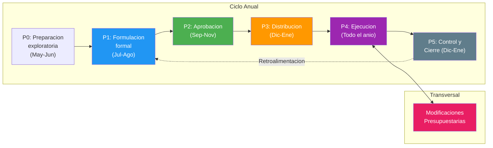
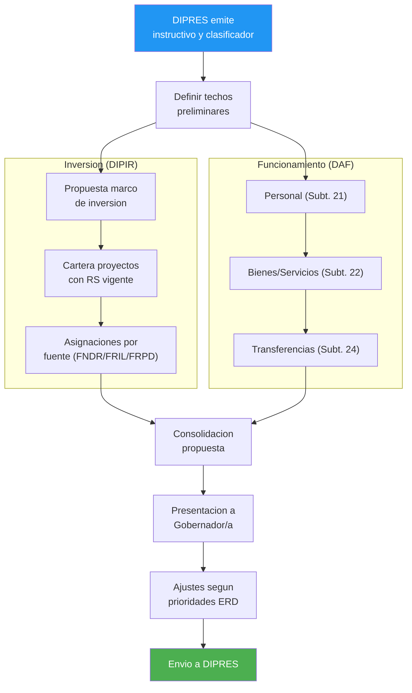
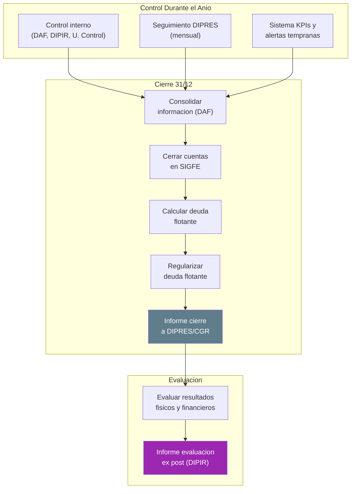
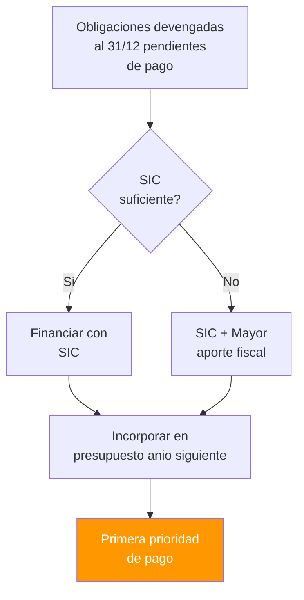

---
_manifest:
  urn: "urn:gn:kb:gestion-prpto"
  provenance:
    created_by: "FS"
    created_at: "2026-03-15"
    source: "kb_gn_018_gestion_prpto.md + D02_ciclo_presupuestario_koda.yml + kb_gn_043_manual_presupuesto_koda.yml"
version: "1.1.0"
status: published
tags: [presupuesto, gore, gestion-financiera, ciclo-presupuestario, daf-dipir]
lang: es
extensions:
  gn:
    family: normative
---

# Gestión Financiera y Operativa del Presupuesto Regional GORE 2026

## Resumen

Guía técnico-operativa para la gestión completa del presupuesto regional en Gobiernos Regionales (foco GORE Ñuble), alineada a Ley de Presupuestos 2026 (Ley N° 21.796) y glosas/requerimientos de información de Partida 31. Cubre el ciclo completo: formulación → aprobación → ejecución → modificaciones → control → cierre. Marco normativo: D.F.L. N°1-19.175, D.L. N°1.263/1975, normativa DIPRES y CGR.

## Glosario Clave

| Sigla | Nombre | Definición |
|-------|--------|-----------|
| GORE | Gobierno Regional | Entidad pública autónoma con personalidad jurídica y patrimonio propio, encargada de la administración superior de la región |
| CORE | Consejo Regional | Órgano colegiado del GORE con facultades normativas, resolutivas y fiscalizadoras |
| DAF | División de Administración y Finanzas | División responsable de gestión administrativa interna, finanzas, presupuesto de funcionamiento y pagos del GORE |
| DIPIR | División de Presupuesto e Inversión Regional | División encargada del presupuesto de inversión, programación y seguimiento de iniciativas de inversión y programas regionales |
| DIPRES | Dirección de Presupuestos | Órgano técnico del Ministerio de Hacienda; formulación, ejecución y control del Presupuesto del Sector Público |
| CGR | Contraloría General de la República | Órgano de control; ejerce control de legalidad previo (Toma de Razón) y posterior sobre actos presupuestarios del GORE |
| MDSF | Ministerio de Desarrollo Social y Familia | Responsable de evaluación técnico-económica de iniciativas de inversión en el SNI |
| SIGFE | Sistema de Información para la Gestión Financiera del Estado | Sistema contable-presupuestario oficial donde se registra la ejecución del presupuesto del GORE |
| BIP | Banco Integrado de Proyectos | Plataforma del SNI para registro y seguimiento de iniciativas de inversión pública |
| SNI | Sistema Nacional de Inversiones | Marco y plataforma para evaluación técnico-económica de proyectos de inversión pública |
| FNDR | Fondo Nacional de Desarrollo Regional | Principal fuente de financiamiento de la inversión regional |
| FRIL | Fondo Regional de Iniciativa Local | Fondo para proyectos de infraestructura de menor escala, ejecutados principalmente por municipalidades |
| FRPD | Fondo Regional para la Productividad y el Desarrollo | Fondo financiado con royalty minero para innovación, competitividad y desarrollo productivo |
| ARI | Anteproyecto Regional de Inversiones | Instrumento de planificación que estima la inversión pública en la región para el año siguiente |
| PROPIR | Programa Público de Inversión en la Región | Instrumento que organiza y monitorea el gasto público regional del año en curso |
| SISREC | Sistema de Rendición Electrónica de Cuentas | Plataforma de CGR para gestionar rendiciones de cuentas de transferencias |

## Marco Normativo

**Jerarquía:** Ley > Decreto > Resolución > Oficio Circular > Instructivo

- D.F.L. N°1-19.175 (LOC GORE)
- D.L. N°1.263/1975 (Administración Financiera del Estado)
- Ley N° 21.796 (Ley de Presupuestos 2026, Diario Oficial 12-12-2025, CVE 2741100)
- Normas DIPRES: oficios circulares, instructivos de ejecución
- Normas CGR: resoluciones, instructivos

### Cambios estructurales desde 2025 (vigentes en 2026)

Fuente: Oficio Circular N°11 DIPRES 2025

- Creación de 16 programas presupuestarios (uno por región) que integran funcionamiento e inversión.
- Creación de programa especial "Asociatividad y Planes Especiales" para asociatividad regional, zonas extremas y territorios rezagados.
- Causa: profundización del proceso de descentralización fiscal.
- Impacto: requiere coordinación estrecha DAF-DIPIR para gestionar un solo programa integrado.

## Conceptos Presupuestarios Fundamentales

### Presupuesto del Sector Público

Estimación financiera de ingresos y gastos del sector público para un año, que compatibiliza recursos disponibles con metas y objetivos (Art. 11, D.L. N°1.263/1975).

**Principios:**
- Universalidad: todos los ingresos y gastos del Estado deben reflejarse en el presupuesto (Art. 4°, D.L. N°1.263/1975).
- Anualidad: el ejercicio presupuestario coincide con el año calendario (Art. 12, D.L. N°1.263/1975).

### Clasificación Institucional

Estructura: **Partida → Capítulo → Programa**

- **Partida:** nivel superior (ej. Partida 31 - Gobiernos Regionales)
- **Capítulo:** subdivisión de la Partida; un capítulo por cada GORE
- **Programa:** división del Capítulo asociada a funciones específicas (ej. Programa 01 Funcionamiento, 02 Inversión Regional, 03 Asociatividad y Planes Especiales)

### Clasificación por Objeto

Estructura: **Subtítulo → Ítem → Asignación → Sub-asignación**

- Subtítulos de gasto: 21 Gastos en Personal, 22 Bienes y Servicios de Consumo, 33 Transferencias de Capital
- Subtítulos de ingreso: 08 Otros Ingresos Corrientes, 09 Aporte Fiscal, 15 Saldo Inicial de Caja

### Clasificación por Grado de Afectación

| Etapa | Descripción |
|-------|-------------|
| Preafectación | Intenciones de gasto sin obligación a terceros (llamados a licitación, cotizaciones) |
| Afectación | Obligación sujeta a perfeccionamiento (adjudicación, selección de proveedor) |
| Compromiso Cierto | Obligación recíproca formalizada (orden de compra, contrato, nombramiento) |
| Compromiso Implícito | Gasto y devengo simultáneos (servicios básicos, peajes) |

## Ciclo Presupuestario

**Etapas:** 1) Formulación, 2) Aprobación / Distribución Inicial, 3) Ejecución, 4) Modificaciones, 5) Control y Seguimiento, 6) Cierre

- **Rol DAF:** financiero-administrativo
- **Rol DIPIR:** estratégico-programático de inversión

### Formulación

**DIPIR — Inversión:**
- Elaborar proyecto de presupuesto de inversiones; asesorar al Gobernador en selección de proyectos.
- Coordinar ARI y PROPIR; recopilar iniciativas de servicios públicos (plataforma Chileindica).
- Alinear con Estrategia Regional de Desarrollo (ERD) y coordinar con DIPLADE.

**DIPIR — Oferta Programática:**
- Diseñar programas públicos con Metodología de Marco Lógico.
- Preparar antecedentes para evaluación ex-ante (DIPRES/MDSF) de programas Glosa 06.
- Identificar programas nuevos o sustancialmente reformulados con evaluación obligatoria.
- Base: Glosa 06 Partida 31 Ley 21.796; Oficio Circular N°22 DIPRES.

**DAF — Proyecciones y Clasificación:**
- Proyectar gastos de funcionamiento (Subtítulos 21 y 22) con base en dotación vigente y gastos recurrentes.
- Cumplir restricciones legales (ej. Art. 04 Ley 21.796).
- Verificar correcta aplicación del clasificador presupuestario (Decreto N°854/2004).
- Asegurar nivel de detalle adecuado en transferencias (Subtítulos 24 y 33).

**Coordinación DIPIR-DAF:**
- Identificar y explicitar glosas aplicables (dotaciones, vehículos, viáticos, etc.).
- Crear provisiones: FRPD en ítem 33.03, FRIL, provisiones 8% FNDR.
- Obtener Recomendación Satisfactoria (RS) de MDSF para inclusión en presupuesto (salvo excepciones como FRIL).
- Mantener proyectos en SNI con código BIP.

**ARI y PROPIR (plataforma Chileindica, www.chileindica.cl):**

| Instrumento | Descripción |
|-------------|-------------|
| ARI | Estimación de inversión de GORE, ministerios y servicios para el año siguiente; plazos máx. primeros 4 meses |
| PROPIR | Planificación y seguimiento del gasto público regional del año en curso; informe trimestral al CORE |

Gobernador conduce el proceso (puede delegar en Jefe DIPLADE). Servicios públicos ingresan iniciativas a Chileindica con desglose comunal, montos, fuente, beneficiarios y alineación con ERD.

### Aprobación y Distribución Inicial

**Plazos (Art. 25 LOC GORE; Glosa 01 Partida 31):**

| Hito | Plazo |
|------|-------|
| Gobernador propone al CORE | 10 días desde publicación Ley |
| CORE se pronuncia | 10 días desde recepción |
| Gobernador remite acuerdo a DIPRES | 5 días desde aprobación CORE |
| DIPRES elabora resoluciones | 10 días |
| Toma de Razón CGR | 15 días desde recepción (prorrogable por 15) |

**Requisitos presupuesto de funcionamiento:**
- Incluir glosas obligatorias (dotación, vehículos, viáticos, gasto CORE en el extranjero).
- Monto del Subtítulo 21 debe coincidir con glosa específica autorizada.

**Requisitos presupuesto de inversión:**
- Incluir arrastres conservando número de asignación y código BIP.
- Incorporar nuevas iniciativas cumpliendo requisitos de glosas.
- Para nuevas transferencias a privados: acreditar selección por concurso o causal de excepción y personalidad jurídica vigente.
- Crear asignación FRPD en ítem 33.03 y otras provisiones (FRIL, 8% FNDR).

**Toma de Razón CGR:** verifica clasificación presupuestaria, cumplimiento de glosas, conformidad normativa y coincidencia GORE-CORE-DIPRES. Post-TDR: DAF carga presupuesto en SIGFE.

### Ejecución

**Programación de caja:**
- DIPRES elabora programa de ejecución inicial mensualizado; GORE propone su programa.
- GORE remite actualizaciones mensuales a más tardar el día 15.
- Programa de Caja Mensual basado en ejecución programada menos saldos disponibles.

**Rol DAF:**
- Garantizar gasto dentro de montos y clasificaciones autorizadas.
- Registrar preafectación, compromiso, devengo y pago en SIGFE.
- Tramitar órdenes de compra y realizar pagos obligatoriamente vía transferencia electrónica (Art. 08 Ley 21.796).
- Identificar mensualmente iniciativas de inversión (Subtítulo 31) por código BIP.
- Certificar disponibilidad presupuestaria y límites legales con coordinación de Unidad de Control.

**Rol DIPIR:**
- Revisar avance físico de obras e iniciativas (Subtítulos 31 y 33).
- Detectar atrasos o desviaciones y proponer acciones correctivas.
- Evaluar cumplimiento de hitos de convenios (trimestral).
- Actualizar estados en BIP y cargar ejecución físico-financiera (primeros 8 días del mes siguiente).

**Reglas de devengo por tipo de transferencia:**

| Tipo | Moment Devengo |
|------|----------------|
| Transferencias extrapresupuestarias (Subtítulos 24-03, 33-03) a instituciones de la Ley de Presupuestos | Al aprobarse la rendición |
| Transferencias presupuestarias consolidables o a municipios (24-02, 33-02; 24-03, 33-03) | Cuando la obligación es exigible (acto o convenio tramitado) |
| Transferencias a entidades privadas (24-01, 33-01) | Cuando la obligación es exigible conforme al convenio/acto |

Fuente: Minuta CGR-AGORECHI-DIPRES marzo 2025; Dictamen CGR N°E583841/2024.

### Modificaciones Presupuestarias

**Motivaciones y plazos:** Solicitudes a DIPRES hasta 31 de octubre del año.

**Tipos de modificación:**

| Tipo | Acto Requerido |
|------|---------------|
| Suplemento Presupuestario (mayor aporte fiscal) | DS DIPRES + Resolución GORE |
| Incorporación/Reducción de Ingresos Ley | DS DIPRES + Resolución GORE |
| Reasignación Presupuestaria Interna (entre subtítulos dentro del GORE) | Solo Resolución GORE |
| Transferencias consolidables a otros organismos | DS DIPRES + Resolución GORE |
| Financiamiento emergencias (3%, Glosa 14) | DS DIPRES + Resolución GORE |
| Creación iniciativas FRPD (ítem 33.03) | Solo Resolución GORE |
| Incorporación Deuda Flotante con SIC | Solo Resolución GORE |
| Incorporación Deuda Flotante con mayor aporte fiscal | Resolución GORE + DS DIPRES |

Fuente: Oficio Circular N°11 DIPRES 2025.

**Procedimiento externo:**
1. GORE emite resolución firmada por Gobernador.
2. Visación DIPRES (verifica cumplimiento normativo).
3. Toma de Razón CGR.
4. Post-TDR: DAF ajusta en SIGFE; DIPIR notifica a unidades ejecutoras.

**Documentos requeridos:**
- Certificado de acuerdo CORE cuando aplica.
- Minuta explicativa (justificación, origen/destino fondos, glosa habilitante).
- Informe favorable MDSF/DIPRES si financia programas directos nuevos.

**Casos sin acuerdo CORE (Glosa 01 Partida 31; Oficio Circular N°11 DIPRES 2025):**
- Aplicación de leyes generales (reajustes, sentencias, deuda flotante).
- Regularización de ingresos sin incidencia en gastos.
- Variaciones de tipo de cambio en activos no financieros.
- Uso del 3% para emergencias (Glosa 14).
- Aumento de costo de proyectos en ejecución hasta 10% del monto RS (tope 7.000 UTM).
- Adjudicación de licitaciones con variación hasta 10% sobre RS (tope 7.000 UTM).

**Emergencias — Glosa 14:**
- Hasta 3% del presupuesto de inversión aprobado por Congreso puede traspasarse a asignaciones 24.03.002 y/o 33.03.001 de Subsecretaría del Interior.
- Los GORE pueden destinar hasta 2% del presupuesto de Inversión Regional para emergencias definidas por resolución del Ministro/Subsecretario del Interior.
- La ejecución puede efectuarse sin esperar total tramitación del acto administrativo.
- Informe trimestral a Comisión Especial Mixta de Presupuestos y DIPRES.
- Aunque no requieran CORE, sí exigen visación DIPRES, Toma de Razón CGR e información mensual al CORE.

**Límites y flexibilidades:**
- Glosa 03: prohíbe usar inversión para préstamos, gasto en personal o bienes y servicios de consumo de entidades receptoras.
- Glosa 04: permite traspasos entre subtítulos de inversión, excluyendo Subtítulo 22 como receptor.
- Glosa 06: permite usar hasta 5% del monto del programa para gastos de administración del GORE (Subtítulos 21, 22, 29) y hasta 5% para honorarios de la entidad receptora.
- Art. 07 Ley 21.796: habilitación legal expresa para financiar gastos operativos con recursos de transferencia.

**Gastos corrientes (Art. 04 Ley 21.796):** Requiere autorización legal para incrementar suma del valor neto. Excepciones: ítems legalmente excedibles (art. 28 DL N°1.263/1975), Glosa 01 Programa Operaciones Complementarias, mayores saldos iniciales de caja (excepto Partida Tesoro Público), venta de activos financieros, ingresos propios asignables, recursos de fondos concursables de entes públicos, Art. 21 DL N°1.263/1975.

**Gastos de capital (Art. 04 Ley 21.796):** Requiere autorización legal para aumentar en más de 10% la suma aprobada en el Art. 1 de la Ley. Excepciones: reasignaciones desde gastos corrientes, mayores saldos iniciales de caja (excepto Tesoro Público), venta de activos, fondos concursables, recuperación de anticipos.

**Transferencias consolidables:**
- Definición: transferencias desde un GORE a otras instituciones del Presupuesto del Sector Público para evitar doble contabilización del gasto.
- Base: Oficio Circular N°11 DIPRES 2025; Glosa 01 Partida 31; Art. 26 Ley 21.796.
- Pueden efectuarse sin convenio formal si se cumple procedimiento presupuestario.

## Gestión por Subtítulo

### Subtítulo 21 — Gastos en Personal

- Remuneraciones y obligaciones del empleador.
- Responsable: DAF.
- Flexibilidad 2026: sin límite de antigüedad para contratas; contratas pueden ejercer funciones directivas (hasta 20%); honorarios pueden actuar como agente público (Glosa 01 Partida 31).
- Art. 05 Ley 21.796: suspensión de compatibilidad cargo planta con contrata.
- Ítem 03 Asignación 001 Honorarios a Suma Alzada: permite contratar profesionales para programas de inversión (Glosa 06).

### Subtítulo 22 — Bienes y Servicios de Consumo

- Gastos operativos (insumos, servicios básicos, arriendos, pasajes).
- Responsable: DAF.
- **Prohibición:** reasignar recursos de inversión hacia Subtítulo 22 (Glosa 04 Partida 31).
- Incremento solo con ingresos propios o Saldo Inicial de Caja.

### Subtítulo 23 — Prestaciones de Seguridad Social

- Gastos por prestaciones previsionales y asistencia social; uso en GORE generalmente bajo.
- Responsable: DAF.

### Subtítulo 24 — Transferencias Corrientes

- Recursos transferidos sin contraprestación directa para gastos corrientes.
- Transferencias a privados deben ser por concurso público y convenio (Art. 23-27 Ley 21.796).

**Requisitos para transferencias a privados (Art. 23-27 Ley 21.796):**
- Concurso público abierto y transparente; materialización mediante convenio.
- Asignación directa sin concurso solo por: (a) sin interesados en concurso; (b) única persona jurídica posible; (c) emergencia/urgencia/imprevisto calificados.
- Convenio debe indicar objeto social/fines del receptor y acreditar pertinencia; actividades específicas y/o conceptos de gasto a financiar.
- No puede establecer compromisos financieros que excedan el ejercicio sin autorización previa DIPRES.
- Condicionado a cumplimiento íntegro de Ley N°19.862.
- Rendiciones vía SISREC CGR; plazo máx. 3 meses para pronunciarse sobre rendición.
- Restitución obligatoria si recursos se destinan a finalidad distinta, no se utilizan, no se rinden o son observados.
- Para ejecutoras de políticas públicas: al menos 2 años de antigüedad y experiencia acreditada.
- Garantías cuando el total supere 1.000 UTM; equivale al 5% del monto total.
- Reintegros a rentas generales dentro del mes siguiente al cierre de rendición.
- Proceso de rendición no puede extenderse más de 6 meses desde finalización del convenio.

**Transferencias Subtítulo 24 Ítem 09 (Art. 07 Ley 21.796):**
- Desglose previo a ejecución en conceptos de gasto, según visación DIPRES.
- Reporte mensual a DIPRES: avance de actividades e información de ejecución presupuestaria.
- Personal contratado no forma parte de la dotación del Servicio.
- Prohibición: no incluir recursos para gastos en personal ni bienes y servicios de consumo, salvo autorización expresa.

**Concurso de Vinculación con la Comunidad 8% FNDR (Glosa 07 Partida 31):**
- Límite: hasta 8% del total del presupuesto de inversión regional; mínimo 1% a cultura y patrimonio.
- Hasta 10% de los recursos del Concurso para asignaciones directas en casos emblemáticos/excepcionales/emergentes, previo acuerdo del CORE (Resolución N°72 de 08.01.2025 DIPRES).
- Exento de evaluación ex-ante Glosa 06.
- Ejecutores: municipalidades, otras entidades públicas, instituciones privadas sin fines de lucro, organizaciones de la sociedad civil y comunitarias sin fines de lucro.
- Actividades financiables: deportivas/Elige Vivir Sano, seguridad ciudadana, participación NNA/jóvenes (Ley N°21.302 art. 6 letra p)), carácter social (discapacidad con dependencia severa, prevención/rehabilitación drogas), adultos mayores, protección medioambiental/educación ambiental, adopción/rescate/atención veterinaria/gestión residuos animales, ELEAM/residencias familiares/Servicio Reinserción Social Juvenil, teatros municipales o regionales/monumentos históricos con atención al público, culturales y patrimoniales.

**Programas Glosa 06 Partida 31:**
- Programas nuevos de ejecución directa requieren evaluación ex-ante DIPRES/MDSF.
- Hasta 5% del monto de la transferencia para gastos de administración del GORE (personal, bienes y servicios, activos no financieros).
- Personal a honorarios con cargo al 5% tendrá calidad de agente público.
- Receptor público puede contratar honorarios hasta 5% del total; cesa al finalizar el convenio.
- Excepciones a evaluación ex-ante: programas que hayan iniciado ejecución en años anteriores; subvenciones 8%; transferencias a universidades, municipalidades, entidades públicas, gobierno central e instituciones privadas sin fines de lucro sin fines de lucro; ayudas tempranas e iniciativas de fomento productivo vinculadas a emergencias, en coordinación con Ministerio del Interior.

### Subtítulo 26 — Otros Gastos Corrientes

- Devoluciones y compensaciones por daños a terceros.
- Ítems: 01 Devoluciones; 02 Compensaciones por Daños.
- Responsable: DAF.

### Subtítulo 29 — Activos No Financieros

- Adquisición de bienes de capital del GORE (equipos, vehículos, terrenos).
- Activos nuevos requieren certificado de disponibilidad presupuestaria para gastos recurrentes (emitido por Ministerio o Subsecretaría respectiva).
- Para Fuerzas de Orden y Seguridad Pública: certificado de pertinencia del Ministerio de Seguridad Pública.
- Para Bomberos: certificado de pertinencia técnica de la Junta Nacional de Bomberos.
- Compra de terrenos: coordinar con SERVIU de la región, cuando corresponda.
- Responsable: DIPIR identifica necesidades; DAF ejecuta adquisición.
- Ítems: 01 Terrenos; 02 Edificios; 03 Vehículos; 04 Mobiliario y Otros; 05 Máquinas y Equipos; 06 Equipos Informáticos; 07 Programas Informáticos; 99 Otros.

### Subtítulo 31 — Iniciativas de Inversión Directa

- Inversión real ejecutada directamente por el GORE (unidad mandante).
- Base: Glosa 10 Partida 31.
- Licitación pública obligatoria: proyectos/programas de inversión >1.000 UTM; estudios básicos >500 UTM (Art. 06 Ley 21.796).
- Identificaciones presupuestarias en ejecución o creadas en el mismo año no requieren nueva aprobación CORE si montos totales son iguales o menores al 10% de los costos aprobados (reajustados).
- Personal a honorarios para ejecución tendrá calidad de agente público.
- Ítems: 01 Estudios Básicos; 02 Proyectos; 03 Programas de Inversión.

**Iniciativas adicionales permitidas (Glosa 10):**
- Infraestructura pública (construcción, conservación y mejoramiento) en coordinación con ministerio sectorial.
- Transporte (coordinación MTT) en marco Ley N°20.378.
- Electrificación, gas, energía, conectividad digital, telefonía celular y comunicaciones (incluye conexiones domiciliarias).
- Agua potable y alcantarillado; proyectos sanitarios en áreas de concesión de empresas del sector público.
- APR y mitigación/reparación por cambio climático (pequeños productores y habitantes rurales).
- Regla especial 2026: saneamiento rural o proyectos en territorios insulares (SSR) pueden designar como Unidad Técnica a empresa pública o privada que opere en la región, mediante resolución fundada. DOH y Subdirección SSR informan a GORE y Contraloría Regional los días 20 de enero y 30 de junio las regiones sin especialistas.
- Huellas y caminos vecinales privados de uso público: administración directa/contrato/compra servicio; requiere compromiso formal de transferencia de faja y visto bueno Dirección Regional de Vialidad.

### Subtítulo 33 — Transferencias de Capital

- Transferencia de recursos a terceros para ejecutar proyectos de inversión; subtítulo de mayor peso.
- Base: Glosa 11 Partida 31.
- Cada transferencia debe formalizarse en convenio con objeto, monto, plazos, obligaciones, seguimiento y garantías.
- Ítems: 01 Al Sector Privado; 03 A Otras Entidades Públicas; 04 A Empresas Públicas no Financieras; 05 A Empresas Públicas Financieras; 06 A Gobiernos Extranjeros; 07 A Organismos Internacionales.

**Convenio Mandato vs. Convenio de Transferencia:** Cuando el GORE no es la unidad técnica ejecutora, la inversión se canaliza mediante dos modalidades de convenio con naturaleza jurídica y operativa distinta. El **Convenio Mandato** es aquel en que el GORE encarga la ejecución de una iniciativa a un tercero con capacidad técnica (MOP, SERVIU, Municipalidad u otra entidad pública habilitada); los recursos se transfieren contra avance mediante Estados de Pago, y la entidad mandataria actúa como unidad técnica bajo supervisión del GORE. El **Convenio de Transferencia** entrega recursos para ejecución directa por parte del beneficiario (subvenciones, fondos concursables, programas Glosa 06); la rendición es estricta vía SISREC/CGR. La distinción es relevante para determinar el momento de devengo, los requisitos de rendición y el grado de control que ejerce el GORE sobre la ejecución.

**Iniciativas adicionales permitidas (Glosa 11):**
- PMU/PMB en coordinación con SUBDERE.
- Infraestructura social/deportiva en inmuebles: bienes comunes de comunidades agrícolas; condominios de viviendas sociales; conformados según leyes N°15.020, N°16.640 y N°19.253; inmuebles fiscales en tuición de organizaciones privadas sin fines de lucro con fines sociales.
- Caminos comunitarios en territorios Ley N°19.253 o de comunidades agrícolas.
- Fachadas de inmuebles privados con protección patrimonial.
- Protección/puesta en valor de Monumentos Nacionales, Inmuebles de Conservación Histórica, zonas de conservación, UNESCO y Lista Tentativa (incluye ejecución con sector privado).
- Subsidios a empresas (públicas o privadas) para inversión social (electrificación, gas, energía, telefonía/comunicaciones), evaluadas por MDSF.
- APR/sanitarios rurales/desalinización: transferencia por resolución fundada del Gobernador Regional con efectos sin esperar total tramitación; requiere pronunciamiento técnico favorable Subdirección SSR.
- Transferencias a municipalidades y empresas sanitarias para monitoreo, mantenciones, diseño de soluciones y trabajos preventivos ante filtraciones de redes agua potable/alcantarillado; incluye pavimentación post recambio de redes; previa visación del órgano competente regional.
- Proyectos de Construcción de Infraestructura Sanitaria: rige límite de costo art. 8° DS N°829/1998 Ministerio del Interior y sus modificaciones.

**FRIL:**
- Proyectos municipales con costo total inferior a 4.545 UTM (Glosa 12 Partida 31) no requieren informe favorable MDSF; se debe ingresar al SNI la información necesaria.
- GORE puede aprobar por resolución instructivos o bases (metodología distribución entre comunas, procedimientos de ejecución, entrega de recursos, rendición y otros).
- Una vez aprobados los montos por municipio, el compromiso debe informarse mediante oficio al municipio respectivo.
- Guía Operativa FRIL SUBDERE: Resolución Exenta N°15.051 de 29-12-2023.

### Subtítulo 34 — Servicio de Deuda

- Pagos asociados principalmente a la Deuda Flotante del año anterior.
- Uso de Ítem 34.07.
- Los GORE no pueden endeudarse sin ley especial.
- Alto nivel de deuda flotante recurrente indica gestión deficiente.

## Glosas Relevantes y Fondos Especiales

### FNDR

- Principal fuente de financiamiento de inversión regional.
- Distribución referencial: 90% asignado por ley, 10% gestionado por SUBDERE/DIPRES.
- DIPIR programa cartera para ejecutar 90%; DAF vigila uso autorizado de giros.

### FRPD (Fondo Regional para la Productividad y el Desarrollo)

- Reemplaza al FIC; orientado a innovación, competitividad, ciencia y tecnología.
- Base: Glosa 13 Partida 31 Ley 21.796; Art. 13 Ley 21.591 (Royalty Minero); Decreto N°1699 de 06-12-2025 MH; Resolución Exenta N°33/2024 MinCiencia; Resolución Exenta N°08/2025 Subsecretaría de Economía.
- Provisión FRPD en Ítem 33.03 en presupuesto inicial; reasignación a iniciativas específicas vía modificaciones presupuestarias.
- Tipología Innovación y Competitividad (Res. Ex. N°33 SUBDERE 2024) exenta de evaluación ex-ante Glosa 06.
- Pueden transferirse directamente recursos a iniciativas seleccionadas mediante concurso convocado por CORFO o ANID cuyas instituciones ejecutoras estén en Resolución Exenta N°33/2024 MinCiencia.
- Pueden efectuarse creaciones y modificaciones de asignaciones para pago de compromisos de arrastre de iniciativas del Fondo de Innovación y Competitividad.
- Participación en financiamiento de iniciativas de Programas de Desarrollo Productivo Sostenible (Ministerio de Economía) y Programa de Financiamiento Estructural I+D+i Universitario (Ministerio de Ciencia).
- DIPIR gestiona fondo; DAF maneja provisión y control financiero.

### Asociatividad Regional

- GORE puede participar en corporaciones y fundaciones (Art. 101 LOC GORE; Glosa 08 Partida 31 Ley 21.796).
- Aporte máximo GORE: 5% del presupuesto de inversión.
- Aportes para funcionamiento son anuales; no proceden convenios plurianuales.
- Cofinanciamiento máximo 50% con recursos GORE.
- Aportes privados pueden ser no pecuniarios, valorizados en convenio.
- Informe al término del primer trimestre: razón social; misión/objetivos/productos; directorio; organigrama; instituciones que financian; vínculo con objetivos del GORE; planificación anual con resultados esperados.
- Informe trimestral (dentro de 30 días): número de profesionales, remuneración y perfil; concursos de contratación; recursos transferidos/ejecutados; indicadores de gestión.
- Cuenta pública anual; estados financieros publicados; régimen Ley N°20.285.

### Universidades Regionales (Glosa 05 Partida 31)

- Habilita transferencias a universidades del DFL N°4 de 1981 con casa central en la región.
- Ejecución íntegra por la propia universidad, preferentemente con sede en la región.
- Solo para fines dentro del ámbito de competencia del establecimiento adjudicatario.
- Pueden exceptuarse del mecanismo de concursabilidad de la ley.

### Equidad e Inversion Territorial

- Fondo de Equidad Interregional: integrado al programa de inversión.
- Planes de Zonas Extremas y Territorios Rezagados: financiados con programa especial de Asociatividad y Planes Especiales.

## Control y Seguimiento

### Control Interno

- Unidad de Control o auditoría interna del GORE.
- Revisión ex-ante de actos administrativos de contenido financiero; visación de resoluciones; revisión de rendiciones.

### Control CGR

- Toma de Razón de resoluciones y decretos presupuestarios.
- Auditorías e investigaciones especiales (control posterior).
- DIPIR y DAF mantienen antecedentes ordenados para fiscalizaciones.

### Seguimiento DIPRES

- Monitoreo mensual de ejecución presupuestaria mediante informes, reuniones y alertas de baja ejecución.
- GORE gestiona calendario de hitos para asegurar cumplimiento.

### Transparencia y Control Social

- Publicar mensualmente en sitio web del GORE la cartera de proyectos financiados con inversión regional.
- Publicar acuerdos del CORE en máximo 5 días hábiles.
- Informar trimestralmente uso de recursos de inversión regional: beneficiarios, comuna, instituciones receptoras, monto, productos del convenio y aplicación regional.
- Informar y publicar trimestralmente destino de recursos FNDR a proyectos de desarrollo económico y proyectos adjudicados por sectores.
- Informar trimestralmente proyectos adjudicados o contratados con cargo a Subtítulos 24, 31 y 33 (nombre, monto estimado, postulantes, pauta de evaluación, seleccionado, presupuesto aprobado, votación CORE).
- Informar trimestralmente transferencias con cargo al Fondo de Vinculación con la Comunidad (8%): beneficiario, comuna, objeto, montos totales y fecha.
- Informar trimestralmente iniciativas y proyectos de inversión que superen 500 UTM: proyecto, antecedentes, montos, plazo de ejecución e identidad del receptor.
- Informar trimestralmente disponibilidad presupuestaria para universidades reconocidas por el Estado para FRPD.
- Publicar de forma permanente en transparencia activa (literal k, art. 7 Ley N°20.285) montos recibidos y ejecución presupuestaria del FRPD, incluyendo detalle de transferencias.
- Publicar información en formato digital legible y procesable (no solo imágenes).
- Publicar en transparencia activa las actas de evaluación de comisiones evaluadoras de licitaciones (Ley N°19.886).

## Requerimientos de Información Partida 31 — 2026

| ID | Periodicidad | Actor | Destinatario | Contenido |
|----|-------------|-------|-------------|-----------|
| INFO-REQ-01 | Semestral | SUBDERE | CEMP | Montos para proyectos de conectividad digital en zonas rezagadas no cubiertas por Fondo de Desarrollo para las Telecomunicaciones |
| INFO-REQ-02 | Mensual + 5 días hábiles | GORES | Web propia | Cartera de proyectos de inversión; acuerdos del CORE dentro de 5 días hábiles |
| INFO-REQ-03 | Trimestral | GORES | CEMP + Comisión Gobierno Interior Cámara + SUBDERE | a) Uso de recursos de inversión (beneficiarios, comuna, instituciones, monto, productos, aplicación regional); b) Destino FNDR a proyectos de desarrollo económico y adjudicados por sectores |
| INFO-REQ-04 | Trimestral | GORES | — | Disponibilidad presupuestaria FRPD para universidades; solicitudes de asignación directa recibidas para I+D/innovación/desarrollo científico y aeroespacial |
| INFO-REQ-05 | Trimestral | Cada GORE | Web propia + senadores y diputados de la región | Proyectos adjudicados/contratados cargo Subtítulo 24 y Subtítulos 31 y 33: nombre, monto estimado, postulantes, pauta de evaluación, seleccionado, presupuesto aprobado, votación CORE |
| INFO-REQ-06 | Trimestral | SUBDERE | Web propia | Distribución recursos entre regiones, criterios, cartera de proyectos, costo de cada proyecto, ejecución presupuestaria Plan Especial de Zonas Extremas por región |
| INFO-REQ-07 | A más tardar 30-04-2026 | DIPRES | CEMP + Comisión Gobierno Interior Cámara + Comisión Gobierno Descentralización Senado | Saldos iniciales de caja incorporados al presupuesto de cada GORE (funcionamiento e inversión) |
| INFO-REQ-08 | Semestral | GORES | CEMP + Comisión Vivienda y Bienes Nacionales Cámara | Avances en compra de terrenos para viviendas sociales |
| INFO-REQ-09 | Permanente | Cada GORE beneficiario FRPD | Transparencia Activa | Montos recibidos e informes de ejecución presupuestaria FRPD, incluido detalle de transferencias; conforme literal k, art. 7° Ley N°20.285 |
| INFO-REQ-10 | Antes del 30-09-2026 | DIPRES | CEMP + GORES | Criterios para asignación de recursos adicionales dentro de Partida 31, nivel de ejecución por región y decisiones de distribución |
| INFO-REQ-11 | Trimestral | SUBDERE | GORE Maule + CEMP | Estado de implementación Fondo de Apoyo al Transporte Público y la Conectividad Regional en la región del Maule |
| INFO-REQ-12 | Trimestral | GORE | Comisiones de Gobierno Descentralización y Hacienda del Senado; Comisiones Gobierno Interior y Hacienda de la Cámara | Iniciativas y proyectos de inversión >500 UTM: proyecto, antecedentes, montos, plazo de ejecución, identidad del receptor |
| INFO-REQ-12B | Hasta último día hábil de marzo 2026 | GORE | Comisiones de Hacienda de ambas Cámaras | Nombre y cargo del responsable de evacuar la información y de quien lo subrogará |
| INFO-REQ-13 | Trimestral | Gobernador regional | Comisiones de Gobierno Descentralización y Hacienda del Senado; Comisiones Gobierno Interior y Hacienda de la Cámara | Transferencias con cargo al Fondo de Vinculación con la Comunidad: beneficiario, comuna, objeto, montos totales, fecha de cada transferencia |
| INFO-REQ-13B | Hasta último día hábil de marzo 2026 | GORE | Comisiones de Hacienda de ambas Cámaras | Nombre y cargo del responsable y de quien lo subrogará |
| INFO-REQ-14 | Semestral | GORES | CEMP | Informe consolidado ejecución presupuestaria y avance de iniciativas financiadas a través de Planes Especiales de Zonas Extremas |
| INFO-REQ-15 | Anual | GORES | CEMP | Recursos destinados a abastecimiento mediante camiones aljibe en situaciones de emergencia hídrica |
| INFO-REQ-16 | Anual | GORE | CEMP | Acciones de coordinación con Dirección de Obras Hidráulicas para atender emergencias APR: tiempos de respuesta y mecanismos de seguimiento |

## GORE Ñuble — Programa 19 (2026)

- Dotación máxima de vehículos: 5
- Gastos en personal: M$ 4.222.003
- Dotación máxima de personal: 101
- Horas extraordinarias: M$ 9.928
- Viáticos territorio nacional: M$ 19.802; exterior: M$ 17.100
- Convenios con personas naturales: N° 3; M$ 115.294
- Funciones críticas: N° 2; M$ 23.242
- Monto máximo publicidad: M$ 84.272

**Informes específicos 2026:**
- Trimestral a Comisión Especial Mixta de Presupuestos: convenios y montos para compra/distribución de agua vía camiones aljibe, comunas, población beneficiada y acciones para incentivar competencia.
- Trimestral a Comisiones de Economía del Senado y de la Cámara: proyectos de inversión a implementarse en Ñuble y efecto en generación de empleo regional.

## Cierre Presupuestario

### Deuda Flotante

- Obligaciones devengadas en el año pero pendientes de pago al 31 de diciembre.
- DAF calcula, registra y tramita incorporación en el año siguiente mediante creación del ítem 34.07.
- Art. 34 Ley 21.796: permite exceder las sumas fijadas para este ítem.
- Si SIC supera deuda flotante: financiamiento 100% con SIC (solo Resolución GORE).
- Si SIC es insuficiente: se usa todo el SIC y la diferencia con mayor aporte fiscal (Resolución GORE + Decreto DIPRES).

### Evaluación y Cierre

- DAF: ajustes contables, Informe de Ejecución Anual, nuevo SIC.
- DIPIR: evalúa ejecución física de proyectos, identifica logros/retrasos/cuellos de botella; retroalimenta la siguiente formulación.
- Cierre en SIGFE (DAF) y actualización estado final en BIP (DIPIR).

## Sistemas de Información

| Sistema | Responsable | Función Principal |
|---------|-------------|-------------------|
| SIGFE | DAF | Gestión financiera central: registro de todas las etapas del gasto (preafectación, compromiso, devengo, pago), control presupuestario en línea, generación de reportes para DIPRES y gestión de pagos |
| BIP-SNI | DIPIR | Inversión pública: evaluación ex-ante y Recomendación Satisfactoria, seguimiento físico-financiero de iniciativas, planificación multianual (ARI). Interoperabilidad limitada con SIGFE; requiere conciliaciones manuales |
| Transparencia | GORE (DAF/DIPIR) | Publicación de información: cartera de proyectos, acuerdos CORE, ejecución presupuestaria, transferencias FRPD y reportes trimestrales conforme Ley N°20.285 y glosas de Partida 31 |

## Herramientas de Soporte

| Herramienta | Responsable | Uso Principal |
|-------------|-------------|---------------|
| SIGFE | DAF | Control presupuestario en línea; generación de reportes para DIPRES; gestión de pagos y registro de todas las etapas del gasto |
| BIP | DIPIR | Evaluación ex-ante y RS/AD; seguimiento físico y planificación multianual (ARI). Interoperabilidad limitada con SIGFE; requiere conciliaciones manuales |
| Chileindica (www.chileindica.cl) | SEREMI y servicios públicos regionales, coordinación GORE | Formulación y aprobación de ARI y PROPIR; seguimiento de ejecución del PROPIR |

## Indicadores de Desempeño — Ñuble

- % de proyectos Subtítulos 31 y 33 (incluyendo FRIL) con visita en terreno.
- % de iniciativas FNDR del PROPIR georreferenciadas y pertinentes.
- % de iniciativas de fomento productivo que benefician a mujeres.

Objetivo: gestión por resultados evitando ejecución apresurada de fin de año ("dicembreo").

## Síntesis Operativa

- Objetivo cuantitativo: ejecutar 100% del presupuesto.
- Objetivo cualitativo: ejecutar con eficiencia, legalidad y pertinencia territorial.
- Claves del éxito: dominar el ciclo presupuestario, aplicar correctamente clasificador y glosas, documentar actos y someterse a controles.
- Ante dudas, solicitar dictamen a DIPRES o CGR antes de ejecutar.

**Formatos y anexos requeridos por DIPRES (Oficio Circular N°11 DIPRES 2025):**
- Anexo 1: Certificado de Acuerdo CORE.
- Anexo 2: Reporte Mensual de Ejecución.
- Anexo 3: Reporte Trimestral de Transferencias.
