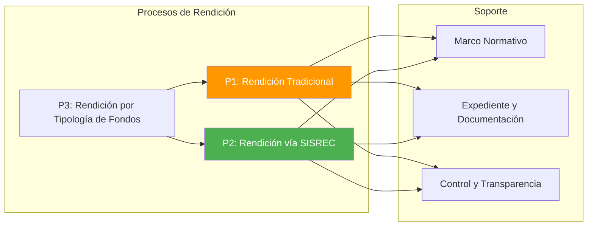
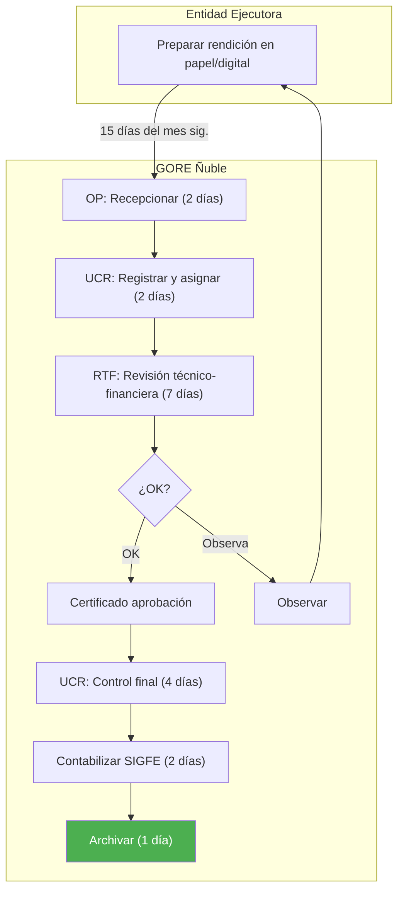
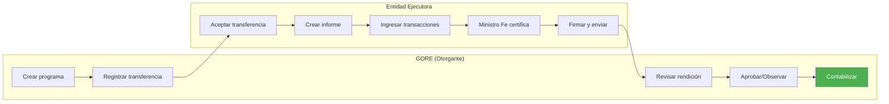
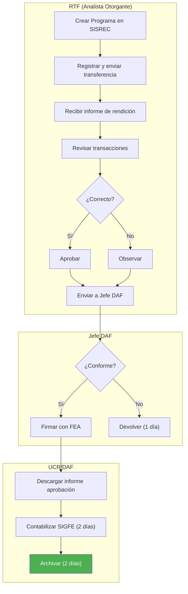
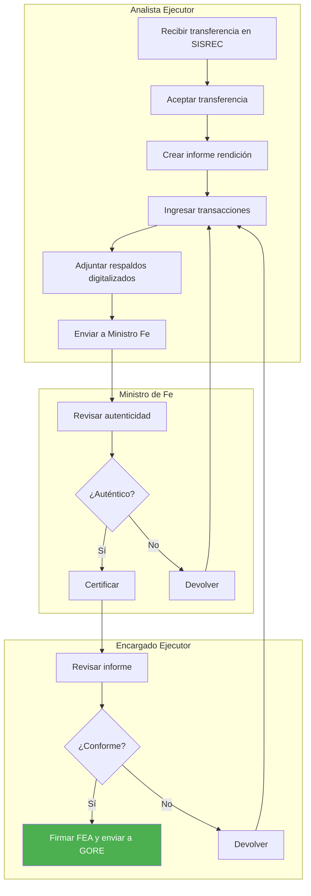
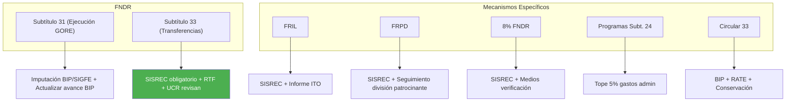

---
_manifest:
  urn: "urn:gn:kb:gestion-rendiciones"
  provenance:
    created_by: "FS"
    created_at: "2026-03-15"
    source: "Guía integrada para la gestión de rendiciones de cuentas en el GORE Ñuble + BPMN D08 Rendiciones + ssot-rendiciones v1.2.1 + goreNubleRenditionData.ttl + goreNubleReferenceData.ttl"
version: "1.2.0"
status: published
tags: [rendiciones, control-financiero, gore-nuble, sisrec, transferencias, estados, escalation, sla]
lang: es
extensions:
  gn:
    family: guide
---

# Gestión de Rendiciones de Cuentas — GORE Ñuble

## Resumen

Guía integrada para la gestión de rendiciones de cuentas en el GORE Ñuble. Cubre marco normativo, actores y responsabilidades, procesos operativos (modalidad legado y SISREC), estados canónicos y GORE_OS con mapeo ontológico, subfases de revisión, SLAs por etapa, sistema de escalation 3 niveles, rendición por tipología de fondos con tabla consolidada, control y fiscalización, responsabilidades, sanciones y procedimientos contables en SIGFE.

## Glosario

| Sigla / Término | Definición |
| :--- | :--- |
| Rendición de Cuentas | Procedimiento administrativo y de control mediante el cual quien administra fondos públicos demuestra y justifica su correcta utilización conforme a la normativa. |
| GORE | Gobierno Regional; administración superior de la región, con personalidad jurídica y patrimonio propio. |
| Entidad Ejecutora | Municipalidad, servicio público u entidad privada que recibe fondos del GORE y debe rendir cuentas. |
| SISREC | Sistema de Rendición Electrónica de Cuentas de CGR; obligatorio para Subtítulos 24 y 33 (Res. Ex. 1858/2023 CGR). |
| SIGFE | Sistema de Información para la Gestión Financiera del Estado; registra transferencias, devengos, pagos y reintegros. |
| Expediente de Rendición | Conjunto ordenado de documentos que respaldan recepción, uso y justificación de fondos públicos. |
| DAF | División de Administración y Finanzas; responsable de gestión financiera y administrativa de rendiciones. |
| U.C.R. | Unidad de Control de Rendiciones; unidad especializada dentro de la DAF que centraliza el control operativo. |
| RTF | Referente Técnico-Financiero; profesional GORE responsable de la revisión técnica y financiera de rendiciones. |
| FNDR | Fondo Nacional de Desarrollo Regional; principal fuente de financiamiento de proyectos y programas regionales. |
| FRIL | Fondo Regional de Iniciativa Local; FNDR para proyectos de pequeña escala ejecutados principalmente por municipalidades. |
| FRPD | Fondo Regional para la Productividad y el Desarrollo; derivado del Royalty Minero, para innovación y competitividad. |
| Subvenciones 8% FNDR | Recursos FNDR para actividades comunitarias (cultura, deporte, social, seguridad, medio ambiente) con concurso público. |
| LOCBGAE | Ley N°18.575 Orgánica Constitucional de Bases Generales de la Administración del Estado. |
| LBPA | Ley N°19.880 de Bases de los Procedimientos Administrativos. |
| Resolución N°30/2015 CGR | Norma de procedimiento sobre rendición de cuentas; aplicación obligatoria para GORE y entidades ejecutoras. |
| Resolución Exenta N°1.858/2023 CGR | Establece obligatoriedad del uso de SISREC para Subtítulos 24 y 33. |

## Marco normativo

| Norma | Artículos clave |
| :--- | :--- |
| Constitución Política de la República | Art. 3 (responsabilidad, eficiencia, probidad, transparencia); Art. 8 (publicidad); Art. 98-99 (facultad CGR para examinar y juzgar cuentas); Art. 111 ss. (régimen GORE). |
| Resolución N°30/2015 CGR | Art. 1 (ámbito: GORE y entidades receptoras); Art. 2 (expediente de rendición); Art. 13 (gastos posteriores a tramitación del acto); Art. 18 (prohibición de nuevas transferencias con rendiciones exigibles pendientes); Art. 26 (transferencias a servicios públicos); Art. 27 (transferencias a entidades privadas); Art. 31 (restitución de fondos). |
| Ley N°18.575 (LOCBGAE) | Art. 3 (principios de responsabilidad, eficiencia, probidad); Art. 52-53 (probidad administrativa). |
| Ley N°19.880 (LBPA) | Art. 5, 16bis, 18, 19 (expediente electrónico, escrituración electrónica). |
| Ley de Presupuestos (anual) | Art. 23-26 (Ley 21.796/2026): marco para transferencias a privados (concurso, convenio, SISREC, garantías, prohibiciones). Glosa 06: oferta programática, tope 5% gastos adm. Glosa 07: 8% FNDR. Glosa 12: FRIL. Glosa 13: FRPD. |
| Ley N°21.180 (Transformación Digital) | Digitalización obligatoria de procedimientos; expediente electrónico; firma electrónica. |
| Ley N°21.719 (Protección Datos Personales) | Tratamiento de datos en expedientes y publicaciones de transparencia: licitud, finalidad, proporcionalidad, seguridad. |

## Actores y responsabilidades

### Actores internos GORE

| Actor | Rol | Funciones principales |
| :--- | :--- | :--- |
| Gobernador/a Regional | Máxima autoridad ejecutiva; responsable final de la correcta inversión de todos los fondos. | Aprobar convenios mediante resolución; velar por sistema de control interno; representar al GORE ante organismos de control. |
| Consejo Regional (CORE) | Órgano fiscalizador. | Fiscalizar actos GORE; requerir informes sobre estado de rendiciones; considerar historial de rendiciones al aprobar nuevos fondos. |
| Administrador/a Regional | Coordinador de la gestión administrativa interna. | Supervisar eficiencia de procesos de rendición; coordinar DAF, DIPIR y unidades técnicas. |
| DAF | Unidad central en gestión financiera y administrativa de rendiciones. | Elaborar convenios y resoluciones de pago; recepcionar, registrar y custodiar expedientes; revisión financiera y de legalidad; contabilizar en SIGFE; gestionar SISREC (roles Administrador y Encargado Otorgante). |
| U.C.R. (dentro de DAF) | Centraliza y especializa el control operativo de rendiciones. | Registrar en base de datos; derivar a RTF; controlar antecedentes para contabilización; contabilizar en SIGFE; archivar; supervisar tiempos de revisión. |
| Divisiones Técnicas (DIPIR, DIDESOH, DIFOI, DIT) | Albergan a los RTF. | Definir aspectos técnicos en convenios; seguimiento técnico de ejecución; revisar coherencia de gastos con avance físico; emitir informes técnicos. |
| RTF | Primera línea de revisión y seguimiento. Corresponde al "Analista Otorgante" en SISREC. | Supervisar cumplimiento del convenio; vigilar que la entidad ejecutora rinda mensualmente; revisar detalladamente rendiciones (técnica y financiera); solicitar subsanación; aprobar técnicamente y derivar a DAF/U.C.R. |
| Unidad de Control Interno | Control preventivo y posterior de legalidad. | Auditar selectivamente procesos; asesorar en procedimientos de control; informar al Gobernador y al CORE. |

### Entidades ejecutoras

**Deberes:**
- Usar fondos exclusivamente para fines convenidos.
- Administrar con probidad, eficiencia y transparencia.
- Llevar registros y documentación de respaldo completa y fidedigna.
- Presentar rendiciones en forma y plazos establecidos (vía SISREC).
- Subsanar observaciones oportunamente.
- Reintegrar fondos no utilizados o mal rendidos.

| Tipo | Obligaciones específicas |
| :--- | :--- |
| Municipalidades | Obligadas a usar SISREC (Res. Ex. 1858/2023 CGR). |
| Otros Servicios Públicos (SERVIU, Vialidad, etc.) | Rinden al GORE según convenio; CGR examina inversión en sede del servicio ejecutor (Res. 30 CGR, Art. 26). |
| Entidades Privadas (Corporaciones, Fundaciones, ONGs) | Sujetos a marco Ley de Presupuestos 2026 Art. 23-26; inscripción en Registro de Colaboradores del Estado (Ley 19.862); obligadas a usar SISREC. |

### Organismos de control externo

| Organismo | Funciones |
| :--- | :--- |
| CGR | Toma de Razón; fiscalización de ingreso e inversión de fondos; examen y juzgamiento de cuentas; auditorías; formulación de reparos; Juicios de Cuentas; administración de SISREC. |
| DIPRES | Monitoreo de ejecución presupuestaria vía SIGFE; evaluación de programas regionales; velar por cumplimiento de glosas. |

## Documentación del expediente de rendición

**Componentes esenciales (Res. 30 CGR, Art. 2):**

- Informe de Rendición de Cuentas: documento formal de la entidad ejecutora; en SISREC corresponde al informe electrónico firmado con FEA.
- Comprobantes de Ingresos: documentación que acredita recepción de fondos.
- Comprobantes de Egresos: documentación auténtica que respalda cada desembolso.
- Comprobantes de Traspasos: documentos de operaciones contables sin movimiento de efectivo.
- Registro Ley N°19.862: cuando corresponda (transferencias a privados).
- Medios de Verificación: evidencia de cumplimiento de objetivos (informes técnicos, fotos, listas, etc.).

**Tipos de soporte aceptado:**

| Soporte | Validez |
| :--- | :--- |
| Papel (original) | Plena. Copias solo si autentificadas por ministro de fe o funcionario autorizado. |
| Electrónico (Ley 19.799) | Plena, con firma electrónica. |
| Digitalizado | Considerado copia simple, salvo autentificación con FEA; en SISREC el Ministro de Fe del ejecutor cumple esta función. |

Tipos comunes: facturas y boletas electrónicas, contratos, liquidaciones de sueldo, comprobantes de cotizaciones, comprobantes de transferencia bancaria, actas de recepción.

## Mapa general de procesos de rendición



Criticidad: alta. Dueño funcional: UCR/DAF.

**SLA:**
- Operativo (suma de etapas): 18 días hábiles GORE (2+2+7+4+2+1) + 15 días EE presentación.
- Meta interna GORE: 14 días hábiles para completar ciclo de revisión GORE (target aspiracional de implementación; el desglose por etapa suma 18 días).
- Plazo máximo pronunciamiento sobre rendición: 3 meses desde finalización del convenio (Art. 23-26 Ley 21.796).

## Proceso operativo de rendición

### Flujo sin SISREC (modalidad legado)

Aplicable a convenios antiguos no migrados a SISREC.



| Paso | Responsable | Acción | Plazo |
| :--- | :--- | :--- | :--- |
| 1 | Entidad Ejecutora | Prepara y presenta rendición en papel/digital a Oficina de Partes (OP). | 15 días hábiles del mes siguiente |
| 2 | Oficina de Partes | Recepciona, registra y deriva a U.C.R./DAF. | 2 días hábiles (GORE) |
| 3 | U.C.R./DAF | Registra en base de datos y deriva a RTF. | 2 días hábiles (GORE) |
| 4 | RTF | Revisa técnica y financieramente. Si OK: emite certificado de aprobación y devuelve a U.C.R./DAF. Si observa: comunica a EE para subsanación (2 días hábiles GORE para comunicar; EE reingresa correcciones). | 7 días hábiles (GORE) |
| 5 | U.C.R./DAF | Control final mediante checklist. | 4 días hábiles (GORE) |
| 6 | U.C.R./DAF | Contabiliza en SIGFE. | 2 días hábiles (GORE) |
| 7 | U.C.R./DAF | Archiva expediente. | 1 día hábil (GORE) |

### Flujo con SISREC (modalidad estándar)

Procedimiento obligatorio para nuevas transferencias Subtítulos 24 y 33.



**Flujo de la Entidad Otorgante (GORE):**



| Paso | Responsable | Acciones | Plazo / Condición |
| :--- | :--- | :--- | :--- |
| 1 | Analista Otorgante (RTF) | Crea Programa/Proyecto en SISREC; registra y envía transferencia al Ejecutor; recibe y revisa rendición; aprueba u observa cada transacción; envía a Encargado Otorgante para firma. | 7 días hábiles GORE para revisión |
| 2 | Encargado Otorgante (Jefe DAF) | Revisa propuesta. Si observa: devuelve al Ejecutor con FEA (1 día hábil GORE). Si aprueba: firma Informe de Aprobación (total/parcial) con FEA. | — |
| 3 | Analista Otorgante (RTF) | Descarga Informe de Aprobación firmado; deriva a U.C.R./DAF para contabilización. | — |
| 4 | U.C.R./DAF | Recibe informe; contabiliza en SIGFE (2 días hábiles GORE); archiva registro (2 días hábiles GORE). | — |

**Flujo de la Entidad Ejecutora:**



| Paso | Responsable | Acciones | Plazo / Condición |
| :--- | :--- | :--- | :--- |
| 1 | Analista Ejecutor | Acepta transferencia en SISREC; crea informe de rendición (mensual, regularización o sin movimiento); ingresa transacciones y adjunta documentos digitalizados; envía a Ministro de Fe. | 15 días hábiles del mes siguiente |
| 2 | Ministro de Fe del Ejecutor | Revisa autenticidad. Si OK: aprueba/certifica y pasa a Encargado Ejecutor. Si observa: devuelve a Analista Ejecutor. | — |
| 3 | Encargado Ejecutor | Revisa rendición. Si OK: firma Informe de Rendición con FEA y envía al GORE. Si observa: devuelve a Analista Ejecutor. | — |
| 4 | Analista Ejecutor (si hay devolución del GORE) | Recibe rendición observada; crea informe de "Regularización"; corrige transacciones observadas y reenvía por el mismo flujo. | — |

### Tipos de informe SISREC

| Tipo | Uso |
| :--- | :--- |
| Mensual | Rendición regular con transacciones del período |
| Regularización | Corrección de transacciones observadas por el GORE |
| Sin Movimiento | Período sin gastos ejecutados |

---

## Estados de rendición — Modelo canónico y GORE_OS

### Estados canónicos ontológicos (6)

Fuente autoritativa: RenditionData.ttl (`gnub:RenditionState`, 6 instancias secuenciadas).

| Seq | Estado | Descripción |
|-----|--------|-------------|
| 1 | Pendiente | No presentada por entidad ejecutora |
| 2 | En Revisión | Recibida, en revisión por RTF/Analista Otorgante |
| 3 | Observada | Devuelta para subsanación |
| 4 | Aprobada Parcialmente | Aprobada con transacciones observadas pendientes de regularización |
| 5 | Aprobada Totalmente | Aprobada en totalidad, firmada con FEA por Encargado Otorgante |
| 6 | Contabilizada | Registrada en SIGFE, archivada por UCR/DAF |

### Mapeo ontológico ↔ GORE_OS (8 estados)

GORE_OS granulariza "En Revisión" en 3 subfases y agrega RECHAZADA. "Aprobada Parcialmente" (ontológico seq 4) se subsume bajo APROBADA sin distinción explícita en GORE_OS.

| Estado GORE_OS | Mapeo ontológico | Nota |
|----------------|-----------------|------|
| PENDIENTE | Pendiente (seq 1) | Equivalente directo |
| EN_REVISION_RTF | En Revisión (seq 2) — subfase RTF | Split: primera revisión técnico-financiera |
| VISADA_RTF | — (estado intermedio GORE_OS) | RTF aprobó, pendiente derivación a UCR |
| EN_REVISION_UCR | — (estado intermedio GORE_OS) | UCR contabiliza y realiza control final |
| OBSERVADA | Observada (seq 3) | Equivalente directo |
| APROBADA | Aprobada Totalmente (seq 5) | Subsume parcial + total |
| RECHAZADA | — (de ReferenceData, no en RenditionData) | Estado GORE_OS sin equivalente ontológico canónico |
| Archivada | Contabilizada (seq 6) | Vía campo `archived_at` |

Aritmética: 6 ontológicos - 1 reemplazado (En Revisión) + 3 subfases + 1 nuevo (RECHAZADA) - 1 subsumido (Aprobada Parcial) = 8 estados GORE_OS.

### Subfases de revisión GORE_OS

El estado ontológico "En Revisión" (seq 2) se descompone en 3 fases operativas:

```
EN_REVISION_RTF → VISADA_RTF → EN_REVISION_UCR
```

| Subfase | Responsable | Acción | Salida |
|---------|-------------|--------|--------|
| EN_REVISION_RTF | Analista Otorgante (RTF) | Revisa transacciones, coherencia técnico-financiera, documentación de respaldo | Aprobación RTF o devolución (→ OBSERVADA) |
| VISADA_RTF | Encargado Otorgante (Jefe DAF) | Revisa propuesta RTF, firma Informe de Aprobación con FEA | Visa o devuelve a RTF |
| EN_REVISION_UCR | UCR/DAF | Control final, contabilización SIGFE, archivo | Rendición contabilizada (→ Archivada) |

### SLAs canónicos por etapa

Definidos en GORE_OS (no en ontología). Meta CGR: 14 días totales para ciclo de revisión GORE.

| Etapa | Plazo | Responsable |
|-------|-------|-------------|
| Presentación rendición | 15 del mes siguiente | Entidad Ejecutora |
| Revisión técnica RTF | 7 días hábiles | Analista Otorgante |
| Devolución por observación | 1 día hábil | Jefe DAF |
| Contabilización UCR | 2 días hábiles | UCR/DAF |
| Resubsanación (OBSERVADA) | 15 días hábiles | Entidad Ejecutora |
| Plazo máximo pronunciamiento | 3 meses desde finalización convenio | GORE (Art. 23-26 Ley 21.796) |

Desglose operativo sin SISREC suma 18 días hábiles GORE (2+2+7+4+2+1). La meta de 14 días es aspiracional.

### Sistema de escalation (3 niveles)

Escalation automático basado en antigüedad respecto al SLA de cada etapa.

| Nivel | Umbral | Acción |
|-------|--------|--------|
| 1 — Atención | 1× SLA (plazo cumplido) | Alerta automática al responsable directo |
| 2 — Advertencia | 1,5× SLA | Escalamiento a jefatura de la unidad responsable |
| 3 — Crítico | 2× SLA | Escalamiento a DAF y alerta a nivel directivo |

Cálculo SLA-accurate: basado en `phase_entered_at` por cada `core.rendition_phase`. Seed: 8 fases en `core.rendition_phase`, 3 niveles en `core.rendition_escalation`.

### Excepción SISREC para montos menores

Rendiciones de convenios cuyo monto total sea ≤500 UTM bajo Subvención 8% pueden rendirse fuera de SISREC (modalidad papel). Aplica exclusivamente a Subvención 8%; todas las demás transferencias Subtítulos 24 y 33 requieren SISREC sin excepción (Res. Ex. 1858/2023 CGR).

### Reconciliación ontológica — RenditionState vs AccountabilityState

Dos clases coexisten en la ontología sin `owl:equivalentClass`:

| Aspecto | RenditionState (RenditionData.ttl) | AccountabilityState (ReferenceData.ttl) |
|---------|-----------------------------------|----------------------------------------|
| Instancias | 6 estados secuenciados | 5 estados (Pending, InReview, Observed, Approved, Rejected) |
| Granularidad | Distingue Aprobada Parcial vs Total | Solo "Approved" genérico; agrega "Rejected" |
| Dominio | `Rendition` | `AccountabilityProcess` |
| Superclase | `gist:Category` | `gist:Category` |
| Canónico | **Sí** — mayor granularidad refleja realidad CGR | No — pendiente deprecar |

Ambas clases comparten superclase `gist:Category` pero con dominios disjuntos (`Rendition` vs `AccountabilityProcess`) sin `owl:sameAs`. Pendiente: consolidar en ontología deprecando `AccountabilityState`.

---

## Rendición consolidada por fondo

| Fondo | Plataforma | Requisito especial | Documentos clave |
|-------|-----------|-------------------|-----------------|
| FNDR S.31 (ejecución directa) | BIP + SIGFE | Estado de pago ITO | Certificado recepción provisoria/definitiva |
| FNDR S.33 (transferencias) | BIP + SISREC | Convenio vigente | Informe avance + comprobantes |
| FRIL | BIP + SISREC | Convenio transferencia municipal | Estado de pago municipal + informe ITO |
| FRPD CTCI | SISREC | Acreditación hitos I+D+i | Informes técnicos ANID/CORFO |
| Subvención 8% | SISREC (≤500 UTM: papel) | Pagaré notarial vigente | Rendición detallada por ítem + medios verificación |
| Glosa 06 Directa | SISREC | Informe evaluación SES | Rendición mensual ejecución + tope 5% admin |
| C33 Conservación | SISREC | Certificación estado actual ≤30% costo reposición | Informe técnico conservación |

---

## Rendición por tipología de fondos



### FNDR — Iniciativas de Inversión (Subtítulo 31, ejecución directa GORE)

- Rendición interna de gastos y cumplimiento de etapas.
- Respaldo clave: contratos, estados de pago visados por ITO, facturas, resoluciones de adjudicación, boletas de garantía.
- Gastos imputados al código BIP en SIGFE; actualización de avance físico-financiero en BIP.
- Al finalizar: completar Carpeta Digital Ex Post en BIP.

### FNDR — Transferencias de Capital (Subtítulo 33, ejecución por terceros)

- Convenio de Transferencia detalla proyecto, monto, plazos y obligaciones.
- Rendición del ejecutor: obligatoria vía SISREC, con informe, comprobantes de gasto, informes de avance y actas de recepción.
- Revisión GORE: RTF revisa coherencia técnica-financiera; DAF/U.C.R. revisan legalidad y documentación.

### FRIL

- Proyectos FRIL deben contar con informe favorable del MDSF.
- **Excepción <5.000 UTM:** Los proyectos cuyo costo total sea inferior a 5.000 UTM (valorizadas al 1 de enero del ejercicio presupuestario vigente) no requerirán informe favorable del MDSF, pero deben ingresar información al SNI según Oficio Ordinario N°2 del 26 de enero de 2024 del Ministerio de Hacienda y MDSF.
- Prohibición: financiar proyectos por etapas o fraccionados.
- Rendición: municipalidades rinden al GORE vía SISREC, acreditando gastos y avance de obras.

### FRPD

- Ejecutores: universidades, centros de investigación, corporaciones, empresas.
- Rendición vía SISREC: acredita gasto financiero y logro de hitos, productos y resultados de I+D+i.
- Supervisión: DIFOI y DIPIR siguen cumplimiento de metas.

### Subvenciones 8% FNDR

- Base normativa: Glosa 07 Ley de Presupuestos, bases del concurso, instructivo regional.
- Rendición vía SISREC; énfasis en coherencia del gasto con el proyecto adjudicado.
- Respaldo clave: boletas de honorarios con cotizaciones, facturas específicas de la actividad.
- Medios de verificación: listas de asistencia, fotos, material de difusión.
- Gastos prohibidos: definidos en bases (operativos, premios en dinero, alcohol, etc.); deben fiscalizarse.

### Programas FNDR — Subtítulo 24 (ejecución directa GORE, Glosa 06)

- Hasta 5% del programa puede destinarse a gastos de administración del GORE, imputados al presupuesto del programa.
- Rendición interna: DAF controla tope del 5% y correcta imputación.
- Rendición externa: cumplimiento de componentes y metas, coherente con diseño aprobado ex ante por DIPRES/SES.

### Conservación de Infraestructura (Circular 33)

- Aplicable a mantención/reparación que no afecta capacidad original del activo.
- Base: Oficio Circular N°33/2009 MINHAC, NIP 2025.
- RATE del MDSF: "AD (Admisible para Financiamiento)" vía BIP.
- Prohibición: costo de reparación > 30% del costo de reposición del activo (si ocurre, debe ir a SNI estándar).
- Rendición: sigue flujo estándar de proyecto de inversión, acreditando partidas de conservación.

## Control, fiscalización y transparencia

### Control interno

- **Unidad de Control Interno:** revisión preventiva y auditorías selectivas; informa al Gobernador y al CORE.
- **Listas de chequeo:** aplicación de checklists estandarizadas para revisión formal, documental, financiera y técnica (Anexo 10.3 del manual de procedimientos).
- **Seguimiento físico-financiero:** verificar que el gasto se traduzca en avances concretos; análisis integrado de informes y visitas a terreno por RTF.

### Fiscalización externa

- **CGR:** examen y juzgamiento de cuentas; auditorías financieras y de cumplimiento; formulación de observaciones y reparos; Juicios de Cuentas para responsabilidades pecuniarias.
- **DIPRES:** monitoreo de ejecución presupuestaria y programática; evaluación de programas regionales.

### Transparencia y acceso a información

**Transparencia activa (Ley N°20.285):** publicación proactiva y mensual de convenios de transferencia, detalle de transferencias, nóminas de beneficiarios, presupuesto y ejecución, resultados de auditorías.

**Transparencia pasiva:** respuesta a solicitudes de acceso a la información dentro de plazos legales, resguardando datos personales sensibles (Ley N°21.719).

**Obligaciones Partida 31 — Corporaciones y Fundaciones (Glosa 08):**
- Informar a DIPRES y publicar en páginas web información institucional (misión, objetivos, directorio, financiamiento, planificación anual) a más tardar al término del primer trimestre.
- Informar y publicar trimestralmente, dentro de los 30 días siguientes al término de cada trimestre: dotación, remuneraciones, concursos, recursos transferidos/ejecutados, indicadores.
- Exigir cuenta pública anual, estados financieros publicados y cumplimiento de Ley N°20.285.

**Obligaciones de información y publicación (Glosa 16):**
- Publicar mensualmente la cartera de proyectos financiada con cargo a presupuestos de inversión regional.
- Publicar acuerdos CORE dentro de 5 días hábiles desde su adopción.
- Informar trimestralmente el uso de recursos (beneficiarios, comuna, instituciones receptoras, montos, productos y aplicación regional) a las instancias definidas en la glosa; publicar en los mismos plazos.
- Publicar trimestralmente e informar a senadores y diputados los proyectos adjudicados/contratados con cargo a Subtítulos 24, 31 y 33: identificación, montos, postulantes, pauta de evaluación, seleccionado, presupuesto aprobado y votaciones CORE.

## Responsabilidades y sanciones

### Tipos de responsabilidad

| Tipo | Causa | Procedimiento | Consecuencia |
| :--- | :--- | :--- | :--- |
| Administrativa | Infracción a deberes de cuidado, supervisión o probidad por funcionarios GORE. | Sumario administrativo (Estatuto Administrativo, Art. 119). | Censura, multa, suspensión o destitución (Ley 18.834). |
| Civil | Perjuicio patrimonial al Fisco por acción negligente o dolosa. | Juicio de Cuentas ante CGR o demanda civil. | Orden de restituir los fondos. |
| Penal | Hechos constitutivos de delito (malversación, fraude al fisco, cohecho, etc.). | Investigación del Ministerio Público y juicio penal. | Multas, inhabilitación, penas privativas de libertad. |

### Consecuencias directas por rendiciones pendientes o observadas

| Condición | Resultado |
| :--- | :--- |
| Rendición no presentada, no aprobada u observada por CGR | Obligación de reintegro (Res. 30 CGR, Art. 31). |
| Rendiciones exigibles pendientes | GORE no debe entregar nuevos fondos (Res. 30 CGR, Art. 18). |

## Gestión estratégica y contingencias

### Buenas prácticas

- Planificación anual de rendiciones y programación de revisiones internas.
- Coordinación interdivisional entre DAF, DIPIR y unidades técnicas con roles claros.
- Capacitación continua a funcionarios GORE y entidades ejecutoras, especialmente en uso de SISREC.
- Uso óptimo de tecnología (SIGFE, BIP, SISREC).
- Desarrollo y actualización de manuales internos de procedimientos.
- Gestión de riesgos (fraude, errores, demoras) con medidas preventivas y de control.
- Enfoque en resultados: articular rendición financiera con medición de impacto.

### Planes de contingencia

| Caso | Procedimiento |
| :--- | :--- |
| Pérdida de rendición al interior del GORE | Mantener registros digitales o libros de correspondencia en cada unidad (OP, U.C.R., RTF); como último recurso, solicitar copia a entidad ejecutora. SISREC minimiza este riesgo. |
| Entidad privada solicita cuota siguiente sin haber rendido la anterior | Aplicar Art. 18 Res. 30 CGR; si el convenio lo permite, autorizar adelanto solo contra garantía (vale vista, póliza) por monto no rendido, fijando plazo perentorio para rendir o ejecutar garantía. |
| Demoras en revisión interna por alta carga de trabajo | Usar planificación anual para anticipar peaks; reasignar revisores; priorizar rendiciones que habilitan transferencias críticas. |

## Procedimientos contables en SIGFE

### F07 — Transferencias condicionadas sector privado

Aplicación: Subvenciones 8% FNDR y programas con ONGs.

| Fase | Asiento |
| :--- | :--- |
| Fase 1 — Entrega de fondos | Devengo: Debe 12106 Deudores por Transferencias Reintegrables / Haber 21524 o 21533. Pago: Debe 21524/21533 / Haber 11102/11103 Banco. |
| Fase 2 — Aprobación rendición | Reconocimiento del gasto: Debe 54101 Transf. Corr. Sector Privado o 54201 Transf. Cap. Sector Privado / Haber 12106. |
| Fase 3 — Reintegro | Devengo del cobro: Debe 11508 Cuentas por Cobrar / Haber 12106. Recepción: Debe 11102/11103 Banco / Haber 11508. |

### F08 — Transferencias condicionadas sector público

Aplicación: FNDR a Municipalidades (FRIL, proyectos) y transferencias a otros Servicios Públicos.

Advertencia: Para transferencias a otros Servicios Públicos (no Municipalidades), el devengo del gasto se realiza al aprobar la rendición; para Municipalidades, al momento de la transferencia.

| Fase | Asiento |
| :--- | :--- |
| Fase 1 — Entrega de fondos | Devengo: Debe 12106 / Haber 21524/21533. Pago: Debe 21524/21533 / Haber 11102/11103. |
| Fase 2 — Aprobación rendición | Reconocimiento del gasto: Debe 54103 Transf. Corr. Otras Ent. Públicas o 54203 Transf. Cap. Otras Ent. Públicas / Haber 12106. |
| Fase 3 — Reintegro | Devengo del cobro: Debe 11508 Cuentas por Cobrar / Haber 12106. Recepción: Debe 11102/11103 Banco / Haber 11508. |

Los números de cuenta corresponden al Plan de Cuentas del Sector Público.

## Sistemas de información

| Sistema | Función en rendiciones |
| :--- | :--- |
| SISREC | Rendición electrónica de cuentas (CGR); plataforma obligatoria para Subtítulos 24 y 33 |
| SIGFE | Contabilización de transferencias, devengos, pagos y reintegros |
| BIP-SNI | Seguimiento de avance físico-financiero de iniciativas de inversión |
| FIRMAGOB | Firma Electrónica Avanzada para resoluciones e informes oficiales |
