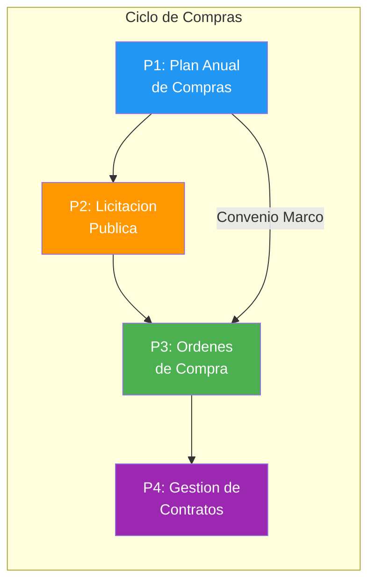
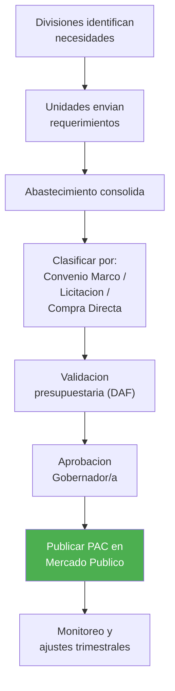
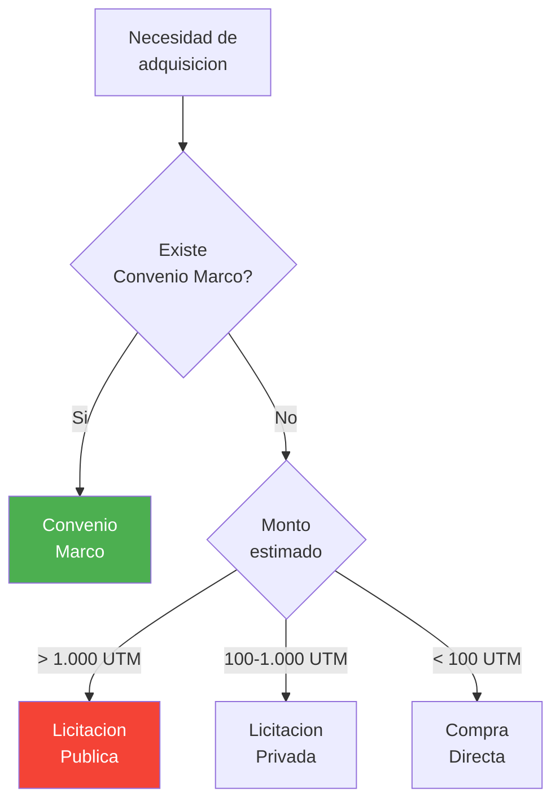
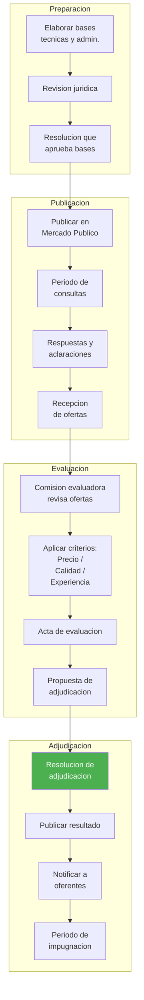
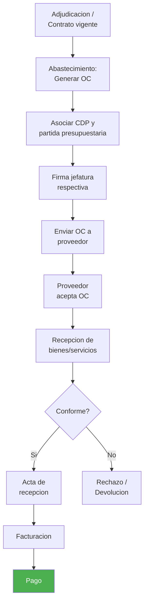
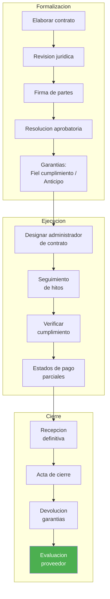

---
_manifest:
  urn: "urn:gn:kb:manual-compras-contrataciones"
  provenance:
    created_by: "FS"
    created_at: "2026-03-15"
    source: "Manual 2.1 Gestión de Compras y Contrataciones GORE Ñuble + BPMN D04 Compras y Contrataciones"
version: "1.0.0"
status: published
tags: [compras, contrataciones, licitaciones, mercado-publico, gore-nuble]
lang: es
extensions:
  gn:
    family: guide
---

# Gestión de Compras y Contrataciones — GORE Ñuble

## Visión General

Manual operativo de compras públicas y contrataciones del GORE Ñuble. Criticidad Alta. Dueño funcional: Unidad de Abastecimiento. Cubre 4 procesos principales (~12 subprocesos): planificación anual de compras (PAC), mecanismos de adquisición (licitación pública, convenio marco, trato directo, compra ágil), ejecución de órdenes de compra y gestión de contratos. Incluye control de transparencia, evaluación de proveedores y reportes de auditoría.

**Objetivo:** normar la adquisición de bienes y servicios garantizando transparencia, eficiencia y cumplimiento de la Ley N° 19.886 de Compras Públicas y su Reglamento.

### Glosario

| Sigla / Término | Definición |
| :--- | :--- |
| PAC | Plan Anual de Compras |
| OC | Orden de Compra emitida en Mercado Público |
| CDP | Certificado de Disponibilidad Presupuestaria |
| Convenio Marco | Acuerdo suscrito por ChileCompra con proveedores para compras directas a precios predefinidos |
| Recepción Conforme | Acto formal que valida la entrega satisfactoria del bien o servicio |

## Marco Normativo y Principios Rectores

### Fundamentos legales

La gestión de compras del GORE se rige por:

- Ley N° 19.886 y Modificación Ley 21.634 (Compras 2.0): moderniza la gestión de compras públicas.
- Decreto N° 661 (2024): nuevo Reglamento de la Ley de Compras (vigencia 12/2024).
- Ley de Presupuestos (Partida 31).
- Directivas ChileCompra.
- Ley 21.180 (Transformación Digital).
- Ley 20.730 (Lobby y conflictos de intereses).

### Umbrales y modalidades (Decreto 661/2024)

| Rango | Modalidad |
| :--- | :--- |
| < 3 UTM | Fondos Globales (Caja Chica) o Portal Mercado Público |
| 3 a 100 UTM | Compra Ágil (preferente); mínimo 3 cotizaciones en el sistema |
| 100 a 1.000 UTM | Licitación Pública (Normas Simplificadas); contrato opcional (puede formalizarse con OC) |
| > 1.000 UTM | Licitación Pública (Normas Generales); contrato obligatorio y Garantía de Fiel Cumplimiento |
| > 5.000 UTM | Garantía de Seriedad de la Oferta obligatoria (máximo 3% del monto) |

### Principios rectores

- **Libre Concurrencia:** garantizar la participación de todos los proveedores que cumplan requisitos.
- **Igualdad de Trato:** no discriminar entre oferentes por razones ajenas al mérito técnico-económico.
- **Transparencia:** publicar bases, aclaraciones, evaluaciones y adjudicaciones en www.mercadopublico.cl.
- **Eficiencia:** optimizar la relación calidad-precio en las adquisiciones.
- **Probidad:** evitar conflictos de interés y declarar inhabilidades.

### Prohibiciones

- **Fraccionamiento prohibido:** no dividir compras para eludir umbrales.
- **Conflicto de intereses:** funcionarios deben declarar inhabilidades.

## Mapa de Procesos

## P1 — Plan Anual de Compras (PAC)

El PAC es el instrumento de planificación que articula necesidades con presupuesto disponible. Período: anual (diciembre-enero).

### Flujo del PAC

### Etapas detalladas

1. **Elaboración.** Cada División/Departamento envía requerimientos a la Unidad de Abastecimiento. Plazo: antes del 15 de noviembre del año anterior.
2. **Consolidación.** La Unidad de Abastecimiento integra y prioriza necesidades según:
   - Criticidad operativa.
   - Disponibilidad presupuestaria.
   - Alineamiento con metas institucionales.
3. **Aprobación.** El Administrador Regional aprueba el PAC consolidado mediante Resolución Exenta.
4. **Publicación.** La Unidad de Abastecimiento publica en Mercado Público dentro de los primeros 30 días del año calendario.
5. **Modificaciones.** Permitidas durante el año mediante resolución fundada; debe actualizarse la publicación en el portal.

### Contenido del PAC

| Elemento | Descripción |
| :--- | :--- |
| Producto/Servicio | Descripción detallada |
| Cantidad estimada | Unidades requeridas |
| Monto estimado | Valor en pesos |
| Período | Trimestre de adquisición |
| Mecanismo | CM / LP / CD / TDP |

### Tipos de requerimientos

| Tipo | Descripción |
| :--- | :--- |
| Planificados (PAC) | Incluidos en la programación anual |
| Extraordinarios | Necesidades imprevistas; requieren justificación escrita del área solicitante y visación DAF |
| Urgentes | Situaciones de emergencia que permiten plazos abreviados según Reglamento (Art. 43) |

### Reserva presupuestaria previa

Ningún proceso de compra inicia sin CDP vigente.

- El CDP debe emitirse desde el sistema financiero antes de la publicación del llamado o emisión de la OC.
- La pre-afectación bloquea los recursos hasta la adjudicación o desistimiento.

## P2 — Mecanismos de Compra

### Árbol de decisión

### Convenio Marco

Modalidad preferente para bienes y servicios estandarizados. Se accede vía tienda electrónica en www.mercadopublico.cl.

**Proceso:** Selección de producto → Emisión de OC → Aceptación proveedor → Despacho/Prestación.

- No requiere proceso licitatorio individual.
- No aplica para bienes o servicios no catalogados.

### Licitación Pública

Obligatoria para compras de bienes, servicios y ejecución de proyectos de inversión (Subtítulo 31) superiores a 1.000 UTM (salvo Convenio Marco).

#### Flujo de licitación

**Bases Administrativas:** condiciones generales, plazos, garantías, causales de inadmisibilidad.

**Bases Técnicas:** especificaciones del bien o servicio, criterios de evaluación técnica.

**Plazos de publicación:**

- Mínimo 20 días corridos para ofertar (licitación normal).
- 10 días (licitación abreviada por monto < 100 UTM).

**Criterios de evaluación:** deben definirse en las bases con ponderaciones claras (Técnico, Económico, Plazos, etc.).

**Comisión Evaluadora:**

- Mínimo 3 integrantes designados por resolución.
- Incluye al menos un funcionario del área técnica requirente.

**Acta de Evaluación:** documento fundado que justifica la puntuación de cada oferente.

**Adjudicación:** por Resolución Exenta del Gobernador Regional, publicada en el portal.

### Licitación Privada y Trato Directo

Modalidades excepcionales sujetas a causales legales taxativas (Art. 8 Ley 19.886).

**Causales de Trato Directo:**

- Proveedor único.
- Emergencias calificadas.
- Compras < 10 UTM.
- Contratos de prórroga por continuidad de servicio (máximo 12 meses).

**Requisitos:**

- Resolución fundada que invoque la causal específica.
- Publicación en Mercado Público (salvo montos menores).
- Visación del Jefe DAF para montos > 100 UTM.

### Grandes Compras (> 5.000 UTM)

- Visación previa de la División Jurídica sobre las bases.
- Garantía de seriedad de la oferta obligatoria (máximo 3% del monto estimado).
- Plazo de ofertas mínimo 30 días corridos.
- Evaluación técnica puede incluir visitas a terreno o demostraciones.

## P3 — Ejecución de Órdenes de Compra

Sistema: Mercado Público.

### Flujo de OC

### Generación de la OC

La OC es el acto administrativo que formaliza el compromiso con el proveedor. Se emite en Mercado Público tras la adjudicación (licitaciones) o selección (CM/Trato Directo).

**Contenido obligatorio:**

- Descripción detallada del bien/servicio.
- Cantidad y precio unitario.
- Plazo de entrega/ejecución.
- Lugar de entrega.
- Imputación presupuestaria (Subtítulo/Ítem/Asignación).

### Estados de la OC

| Estado | Descripción |
| :--- | :--- |
| Generada | OC creada en el sistema |
| Enviada | Notificada al proveedor |
| Aceptada | Proveedor confirma |
| Recepcionada | Bienes/servicios entregados |
| Pagada | Proceso completado |

### Aceptación y rechazo

El proveedor tiene 48 horas hábiles para aceptar la OC en el portal (salvo indicación distinta en bases). OC rechazada o no aceptada permite re-adjudicar al siguiente oferente mejor evaluado.

### Recepción conforme

Hito crítico que habilita el devengo y posterior pago.

**Bienes:**

1. La bodega o área solicitante verifica cantidad, calidad y concordancia con OC.
2. Genera Acta de Recepción física o digital.

**Servicios:**

- El administrador del contrato certifica el cumplimiento mediante Informe de Conformidad.

**Integración contable:** la recepción conforme genera automáticamente el devengo presupuestario y el pasivo contable (Cuentas por Pagar).

**Pago electrónico obligatorio** (Art. 8 Ley de Presupuestos): todos los pagos a proveedores deben realizarse exclusivamente mediante transferencia electrónica de fondos. Prohibido pago en efectivo o cheque, salvo excepciones legalmente autorizadas.

### Devoluciones y reclamos

- Plazo de 8 días corridos desde la recepción para reclamar la factura electrónica en el SII.
- Devoluciones por no conformidad deben documentarse con Acta de Rechazo indicando las causales.
- El proveedor tiene plazo según contrato/OC para subsanar o reemplazar.

## P4 — Gestión de Contratos

Responsable principal: Administrador de Contrato.

### Flujo de gestión contractual

### Formalización de contratos

Contrato obligatorio para:

- Licitaciones > 1.000 UTM.
- Servicios de tracto sucesivo.
- Obras civiles.

**Contenido del contrato:**

- Identificación de las partes.
- Objeto y alcance.
- Precio y modalidad de pago (hitos, mensualidades, etc.).
- Plazos de ejecución.
- Garantías exigidas.
- Multas y sanciones.
- Causales de término anticipado.

### Administración del contrato

**Administrador del Contrato:** funcionario designado por resolución, responsable del seguimiento técnico y cumplimiento de hitos.

**Funciones del Administrador:**

| Función | Descripción |
| :--- | :--- |
| Supervisión | Verificar cumplimiento técnico |
| Comunicación | Enlace con proveedor |
| Documentación | Mantener expediente |
| Hitos | Certificar avances |
| Pagos | Autorizar estados de pago |

**Libro de Obra / Bitácora:** registro de incidencias, instrucciones y acuerdos durante la ejecución (obligatorio en contratos de obra).

**Estados de Pago:** documentos que certifican el avance para liberar pagos parciales según hitos.

**Modificaciones contractuales:**

- Aumentos o disminuciones de hasta 30% del monto original requieren resolución fundada.
- Sobre 30% requieren nueva licitación.

### Garantías contractuales

| Tipo | Descripción |
| :--- | :--- |
| Seriedad de la Oferta | Devuelta tras adjudicación a oferentes no seleccionados |
| Fiel Cumplimiento | Generalmente 5% del monto contratado, vigente hasta recepción final + plazo de responsabilidad |
| Correcta Ejecución (Obras) | Puede exigirse por el plazo de responsabilidad post-recepción (típicamente 12 meses) |

**Custodia:** las garantías físicas (boletas, pólizas) se custodian en Tesorería. Las electrónicas se registran en el sistema de garantías.

### Multas y sanciones

Deben estar contempladas en las bases y el contrato. Causales típicas: atraso en entrega, incumplimiento parcial, calidad deficiente.

**Procedimiento:**

1. Informe del administrador.
2. Notificación al proveedor.
3. Plazo de descargos (5 días hábiles).
4. Resolución que aplica o desestima la multa.

**Cobro:** descuento directo de estados de pago o ejecución de garantía.

### Término del contrato

| Tipo | Descripción |
| :--- | :--- |
| Término Natural | Cumplimiento del objeto en plazo |
| Término Anticipado | Por incumplimiento grave, mutuo acuerdo o causales de fuerza mayor |
| Recepción Final | Acta que cierra el contrato y libera garantías (tras plazo de responsabilidad si aplica) |

## Control, Transparencia y Evaluación

### Interoperabilidad con Mercado Público

- Toda operación debe reflejarse en www.mercadopublico.cl.
- El sistema institucional (SIGAS o equivalente) debe sincronizar OC, estados de pago y recepciones.
- Descarga automática de actas de adjudicación para trazabilidad.

### Obligaciones de publicación

| Información | Plataforma |
| :--- | :--- |
| PAC | Mercado Público |
| Licitaciones | Mercado Público |
| Adjudicaciones | Mercado Público |
| Contratos | Transparencia Activa |
| Órdenes de Compra | Mercado Público |

### Portal de Proveedores

Herramienta de transparencia que permite a proveedores consultar:

- Estado de sus órdenes de compra.
- Estado de facturas y pagos.
- Historial de transacciones.

### Evaluación de proveedores

**Frecuencia:** al cierre de cada contrato; anualmente para contratos de tracto sucesivo.

**Criterios:**

- Cumplimiento de plazos.
- Calidad del producto/servicio.
- Respuesta ante incidencias.

**Registro:** la calificación se incorpora al Historial de Proveedores institucional.

**Consecuencias:** proveedores con evaluación deficiente pueden ser excluidos de futuras licitaciones (según bases).

### Reportes y auditoría

**Reportes periódicos:**

- Informe Mensual de Compras: resumen de OC emitidas, montos, mecanismos utilizados.
- Informe de Contratos Vigentes: estado de avance, hitos pendientes, alertas de vencimiento.

**Indicadores de gestión:**

| Indicador | Tipo |
| :--- | :--- |
| % de compras vía Convenio Marco | Eficiencia |
| % de licitaciones declaradas desiertas | Efectividad |
| Tiempo promedio de adjudicación | Oportunidad |
| Cumplimiento de plazos de pago a 30 días | Cumplimiento |

## Normativa Aplicable

| Norma | Alcance |
| :--- | :--- |
| Ley N° 19.886 | Compras públicas |
| Ley N° 21.634 (Compras 2.0) | Modernización compras públicas |
| Decreto N° 661 (2024) | Nuevo Reglamento Ley de Compras |
| D.S. 250 | Procedimientos (reglamento anterior) |
| Ley de Presupuestos (Partida 31) | Presupuesto regional |
| Directivas ChileCompra | Operativas |
| Ley N° 21.180 | Transformación digital |
| Ley N° 20.730 | Lobby y conflictos de intereses |
| Art. 8 Ley de Presupuestos | Pago electrónico obligatorio |

## Sistemas de Información

| Sistema | Función |
| :--- | :--- |
| Mercado Público (ChileCompra) | OC, licitaciones, PAC, adjudicaciones |
| SIGFE | CDP, compromisos, pagos |
| Doc Digital | Contratos, resoluciones |
| SIGAS (o equivalente) | Sincronización OC, estados de pago, recepciones |
