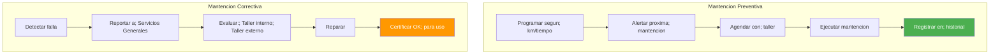
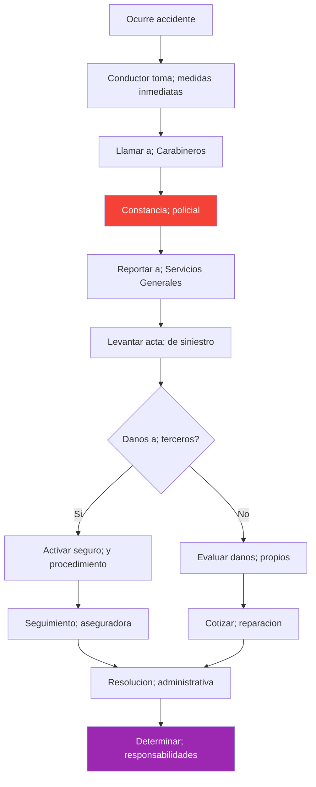

---
_manifest:
  urn: urn:gn:kb:manual-flota-servicios-generales-p02
  provenance:
    created_by: FS
    created_at: '2026-03-15'
    source: Manual 3.1 Administración de Flota Vehicular GORE Ñuble + BPMN D06 Flota
      Vehicular
version: 1.0.0
status: published
tags:
- flota-vehicular
- servicios-generales
- gore-nuble
- logistica
- mantencion
lang: es
extensions:
  gn:
    family: guide
  kora:
    shard_index: 2
    shard_count: 2
    shard_root_urn: urn:gn:kb:manual-flota-servicios-generales
---

# Gestion de Flota Vehicular y Servicios Generales — GORE Nuble - Parte 02

## Mantencion de Vehiculos

### Tipos de mantencion vehicular

| Tipo | Frecuencia | Acciones |
| :--- | :--- | :--- |
| Basica (Preventiva) | 5.000 km | Cambio aceite, filtros |
| Intermedia | 15.000 km | Frenos, neumaticos |
| Mayor | 30.000 km | Revision completa; evaluacion costo/beneficio vs. reemplazo |
| Documentos | Anual | Revision tecnica, permiso de circulacion |

Mantencion preventiva segun manual del fabricante y kilometraje (tipico: cada 5.000, 10.000, 20.000 km). Incluye cambio de aceite, filtros, revision de frenos, neumaticos.

Mantencion correctiva: reparacion de fallas detectadas, priorizada segun criticidad.

### Ordenes de trabajo vehicular

1. Generacion por plan preventivo o por reporte de falla.
2. Asignacion a taller interno o externo (contratista autorizado).
3. Registro de trabajos, repuestos, costos.
4. Actualizacion de hoja de vida del vehiculo.

### Flujo de mantencion

### Control de documentacion

Alertas automaticas para vencimientos:

| Documento | Frecuencia | Responsable |
| :--- | :--- | :--- |
| Permiso de Circulacion | Anual | Encargado Flota |
| Revision Tecnica | Semestral/Anual | Encargado Flota |
| SOAP | Anual | Encargado Flota |
| Seguro Automotriz | Anual | Encargado Flota |
| Licencia Conductor | Segun vencimiento | RRHH / Conductor |

## Siniestros y Accidentes

### Procedimiento ante accidente

1. Asegurar integridad de personas.
2. Notificar a Carabineros y compania de seguros.
3. Documentar con fotografias y croquis.
4. Reportar a Encargado de Flota y jefatura.
5. Gestionar denuncia y reclamo al seguro.
6. Evaluar responsabilidad del conductor (posible sumario).
7. Reparacion o baja del vehiculo segun dano.

### Acta de siniestro

| Dato | Descripcion |
| :--- | :--- |
| Fecha y hora | Del accidente |
| Lugar | Direccion exacta |
| Conductor | Funcionario a cargo |
| Descripcion | Circunstancias |
| Testigos | Identificacion |
| Danos | Propios y a terceros |
| N° Parte | Carabineros |

### Flujo de siniestros

## Control, Reporteria y Auditoria

### Indicadores de gestion de flota

| Indicador | Formula | Meta |
| :--- | :--- | :--- |
| Rendimiento combustible | Km / Litros | > 10 km/lt |
| % Mantencion cumplida | Mantenciones OK / Programadas | > 95% |
| Tasa de accidentabilidad | Accidentes / Vehiculos | < 5% |
| Disponibilidad flota | Dias operativos / Dias totales | > 90% |
| Utilizacion | % de uso efectivo vs. capacidad disponible | — |
| Costo por Kilometro | (Combustible + Mantencion + Seguros) / Km recorridos | — |
| Costo por Vehiculo | Gastos totales mensuales/anuales | — |
| Incidentes | Numero de accidentes, multas de transito | — |

### Reportes periodicos

- **Informe Mensual de Flota:** estado de cada vehiculo, kilometraje recorrido, consumo de combustible, mantenciones realizadas, costos incurridos.
- **Informe de Vencimientos:** documentos proximos a vencer.
- **Ranking de Conductores:** por consumo, incidentes, multas.

### Auditoria de uso

- Verificacion de coherencia entre bitacora, combustible y kilometraje.
- Deteccion de usos no autorizados o fuera de horario.
- Cruce con comisiones de servicio autorizadas.

## Disposiciones Especiales

### Vehiculos en comodato o arriendo

| Modalidad | Definicion |
| :--- | :--- |
| Comodato Recibido | Vehiculos de otras instituciones en uso temporal |
| Arriendo Operativo | Contratos de leasing o arriendo sin transferencia de propiedad |

- Mismo regimen de bitacora, combustible y mantencion que vehiculos propios.
- Registro contable como gasto de arriendo, no como activo fijo.

### Baja de vehiculos

Procedimiento segun Manual Activo Fijo:

1. Informe tecnico de obsolescencia o siniestro.
2. Resolucion de baja.
3. Destino: remate, donacion o destruccion.
4. Tramites legales: transferencia de dominio o baja registral.

### Responsabilidades

| Rol | Responsabilidad |
| :--- | :--- |
| Conductor | Uso correcto, registro de bitacora, reporte de fallas |
| Encargado de Flota | Planificacion, asignacion, control documental |
| Jefe de Servicios Generales | Supervision integral del area |
| DAF | Control presupuestario y de contratos |

## Normativa Aplicable

| Norma | Alcance |
| :--- | :--- |
| D.L. 799 | Restriccion de uso de vehiculos fiscales: prohibido fines de semana sin autorizacion especial, uso particular prohibido, fuera de la region requiere autorizacion, uso en jornada laboral salvo excepciones. Incumplimiento genera responsabilidad administrativa y patrimonial |
| Art. 12 Ley de Presupuestos | Autorizacion previa de DIPRES para adquisicion de vehiculos sobre monto fijado |

## Sistemas de Informacion

| Sistema | Funcion |
| :--- | :--- |
| SYS-SIGAS | Inventario de vehiculos |
| Sistema interno de flota | Bitacoras, mantenciones |
