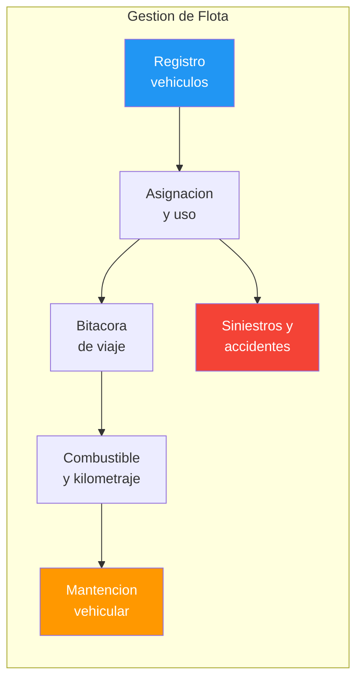
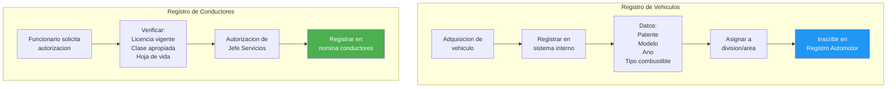
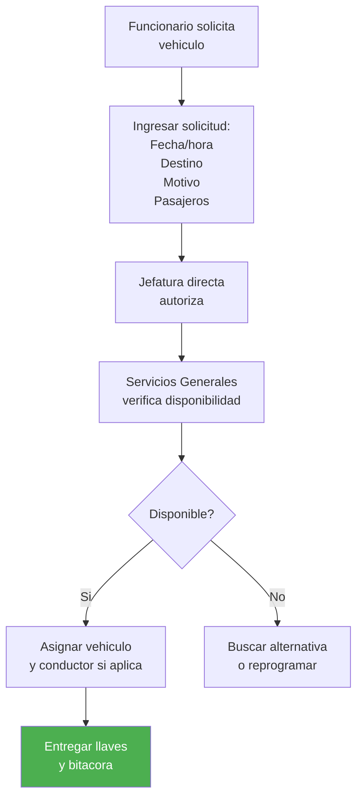
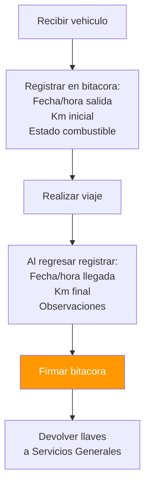
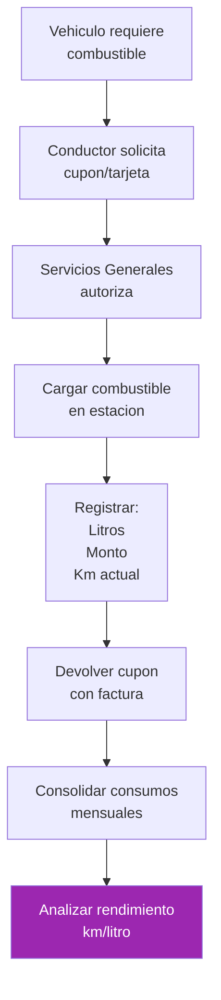
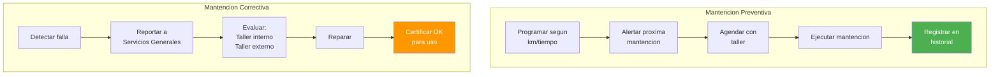
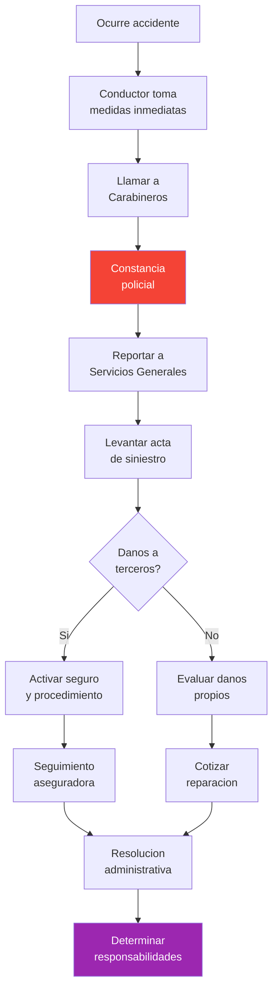

---
_manifest:
  urn: "urn:gn:kb:manual-flota-servicios-generales"
  provenance:
    created_by: "FS"
    created_at: "2026-03-15"
    source: "Manual 3.1 Administración de Flota Vehicular GORE Ñuble + BPMN D06 Flota Vehicular"
version: "1.0.0"
status: published
tags: [flota-vehicular, servicios-generales, gore-nuble, logistica, mantencion]
lang: es
extensions:
  gn:
    family: guide
---

# Gestion de Flota Vehicular y Servicios Generales — GORE Nuble

## Vision General

Manual operativo que integra la administracion de servicios generales de soporte institucional y la gestion integral de la flota vehicular del GORE Nuble. Cubre servicios externalizados, mantencion de infraestructura, registro y asignacion de vehiculos, bitacora de uso, combustible, mantencion vehicular, siniestros, control documental y reporteria.

| Campo | Valor |
| :--- | :--- |
| Criticidad | Media |
| Dueno funcional | Jefe Servicios Generales |
| Proceso principal | 1 (Gestion de Flota Vehicular) |
| Subprocesos | 6 (Registro, Asignacion, Bitacora, Combustible, Mantencion, Siniestros) |

## Mapa de Procesos

## Servicios Generales

### Alcance

Servicios transversales de apoyo a la operacion institucional:

| Servicio | Alcance |
| :--- | :--- |
| Mantencion de Infraestructura | Edificios, instalaciones, sistemas electricos, sanitarios |
| Aseo y Ornato | Limpieza de oficinas, areas comunes, jardines |
| Seguridad Fisica | Vigilancia, control de acceso, circuito cerrado |
| Cafeteria y Alimentacion | Segun aplicabilidad |
| Correo y Mensajeria | Distribucion interna y externa de correspondencia |
| Gestion de Estacionamientos | Asignacion y control de espacios |

### Organizacion del area

| Rol | Funcion |
| :--- | :--- |
| Jefe de Servicios Generales | Coordinacion integral, supervision del area |
| Supervisores por Area | Mantencion, Aseo, Seguridad |
| Personal Operativo | Funcionarios propios o empresas contratadas |
| Coordinacion con DAF | Contrataciones, pagos, control presupuestario |

### Contratos de servicios externalizados

La mayoria de servicios generales se ejecuta mediante contratos externos:

- **Aseo:** contrato de servicio con empresa especializada.
- **Seguridad:** contrato de vigilancia privada.
- **Mantencion de Areas Verdes:** contrato de jardineria.
- **Mantencion de Ascensores/Equipos:** contratos especializados.

**Administracion de contratos:**

1. Designacion de Administrador del Contrato.
2. Verificacion de cumplimiento de dotaciones y horarios.
3. Libro de novedades para registro de incidencias.
4. Evaluacion periodica del servicio.
5. Aplicacion de multas segun bases contractuales.

## Mantencion de Infraestructura

### Tipos de mantencion

| Tipo | Definicion |
| :--- | :--- |
| Preventiva | Programada para evitar fallas (revisiones periodicas) |
| Correctiva | Reparacion de fallas o danos detectados |
| Emergencia | Atencion inmediata ante situaciones criticas (filtraciones, cortes electricos) |

### Plan de mantencion preventiva

- **Frecuencia de elaboracion:** anual.
- **Base:** inventario de instalaciones y equipos.

Contenido del plan:

- Listado de equipos e instalaciones a mantener.
- Frecuencia de intervencion (mensual, trimestral, anual).
- Responsable de ejecucion (interno o contratista).
- Presupuesto estimado.

Seguimiento mediante calendario de actividades con alertas automaticas.

### Ordenes de trabajo

Instrumento formal para solicitar y documentar intervenciones de infraestructura.

**Generacion:**
- Por usuario (falla reportada).
- Automatica (plan preventivo).

**Contenido:**
- Descripcion del requerimiento.
- Ubicacion y equipo afectado.
- Prioridad (alta, media, baja).
- Fecha de solicitud.

**Asignacion:** a tecnico interno o derivacion a contratista.

**Ejecucion:** registro de trabajos realizados, materiales usados, horas.

**Cierre:** validacion por solicitante + actualizacion de hoja de vida del equipo.

### Control de elementos de seguridad

- Extintores: carga, vencimiento, ubicacion, senaletica.
- Red humeda y seca: pruebas periodicas.
- Iluminacion de emergencia.
- Senaletica de evacuacion.
- Detectores de humo y alarmas.

## Registro de Vehiculos y Conductores

### Restricciones legales de adquisicion

La adquisicion de vehiculos motorizados, a cualquier titulo, requiere autorizacion previa de la Direccion de Presupuestos (DIPRES) cuando su precio supere el monto fijado por dicha direccion (Art. 12 Ley de Presupuestos). Esta restriccion aplica tambien a vehiculos adquiridos via proyectos de inversion.

### Registro de vehiculos

Cada vehiculo institucional debe tener ficha completa:

**Datos de identificacion:**
- Patente.
- Marca, modelo, ano.
- Numero de chasis y motor.
- Color.
- Tipo (sedan, camioneta, minibus, etc.).

**Datos administrativos:**
- Codigo de activo fijo (vinculacion con Manual Activo Fijo).
- Fecha de adquisicion y valor.
- Responsable asignado.
- Centro de costo.

**Documentacion vigente:**
- Permiso de circulacion.
- Revision tecnica.
- Seguro obligatorio (SOAP).
- Seguro automotriz voluntario.

**Equipamiento:**
- Accesorios instalados (GPS, radio, botiquin, extintor).
- Kit de emergencia.

### Registro de conductores

Nomina de funcionarios autorizados para conducir vehiculos institucionales.

**Requisitos:**
- Licencia de conducir vigente (clase apropiada).
- Hoja de vida sin infracciones graves.
- Autorizacion formal (resolucion o memorando).

Control de vencimiento de licencias con alertas.

### Flujo de registro

## Solicitud y Asignacion de Vehiculos

### Procedimiento

1. **Solicitud:** funcionario requiere vehiculo indicando fecha, hora, destino, proposito.
2. **Aprobacion:** jefatura del solicitante autoriza.
3. **Asignacion:** Encargado de Flota verifica disponibilidad y asigna vehiculo + conductor.
4. **Confirmacion:** notificacion al solicitante y conductor.

### Criterios de prioridad

1. Comisiones de servicio oficiales.
2. Actividades del Gobernador y autoridades.
3. Emergencias institucionales.
4. Traslados programados.

> **D.L. 799 — Restriccion de uso:** los vehiculos estatales no pueden circular en dias sabados, domingos ni festivos, salvo autorizacion expresa y fundada por razones de servicio impostergables.

### Flujo de solicitud y asignacion

## Bitacora de Viaje

Registro obligatorio de cada salida.

**Campos:**
- Fecha y hora de salida/retorno.
- Conductor.
- Destino y proposito.
- Kilometraje inicial y final.
- Observaciones (estado del vehiculo, incidentes).

**Modalidad:**
- Digital: registro en sistema o aplicacion movil.
- Fisica: cuaderno en el vehiculo (respaldo).

### Flujo de bitacora

## Gestion de Combustible y Kilometraje

### Control de combustible

**Tarjeta de combustible:** asignada a cada vehiculo (ej. ServiEstado, Copec).

**Registro de cargas:**
- Fecha y estacion de servicio.
- Litros cargados.
- Monto.
- Kilometraje al momento de carga.

**Analisis de rendimiento:**
- Km/litro por vehiculo.
- Comparacion con estandar del fabricante.
- Alertas por consumos anomalos.

### Control de kilometraje

- Registro mensual del odometro de cada vehiculo.
- Proyeccion de mantenciones segun kilometraje.
- Deteccion de usos no autorizados.

### Flujo de combustible

## Mantencion de Vehiculos

### Tipos de mantencion vehicular

| Tipo | Frecuencia | Acciones |
| :--- | :--- | :--- |
| Basica (Preventiva) | 5.000 km | Cambio aceite, filtros |
| Intermedia | 15.000 km | Frenos, neumaticos |
| Mayor | 30.000 km | Revision completa; evaluacion costo/beneficio vs. reemplazo |
| Documentos | Anual | Revision tecnica, permiso de circulacion |

Mantencion preventiva segun manual del fabricante y kilometraje (tipico: cada 5.000, 10.000, 20.000 km). Incluye cambio de aceite, filtros, revision de frenos, neumaticos.

Mantencion correctiva: reparacion de fallas detectadas, priorizada segun criticidad.

### Ordenes de trabajo vehicular

1. Generacion por plan preventivo o por reporte de falla.
2. Asignacion a taller interno o externo (contratista autorizado).
3. Registro de trabajos, repuestos, costos.
4. Actualizacion de hoja de vida del vehiculo.

### Flujo de mantencion

### Control de documentacion

Alertas automaticas para vencimientos:

| Documento | Frecuencia | Responsable |
| :--- | :--- | :--- |
| Permiso de Circulacion | Anual | Encargado Flota |
| Revision Tecnica | Semestral/Anual | Encargado Flota |
| SOAP | Anual | Encargado Flota |
| Seguro Automotriz | Anual | Encargado Flota |
| Licencia Conductor | Segun vencimiento | RRHH / Conductor |

## Siniestros y Accidentes

### Procedimiento ante accidente

1. Asegurar integridad de personas.
2. Notificar a Carabineros y compania de seguros.
3. Documentar con fotografias y croquis.
4. Reportar a Encargado de Flota y jefatura.
5. Gestionar denuncia y reclamo al seguro.
6. Evaluar responsabilidad del conductor (posible sumario).
7. Reparacion o baja del vehiculo segun dano.

### Acta de siniestro

| Dato | Descripcion |
| :--- | :--- |
| Fecha y hora | Del accidente |
| Lugar | Direccion exacta |
| Conductor | Funcionario a cargo |
| Descripcion | Circunstancias |
| Testigos | Identificacion |
| Danos | Propios y a terceros |
| N° Parte | Carabineros |

### Flujo de siniestros

## Control, Reporteria y Auditoria

### Indicadores de gestion de flota

| Indicador | Formula | Meta |
| :--- | :--- | :--- |
| Rendimiento combustible | Km / Litros | > 10 km/lt |
| % Mantencion cumplida | Mantenciones OK / Programadas | > 95% |
| Tasa de accidentabilidad | Accidentes / Vehiculos | < 5% |
| Disponibilidad flota | Dias operativos / Dias totales | > 90% |
| Utilizacion | % de uso efectivo vs. capacidad disponible | — |
| Costo por Kilometro | (Combustible + Mantencion + Seguros) / Km recorridos | — |
| Costo por Vehiculo | Gastos totales mensuales/anuales | — |
| Incidentes | Numero de accidentes, multas de transito | — |

### Reportes periodicos

- **Informe Mensual de Flota:** estado de cada vehiculo, kilometraje recorrido, consumo de combustible, mantenciones realizadas, costos incurridos.
- **Informe de Vencimientos:** documentos proximos a vencer.
- **Ranking de Conductores:** por consumo, incidentes, multas.

### Auditoria de uso

- Verificacion de coherencia entre bitacora, combustible y kilometraje.
- Deteccion de usos no autorizados o fuera de horario.
- Cruce con comisiones de servicio autorizadas.

## Disposiciones Especiales

### Vehiculos en comodato o arriendo

| Modalidad | Definicion |
| :--- | :--- |
| Comodato Recibido | Vehiculos de otras instituciones en uso temporal |
| Arriendo Operativo | Contratos de leasing o arriendo sin transferencia de propiedad |

- Mismo regimen de bitacora, combustible y mantencion que vehiculos propios.
- Registro contable como gasto de arriendo, no como activo fijo.

### Baja de vehiculos

Procedimiento segun Manual Activo Fijo:

1. Informe tecnico de obsolescencia o siniestro.
2. Resolucion de baja.
3. Destino: remate, donacion o destruccion.
4. Tramites legales: transferencia de dominio o baja registral.

### Responsabilidades

| Rol | Responsabilidad |
| :--- | :--- |
| Conductor | Uso correcto, registro de bitacora, reporte de fallas |
| Encargado de Flota | Planificacion, asignacion, control documental |
| Jefe de Servicios Generales | Supervision integral del area |
| DAF | Control presupuestario y de contratos |

## Normativa Aplicable

| Norma | Alcance |
| :--- | :--- |
| D.L. 799 | Restriccion de uso de vehiculos fiscales: prohibido fines de semana sin autorizacion especial, uso particular prohibido, fuera de la region requiere autorizacion, uso en jornada laboral salvo excepciones. Incumplimiento genera responsabilidad administrativa y patrimonial |
| Art. 12 Ley de Presupuestos | Autorizacion previa de DIPRES para adquisicion de vehiculos sobre monto fijado |

## Sistemas de Informacion

| Sistema | Funcion |
| :--- | :--- |
| SYS-SIGAS | Inventario de vehiculos |
| Sistema interno de flota | Bitacoras, mantenciones |
