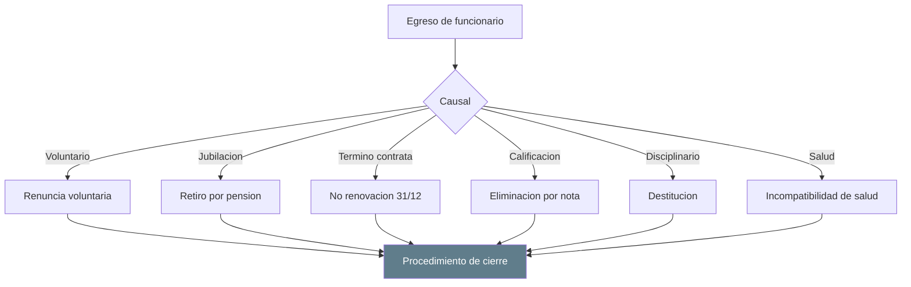
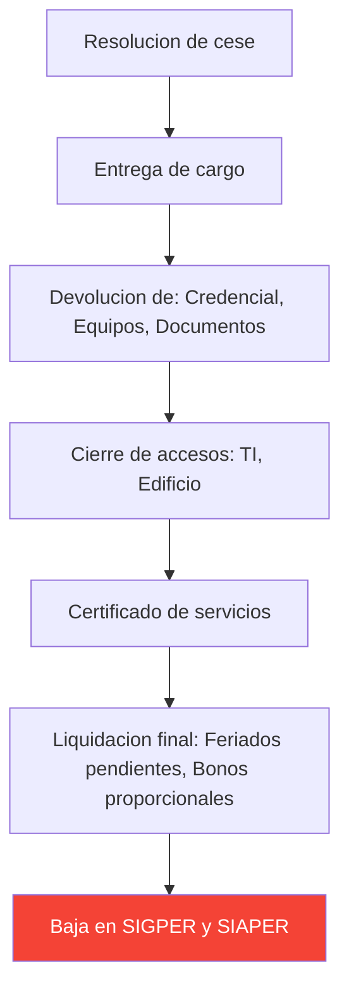
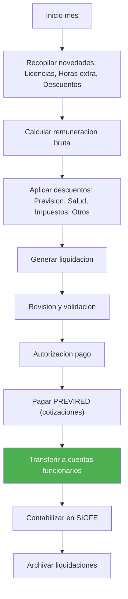

---
_manifest:
  urn: urn:gn:kb:manual-gestion-personas-p02
  provenance:
    created_by: FS
    created_at: '2026-03-15'
    source: Manuales 3.0-3.5 Gestión de Personas GORE Ñuble + BPMN D07 RRHH
version: 1.0.0
status: published
tags:
- gestion-personas
- rrhh
- remuneraciones
- gore-nuble
- ciclo-vida-funcionario
lang: es
extensions:
  gn:
    family: guide
  kora:
    shard_index: 2
    shard_count: 3
    shard_root_urn: urn:gn:kb:manual-gestion-personas
---

# Gestion de Personas — GORE Nuble - Parte 02

## Egreso y Desvinculacion

### Causales de Egreso

| Causal | Descripcion |
|---|---|
| Renuncia Voluntaria | Debe ser aceptada por la autoridad (plazo maximo 30 dias para retener). |
| Jubilacion | Cumplimiento de edad y requisitos previsionales. |
| Vacancia del Cargo | Por fallecimiento o inasistencia injustificada (>3 dias seguidos). |
| Salud Incompatible | Declaracion tras uso de licencias medicas por > 6 meses en 2 anos (Art. 151 Estatuto Administrativo). Al contratar reemplazos por licencias prolongadas, el Jefe de Servicio debera considerar declarar la salud incompatible (Art. 11 Ley Presupuestos 2026). |
| Calificacion Deficiente | Lista 3 (Condicional) dos veces consecutivas o Lista 4 (Eliminacion). |
| Destitucion | Medida disciplinaria tras sumario administrativo. |
| Termino de Contrata | No renovacion al 31 de diciembre (aviso previo, principio de confianza legitima CGR). |

### Procedimiento de Cierre

1. **Entrega del Cargo:** Acta de traspaso de bienes, documentos y pendientes.
2. **Cierre de Accesos:** Revocacion de credenciales, accesos informaticos y firma electronica.
3. **Certificado de Servicios:** Emision de relacion de servicios para fines previsionales.
4. **Liquidacion Final:** Pago de haberes pendientes y feriado proporcional (si corresponde).
5. **Reporte de Desvinculacion (Art. 14 Ley Presupuestos 2026):** Informar trimestralmente a la CEMP y BCN la nomina de funcionarios que cesan funciones (nombre, cargo, antiguedad, fecha y causal).

## Remuneraciones

### Estructura de Remuneraciones

Rige por la Escala Unica de Sueldos (EUS) y leyes especiales de reajuste del Sector Publico.

#### Componentes

| Componente | Detalle |
|---|---|
| Sueldo Base | Asignado segun grado EUS. |
| Asignacion de Antiguedad | Bienios. |
| Asignacion Profesional / Directiva / Jefatura | Segun estamento y cargo. |
| Asignacion de Zona | Segun localidad. |
| Asignacion de Modernizacion (Ley 19.553) | Componente Base y por Desempeno Institucional/Colectivo. |
| Viaticos | Comisiones de Servicio. Escala segun grado y destino (nacional/internacional). |
| Horas Extraordinarias | Trabajo fuera de jornada. |

#### Honorarios

- Monto definido en contrato a Suma Alzada.
- No perciben asignaciones de escala EUS (zona, antiguedad, etc.).
- Sujeto a boleta de honorarios mensual (electronica).

### Ciclo Mensual de Remuneraciones

| Etapa | Plazo | Descripcion |
|---|---|---|
| Recopilacion y Apertura | Dias 01 - 14 | Cierre de recepcion de novedades (licencias, horas extra visadas, nuevos contratos). Input: formularios GDP firmados y Decretos tramitados. |
| Proceso y Calculo | Dias 15 - 17 | Ingreso al sistema, calculo de brutos, descuentos y liquidos. |
| Validacion y VB | Dia 18 | Revision de nominas preliminares por Jefatura GDP y Control. |
| Pago | Dia 19 del mes (o habil anterior) | Transferencia efectiva a cuentas funcionarios. Fecha legal. |
| Reliquidaciones y Planilla Suplementaria | Dias 19 - 25 | Pagos rechazados o ajustes de ultima hora. |
| Pago Cotizaciones | Dias 20 - 30 | Declaracion y pago PREVIRED. |

### Horas Extraordinarias

Topes institucionales (Ref. PR-DAF-0005):

- Diurnas: Maximo 20 horas mensuales.
- Nocturnas/Festivas: Maximo 16 horas mensuales.
- Total Maximo: 40 horas (solo casos criticos excepcionales autorizados por Gobernador).

Requisitos:

- Resolucion previa.
- Sistema de control horario biometrico debe respaldar la solicitud.

### Viaticos

- Pago anticipado o devengado.
- Escala segun grado y destino (nacional/internacional).
- Rendicion de cometido requerida para cierre administrativo.

### Descuentos Legales y Voluntarios

**Obligatorios:** Impuesto Unico de Segunda Categoria, AFP/IPS, FONASA/Isapre, Seguro de Cesantia (Codigo del Trabajo).

**Voluntarios:** Ahorro previsional, asociaciones de funcionarios, convenios de bienestar (hasta tope legal del 15% o 25% de remuneracion liquida).

### Obligaciones de Informacion (Art. 14 N 10 Ley Presupuestos 2026)

Remitir semestralmente a Comision de Hacienda de la Camara de Diputados:

- Gastos asociados a remuneraciones.
- Calidad juridica de contratos.
- Porcentajes por estamento y genero.
- Duracion media de contratos y re-contrataciones.

### Transparencia Activa (Ley 20.285)

Publicacion mensual en sitio web de dotacion de planta, contrata y honorarios con remuneraciones brutas y liquidas.

## Asistencia y Control de Jornada

### Jornada Laboral

Base legal: Estatuto Administrativo (Ley 18.834).

- **Jornada Ordinaria:** 44 horas semanales, distribuidas de lunes a viernes.
- **Horarios:** Fijos o flexibles (segun reglamento interno), garantizando presencia en horario nucleo (ej. 09:30 - 16:00).
- **Colacion:** Minimo 30 minutos, no imputables a la jornada de trabajo.

### Control de Asistencia

- **Sistema:** Registro biometrico (huella/facial) o tarjeta magnetica.
- **Obligatoriedad:** Todo funcionario debe registrar entrada y salida.
- **Excepciones:** Cargos directivos y Jefes de Division (art. 22 del Codigo del Trabajo por analogia/exencion de marcar).

#### Atrasos y Tiempos Menores

Regla: Si la suma de atrasos y tiempos menores de jornada en el periodo mensual supera los 59 minutos, genera descuento proporcional en las remuneraciones del funcionario (PR-DAF-0004).

```mermaid
flowchart TD
 subgraph REGISTRO["Registro"]
 A["Funcionario marca entrada/salida"]
 B["Sistema registra en reloj control"]
 C["Generar reporte diario"]
 end

 subgraph PERMISOS["Permisos"]
 D["Solicitar permiso: Administrativo / Particular"]
 E["Jefatura aprueba / rechaza"]
 F["Registrar en sistema"]
 end

 subgraph LICENCIAS["Licencias"]
 G["Funcionario presenta licencia medica"]
 H["RRHH recepciona y valida"]
 I["Enviar a Isapre / COMPIN"]
 J["Resolucion: Aprobada / Rechazada"]
 K["Ajustar remuneracion"]
 end

 subgraph FERIADOS["Feriados"]
 L["Solicitar feriado legal/progresivo"]
 M["Verificar saldo disponible"]
 N["Jefatura autoriza"]
 O["Descontar dias"]
 end

 A --> B --> C
 D --> E --> F
 G --> H --> I --> J --> K
 L --> M --> N --> O

 style K fill:#FF9800,color:#fff
```

### Derechos Estatutarios

#### Feriado Legal (Vacaciones)

- **Derecho:** 15 dias habiles con goce de sueldo tras 1 ano de servicio (aumenta a 20 y 25 dias segun antiguedad).
- **Solicitud:** Via sistema interno (workflow SIGPER). Aprobada por Jefatura Directa.
- **Acumulacion:** Posible acumular hasta 2 periodos (requiere resolucion fundada). Dias no utilizados fuera de los periodos autorizados caducan automaticamente.

#### Permisos Administrativos

- 6 dias anuales con goce de sueldo para fines particulares.
- Pueden tomarse por dias completos o medios dias (manana/tarde).

#### Compensacion de Horas

Devolucion de tiempo por trabajos extraordinarios realizados en horario nocturno, festivo o fines de semana, autorizada previamente por Resolucion.

### Licencias Medicas

#### Flujo de Tramitacion

1. **Recepcion y Validacion:** El funcionario presenta LME (electronica via portal I-MED o manual en papel). Plazo maximo: 3 dias habiles desde inicio del reposo.
2. **Registro y Certificacion:** GDP registra en SIGPER y emite Certificado de Remuneraciones (ultimos 3 meses).
3. **Tramitacion Externa:**
 - Afiliado FONASA con Caja Compensacion (CCAF): Envio a CCAF dentro de 3 dias habiles.
 - Afiliado FONASA sin CCAF: Envio a COMPIN dentro de 3 dias habiles.
 - Afiliado ISAPRE: Envio a la Isapre respectiva dentro de 3 dias habiles.
4. **Resolucion y Ajuste:**
 - Recepcion de Resolucion (Aprobada/Rechazada/Reducida).
 - Calculo de SIL (Subsidio por Incapacidad Laboral) para recuperacion.
 - En caso de Rechazo/Reduccion: Generar descuento o reintegro inmediato tras notificacion.

#### Mantencion de Ingresos

El GORE garantiza el pago integro de la remuneracion liquida mientras el funcionario mantenga el vinculo. GDP tramita ante el ente pagador (Caja/Compin/Isapre) la devolucion del subsidio correspondiente al empleador.

### Responsabilidades

| Rol | Responsabilidad |
|---|---|
| Funcionario | Cuidar su asistencia, registrar marcas biometricas, solicitar permisos a tiempo y justificar ausencias en plataforma de control. |
| Jefatura Directa | Autorizar permisos garantizando cobertura de funciones criticas del servicio. Validar cumplimiento de turnos y evitar acumulacion excesiva de compensatorios. |
| Gestion de Personas (GDP) | Administracion tecnica del sistema de control y SIGPER. Reportar semanalmente atrasos a Remuneraciones para corte mensual. Liderar la recuperacion de subsidios por licencias medicas. |
