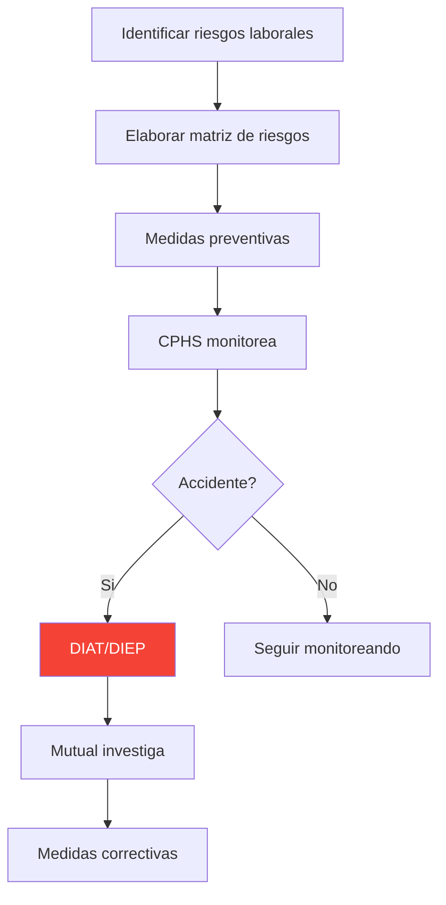

---
_manifest:
  urn: urn:gn:kb:manual-gestion-personas-p03
  provenance:
    created_by: FS
    created_at: '2026-03-15'
    source: Manuales 3.0-3.5 Gestión de Personas GORE Ñuble + BPMN D07 RRHH
version: 1.0.0
status: published
tags:
- gestion-personas
- rrhh
- remuneraciones
- gore-nuble
- ciclo-vida-funcionario
lang: es
extensions:
  gn:
    family: guide
  kora:
    shard_index: 3
    shard_count: 3
    shard_root_urn: urn:gn:kb:manual-gestion-personas
---

# Gestion de Personas — GORE Nuble - Parte 03

## Bienestar del Personal

### Servicio de Bienestar

#### Afiliacion y Aportes

- **Caracter:** La afiliacion es voluntaria y la desafiliacion es libre.
- **Socios:** Funcionarios de Planta y Contrata (y jubilados que deseen permanecer).
- **Financiamiento:**
 - Aporte del Funcionario: Porcentaje de su remuneracion imponible (descuento por planilla).
 - Aporte Institucional: Aporte anual definido en Ley de Presupuestos (Subtitulo 24).
 - Cuota de Incorporacion: Pago unico al ingresar.

#### Administracion

- **Consejo Administrativo:** Organo colegiado con representantes de la institucion y de los socios (electos). Decide sobre presupuestos y beneficios.
- **Unidad de Bienestar:** Ejecuta las decisiones del Consejo y administra los fondos.

```mermaid
flowchart TD
 subgraph AFILIACION["Afiliacion"]
 A["Funcionario ingresa"]
 B["Invitar a Servicio de Bienestar"]
 C["Aceptar y afiliar"]
 D["Descuento mensual por planilla"]
 end

 subgraph PRESTACIONES["Prestaciones"]
 E["Solicitar beneficio: Medico, Economico, Prestamo, Convenio"]
 F["Unidad Bienestar evalua"]
 G["Consejo Administrativo aprueba si requiere"]
 H["Otorgar beneficio"]
 end

 subgraph ACTIVIDADES["Actividades"]
 I["Planificar eventos: Deportivos, Recreativos, Culturales"]
 J["Ejecutar actividad"]
 K["Evaluar satisfaccion"]
 end

 A --> B --> C --> D
 E --> F --> G --> H
 I --> J --> K

 style H fill:#4CAF50,color:#fff
```

### Beneficios y Prestaciones

#### Ayudas Medicas y Dentales

- **Reembolso:** Bonificacion de un porcentaje del copago (no cubierto por Isapre/FONASA y seguro complementario) en consultas, examenes, medicamentos, optica y protesis.
- **Tope Anual:** Monto maximo de reembolso por socio/carga.

#### Ayudas Economicas

- **Subsidios:** Asignaciones en dinero por eventos vitales (Nacimiento, Matrimonio/AUC, Fallecimiento).
- **Bonos Escolares:** Aporte anual por escolaridad de hijos (Pre-kinder a Universidad).
- **Becas de Excelencia:** Premio al rendimiento academico del funcionario o hijos.

#### Prestamos

- Tipos: Medico, Auxilio (libre disposicion), Escolar, Habitacional.
- Condiciones:
 - Interes bajo.
 - Descuento por planilla en cuotas.
 - Requiere codeudor solidario (otro socio) segun monto.

#### Convenios

- **Comerciales:** Descuentos en farmacias, gimnasios, opticas, librerias, etc.
- **Institucionales:** Acuerdos con Cajas de Compensacion (CCAF) para creditos sociales y turismo.

### Calidad de Vida

#### Actividades Recreativas y Culturales

- Organizacion de eventos de camaraderia (Aniversario GORE, Fiestas Patrias, Navidad).
- Actividades deportivas y talleres.

#### Prevencion de Riesgos

Coordinacion con Mutualidad (ACHS/IST) para evaluacion de puestos de trabajo y prevencion de enfermedades profesionales.

## Normativa Aplicable

| Norma | Alcance |
|---|---|
| Ley 18.834 | Estatuto Administrativo. |
| Ley 18.575 | Bases Generales de la Administracion del Estado. |
| Ley 19.553 | Asignacion de Modernizacion (Componente Base y Desempeno). |
| Ley 19.653 | Probidad Administrativa (Art. 12: Declaraciones Juradas). |
| Ley 20.285 | Transparencia Activa y acceso a informacion publica. |
| Ley 20.880 | Probidad en la funcion publica, declaraciones de intereses y patrimonio. |
| Ley 21.643 (Ley Karin) | Prevencion de violencia y acoso en el trabajo. |
| Ley de Presupuestos 2026 | Dotacion maxima, tasa de reemplazo, traspasos, reemplazos temporales, obligaciones de informacion. |
| Codigo del Trabajo | Aplicable a contrataciones por honorarios y situaciones excepcionales. |
| D.S. N 3 de 1984 (Minsal) | Tramitacion de licencias medicas. |
| Reglamento General de Servicios de Bienestar | Regimen de beneficios y prestaciones sociales. |
| Reglamento Interno de Higiene y Seguridad GORE Nuble | Normas internas de seguridad y salud ocupacional. |

## Sistemas de Informacion

| Sistema | Funcion |
|---|---|
| SIGPER | Gestion integral de personas: contratos, remuneraciones, licencias, permisos, control de asistencia. |
| SIAPER | Control de personal del Estado (altas, bajas, nombramientos). |
| PREVIRED | Declaracion y pago de cotizaciones previsionales y de salud. |
| SIGFE | Contabilizacion del gasto en remuneraciones. |
| I-MED | Portal de licencias medicas electronicas. |
