---
_manifest:
  urn: "urn:gn:kb:manual-gestion-personas"
  provenance:
    created_by: "FS"
    created_at: "2026-03-15"
    source: "Manuales 3.0-3.5 Gestión de Personas GORE Ñuble + BPMN D07 RRHH"
version: "1.0.0"
status: published
tags: [gestion-personas, rrhh, remuneraciones, gore-nuble, ciclo-vida-funcionario]
lang: es
extensions:
  gn:
    family: guide
---

# Gestion de Personas — GORE Nuble

## Vision General

Este artefacto consolida la operacion completa del dominio de Gestion de Personas (RRHH) del Gobierno Regional de Nuble. Integra cinco manuales operativos — Ciclo de Vida del Funcionario, Remuneraciones, Asistencia y Control de Jornada, Desarrollo Organizacional y Capacitacion, y Bienestar del Personal — junto con la arquitectura de procesos BPMN del dominio D07.

**Objetivo integrado:** Regular los procesos administrativos, remuneracionales, de desarrollo y bienestar asociados a la trayectoria laboral de los funcionarios del GORE Nuble, desde el ingreso hasta el egreso, asegurando el cumplimiento de la normativa estatutaria y presupuestaria vigente.

| Atributo | Valor |
|---|---|
| Criticidad | Alta |
| Dueno | Area de Gestion y Desarrollo de Personas (GDP) |
| Procesos | 7 |
| Subprocesos | ~20 |

## Mapa de Procesos

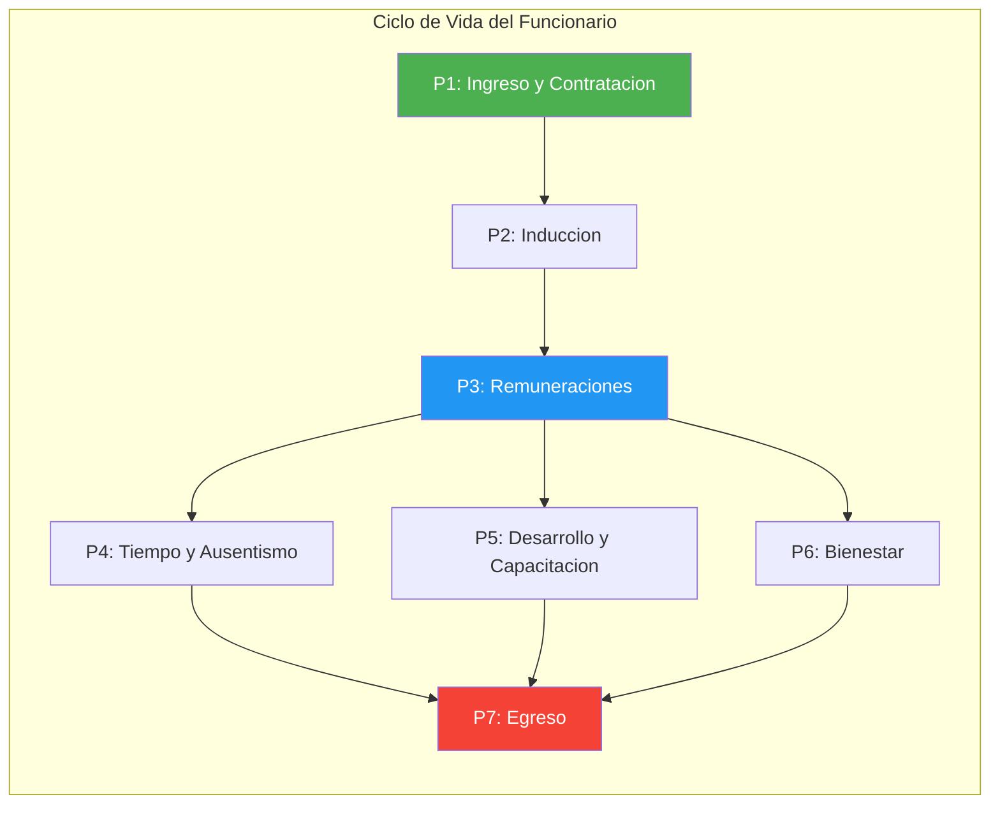

## Desarrollo Organizacional

### Sistema de Capacitacion y Formacion

Regido por el Estatuto Administrativo y normas del Servicio Civil. Busca perfeccionar los conocimientos y habilidades de los funcionarios.

#### Deteccion de Necesidades de Capacitacion (DNC)

Proceso anual de consulta a jefaturas y funcionarios sobre brechas de competencias.

Fuentes de informacion:

- Evaluacion del desempeno.
- Nuevas normativas o sistemas (ej. SIGFE, Transformacion Digital).
- Objetivos estrategicos regionales (ERD).

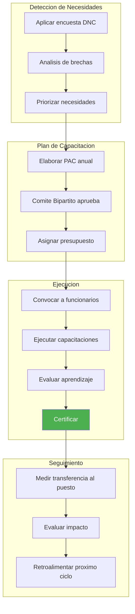

#### Plan Anual de Capacitacion (PAC)

- **Elaboracion:** Area de Gestion y Desarrollo de Personas (GDP) consolida el DNC.
- **Comite Bipartito de Capacitacion:** Instancia consultiva con representantes de la asociacion de funcionarios y la administracion. Revisa y sugiere acciones.
- **Aprobacion:** Resolucion Exenta del Gobernador(a).
- **Modalidades de ejecucion:** Cursos internos, cursos externos, e-learning.
- **Compromiso del funcionario:**
  - El funcionario capacitado debe replicar conocimientos o aplicarlos.
  - Renuncias post-curso pueden implicar devolucion de costos (segun reglamento).
- **Prioridad en competencias digitales:** Se priorizaran acciones formativas en competencias digitales (uso de plataformas, firma electronica, seguridad de la informacion), conforme a la Estrategia de Capacitacion de la Transformacion Digital del Estado.

### Gestion del Desempeno

#### Sistema de Calificaciones

Instrumento formal para evaluar el desempeno funcionario.

- **Periodo calificatorio:** Anual (1 de septiembre al 31 de agosto).

Etapas:

1. **Precalificacion:** Jefe Directo evalua factores cualitativos y cuantitativos.
2. **Junta Calificadora:** Comite colegiado que revisa las precalificaciones y asigna la nota final y Lista (1: Distincion, 2: Buena, 3: Condicional, 4: Eliminacion).
3. **Apelacion:** Funcionario puede apelar ante la Junta. En segunda instancia, ante la Contraloria (por vicios de legalidad).

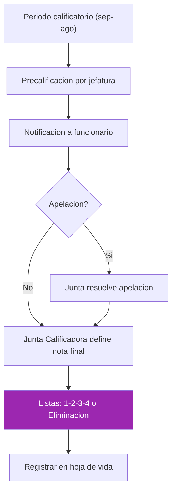

#### Metas y Compromisos PMG

- **Metas de Gestion Institucional:** Definidas anualmente (ej. eficiencia presupuestaria, atencion usuarios).
- **Metas de Desempeno Colectivo:** Definidas por equipo/division.
- **Evaluacion:** El cumplimiento determina el pago del Componente de Desempeno de la Asignacion de Modernizacion (pagado trimestralmente).

### Clima Laboral y Desarrollo Organizacional

#### Clima Laboral

- **Medicion:** Aplicacion bianual de encuestas de clima laboral (ej. ISTAS 21).
- **Intervencion:** Planes de accion para abordar brechas (liderazgo, comunicacion, condiciones fisicas).

#### Conciliacion Trabajo-Vida

- **Politicas:** Promocion de corresponsabilidad parental, respeto de horarios, derecho a desconexion.
- **Teletrabajo:** Modalidad sujeta a factibilidad tecnica y normativa especifica (Ley de Presupuestos / Reglamento Interno), priorizando tareas que permitan medicion por objetivos.

## Ciclo de Vida del Funcionario

### Ingreso y Contratacion

#### Calidad Juridica y Dotacion

El ingreso al GORE se realiza bajo las siguientes modalidades, sujetas a la Dotacion Maxima de Personal autorizada en la Ley de Presupuestos (Partida 31):

| Modalidad | Descripcion |
|---|---|
| Planta | Cargos permanentes asignados a grados especificos. Ingreso por concurso publico (salvo cargos de confianza). |
| Contrata | Empleos transitorios de duracion anual (hasta el 31 de diciembre), renovables. |
| Honorarios | Contratacion para labores accidentales o especificas no habituales (Suma Alzada). Sin vinculo laboral. |
| Codigo del Trabajo | Casos excepcionales regulados por normas especificas. |

#### Restriccion de Dotacion (Art. 10 Ley Presupuestos 2026)

- No se puede aumentar la dotacion maxima sin una compensacion (disminucion en otro servicio o cupos de honorarios).
- Tasa de Reemplazo para 2026: 1 por cada 3 vacantes producidas por retiro (jubilacion/incentivo).
- Requiere certificacion de disponibilidad presupuestaria previa.

#### Proceso de Reclutamiento y Seleccion

1. **Levantamiento del Perfil:** Jefatura requirente define competencias y requisitos (DFL).
2. **Autorizacion Presupuestaria:** Division de Administracion y Finanzas (DAF) certifica disponibilidad de cupo y recursos (Subtitulo 21).
3. **Concurso Publico (Planta):**
   - Publicacion en Diario Oficial y sitio web.
   - Comite de Seleccion evalua antecedentes y entrevistas.
   - Confeccion de terna y resolucion del Gobernador(a).
4. **Seleccion (Contrata/Honorarios):**
   - Publicacion de oferta (Empleos Publicos / Web GORE).
   - Evaluacion curricular y psicologica.
   - Entrevista tecnica.

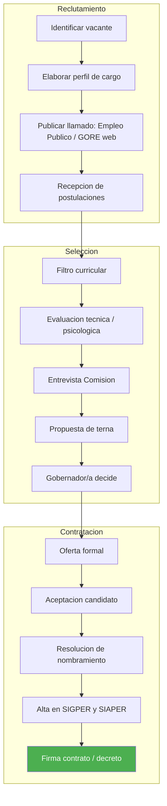

#### Formalizacion del Ingreso

- **Decreto de Nombramiento (Planta/Contrata):** Registrado en SIAPER y tramitado ante Contraloria (Toma de Razon o Registro).
- **Contrato de Honorarios:** Debe especificar labores, productos, monto y vigencia.
- **Declaraciones Juradas:** Intereses, Patrimonio, Inhabilidades e Incompatibilidades (Art. 12 Ley 19.653).
- **Obligacion de Informar (Art. 14 Ley Presupuestos 2026):** Informar trimestralmente a la CEMP y BCN la nomina de contrataciones (nombre, cargo, titulo).

### Induccion e Integracion

Todo funcionario nuevo debe participar en el proceso de induccion institucional. Responsable: Unidad de Desarrollo Organizacional (GDP).

Fases:

1. **Bienvenida e Instalacion (Dia 1):** Entrega de credencial, correo, puesto de trabajo.
2. **Induccion General (Semana 1):** E-learning sobre Probidad, Estatuto, Estructura GORE.
3. **Induccion Especifica (Mes 1):** Acompanamiento en el puesto (Mentoring) por jefatura o par.
4. **Evaluacion:** Evaluacion de induccion obligatoria al dia 30.

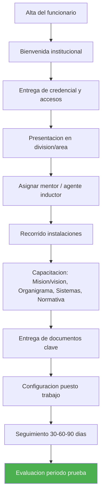

#### Protocolos Ley Karin (Prevencion de Violencia y Acoso)

Como parte de la induccion, se deben cumplir los siguientes hitos:

1. **Difusion de Protocolos:** Entrega de los protocolos institucionales de prevencion de violencia en el trabajo, acoso laboral y acoso sexual.
2. **Capacitacion Preventiva:** Modulo obligatorio sobre conductas prohibidas y canales de denuncia.
3. **Acuse de Recibo:** El funcionario debe firmar la recepcion de los protocolos y del Reglamento Interno de Higiene y Seguridad.
4. **Registro:** Archivo de la firma en la carpeta personal del funcionario.

### Movilidad y Desarrollo

#### Encasillamiento y Promocion

- **Ascensos:** Movimiento a un cargo de grado superior en la planta, por concurso interno o promocion automatica (segun DFL).
- **Traspaso Honorarios a Contrata (Art. 15 Ley Presupuestos 2026):**
  - Autorizacion anual maxima de cupos a nivel nacional (6.500 para 2026).
  - Requisitos: Antiguedad, funciones habituales.
  - Proceso regulado por Decreto de Hacienda. No puede significar aumento del gasto liquido mensualizado.

#### Suplencias y Reemplazos

- **Suplencia:** Reemplazo de un cargo titular vacante o por ausencia del titular.
- **Reemplazos Temporales (Art. 11 Ley Presupuestos 2026):**
  - Para ausencias > 30 dias corridos.
  - Contrato maximo 6 meses.
  - Requiere Autorizacion Previa de DIPRES, salvo Licencias Maternales/Parentales (que solo deben informarse).

#### Comisiones de Servicio y Cometidos

- **Comision de Servicio:** Destinacion temporal a otra institucion o lugar para funciones propias del cargo.
- **Cometido Funcionario:** Desplazamiento transitorio para una tarea especifica con derecho a pasajes y viaticos.
- **Registro:** Obligatoriedad de Decreto Exento previo a la realizacion (salvo emergencias justificadas).

### Egreso y Desvinculacion

#### Causales de Egreso

| Causal | Descripcion |
|---|---|
| Renuncia Voluntaria | Debe ser aceptada por la autoridad (plazo maximo 30 dias para retener). |
| Jubilacion | Cumplimiento de edad y requisitos previsionales. |
| Vacancia del Cargo | Por fallecimiento o inasistencia injustificada (>3 dias seguidos). |
| Salud Incompatible | Declaracion tras uso de licencias medicas por > 6 meses en 2 anos (Art. 151 Estatuto Administrativo). Al contratar reemplazos por licencias prolongadas, el Jefe de Servicio debera considerar declarar la salud incompatible (Art. 11 Ley Presupuestos 2026). |
| Calificacion Deficiente | Lista 3 (Condicional) dos veces consecutivas o Lista 4 (Eliminacion). |
| Destitucion | Medida disciplinaria tras sumario administrativo. |
| Termino de Contrata | No renovacion al 31 de diciembre (aviso previo, principio de confianza legitima CGR). |

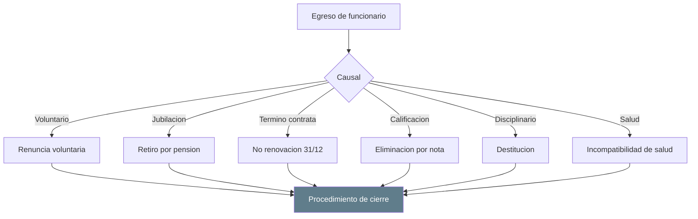

#### Procedimiento de Cierre

1. **Entrega del Cargo:** Acta de traspaso de bienes, documentos y pendientes.
2. **Cierre de Accesos:** Revocacion de credenciales, accesos informaticos y firma electronica.
3. **Certificado de Servicios:** Emision de relacion de servicios para fines previsionales.
4. **Liquidacion Final:** Pago de haberes pendientes y feriado proporcional (si corresponde).
5. **Reporte de Desvinculacion (Art. 14 Ley Presupuestos 2026):** Informar trimestralmente a la CEMP y BCN la nomina de funcionarios que cesan funciones (nombre, cargo, antiguedad, fecha y causal).

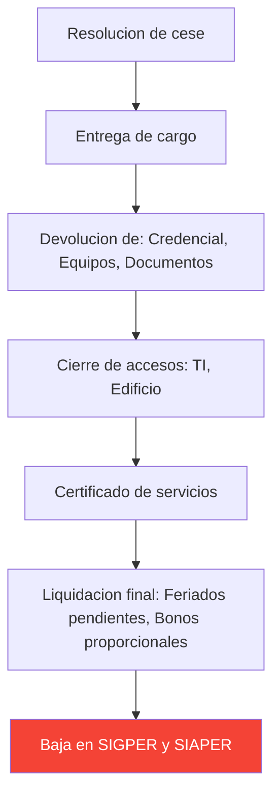

## Remuneraciones

### Estructura de Remuneraciones

Rige por la Escala Unica de Sueldos (EUS) y leyes especiales de reajuste del Sector Publico.

#### Componentes

| Componente | Detalle |
|---|---|
| Sueldo Base | Asignado segun grado EUS. |
| Asignacion de Antiguedad | Bienios. |
| Asignacion Profesional / Directiva / Jefatura | Segun estamento y cargo. |
| Asignacion de Zona | Segun localidad. |
| Asignacion de Modernizacion (Ley 19.553) | Componente Base y por Desempeno Institucional/Colectivo. |
| Viaticos | Comisiones de Servicio. Escala segun grado y destino (nacional/internacional). |
| Horas Extraordinarias | Trabajo fuera de jornada. |

#### Honorarios

- Monto definido en contrato a Suma Alzada.
- No perciben asignaciones de escala EUS (zona, antiguedad, etc.).
- Sujeto a boleta de honorarios mensual (electronica).

### Ciclo Mensual de Remuneraciones

| Etapa | Plazo | Descripcion |
|---|---|---|
| Recopilacion y Apertura | Dias 01 - 14 | Cierre de recepcion de novedades (licencias, horas extra visadas, nuevos contratos). Input: formularios GDP firmados y Decretos tramitados. |
| Proceso y Calculo | Dias 15 - 17 | Ingreso al sistema, calculo de brutos, descuentos y liquidos. |
| Validacion y VB | Dia 18 | Revision de nominas preliminares por Jefatura GDP y Control. |
| Pago | Dia 19 del mes (o habil anterior) | Transferencia efectiva a cuentas funcionarios. Fecha legal. |
| Reliquidaciones y Planilla Suplementaria | Dias 19 - 25 | Pagos rechazados o ajustes de ultima hora. |
| Pago Cotizaciones | Dias 20 - 30 | Declaracion y pago PREVIRED. |

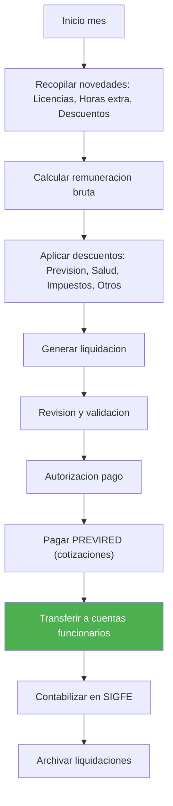

### Horas Extraordinarias

Topes institucionales (Ref. PR-DAF-0005):

- Diurnas: Maximo 20 horas mensuales.
- Nocturnas/Festivas: Maximo 16 horas mensuales.
- Total Maximo: 40 horas (solo casos criticos excepcionales autorizados por Gobernador).

Requisitos:

- Resolucion previa.
- Sistema de control horario biometrico debe respaldar la solicitud.

### Viaticos

- Pago anticipado o devengado.
- Escala segun grado y destino (nacional/internacional).
- Rendicion de cometido requerida para cierre administrativo.

### Descuentos Legales y Voluntarios

**Obligatorios:** Impuesto Unico de Segunda Categoria, AFP/IPS, FONASA/Isapre, Seguro de Cesantia (Codigo del Trabajo).

**Voluntarios:** Ahorro previsional, asociaciones de funcionarios, convenios de bienestar (hasta tope legal del 15% o 25% de remuneracion liquida).

### Obligaciones de Informacion (Art. 14 N 10 Ley Presupuestos 2026)

Remitir semestralmente a Comision de Hacienda de la Camara de Diputados:

- Gastos asociados a remuneraciones.
- Calidad juridica de contratos.
- Porcentajes por estamento y genero.
- Duracion media de contratos y re-contrataciones.

### Transparencia Activa (Ley 20.285)

Publicacion mensual en sitio web de dotacion de planta, contrata y honorarios con remuneraciones brutas y liquidas.

## Asistencia y Control de Jornada

### Jornada Laboral

Base legal: Estatuto Administrativo (Ley 18.834).

- **Jornada Ordinaria:** 44 horas semanales, distribuidas de lunes a viernes.
- **Horarios:** Fijos o flexibles (segun reglamento interno), garantizando presencia en horario nucleo (ej. 09:30 - 16:00).
- **Colacion:** Minimo 30 minutos, no imputables a la jornada de trabajo.

### Control de Asistencia

- **Sistema:** Registro biometrico (huella/facial) o tarjeta magnetica.
- **Obligatoriedad:** Todo funcionario debe registrar entrada y salida.
- **Excepciones:** Cargos directivos y Jefes de Division (art. 22 del Codigo del Trabajo por analogia/exencion de marcar).

#### Atrasos y Tiempos Menores

Regla: Si la suma de atrasos y tiempos menores de jornada en el periodo mensual supera los 59 minutos, genera descuento proporcional en las remuneraciones del funcionario (PR-DAF-0004).

```mermaid
flowchart TD
    subgraph REGISTRO["Registro"]
        A["Funcionario marca entrada/salida"]
        B["Sistema registra en reloj control"]
        C["Generar reporte diario"]
    end

    subgraph PERMISOS["Permisos"]
        D["Solicitar permiso: Administrativo / Particular"]
        E["Jefatura aprueba / rechaza"]
        F["Registrar en sistema"]
    end

    subgraph LICENCIAS["Licencias"]
        G["Funcionario presenta licencia medica"]
        H["RRHH recepciona y valida"]
        I["Enviar a Isapre / COMPIN"]
        J["Resolucion: Aprobada / Rechazada"]
        K["Ajustar remuneracion"]
    end

    subgraph FERIADOS["Feriados"]
        L["Solicitar feriado legal/progresivo"]
        M["Verificar saldo disponible"]
        N["Jefatura autoriza"]
        O["Descontar dias"]
    end

    A --> B --> C
    D --> E --> F
    G --> H --> I --> J --> K
    L --> M --> N --> O

    style K fill:#FF9800,color:#fff
```

### Derechos Estatutarios

#### Feriado Legal (Vacaciones)

- **Derecho:** 15 dias habiles con goce de sueldo tras 1 ano de servicio (aumenta a 20 y 25 dias segun antiguedad).
- **Solicitud:** Via sistema interno (workflow SIGPER). Aprobada por Jefatura Directa.
- **Acumulacion:** Posible acumular hasta 2 periodos (requiere resolucion fundada). Dias no utilizados fuera de los periodos autorizados caducan automaticamente.

#### Permisos Administrativos

- 6 dias anuales con goce de sueldo para fines particulares.
- Pueden tomarse por dias completos o medios dias (manana/tarde).

#### Compensacion de Horas

Devolucion de tiempo por trabajos extraordinarios realizados en horario nocturno, festivo o fines de semana, autorizada previamente por Resolucion.

### Licencias Medicas

#### Flujo de Tramitacion

1. **Recepcion y Validacion:** El funcionario presenta LME (electronica via portal I-MED o manual en papel). Plazo maximo: 3 dias habiles desde inicio del reposo.
2. **Registro y Certificacion:** GDP registra en SIGPER y emite Certificado de Remuneraciones (ultimos 3 meses).
3. **Tramitacion Externa:**
   - Afiliado FONASA con Caja Compensacion (CCAF): Envio a CCAF dentro de 3 dias habiles.
   - Afiliado FONASA sin CCAF: Envio a COMPIN dentro de 3 dias habiles.
   - Afiliado ISAPRE: Envio a la Isapre respectiva dentro de 3 dias habiles.
4. **Resolucion y Ajuste:**
   - Recepcion de Resolucion (Aprobada/Rechazada/Reducida).
   - Calculo de SIL (Subsidio por Incapacidad Laboral) para recuperacion.
   - En caso de Rechazo/Reduccion: Generar descuento o reintegro inmediato tras notificacion.

#### Mantencion de Ingresos

El GORE garantiza el pago integro de la remuneracion liquida mientras el funcionario mantenga el vinculo. GDP tramita ante el ente pagador (Caja/Compin/Isapre) la devolucion del subsidio correspondiente al empleador.

### Responsabilidades

| Rol | Responsabilidad |
|---|---|
| Funcionario | Cuidar su asistencia, registrar marcas biometricas, solicitar permisos a tiempo y justificar ausencias en plataforma de control. |
| Jefatura Directa | Autorizar permisos garantizando cobertura de funciones criticas del servicio. Validar cumplimiento de turnos y evitar acumulacion excesiva de compensatorios. |
| Gestion de Personas (GDP) | Administracion tecnica del sistema de control y SIGPER. Reportar semanalmente atrasos a Remuneraciones para corte mensual. Liderar la recuperacion de subsidios por licencias medicas. |

## Bienestar del Personal

### Servicio de Bienestar

#### Afiliacion y Aportes

- **Caracter:** La afiliacion es voluntaria y la desafiliacion es libre.
- **Socios:** Funcionarios de Planta y Contrata (y jubilados que deseen permanecer).
- **Financiamiento:**
  - Aporte del Funcionario: Porcentaje de su remuneracion imponible (descuento por planilla).
  - Aporte Institucional: Aporte anual definido en Ley de Presupuestos (Subtitulo 24).
  - Cuota de Incorporacion: Pago unico al ingresar.

#### Administracion

- **Consejo Administrativo:** Organo colegiado con representantes de la institucion y de los socios (electos). Decide sobre presupuestos y beneficios.
- **Unidad de Bienestar:** Ejecuta las decisiones del Consejo y administra los fondos.

```mermaid
flowchart TD
    subgraph AFILIACION["Afiliacion"]
        A["Funcionario ingresa"]
        B["Invitar a Servicio de Bienestar"]
        C["Aceptar y afiliar"]
        D["Descuento mensual por planilla"]
    end

    subgraph PRESTACIONES["Prestaciones"]
        E["Solicitar beneficio: Medico, Economico, Prestamo, Convenio"]
        F["Unidad Bienestar evalua"]
        G["Consejo Administrativo aprueba si requiere"]
        H["Otorgar beneficio"]
    end

    subgraph ACTIVIDADES["Actividades"]
        I["Planificar eventos: Deportivos, Recreativos, Culturales"]
        J["Ejecutar actividad"]
        K["Evaluar satisfaccion"]
    end

    A --> B --> C --> D
    E --> F --> G --> H
    I --> J --> K

    style H fill:#4CAF50,color:#fff
```

### Beneficios y Prestaciones

#### Ayudas Medicas y Dentales

- **Reembolso:** Bonificacion de un porcentaje del copago (no cubierto por Isapre/FONASA y seguro complementario) en consultas, examenes, medicamentos, optica y protesis.
- **Tope Anual:** Monto maximo de reembolso por socio/carga.

#### Ayudas Economicas

- **Subsidios:** Asignaciones en dinero por eventos vitales (Nacimiento, Matrimonio/AUC, Fallecimiento).
- **Bonos Escolares:** Aporte anual por escolaridad de hijos (Pre-kinder a Universidad).
- **Becas de Excelencia:** Premio al rendimiento academico del funcionario o hijos.

#### Prestamos

- Tipos: Medico, Auxilio (libre disposicion), Escolar, Habitacional.
- Condiciones:
  - Interes bajo.
  - Descuento por planilla en cuotas.
  - Requiere codeudor solidario (otro socio) segun monto.

#### Convenios

- **Comerciales:** Descuentos en farmacias, gimnasios, opticas, librerias, etc.
- **Institucionales:** Acuerdos con Cajas de Compensacion (CCAF) para creditos sociales y turismo.

### Calidad de Vida

#### Actividades Recreativas y Culturales

- Organizacion de eventos de camaraderia (Aniversario GORE, Fiestas Patrias, Navidad).
- Actividades deportivas y talleres.

#### Prevencion de Riesgos

Coordinacion con Mutualidad (ACHS/IST) para evaluacion de puestos de trabajo y prevencion de enfermedades profesionales.

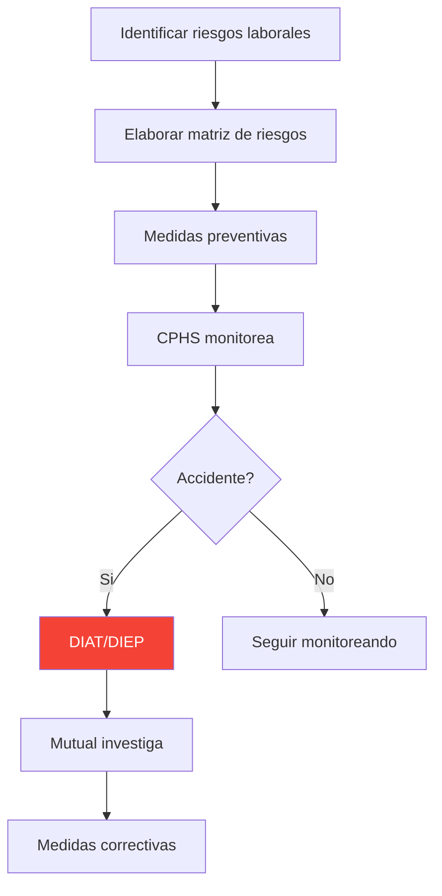

## Normativa Aplicable

| Norma | Alcance |
|---|---|
| Ley 18.834 | Estatuto Administrativo. |
| Ley 18.575 | Bases Generales de la Administracion del Estado. |
| Ley 19.553 | Asignacion de Modernizacion (Componente Base y Desempeno). |
| Ley 19.653 | Probidad Administrativa (Art. 12: Declaraciones Juradas). |
| Ley 20.285 | Transparencia Activa y acceso a informacion publica. |
| Ley 20.880 | Probidad en la funcion publica, declaraciones de intereses y patrimonio. |
| Ley 21.643 (Ley Karin) | Prevencion de violencia y acoso en el trabajo. |
| Ley de Presupuestos 2026 | Dotacion maxima, tasa de reemplazo, traspasos, reemplazos temporales, obligaciones de informacion. |
| Codigo del Trabajo | Aplicable a contrataciones por honorarios y situaciones excepcionales. |
| D.S. N 3 de 1984 (Minsal) | Tramitacion de licencias medicas. |
| Reglamento General de Servicios de Bienestar | Regimen de beneficios y prestaciones sociales. |
| Reglamento Interno de Higiene y Seguridad GORE Nuble | Normas internas de seguridad y salud ocupacional. |

## Sistemas de Informacion

| Sistema | Funcion |
|---|---|
| SIGPER | Gestion integral de personas: contratos, remuneraciones, licencias, permisos, control de asistencia. |
| SIAPER | Control de personal del Estado (altas, bajas, nombramientos). |
| PREVIRED | Declaracion y pago de cotizaciones previsionales y de salud. |
| SIGFE | Contabilizacion del gasto en remuneraciones. |
| I-MED | Portal de licencias medicas electronicas. |
