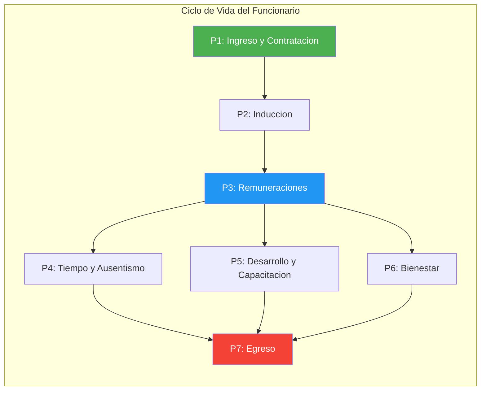
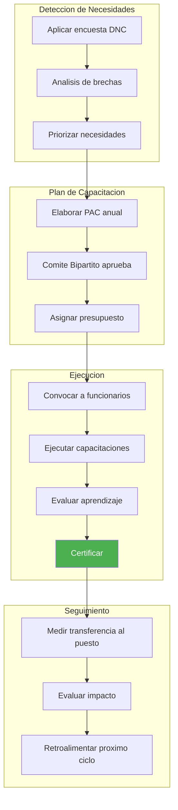
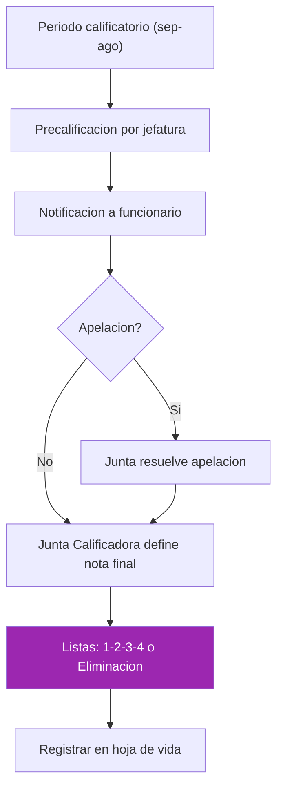
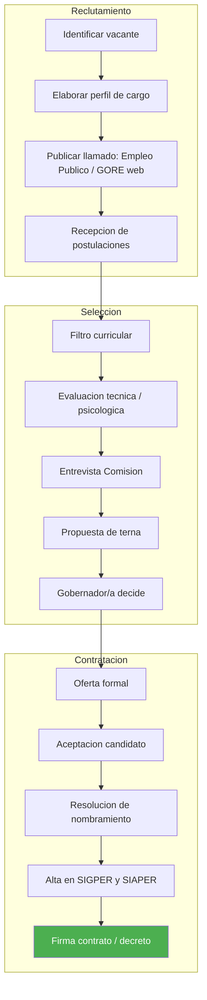
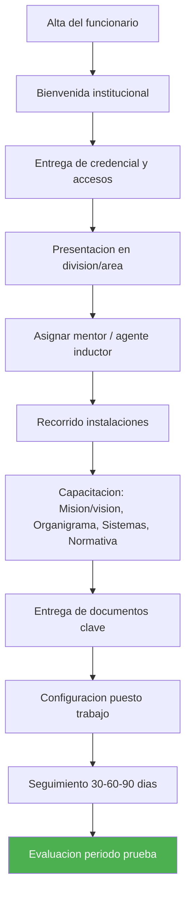

---
_manifest:
  urn: urn:gn:kb:manual-gestion-personas
  provenance:
    created_by: FS
    created_at: '2026-03-15'
    source: Manuales 3.0-3.5 Gestión de Personas GORE Ñuble + BPMN D07 RRHH
version: 1.0.0
status: published
tags:
- gestion-personas
- rrhh
- remuneraciones
- gore-nuble
- ciclo-vida-funcionario
lang: es
extensions:
  gn:
    family: guide
  kora:
    shard_index: 1
    shard_count: 3
    shard_root_urn: urn:gn:kb:manual-gestion-personas
---

# Gestion de Personas — GORE Nuble

## Vision General

Este artefacto consolida la operacion completa del dominio de Gestion de Personas (RRHH) del Gobierno Regional de Nuble. Integra cinco manuales operativos — Ciclo de Vida del Funcionario, Remuneraciones, Asistencia y Control de Jornada, Desarrollo Organizacional y Capacitacion, y Bienestar del Personal — junto con la arquitectura de procesos BPMN del dominio D07.

**Objetivo integrado:** Regular los procesos administrativos, remuneracionales, de desarrollo y bienestar asociados a la trayectoria laboral de los funcionarios del GORE Nuble, desde el ingreso hasta el egreso, asegurando el cumplimiento de la normativa estatutaria y presupuestaria vigente.

| Atributo | Valor |
|---|---|
| Criticidad | Alta |
| Dueno | Area de Gestion y Desarrollo de Personas (GDP) |
| Procesos | 7 |
| Subprocesos | ~20 |

## Mapa de Procesos

## Desarrollo Organizacional

### Sistema de Capacitacion y Formacion

Regido por el Estatuto Administrativo y normas del Servicio Civil. Busca perfeccionar los conocimientos y habilidades de los funcionarios.

#### Deteccion de Necesidades de Capacitacion (DNC)

Proceso anual de consulta a jefaturas y funcionarios sobre brechas de competencias.

Fuentes de informacion:

- Evaluacion del desempeno.
- Nuevas normativas o sistemas (ej. SIGFE, Transformacion Digital).
- Objetivos estrategicos regionales (ERD).

#### Plan Anual de Capacitacion (PAC)

- **Elaboracion:** Area de Gestion y Desarrollo de Personas (GDP) consolida el DNC.
- **Comite Bipartito de Capacitacion:** Instancia consultiva con representantes de la asociacion de funcionarios y la administracion. Revisa y sugiere acciones.
- **Aprobacion:** Resolucion Exenta del Gobernador(a).
- **Modalidades de ejecucion:** Cursos internos, cursos externos, e-learning.
- **Compromiso del funcionario:**
 - El funcionario capacitado debe replicar conocimientos o aplicarlos.
 - Renuncias post-curso pueden implicar devolucion de costos (segun reglamento).
- **Prioridad en competencias digitales:** Se priorizaran acciones formativas en competencias digitales (uso de plataformas, firma electronica, seguridad de la informacion), conforme a la Estrategia de Capacitacion de la Transformacion Digital del Estado.

### Gestion del Desempeno

#### Sistema de Calificaciones

Instrumento formal para evaluar el desempeno funcionario.

- **Periodo calificatorio:** Anual (1 de septiembre al 31 de agosto).

Etapas:

1. **Precalificacion:** Jefe Directo evalua factores cualitativos y cuantitativos.
2. **Junta Calificadora:** Comite colegiado que revisa las precalificaciones y asigna la nota final y Lista (1: Distincion, 2: Buena, 3: Condicional, 4: Eliminacion).
3. **Apelacion:** Funcionario puede apelar ante la Junta. En segunda instancia, ante la Contraloria (por vicios de legalidad).

#### Metas y Compromisos PMG

- **Metas de Gestion Institucional:** Definidas anualmente (ej. eficiencia presupuestaria, atencion usuarios).
- **Metas de Desempeno Colectivo:** Definidas por equipo/division.
- **Evaluacion:** El cumplimiento determina el pago del Componente de Desempeno de la Asignacion de Modernizacion (pagado trimestralmente).

### Clima Laboral y Desarrollo Organizacional

#### Clima Laboral

- **Medicion:** Aplicacion bianual de encuestas de clima laboral (ej. ISTAS 21).
- **Intervencion:** Planes de accion para abordar brechas (liderazgo, comunicacion, condiciones fisicas).

#### Conciliacion Trabajo-Vida

- **Politicas:** Promocion de corresponsabilidad parental, respeto de horarios, derecho a desconexion.
- **Teletrabajo:** Modalidad sujeta a factibilidad tecnica y normativa especifica (Ley de Presupuestos / Reglamento Interno), priorizando tareas que permitan medicion por objetivos.

## Ingreso y Contratacion

### Calidad Juridica y Dotacion

El ingreso al GORE se realiza bajo las siguientes modalidades, sujetas a la Dotacion Maxima de Personal autorizada en la Ley de Presupuestos (Partida 31):

| Modalidad | Descripcion |
|---|---|
| Planta | Cargos permanentes asignados a grados especificos. Ingreso por concurso publico (salvo cargos de confianza). |
| Contrata | Empleos transitorios de duracion anual (hasta el 31 de diciembre), renovables. |
| Honorarios | Contratacion para labores accidentales o especificas no habituales (Suma Alzada). Sin vinculo laboral. |
| Codigo del Trabajo | Casos excepcionales regulados por normas especificas. |

### Restriccion de Dotacion (Art. 10 Ley Presupuestos 2026)

- No se puede aumentar la dotacion maxima sin una compensacion (disminucion en otro servicio o cupos de honorarios).
- Tasa de Reemplazo para 2026: 1 por cada 3 vacantes producidas por retiro (jubilacion/incentivo).
- Requiere certificacion de disponibilidad presupuestaria previa.

### Proceso de Reclutamiento y Seleccion

1. **Levantamiento del Perfil:** Jefatura requirente define competencias y requisitos (DFL).
2. **Autorizacion Presupuestaria:** Division de Administracion y Finanzas (DAF) certifica disponibilidad de cupo y recursos (Subtitulo 21).
3. **Concurso Publico (Planta):**
 - Publicacion en Diario Oficial y sitio web.
 - Comite de Seleccion evalua antecedentes y entrevistas.
 - Confeccion de terna y resolucion del Gobernador(a).
4. **Seleccion (Contrata/Honorarios):**
 - Publicacion de oferta (Empleos Publicos / Web GORE).
 - Evaluacion curricular y psicologica.
 - Entrevista tecnica.

### Formalizacion del Ingreso

- **Decreto de Nombramiento (Planta/Contrata):** Registrado en SIAPER y tramitado ante Contraloria (Toma de Razon o Registro).
- **Contrato de Honorarios:** Debe especificar labores, productos, monto y vigencia.
- **Declaraciones Juradas:** Intereses, Patrimonio, Inhabilidades e Incompatibilidades (Art. 12 Ley 19.653).
- **Obligacion de Informar (Art. 14 Ley Presupuestos 2026):** Informar trimestralmente a la CEMP y BCN la nomina de contrataciones (nombre, cargo, titulo).

## Induccion e Integracion

Todo funcionario nuevo debe participar en el proceso de induccion institucional. Responsable: Unidad de Desarrollo Organizacional (GDP).

Fases:

1. **Bienvenida e Instalacion (Dia 1):** Entrega de credencial, correo, puesto de trabajo.
2. **Induccion General (Semana 1):** E-learning sobre Probidad, Estatuto, Estructura GORE.
3. **Induccion Especifica (Mes 1):** Acompanamiento en el puesto (Mentoring) por jefatura o par.
4. **Evaluacion:** Evaluacion de induccion obligatoria al dia 30.

### Protocolos Ley Karin (Prevencion de Violencia y Acoso)

Como parte de la induccion, se deben cumplir los siguientes hitos:

1. **Difusion de Protocolos:** Entrega de los protocolos institucionales de prevencion de violencia en el trabajo, acoso laboral y acoso sexual.
2. **Capacitacion Preventiva:** Modulo obligatorio sobre conductas prohibidas y canales de denuncia.
3. **Acuse de Recibo:** El funcionario debe firmar la recepcion de los protocolos y del Reglamento Interno de Higiene y Seguridad.
4. **Registro:** Archivo de la firma en la carpeta personal del funcionario.

## Movilidad y Desarrollo

### Encasillamiento y Promocion

- **Ascensos:** Movimiento a un cargo de grado superior en la planta, por concurso interno o promocion automatica (segun DFL).
- **Traspaso Honorarios a Contrata (Art. 15 Ley Presupuestos 2026):**
 - Autorizacion anual maxima de cupos a nivel nacional (6.500 para 2026).
 - Requisitos: Antiguedad, funciones habituales.
 - Proceso regulado por Decreto de Hacienda. No puede significar aumento del gasto liquido mensualizado.

### Suplencias y Reemplazos

- **Suplencia:** Reemplazo de un cargo titular vacante o por ausencia del titular.
- **Reemplazos Temporales (Art. 11 Ley Presupuestos 2026):**
 - Para ausencias > 30 dias corridos.
 - Contrato maximo 6 meses.
 - Requiere Autorizacion Previa de DIPRES, salvo Licencias Maternales/Parentales (que solo deben informarse).

### Comisiones de Servicio y Cometidos

- **Comision de Servicio:** Destinacion temporal a otra institucion o lugar para funciones propias del cargo.
- **Cometido Funcionario:** Desplazamiento transitorio para una tarea especifica con derecho a pasajes y viaticos.
- **Registro:** Obligatoriedad de Decreto Exento previo a la realizacion (salvo emergencias justificadas).
