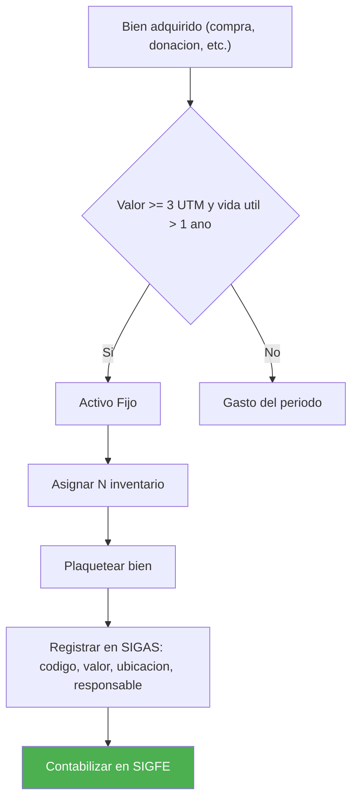
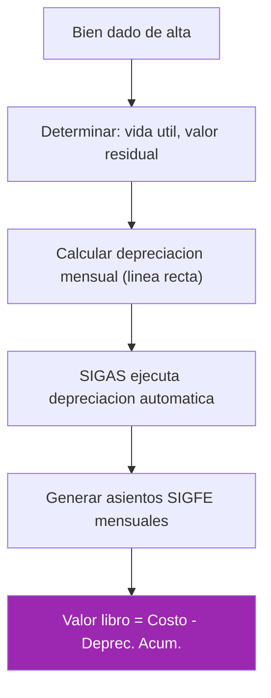
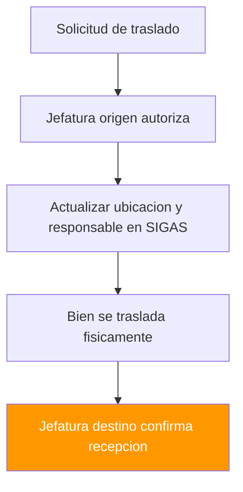

---
_manifest:
  urn: urn:gn:kb:manual-inventarios-activo-fijo-p02
  provenance:
    created_by: FS
    created_at: '2026-03-15'
    source: Manual 2.2 Inventarios/Bodegas + Manual 2.3 Activo Fijo GORE Ñuble + BPMN
      D05 Inventarios y Activo Fijo
version: 1.0.0
status: published
tags:
- inventarios
- activo-fijo
- bodegas
- gore-nuble
- patrimonio
lang: es
extensions:
  gn:
    family: guide
  kora:
    shard_index: 2
    shard_count: 3
    shard_root_urn: urn:gn:kb:manual-inventarios-activo-fijo
---

# Gestion de Inventarios y Activo Fijo — GORE Nuble - Parte 02

## Valorizacion y Cierre Contable de Existencias

### Metodos de valorizacion

El GORE debe adoptar un metodo consistente segun NICSP:

| Metodo | Descripcion | Uso |
| :--- | :--- | :--- |
| Precio Promedio Ponderado (PPP) | Costo promedio recalculado con cada ingreso | Default |
| FIFO (First In, First Out) | Primeros ingresos se asignan a primeros egresos | Alternativo |
| Costo Identificado | Para articulos de alto valor con trazabilidad individual | Especifico |
| FEFO (First Expired, First Out) | Primero en vencer, primero en salir | Perecibles |

### Recosteo

Proceso para actualizar el costo de articulos ante cambios significativos. Aplicable cuando hay diferencias relevantes entre costo registrado y costo de reposicion. Genera comprobante contable de ajuste de valor.

### Cierre mensual de bodega

1. **Corte de Movimientos:** no ingresan ni egresan productos despues del cierre.
2. **Valorizacion Final:** calculo del stock valorizado al ultimo dia del mes.
3. **Generacion de Comprobante:** asiento contable que registra el costo de lo consumido.
4. **Cuadratura:** stock valorizado debe coincidir con cuenta contable de Existencias.

### Cierre anual

Requisitos:

- Inventario fisico obligatorio.
- Ajustes de inventario procesados antes del cierre.

Resultados:

- Emision de informe anual de existencias para CGR.
- Traspaso de saldos al ejercicio siguiente.

## Reporteria de Inventarios

Reportes estandar:

- **Cartola de Articulos:** detalle de movimientos por articulo en un periodo.
- **Stock Valorizado:** existencias actuales con su valor monetario.
- **Consumos por Unidad:** analisis de uso por departamento/division.
- **Articulos sin Movimiento:** identificacion de obsolescencia.
- **Vencimientos Proximos:** listado de articulos a vencer.
- **Diferencias de Inventario:** resumen de ajustes realizados.

## Trazabilidad y Auditoria de Inventarios

- Cada movimiento registra: usuario, fecha, hora, documento de respaldo.
- Historial de eventos inalterable (log de auditoria).
- Acceso restringido por perfil (bodeguero, supervisor, auditor).
- Documentos de respaldo digitalizados y vinculados a cada transaccion.

---

## Gestion de Activo Fijo

Objetivo: administrar el patrimonio fisico institucional, asegurando el correcto registro, valorizacion, control y disposicion de los bienes conforme a NICSP.

## Marco Normativo de Activo Fijo

| Norma | Alcance |
| :--- | :--- |
| NICSP 17 | Propiedad, planta y equipo |
| NICSP 21 | Deterioro del valor de activos no generadores de efectivo |
| NICSP 31 | Activos intangibles |
| NICSP 32 | Acuerdos de concesion de servicios |
| Resoluciones CGR | Normativa sobre control patrimonial, bajas y remates |
| DL 1.263/1975 | Ley de Administracion Financiera del Estado |
| Ley 21.180 | Obligatoriedad del registro electronico del inventario |
| Ley 18.575 | Responsabilidad patrimonial |

## Clasificacion de Bienes

### Por naturaleza

- **Bienes Muebles:** mobiliario, equipos computacionales, maquinaria, vehiculos.
- **Bienes Inmuebles:** terrenos, edificios, instalaciones, infraestructura.
- **Bienes Intangibles:** software, licencias, derechos, patentes.

### Por tratamiento contable

- **Patrimoniales:** registrados en el balance (valor >= umbral de capitalizacion).
- **Inventario Administrativo:** bienes menores controlados pero no capitalizados.

### Por uso

- **En Uso:** asignados a funcionarios o unidades.
- **En Bodega:** disponibles para asignacion.
- **En Comodato:** cedidos temporalmente a terceros.
- **Dados de Baja:** fuera de servicio, pendientes de disposicion final.

## Umbral de Capitalizacion

El GORE define un umbral monetario (tipicamente 3 UTM) bajo el cual los bienes se consideran "gasto" y no se capitalizan. Bienes bajo el umbral pueden registrarse en inventario administrativo para control fisico sin impacto patrimonial.

## Alta de Bienes

### Origen de los bienes

- **Compra Directa (Subtitulo 29):** Adquisicion de Activos No Financieros (vehiculos, equipos, terrenos) con presupuesto de funcionamiento.
- **Proyectos de Inversion (Subtitulo 31):** bienes adquiridos en el marco de iniciativas de inversion propia o programas ejecutados directamente (Glosa 06/10).
- **Donaciones recibidas.**
- **Traspasos desde otras instituciones publicas.**
- **Construccion o fabricacion propia.**

### Registro preliminar (prealta)

1. Verificacion fisica del bien recibido.
2. Asignacion de tipologia y clasificacion.
3. Registro de datos: fecha de ingreso, documento tributario, valor de adquisicion.
4. Indicacion de ubicacion fisica provisional.
5. Asociacion de responsable temporal.

### Codificacion y etiquetado

| Campo | Descripcion |
| :--- | :--- |
| Codigo Unico de Bien | Identificador alfanumerico secuencial generado por el sistema |
| Etiqueta Fisica | Placa metalica o adhesivo con codigo de barras/QR |
| Informacion de Etiqueta | Codigo, descripcion abreviada, ano de alta |
| Impresion | El sistema permite imprimir etiquetas individuales o masivas |

### Datos del alta

**Datos de adquisicion:**

- Proveedor.
- Numero de factura u OC.
- Valor de compra (incluido IVA si no recuperable).
- Fecha de puesta en marcha (inicio de depreciacion).

**Datos tecnicos:**

- Marca, modelo, numero de serie.
- Color, dimensiones, caracteristicas tecnicas.
- Imagen fotografica.

**Datos de gestion:**

- Ubicacion fisica (edificio, piso, sala).
- Responsable asignado.
- Centro de costo asociado.

**Documentos adjuntos:**

- Factura, garantia, manual, poliza de seguro.

### Tipos de alta

| Tipo | Descripcion |
| :--- | :--- |
| Alta Normal | Bien nuevo adquirido por compra |
| Alta por Donacion | Requiere resolucion de aceptacion y valorizacion por perito si no hay documento de respaldo |
| Alta por Traspaso | Desde otra entidad publica, con valor libro informado |
| Alta por Revalorizacion | Bienes detectados en inventario sin registro previo (regularizacion) |
| Alta Postergada | Permite registrar el bien sin contabilizarlo inmediatamente (util para proyectos en curso) |

## Valorizacion y Depreciacion

### Valor inicial

El bien se registra a su costo de adquisicion, que incluye:

- Precio de compra.
- Impuestos no recuperables.
- Costos de transporte e instalacion.
- Costos de desmantelamiento estimados (si aplica provision).

### Depreciacion

Distribucion sistematica del valor del bien a lo largo de su vida util.

| Parametro | Descripcion |
| :--- | :--- |
| Metodo | Linea recta (mas comun en sector publico) |
| Inicio | Mes siguiente a la fecha de puesta en marcha |
| Valor Residual | Valor estimado al final de la vida util (puede ser cero) |
| Calculo Mensual | Depreciacion = (Valor Inicial - Valor Residual) / Vida Util en meses |
| Contabilizacion | Asiento mensual automatico (Gasto Depreciacion / Depreciacion Acumulada) |

**Vidas utiles estimadas:**

| Tipo de bien | Vida util |
| :--- | :--- |
| Edificios | 50-80 anos |
| Vehiculos | 7-10 anos |
| Equipos computacionales | 3-5 anos |
| Mobiliario | 10-15 anos |

### Revalorizacion

Ajuste del valor contable a valor razonable.

- **Periodicidad:** al menos cada 5 anos para bienes significativos.
- **Metodo:** tasacion por perito o indices oficiales (IPC, UF).
- **Efecto:** incremento de valor se registra en Patrimonio (Superavit por Revalorizacion).
- **Aplicacion:** principalmente para bienes inmuebles y terrenos.

### Deterioro (Impairment)

Reconocimiento de perdida de valor cuando el valor recuperable es inferior al valor libro.

- **Indicadores:** dano fisico, obsolescencia tecnologica, cambio de uso.
- **Evaluacion:** al menos anual para bienes significativos.
- **Registro:** gasto por deterioro y reduccion del valor libro.
- **Reversion:** posible si las circunstancias cambian (con limite del valor original depreciado).

## Movimientos de Bienes

### Traslado

Cambio de ubicacion fisica dentro de la institucion: entre edificios o pisos, entre centros de costo, cambio de responsable.

Procedimiento:

1. Solicitud del area origen.
2. Aceptacion del area destino.
3. Actualizacion en sistema con nuevo responsable y ubicacion.
4. Respaldar con acta de entrega-recepcion.

### Prestamo y comodato

| Tipo | Descripcion |
| :--- | :--- |
| Prestamo Interno | Cesion temporal a otra unidad del GORE |
| Comodato Externo | Cesion gratuita a terceros (municipalidades, organizaciones) |
| Comodato Recibido | Bien de tercero en custodia GORE |
| Comodato Entregado | Bien GORE en custodia de tercero |

Requisitos para comodato externo:

- Resolucion fundada.
- Contrato de comodato con plazo y obligaciones.
- Registro del bien como "En Comodato" sin baja patrimonial.
- Seguimiento de fecha de devolucion.

Ambos tipos de comodato requieren convenio y registro separado en control paralelo.

### Mantencion mayor

Erogaciones que extienden la vida util o mejoran el rendimiento del bien.

| Criterio | Condicion |
| :--- | :--- |
| Capitalizable | Si cumple criterios NICSP, se suma al valor del activo |
| Gasto | Si solo mantiene capacidades actuales, se registra como gasto del periodo |

Ejemplos capitalizables: ampliacion de edificio, overhaul de maquinaria. Registro: actualizacion del valor y recalculo de depreciacion futura.

### Descomponetizacion

Separacion de un bien en sus componentes significativos para depreciacion diferenciada. Tipico en bienes inmuebles (estructura, instalaciones, acabados). Cada componente con su propia vida util y valor. Beneficio: reflejar con mayor precision el consumo de valor de cada componente.
