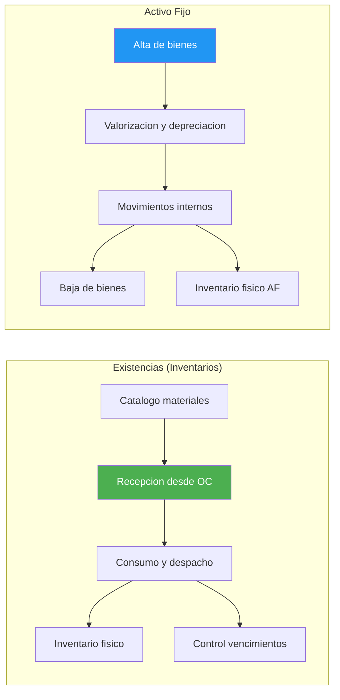
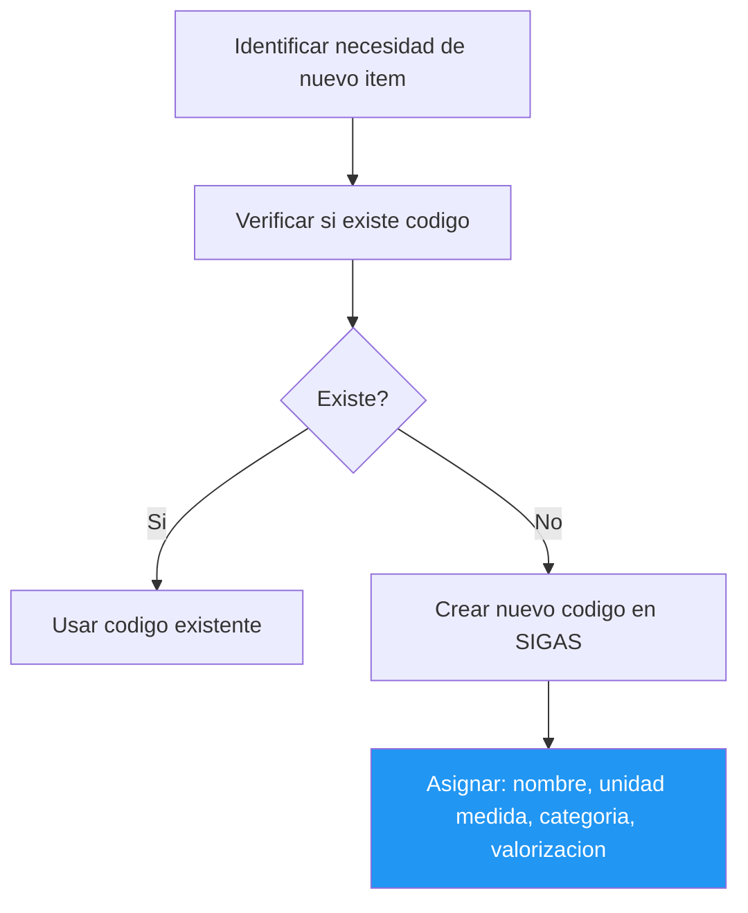
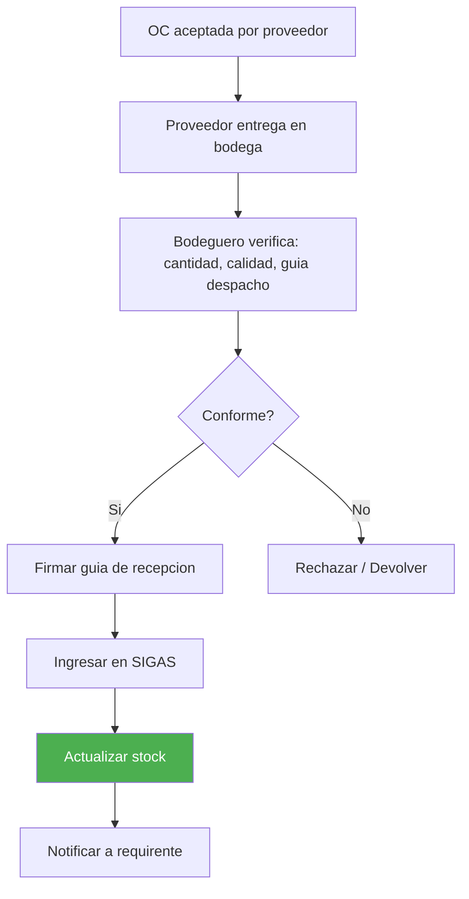
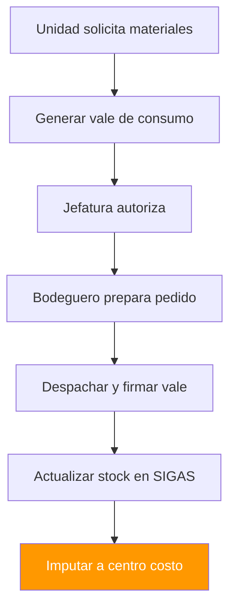
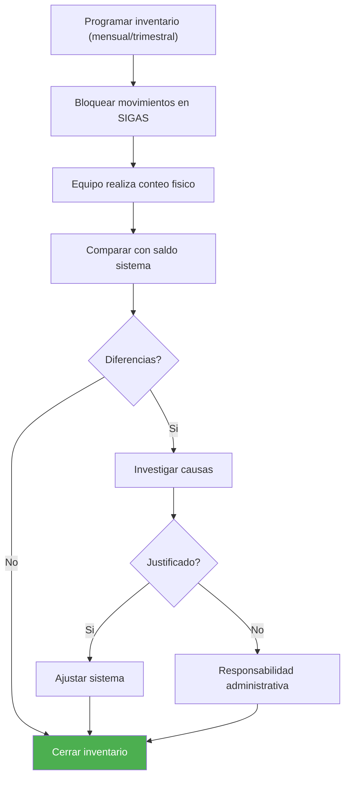
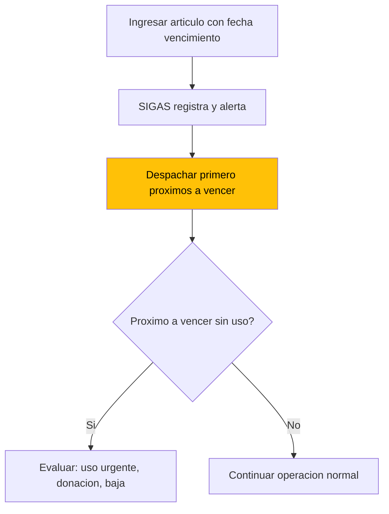

---
_manifest:
  urn: urn:gn:kb:manual-inventarios-activo-fijo
  provenance:
    created_by: FS
    created_at: '2026-03-15'
    source: Manual 2.2 Inventarios/Bodegas + Manual 2.3 Activo Fijo GORE Ñuble + BPMN
      D05 Inventarios y Activo Fijo
version: 1.0.0
status: published
tags:
- inventarios
- activo-fijo
- bodegas
- gore-nuble
- patrimonio
lang: es
extensions:
  gn:
    family: guide
  kora:
    shard_index: 1
    shard_count: 3
    shard_root_urn: urn:gn:kb:manual-inventarios-activo-fijo
---

# Gestion de Inventarios y Activo Fijo — GORE Nuble

## Vision General

Manual unificado de gestion patrimonial del GORE Nuble. Cubre dos dominios complementarios: (1) gestion de existencias consumibles en bodegas (inventarios) y (2) ciclo de vida del activo fijo (bienes capitalizables). Ambos dominios comparten normativa NICSP, operan sobre SIGAS como sistema central y se integran con SIGFE para la contabilizacion patrimonial.

Criterio de demarcacion: bienes con valor >= 3 UTM y vida util > 1 ano se capitalizan como activo fijo; bienes bajo ese umbral se registran como existencias de consumo o, si se requiere control fisico, en inventario administrativo sin impacto patrimonial.

Criticidad del dominio: Media. Dueno: DAF.

## Mapa de Procesos

Mapa general del dominio D05 que muestra los subprocesos de existencias y activo fijo.

---

## Gestion de Inventarios y Bodegas

Objetivo: controlar el flujo fisico de existencias y materiales, asegurando la disponibilidad oportuna de insumos para la operacion institucional y el correcto registro contable de los movimientos.

## Marco Normativo de Inventarios

La gestion de inventarios se rige por:

- **NICSP:** tratamiento contable de existencias y valorizacion.
- **Resoluciones CGR:** normativa sobre control patrimonial y rendicion de cuentas.
- **Reglamento Interno de Bodegas:** documento institucional que define procedimientos operativos y responsabilidades.
- **Ley 21.180 (Transformacion Digital):** obligatoriedad del registro electronico de movimientos.

## Estructura Organizacional de Bodegas

| Rol | Funcion |
| :--- | :--- |
| Jefe de Bodega Central | Responsable de la administracion general del sistema de bodegas |
| Encargados de Bodega | Funcionarios designados para cada bodega, responsables de custodia y operacion |
| Usuarios Solicitantes | Funcionarios autorizados para generar pedidos de consumo |
| Aprobadores | Jefaturas con atribucion para autorizar despachos segun monto y tipo de articulo |

## Catalogo de Bodegas Institucionales

El GORE puede operar multiples bodegas especializadas:

- **Bodega Central:** almacenamiento principal de insumos de consumo general.
- **Bodega de Economato:** materiales de oficina y papeleria.
- **Bodega de Aseo:** productos de limpieza e higiene.
- **Bodega de Mantencion:** repuestos, herramientas y materiales tecnicos.
- **Bodega de Vestuario:** uniformes y elementos de seguridad personal (EPP).
- **Bodegas Satelite:** ubicaciones descentralizadas por edificio o servicio.

## Catalogo de Articulos

### Codificacion y clasificacion

Todo articulo debe estar registrado en el Catalogo Maestro antes de cualquier movimiento.

| Campo | Descripcion |
| :--- | :--- |
| Codigo Interno | Identificador unico alfanumerico generado por el sistema |
| Codigo de Barras | EAN-13 o Code-128 para lectura automatica |
| Clasificacion Jerarquica | Familia (ej. Insumos de Oficina) > Linea (ej. Papeleria) > Grupo (ej. Cuadernos) |
| Unidad de Medida | Unidad base de control (unidad, caja, resma, litro, etc.) |
| Conversiones | Tabla de equivalencias (ej. 1 caja = 12 unidades) |

### Atributos del articulo

- **Cuenta Contable:** asociacion para generacion automatica de asientos.
- **Concepto de Gasto:** imputacion presupuestaria (Subtitulo 22 generalmente).
- **Umbral de Capitalizacion:** bienes sobre 3 UTM se registran como Activo Fijo, no como existencias.
- **Control de Lote:** para articulos que requieren trazabilidad (medicamentos, alimentos).
- **Fecha de Vencimiento:** obligatorio para articulos perecibles.
- **Imagen Referencial:** fotografia para identificacion visual.
- **Stock Minimo/Maximo:** parametros para generacion de alertas de reposicion.

### Proveedores habituales

El sistema permite asociar proveedores frecuentes a cada articulo para facilitar:

- Consulta de precios referenciales.
- Generacion de requerimientos de reposicion.
- Analisis historico de compras.

## Procesos de Ingreso

### Recepcion de productos por Orden de Compra

Flujo estandar para ingresos desde proveedores externos:

1. **Aviso de Entrega:** el proveedor coordina fecha y hora de despacho.
2. **Verificacion Inicial:** contrastar guia de despacho con Orden de Compra.
3. **Inspeccion Fisica:** contar unidades, verificar estado y calidad, controlar lotes y vencimientos (si aplica).
4. **Registro en Sistema:** ingresar cantidades recibidas, vinculando a OC.
5. **Documento Tributario:** asociar factura electronica o guia de despacho.
6. **Ubicacion:** asignar ubicacion fisica dentro de la bodega.
7. **Recepcion Conforme:** firma del Encargado de Bodega que habilita el devengo.

Clasificacion posterior: existencias (consumibles) van a Bodega segun este manual; activos fijos (capitalizables) van al proceso de alta (ver seccion Gestion de Activo Fijo).

### Recepcion con capturador de datos

- Lectura de codigos de barras del proveedor o etiquetas institucionales.
- Validacion automatica contra OC (cantidad, articulo, precio).
- Generacion de alertas por discrepancias.
- Actualizacion inmediata de stock.

### Otros tipos de ingreso

| Tipo | Descripcion |
| :--- | :--- |
| Devolucion de Prestamo | Articulos retornados por otras bodegas o unidades |
| Prestamo Recibido | Articulos temporales de otra institucion o bodega |
| Donacion | Bienes recibidos sin costo (requiere resolucion de aceptacion) |
| Canje | Intercambio de articulos con proveedores |
| Ajuste por Inventario | Regularizacion de diferencias positivas detectadas |
| Devolucion de Consumo | Articulos retornados por usuarios por no uso |

## Procesos de Egreso

### Solicitud de consumo

Mecanismo formal para retirar articulos de bodega:

1. **Generacion:** usuario solicitante crea pedido en sistema indicando articulos y cantidades.
2. **Justificacion:** campo obligatorio que describe el uso previsto.
3. **Validacion:** el sistema verifica stock disponible antes de enviar a aprobacion.
4. **Flujo de Aprobacion:** segun monto o tipo de articulo, puede requerir V°B° de jefatura.

### Despacho de productos

1. **Preparacion (Picking):** el bodeguero reune los articulos del pedido.
2. **Verificacion:** contrastar fisico con digital antes de entregar.
3. **Documento de Despacho:** guia interna firmada por el receptor.
4. **Descuento de Stock:** actualizacion automatica al confirmar entrega.
5. **Valorizacion:** el sistema aplica metodo de costeo (Precio Promedio Ponderado o FIFO).

### Despacho con capturador de datos

- Lectura de codigos de barras al momento de armar el pedido.
- Validacion automatica de articulos y cantidades.
- Generacion de documento de despacho electronico.
- Firma digital del receptor (si el dispositivo lo permite).

### Otros tipos de egreso

| Tipo | Descripcion |
| :--- | :--- |
| Prestamo Otorgado | Entrega temporal a otra unidad o institucion (con compromiso de devolucion) |
| Merma | Perdida por deterioro, vencimiento o rotura (requiere acta de baja) |
| Donacion | Entrega gratuita a terceros (requiere resolucion) |
| Devolucion a Proveedor | Retorno por no conformidad o cambio |
| Venta | Enajenacion de excedentes (poco frecuente, requiere autorizacion especial) |

## Control de Inventarios

### Toma de inventario fisico

Proceso obligatorio de verificacion periodica.

**Frecuencia:**

- **Inventario General:** al menos una vez al ano (obligatorio al 31/12).
- **Inventarios Parciales:** por familia, ubicacion o articulos criticos (mensual o trimestral).

**Procedimiento:**

1. **Planificacion:** definir alcance, fechas, equipos de conteo y corte de operaciones.
2. **Ejecucion:** conteo ciego (sin ver saldos teoricos); segundo conteo para discrepancias; registro en planillas o capturador de datos.
3. **Conciliacion:** comparar conteo fisico vs. saldo en sistema.
4. **Ajustes:** generar movimientos de ajuste por diferencias (positivas o negativas).

### Ajuste de inventario

| Tipo | Descripcion |
| :--- | :--- |
| Ajuste Positivo (Sobrante) | Cuando el fisico excede al teorico |
| Ajuste Negativo (Faltante) | Cuando el teorico excede al fisico |

- **Documentacion:** acta de inventario firmada por comision, con explicacion de causas.
- **Responsabilidad:** faltantes injustificados pueden derivar en sumario administrativo.
- **Contabilizacion:** generacion automatica de asiento contable por ajuste.

### Control de vencimientos (FEFO)

- El sistema emite alertas automaticas con 90/60/30 dias de anticipacion.
- Prioridad de despacho: FEFO (First Expired, First Out).
- Articulos vencidos: retiro inmediato, acta de baja, destruccion certificada si corresponde.

### Stock critico y reposicion

- **Punto de Reorden:** nivel de stock que dispara la necesidad de reposicion.
- **Stock de Seguridad:** margen para cubrir variaciones de demanda o atrasos de proveedor.
- **Alerta Automatica:** el sistema notifica a Abastecimiento cuando se alcanza el punto de reorden.
- **Analisis de Consumo:** reportes historicos para ajustar parametros de stock.
