---
_manifest:
  urn: "urn:gn:kb:manual-inventarios-activo-fijo"
  provenance:
    created_by: "FS"
    created_at: "2026-03-15"
    source: "Manual 2.2 Inventarios/Bodegas + Manual 2.3 Activo Fijo GORE Ñuble + BPMN D05 Inventarios y Activo Fijo"
version: "1.0.0"
status: published
tags: [inventarios, activo-fijo, bodegas, gore-nuble, patrimonio]
lang: es
extensions:
  gn:
    family: guide
---

# Gestion de Inventarios y Activo Fijo — GORE Nuble

## Vision General

Manual unificado de gestion patrimonial del GORE Nuble. Cubre dos dominios complementarios: (1) gestion de existencias consumibles en bodegas (inventarios) y (2) ciclo de vida del activo fijo (bienes capitalizables). Ambos dominios comparten normativa NICSP, operan sobre SIGAS como sistema central y se integran con SIGFE para la contabilizacion patrimonial.

Criterio de demarcacion: bienes con valor >= 3 UTM y vida util > 1 ano se capitalizan como activo fijo; bienes bajo ese umbral se registran como existencias de consumo o, si se requiere control fisico, en inventario administrativo sin impacto patrimonial.

Criticidad del dominio: Media. Dueno: DAF.

## Mapa de Procesos

Mapa general del dominio D05 que muestra los subprocesos de existencias y activo fijo.

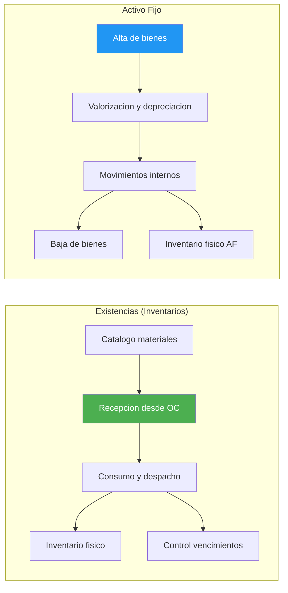

---

## Gestion de Inventarios y Bodegas

Objetivo: controlar el flujo fisico de existencias y materiales, asegurando la disponibilidad oportuna de insumos para la operacion institucional y el correcto registro contable de los movimientos.

### Marco Normativo de Inventarios

La gestion de inventarios se rige por:

- **NICSP:** tratamiento contable de existencias y valorizacion.
- **Resoluciones CGR:** normativa sobre control patrimonial y rendicion de cuentas.
- **Reglamento Interno de Bodegas:** documento institucional que define procedimientos operativos y responsabilidades.
- **Ley 21.180 (Transformacion Digital):** obligatoriedad del registro electronico de movimientos.

### Estructura Organizacional de Bodegas

| Rol | Funcion |
| :--- | :--- |
| Jefe de Bodega Central | Responsable de la administracion general del sistema de bodegas |
| Encargados de Bodega | Funcionarios designados para cada bodega, responsables de custodia y operacion |
| Usuarios Solicitantes | Funcionarios autorizados para generar pedidos de consumo |
| Aprobadores | Jefaturas con atribucion para autorizar despachos segun monto y tipo de articulo |

### Catalogo de Bodegas Institucionales

El GORE puede operar multiples bodegas especializadas:

- **Bodega Central:** almacenamiento principal de insumos de consumo general.
- **Bodega de Economato:** materiales de oficina y papeleria.
- **Bodega de Aseo:** productos de limpieza e higiene.
- **Bodega de Mantencion:** repuestos, herramientas y materiales tecnicos.
- **Bodega de Vestuario:** uniformes y elementos de seguridad personal (EPP).
- **Bodegas Satelite:** ubicaciones descentralizadas por edificio o servicio.

### Catalogo de Articulos

#### Codificacion y clasificacion

Todo articulo debe estar registrado en el Catalogo Maestro antes de cualquier movimiento.

| Campo | Descripcion |
| :--- | :--- |
| Codigo Interno | Identificador unico alfanumerico generado por el sistema |
| Codigo de Barras | EAN-13 o Code-128 para lectura automatica |
| Clasificacion Jerarquica | Familia (ej. Insumos de Oficina) > Linea (ej. Papeleria) > Grupo (ej. Cuadernos) |
| Unidad de Medida | Unidad base de control (unidad, caja, resma, litro, etc.) |
| Conversiones | Tabla de equivalencias (ej. 1 caja = 12 unidades) |

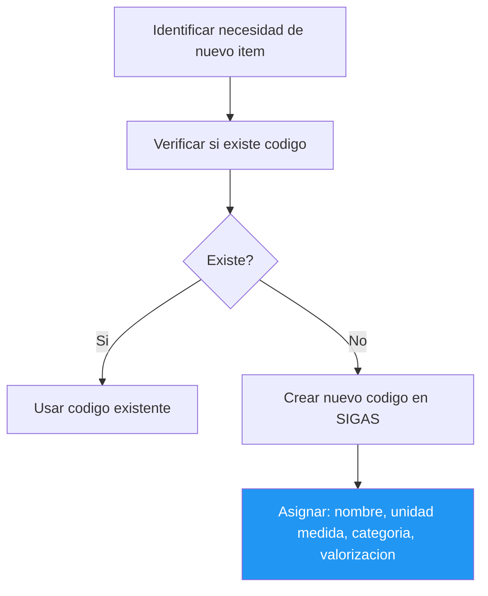

#### Atributos del articulo

- **Cuenta Contable:** asociacion para generacion automatica de asientos.
- **Concepto de Gasto:** imputacion presupuestaria (Subtitulo 22 generalmente).
- **Umbral de Capitalizacion:** bienes sobre 3 UTM se registran como Activo Fijo, no como existencias.
- **Control de Lote:** para articulos que requieren trazabilidad (medicamentos, alimentos).
- **Fecha de Vencimiento:** obligatorio para articulos perecibles.
- **Imagen Referencial:** fotografia para identificacion visual.
- **Stock Minimo/Maximo:** parametros para generacion de alertas de reposicion.

#### Proveedores habituales

El sistema permite asociar proveedores frecuentes a cada articulo para facilitar:

- Consulta de precios referenciales.
- Generacion de requerimientos de reposicion.
- Analisis historico de compras.

### Procesos de Ingreso

#### Recepcion de productos por Orden de Compra

Flujo estandar para ingresos desde proveedores externos:

1. **Aviso de Entrega:** el proveedor coordina fecha y hora de despacho.
2. **Verificacion Inicial:** contrastar guia de despacho con Orden de Compra.
3. **Inspeccion Fisica:** contar unidades, verificar estado y calidad, controlar lotes y vencimientos (si aplica).
4. **Registro en Sistema:** ingresar cantidades recibidas, vinculando a OC.
5. **Documento Tributario:** asociar factura electronica o guia de despacho.
6. **Ubicacion:** asignar ubicacion fisica dentro de la bodega.
7. **Recepcion Conforme:** firma del Encargado de Bodega que habilita el devengo.

Clasificacion posterior: existencias (consumibles) van a Bodega segun este manual; activos fijos (capitalizables) van al proceso de alta (ver seccion Gestion de Activo Fijo).

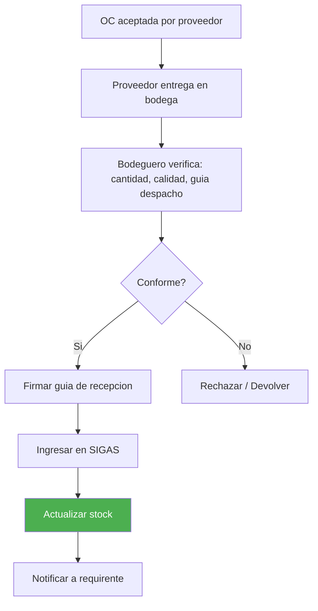

#### Recepcion con capturador de datos

- Lectura de codigos de barras del proveedor o etiquetas institucionales.
- Validacion automatica contra OC (cantidad, articulo, precio).
- Generacion de alertas por discrepancias.
- Actualizacion inmediata de stock.

#### Otros tipos de ingreso

| Tipo | Descripcion |
| :--- | :--- |
| Devolucion de Prestamo | Articulos retornados por otras bodegas o unidades |
| Prestamo Recibido | Articulos temporales de otra institucion o bodega |
| Donacion | Bienes recibidos sin costo (requiere resolucion de aceptacion) |
| Canje | Intercambio de articulos con proveedores |
| Ajuste por Inventario | Regularizacion de diferencias positivas detectadas |
| Devolucion de Consumo | Articulos retornados por usuarios por no uso |

### Procesos de Egreso

#### Solicitud de consumo

Mecanismo formal para retirar articulos de bodega:

1. **Generacion:** usuario solicitante crea pedido en sistema indicando articulos y cantidades.
2. **Justificacion:** campo obligatorio que describe el uso previsto.
3. **Validacion:** el sistema verifica stock disponible antes de enviar a aprobacion.
4. **Flujo de Aprobacion:** segun monto o tipo de articulo, puede requerir V°B° de jefatura.

#### Despacho de productos

1. **Preparacion (Picking):** el bodeguero reune los articulos del pedido.
2. **Verificacion:** contrastar fisico con digital antes de entregar.
3. **Documento de Despacho:** guia interna firmada por el receptor.
4. **Descuento de Stock:** actualizacion automatica al confirmar entrega.
5. **Valorizacion:** el sistema aplica metodo de costeo (Precio Promedio Ponderado o FIFO).

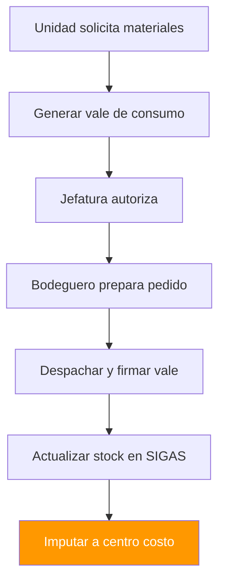

#### Despacho con capturador de datos

- Lectura de codigos de barras al momento de armar el pedido.
- Validacion automatica de articulos y cantidades.
- Generacion de documento de despacho electronico.
- Firma digital del receptor (si el dispositivo lo permite).

#### Otros tipos de egreso

| Tipo | Descripcion |
| :--- | :--- |
| Prestamo Otorgado | Entrega temporal a otra unidad o institucion (con compromiso de devolucion) |
| Merma | Perdida por deterioro, vencimiento o rotura (requiere acta de baja) |
| Donacion | Entrega gratuita a terceros (requiere resolucion) |
| Devolucion a Proveedor | Retorno por no conformidad o cambio |
| Venta | Enajenacion de excedentes (poco frecuente, requiere autorizacion especial) |

### Control de Inventarios

#### Toma de inventario fisico

Proceso obligatorio de verificacion periodica.

**Frecuencia:**

- **Inventario General:** al menos una vez al ano (obligatorio al 31/12).
- **Inventarios Parciales:** por familia, ubicacion o articulos criticos (mensual o trimestral).

**Procedimiento:**

1. **Planificacion:** definir alcance, fechas, equipos de conteo y corte de operaciones.
2. **Ejecucion:** conteo ciego (sin ver saldos teoricos); segundo conteo para discrepancias; registro en planillas o capturador de datos.
3. **Conciliacion:** comparar conteo fisico vs. saldo en sistema.
4. **Ajustes:** generar movimientos de ajuste por diferencias (positivas o negativas).

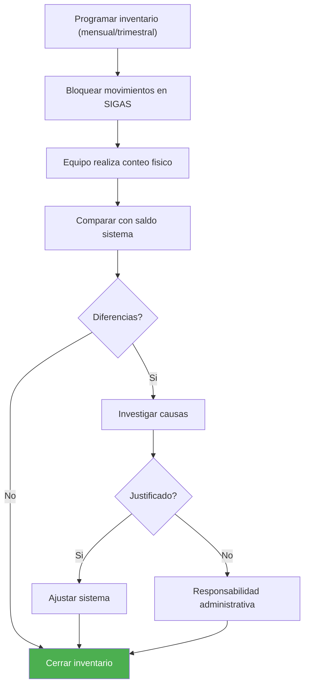

#### Ajuste de inventario

| Tipo | Descripcion |
| :--- | :--- |
| Ajuste Positivo (Sobrante) | Cuando el fisico excede al teorico |
| Ajuste Negativo (Faltante) | Cuando el teorico excede al fisico |

- **Documentacion:** acta de inventario firmada por comision, con explicacion de causas.
- **Responsabilidad:** faltantes injustificados pueden derivar en sumario administrativo.
- **Contabilizacion:** generacion automatica de asiento contable por ajuste.

#### Control de vencimientos (FEFO)

- El sistema emite alertas automaticas con 90/60/30 dias de anticipacion.
- Prioridad de despacho: FEFO (First Expired, First Out).
- Articulos vencidos: retiro inmediato, acta de baja, destruccion certificada si corresponde.

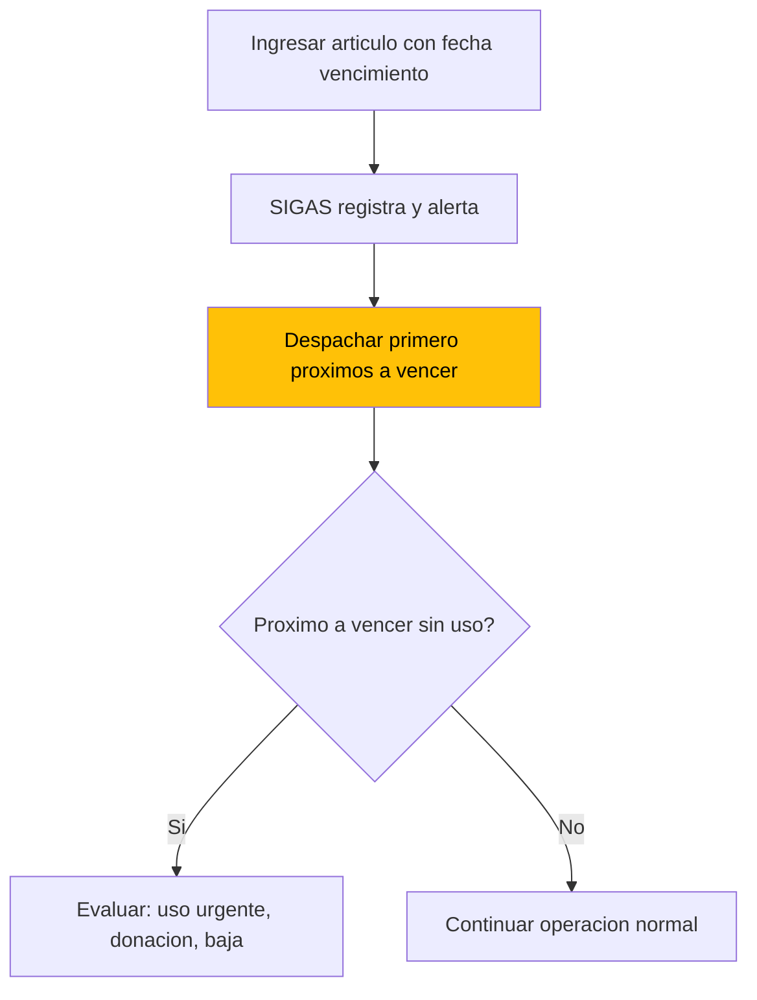

#### Stock critico y reposicion

- **Punto de Reorden:** nivel de stock que dispara la necesidad de reposicion.
- **Stock de Seguridad:** margen para cubrir variaciones de demanda o atrasos de proveedor.
- **Alerta Automatica:** el sistema notifica a Abastecimiento cuando se alcanza el punto de reorden.
- **Analisis de Consumo:** reportes historicos para ajustar parametros de stock.

### Valorizacion y Cierre Contable de Existencias

#### Metodos de valorizacion

El GORE debe adoptar un metodo consistente segun NICSP:

| Metodo | Descripcion | Uso |
| :--- | :--- | :--- |
| Precio Promedio Ponderado (PPP) | Costo promedio recalculado con cada ingreso | Default |
| FIFO (First In, First Out) | Primeros ingresos se asignan a primeros egresos | Alternativo |
| Costo Identificado | Para articulos de alto valor con trazabilidad individual | Especifico |
| FEFO (First Expired, First Out) | Primero en vencer, primero en salir | Perecibles |

#### Recosteo

Proceso para actualizar el costo de articulos ante cambios significativos. Aplicable cuando hay diferencias relevantes entre costo registrado y costo de reposicion. Genera comprobante contable de ajuste de valor.

#### Cierre mensual de bodega

1. **Corte de Movimientos:** no ingresan ni egresan productos despues del cierre.
2. **Valorizacion Final:** calculo del stock valorizado al ultimo dia del mes.
3. **Generacion de Comprobante:** asiento contable que registra el costo de lo consumido.
4. **Cuadratura:** stock valorizado debe coincidir con cuenta contable de Existencias.

#### Cierre anual

Requisitos:

- Inventario fisico obligatorio.
- Ajustes de inventario procesados antes del cierre.

Resultados:

- Emision de informe anual de existencias para CGR.
- Traspaso de saldos al ejercicio siguiente.

### Reporteria de Inventarios

Reportes estandar:

- **Cartola de Articulos:** detalle de movimientos por articulo en un periodo.
- **Stock Valorizado:** existencias actuales con su valor monetario.
- **Consumos por Unidad:** analisis de uso por departamento/division.
- **Articulos sin Movimiento:** identificacion de obsolescencia.
- **Vencimientos Proximos:** listado de articulos a vencer.
- **Diferencias de Inventario:** resumen de ajustes realizados.

### Trazabilidad y Auditoria de Inventarios

- Cada movimiento registra: usuario, fecha, hora, documento de respaldo.
- Historial de eventos inalterable (log de auditoria).
- Acceso restringido por perfil (bodeguero, supervisor, auditor).
- Documentos de respaldo digitalizados y vinculados a cada transaccion.

---

## Gestion de Activo Fijo

Objetivo: administrar el patrimonio fisico institucional, asegurando el correcto registro, valorizacion, control y disposicion de los bienes conforme a NICSP.

### Marco Normativo de Activo Fijo

| Norma | Alcance |
| :--- | :--- |
| NICSP 17 | Propiedad, planta y equipo |
| NICSP 21 | Deterioro del valor de activos no generadores de efectivo |
| NICSP 31 | Activos intangibles |
| NICSP 32 | Acuerdos de concesion de servicios |
| Resoluciones CGR | Normativa sobre control patrimonial, bajas y remates |
| DL 1.263/1975 | Ley de Administracion Financiera del Estado |
| Ley 21.180 | Obligatoriedad del registro electronico del inventario |
| Ley 18.575 | Responsabilidad patrimonial |

### Clasificacion de Bienes

#### Por naturaleza

- **Bienes Muebles:** mobiliario, equipos computacionales, maquinaria, vehiculos.
- **Bienes Inmuebles:** terrenos, edificios, instalaciones, infraestructura.
- **Bienes Intangibles:** software, licencias, derechos, patentes.

#### Por tratamiento contable

- **Patrimoniales:** registrados en el balance (valor >= umbral de capitalizacion).
- **Inventario Administrativo:** bienes menores controlados pero no capitalizados.

#### Por uso

- **En Uso:** asignados a funcionarios o unidades.
- **En Bodega:** disponibles para asignacion.
- **En Comodato:** cedidos temporalmente a terceros.
- **Dados de Baja:** fuera de servicio, pendientes de disposicion final.

### Umbral de Capitalizacion

El GORE define un umbral monetario (tipicamente 3 UTM) bajo el cual los bienes se consideran "gasto" y no se capitalizan. Bienes bajo el umbral pueden registrarse en inventario administrativo para control fisico sin impacto patrimonial.

### Alta de Bienes

#### Origen de los bienes

- **Compra Directa (Subtitulo 29):** Adquisicion de Activos No Financieros (vehiculos, equipos, terrenos) con presupuesto de funcionamiento.
- **Proyectos de Inversion (Subtitulo 31):** bienes adquiridos en el marco de iniciativas de inversion propia o programas ejecutados directamente (Glosa 06/10).
- **Donaciones recibidas.**
- **Traspasos desde otras instituciones publicas.**
- **Construccion o fabricacion propia.**

#### Registro preliminar (prealta)

1. Verificacion fisica del bien recibido.
2. Asignacion de tipologia y clasificacion.
3. Registro de datos: fecha de ingreso, documento tributario, valor de adquisicion.
4. Indicacion de ubicacion fisica provisional.
5. Asociacion de responsable temporal.

#### Codificacion y etiquetado

| Campo | Descripcion |
| :--- | :--- |
| Codigo Unico de Bien | Identificador alfanumerico secuencial generado por el sistema |
| Etiqueta Fisica | Placa metalica o adhesivo con codigo de barras/QR |
| Informacion de Etiqueta | Codigo, descripcion abreviada, ano de alta |
| Impresion | El sistema permite imprimir etiquetas individuales o masivas |

#### Datos del alta

**Datos de adquisicion:**

- Proveedor.
- Numero de factura u OC.
- Valor de compra (incluido IVA si no recuperable).
- Fecha de puesta en marcha (inicio de depreciacion).

**Datos tecnicos:**

- Marca, modelo, numero de serie.
- Color, dimensiones, caracteristicas tecnicas.
- Imagen fotografica.

**Datos de gestion:**

- Ubicacion fisica (edificio, piso, sala).
- Responsable asignado.
- Centro de costo asociado.

**Documentos adjuntos:**

- Factura, garantia, manual, poliza de seguro.

#### Tipos de alta

| Tipo | Descripcion |
| :--- | :--- |
| Alta Normal | Bien nuevo adquirido por compra |
| Alta por Donacion | Requiere resolucion de aceptacion y valorizacion por perito si no hay documento de respaldo |
| Alta por Traspaso | Desde otra entidad publica, con valor libro informado |
| Alta por Revalorizacion | Bienes detectados en inventario sin registro previo (regularizacion) |
| Alta Postergada | Permite registrar el bien sin contabilizarlo inmediatamente (util para proyectos en curso) |

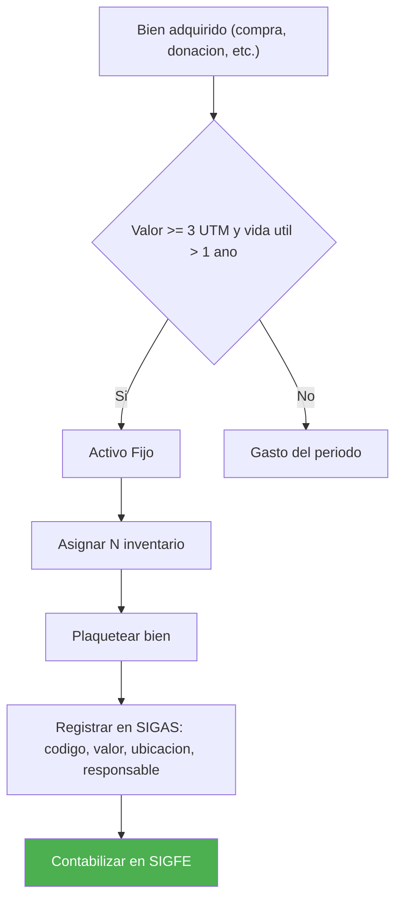

### Valorizacion y Depreciacion

#### Valor inicial

El bien se registra a su costo de adquisicion, que incluye:

- Precio de compra.
- Impuestos no recuperables.
- Costos de transporte e instalacion.
- Costos de desmantelamiento estimados (si aplica provision).

#### Depreciacion

Distribucion sistematica del valor del bien a lo largo de su vida util.

| Parametro | Descripcion |
| :--- | :--- |
| Metodo | Linea recta (mas comun en sector publico) |
| Inicio | Mes siguiente a la fecha de puesta en marcha |
| Valor Residual | Valor estimado al final de la vida util (puede ser cero) |
| Calculo Mensual | Depreciacion = (Valor Inicial - Valor Residual) / Vida Util en meses |
| Contabilizacion | Asiento mensual automatico (Gasto Depreciacion / Depreciacion Acumulada) |

**Vidas utiles estimadas:**

| Tipo de bien | Vida util |
| :--- | :--- |
| Edificios | 50-80 anos |
| Vehiculos | 7-10 anos |
| Equipos computacionales | 3-5 anos |
| Mobiliario | 10-15 anos |

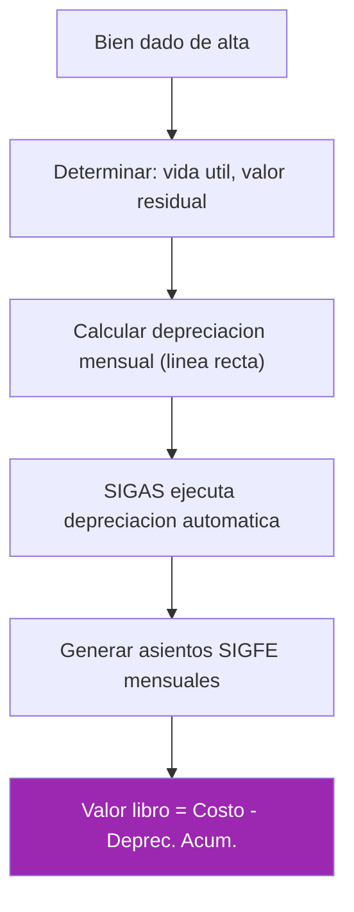

#### Revalorizacion

Ajuste del valor contable a valor razonable.

- **Periodicidad:** al menos cada 5 anos para bienes significativos.
- **Metodo:** tasacion por perito o indices oficiales (IPC, UF).
- **Efecto:** incremento de valor se registra en Patrimonio (Superavit por Revalorizacion).
- **Aplicacion:** principalmente para bienes inmuebles y terrenos.

#### Deterioro (Impairment)

Reconocimiento de perdida de valor cuando el valor recuperable es inferior al valor libro.

- **Indicadores:** dano fisico, obsolescencia tecnologica, cambio de uso.
- **Evaluacion:** al menos anual para bienes significativos.
- **Registro:** gasto por deterioro y reduccion del valor libro.
- **Reversion:** posible si las circunstancias cambian (con limite del valor original depreciado).

### Movimientos de Bienes

#### Traslado

Cambio de ubicacion fisica dentro de la institucion: entre edificios o pisos, entre centros de costo, cambio de responsable.

Procedimiento:

1. Solicitud del area origen.
2. Aceptacion del area destino.
3. Actualizacion en sistema con nuevo responsable y ubicacion.
4. Respaldar con acta de entrega-recepcion.

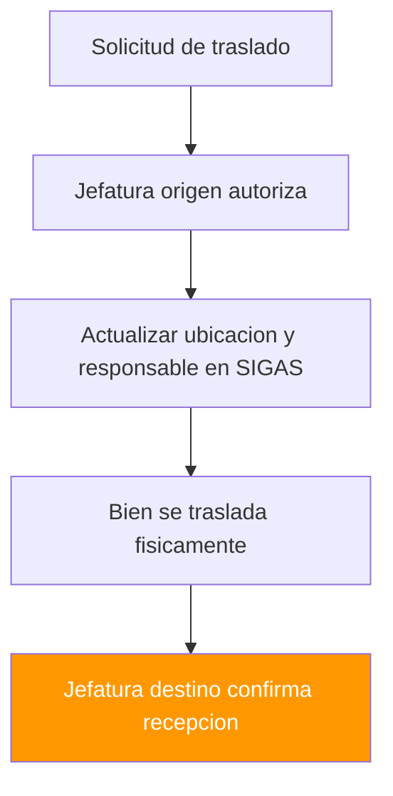

#### Prestamo y comodato

| Tipo | Descripcion |
| :--- | :--- |
| Prestamo Interno | Cesion temporal a otra unidad del GORE |
| Comodato Externo | Cesion gratuita a terceros (municipalidades, organizaciones) |
| Comodato Recibido | Bien de tercero en custodia GORE |
| Comodato Entregado | Bien GORE en custodia de tercero |

Requisitos para comodato externo:

- Resolucion fundada.
- Contrato de comodato con plazo y obligaciones.
- Registro del bien como "En Comodato" sin baja patrimonial.
- Seguimiento de fecha de devolucion.

Ambos tipos de comodato requieren convenio y registro separado en control paralelo.

#### Mantencion mayor

Erogaciones que extienden la vida util o mejoran el rendimiento del bien.

| Criterio | Condicion |
| :--- | :--- |
| Capitalizable | Si cumple criterios NICSP, se suma al valor del activo |
| Gasto | Si solo mantiene capacidades actuales, se registra como gasto del periodo |

Ejemplos capitalizables: ampliacion de edificio, overhaul de maquinaria. Registro: actualizacion del valor y recalculo de depreciacion futura.

#### Descomponetizacion

Separacion de un bien en sus componentes significativos para depreciacion diferenciada. Tipico en bienes inmuebles (estructura, instalaciones, acabados). Cada componente con su propia vida util y valor. Beneficio: reflejar con mayor precision el consumo de valor de cada componente.

### Baja de Bienes

#### Causales de baja

- **Obsolescencia:** tecnologica o funcional.
- **Deterioro Irreparable:** dano que hace inviable la reparacion.
- **Siniestro:** robo, incendio, catastrofe.
- **Termino de Vida Util:** bien completamente depreciado y sin utilidad.
- **Venta o Remate:** enajenacion mediante proceso publico.
- **Donacion:** cesion gratuita a otra entidad.
- **Canje:** intercambio con proveedor.

#### Procedimiento de baja

1. **Informe Tecnico:** el area usuaria o mantencion certifica el estado del bien.
2. **Resolucion de Baja:** acto administrativo firmado por autoridad competente.
3. **Registro en Sistema:** cambio de estado a "Dado de Baja", fecha y causal.
4. **Contabilizacion:** reverso del valor libro (Activo y Depreciacion Acumulada) y reconocimiento de perdida/utilidad si aplica.
5. **Disposicion Final:** destruccion certificada, entrega a beneficiario (donacion), o venta/remate.

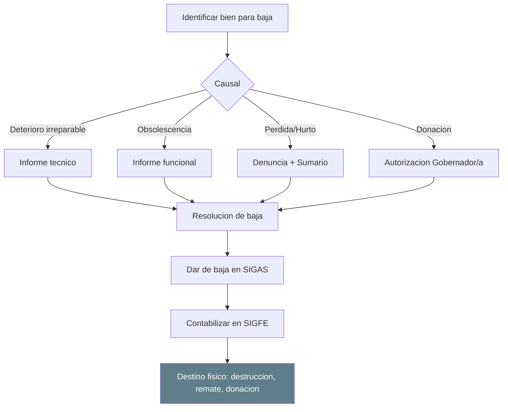

#### Remate de bienes

- **Normativa:** segun instrucciones CGR y reglamento interno.
- **Publicidad:** aviso publico con descripcion, valor base y fecha de remate.
- **Modalidad:** presencial o electronica.
- **Adjudicacion:** al mejor postor sobre valor base.
- **Registro:** baja del bien e ingreso contable por venta.

#### Donacion de bienes

Requiere resolucion fundada del Gobernador Regional. Beneficiarios tipicos: municipalidades, organizaciones sin fines de lucro, otras entidades publicas. El bien se da de baja sin generar ingreso.

### Control e Inventario de Activo Fijo

#### Toma de inventario fisico

Verificacion periodica obligatoria. Frecuencia: al menos anual (obligatorio al 31/12). Alcance: totalidad de bienes o por ubicacion/responsable.

Metodo:

- Lectura de codigos de barras/QR con capturador.
- Verificacion visual del estado.
- Registro de ubicacion real.
- Actualizacion de fotografia (opcional).
- Conciliacion: comparar inventario fisico vs. registro en sistema.

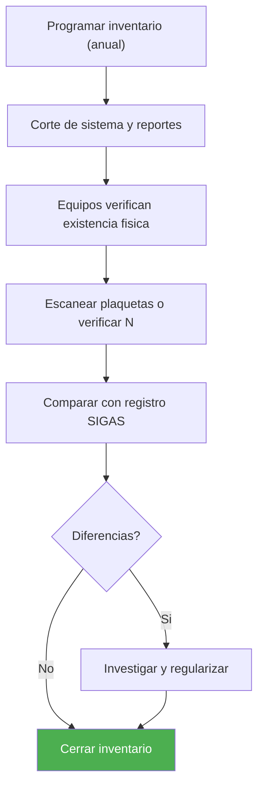

#### Tratamiento de diferencias

- **Sobrante:** bien fisico sin registro. Investigar origen y regularizar con alta por revalorizacion.
- **Faltante:** registro sin respaldo fisico. Investigacion administrativa; si hay responsabilidad: sumario y reintegro; si no hay responsabilidad demostrable: baja por perdida.

#### Asignacion de responsables

- Cada bien debe tener un funcionario responsable de su custodia.
- El cambio de responsable se formaliza con acta de entrega-recepcion.
- El responsable tiene obligacion de informar danos, perdidas o traslados.
- La desvinculacion de un funcionario obliga a reasignar sus bienes.

### Cierre y Reporteria de Activo Fijo

#### Cierre mensual

- Ejecucion de depreciacion del periodo.
- Generacion de comprobante contable (Depreciacion/Deterioro).
- Cuadratura entre modulo de Activo Fijo y Contabilidad Patrimonial.

#### Cierre anual

- Inventario fisico obligatorio.
- Ajustes de deterioro si corresponde.
- Informe de Activos Fijos para CGR y memorias institucionales.
- Traspaso de saldos al ejercicio siguiente.

#### Reportes estandar

- **Inventario Valorizado:** listado de bienes con valor libro actual.
- **Bienes por Responsable:** asignacion por funcionario.
- **Bienes por Ubicacion:** distribucion geografica/fisica.
- **Cuadro de Depreciacion:** valores iniciales, depreciacion acumulada, valor libro.
- **Bienes Totalmente Depreciados:** para evaluacion de baja o continuidad de uso.
- **Movimientos del Periodo:** altas, bajas, traslados, revalorizaciones.

### Casos Especiales

#### Bienes inmuebles

- Registro detallado: Rol de avaluo, superficie, inscripcion CBR.
- Avaluo fiscal actualizado anualmente.
- Seguros y polizas asociadas.
- Control de concesiones o arriendos si aplica.

#### Vehiculos

- Datos especificos: patente, ano, kilometraje, revision tecnica.
- Integracion con modulo de Flota.
- Seguros obligatorios (SOAP) y voluntarios.
- Control de mantenciones y combustible.

#### Equipamiento TIC

- Registro de licencias asociadas.
- Control de garantias y soporte tecnico.
- Vida util acelerada (3-5 anos).
- Procedimiento de sanitizacion de datos antes de baja.

#### Concesiones

Bienes recibidos o entregados en concesion con tratamiento NICSP especifico (NICSP 32).

Fases: construccion, explotacion, devolucion. Registro segun modelo NICSP 32 (Acuerdos de Concesion de Servicios). Control: seguimiento de obligaciones del concesionario.

#### Bienes de Proyectos FNDR

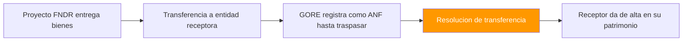

---

## Normativa Aplicable

| Norma | Alcance |
| :--- | :--- |
| NICSP 17 | Propiedad, planta y equipo |
| NICSP 21 | Deterioro del valor de activos no generadores de efectivo |
| NICSP 31 | Activos intangibles |
| NICSP 32 | Acuerdos de concesion de servicios |
| Resoluciones CGR | Control patrimonial, rendicion de cuentas, procedimientos de baja |
| DL 1.263/1975 | Administracion Financiera del Estado |
| Ley 18.575 | Responsabilidad patrimonial |
| Ley 21.180 | Transformacion Digital — registro electronico obligatorio |
| Reglamento Interno de Bodegas | Procedimientos operativos y responsabilidades de bodega |

---

## Sistemas de Informacion

| Sistema | Funcion |
| :--- | :--- |
| SIGAS | Gestion de inventarios y activo fijo (catalogo, movimientos, depreciacion, inventario fisico) |
| SIGFE | Contabilizacion patrimonial (asientos, cierre, reportes CGR) |
| SIGFIN | Integracion financiera |
