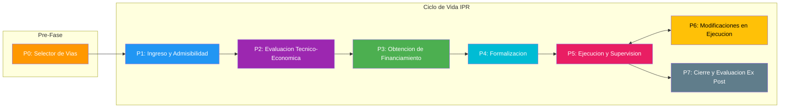
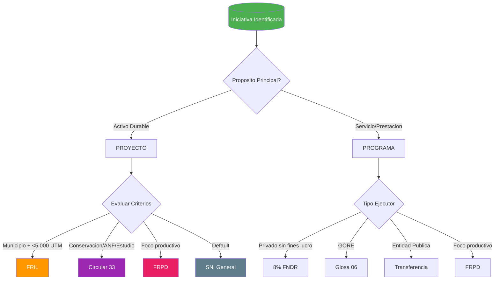
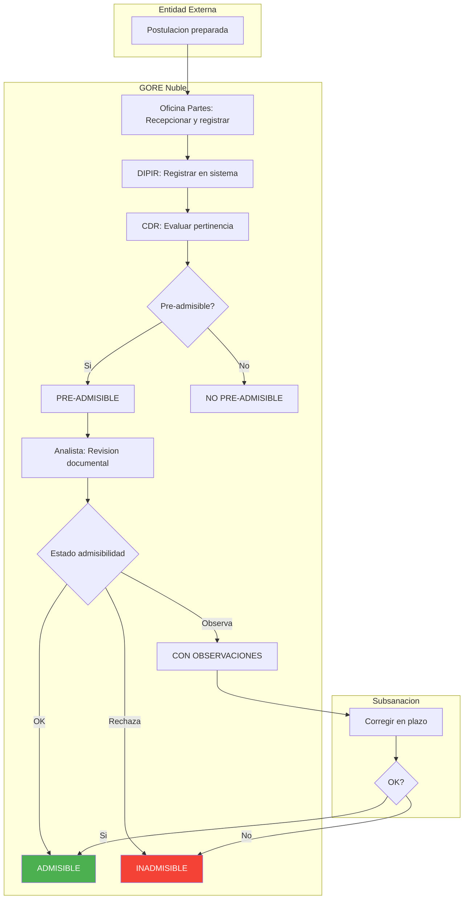
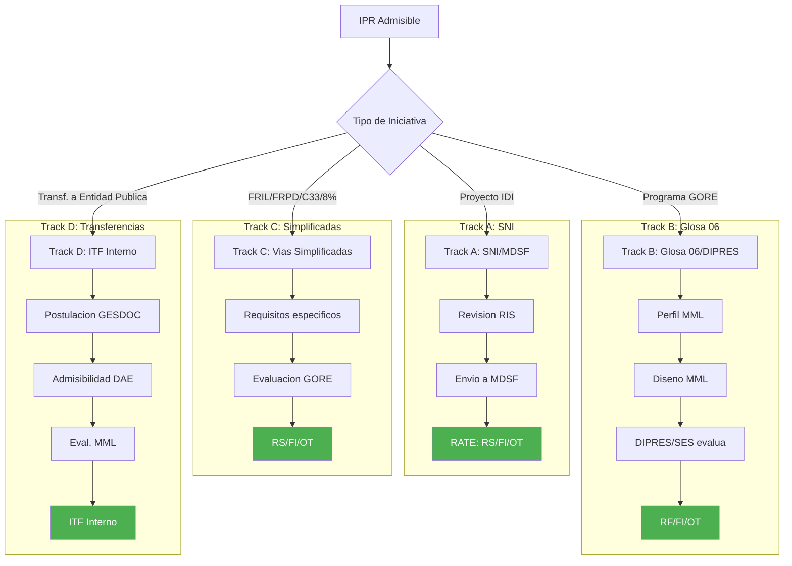

---
_manifest:
  urn: urn:gn:kb:gestion-ipr
  provenance:
    created_by: FS
    created_at: '2026-03-15'
    source: kb_gn_019_gestion_ipr.md + D03_gestion_ipr_koda.yml
version: 1.1.0
status: published
tags:
- gestion-ipr
- ciclo-vida
- inversión-regional
- gore-nuble
- dipir
- evaluacion-tecnica
- seguimiento
lang: es
extensions:
  gn:
    family: note
  kora:
    shard_index: 1
    shard_count: 4
    shard_root_urn: urn:gn:kb:gestion-ipr
relations:
  cites:
  - urn:gn:kb:ssot-ipr-lifecycle
---

# Gestión Operacional de Intervenciones Públicas Regionales (IPR)

## Resumen

Guía operacional completa para la gestión de Intervenciones Públicas Regionales (IPR) en el GORE Ñuble, desde el ingreso hasta el cierre y evaluación ex-post. Estandariza el flujo completo de fases, actores, decisiones y documentos clave, con trazabilidad normativa en cada hito.

### Mapa del Ciclo de Vida IPR

### Reconciliación con modelo canónico SSOT

Este artefacto usa el modelo operativo de 8 fases (P0-P7, fuente BPMN D03) que desagrega ejecución, modificaciones y cierre como fases separadas. El [modelo canónico SSOT](urn:gn:kb:ssot-ipr-lifecycle) define 6 fases (F0-F5) donde ejecución y modificaciones son subprocesos de F4 (Formalización).

| Operativo (este artefacto) | Canónico SSOT |
|---|---|
| P0 Selector de Vías | — (pre-fase, sin equivalente) |
| P1 Ingreso y Admisibilidad | F0 Postulación + F1 Admisibilidad |
| P2 Evaluación Técnico-Económica | F2 Evaluación |
| P3 Obtención de Financiamiento | F3 Priorización |
| P4 Gestión Presupuestaria y Formalización | F4 Formalización |
| P5 Ejecución y Supervisión | F4 (subproceso) |
| P6 Modificaciones en Ejecución | F4 (subproceso) |
| P7 Cierre y Evaluación Ex-Post | F5 Cierre |

Tracks de evaluación: este artefacto usa 4 tracks (A-D) que agrupan los 7 tracks canónicos SSOT (A, B, C, D1, D2, E1, E2). Track C aquí agrupa FRIL + Circular 33 + 8% FNDR + FRPD.

## Glosario Operativo

| Sigla | Nombre | Definición |
|---|---|---|
| IPR | Intervención Pública Regional | Término paraguas para cualquier acción (proyecto, programa, estudio) financiada por el GORE para objetivos de desarrollo |
| IDI | Iniciativa de Inversión | Tipo de IPR asociada a proyectos de capital (obras, activos) |
| PPR | Programa Público Regional | Tipo de IPR de gasto corriente o mixto (servicios, subvenciones) |
| RS | Recomendación Satisfactoria | Resultado favorable de evaluación SNI/MDSF para IDI de mayor envergadura |
| RF | Recomendación Favorable | Resultado favorable de evaluación de programas en Glosa 06 u otros mecanismos |
| AD | Admisible para financiamiento | Resultado favorable de evaluación MDSF para proyectos de conservación; habilita financiamiento sin ser RS |
| CDP | Certificado de Disponibilidad Presupuestaria | Documento del Depto. Presupuesto que acredita fondos para financiar una IPR |
| BIP | Banco Integrado de Proyectos | Sistema para registro y seguimiento de IDI |
| SIGFE | Sistema de Información para la Gestión Financiera del Estado | Sistema contable-financiero donde se registra ejecución presupuestaria |
| SISREC | Sistema de Rendición Electrónica de Cuentas | Plataforma de la CGR para rendiciones de cuentas de transferencias |
| DIPIR | División de Presupuesto e Inversión Regional | División GORE responsable de presupuesto de inversión y gestión de IPR |
| DIPLADE | División de Planificación y Desarrollo Regional | División que lidera planificación y presidencia del CDR |
| CORE | Consejo Regional | Órgano colegiado que aprueba o rechaza financiamiento de IPR |
| CDR | Comité Directivo Regional | Instancia técnico-política interna para filtro de pertinencia estratégica de IPR |
| MDSF | Ministerio de Desarrollo Social y Familia | Organismo responsable de evaluación técnico-económica de IDI en el SNI |

**Estados de admisibilidad IPR:** PRE-ADMISIBLE CDR, NO PRE-ADMISIBLE CDR, ADMISIBLE, ADMISIBLE CON OBSERVACIONES, INADMISIBLE.

**Estados de financiamiento IPR:** PARA REVISIÓN TÉCNICA, EN CARTERA PRE-ADMISIBLE, ENVIADO A MDSF, APROBADO TÉCNICAMENTE (RS/RF/AD/Exento RS), CARTERA ENVIADA A CORE, CERTIFICADO CORE OK, ENVIADO A FINANCIAMIENTO, TRANSFERENCIA PROGRAMADA, CONVENIO FORMALIZADO.

## Base Legal del Proceso

- LOC GORE (Art. 16, 24, 36, 78)
- DL N°1.263/1975 (Art. 19 bis)
- Ley 20.530 (Crea MDSF)
- Glosas 01, 06, 07 Ley de Presupuestos 2026 (Partida 31)
- Normas Generales Ley de Presupuestos 2026 (Art. 23-26)
- Res. 30/2015 CGR (Rendiciones)
- Normativa DIPRES/MDSF sobre SNI, BIP, procedimientos especiales

## P0 – Selector de Vías de Financiamiento

Pre-fase de decisión estratégica que orienta la selección de la vía de financiamiento antes de la formulación de la IPR. Permite identificar el mecanismo adecuado según propósito, tipo de ejecutor, monto y condiciones específicas de la iniciativa.

### Árbol de Decisión

### Matriz de Decisión

| Vía | Tipo | Ejecutor | Monto | Condición Clave |
|---|---|---|---|---|
| FRIL | Proyecto | Municipalidad | < 5.000 UTM | Infraestructura menor |
| Circular 33 | Proyecto | Variable | Variable | Conservación, ANF, estudios |
| FRPD | Ambos | Habilitado | Variable | Foco productivo/innovación |
| SNI General | Proyecto | Variable | Variable | Default |
| 8% FNDR | Actividad | Privado s/f lucro | Variable | Concurso |
| Glosa 06 | Programa | GORE | Variable | Ejecución directa |
| Transferencia | Programa | Entidad pública | Variable | ITF interno |

## Fase 1 – Ingreso, Pertinencia y Admisibilidad

Recepciona, registra y filtra postulaciones para decidir cuáles avanzan a evaluación técnica. Base: LOC GORE Art. 16 y 24.

### 2.1 Recepción y Registro

**Paso 1 – Unidad Formuladora (Externa)**

- Preparar y presentar IPR según guías del mecanismo de financiamiento
- Ingresar oficio conductor firmado por máxima autoridad de la entidad postulante
- La calidad de la formulación inicial es crítica para el resto del ciclo
- Output: oficio y antecedentes completos presentados al GORE

**Paso 2 – Oficina de Partes GORE**

- Recepcionar oficio y documentación física/digital
- Asignar número de ingreso único en sistema de gestión documental (SGDOC)
- Derivar antecedentes completos a Jefatura DIPIR
- Output: postulación registrada y derivada formalmente a DIPIR

**Paso 3 – Jefatura DIPIR**

- Registrar datos básicos de la IPR en sistema de seguimiento interno
- Poner la postulación a disposición del CDR
- Output: postulación disponible para revisión del CDR

### 2.2 Análisis de Pertinencia Estratégica (Filtro Político-Técnico)

Evalúa alineación de la IPR con prioridades estratégicas antes de invertir en evaluación técnica. Responsable principal: CDR. Composición del CDR: Jefaturas de División, Jefatura de Rezago, Administrador/a Regional.

**Paso 1 – Jefatura DIPLADE**

- Recibir listado de postulaciones ingresadas
- Convocar a sesión del CDR como presidente de la instancia
- Output: CDR convocado con cartera de IPR a revisar

**Paso 2 – CDR**

- Analizar cada IPR desde perspectiva técnico-política
- Evaluar coherencia con ERD y prioridades estratégicas del GORE
- Evaluar viabilidad preliminar y pertinencia
- Generar acta de sesión con categorización y observaciones por IPR
- Output: `PRE-ADMISIBLE CDR` o `NO PRE-ADMISIBLE CDR`

**Paso 3 – Jefatura DIPIR**

- Recibir acta del CDR
- Para IPR PRE-ADMISIBLES: evaluar marco presupuestario disponible y cartera de inversiones vigente
- Priorizar IPR para revisión técnica según relevancia y factibilidad de financiamiento
- Output: `PARA REVISIÓN TÉCNICA` o `EN CARTERA PRE-ADMISIBLE`

### 2.3 Revisión de Admisibilidad Formal (Filtro Documental)

Verifica requisitos formales y documentales exigidos por el mecanismo de financiamiento. El resultado condiciona el paso a evaluación técnica.

**Paso 1 – Jefatura de Preinversión (DIPIR)**

- Recibir instrucción de Jefatura DIPIR para iniciar revisión
- Asignar la IPR a analista competente según tipología
- Formalizar apoyos interdivisionales si se requieren
- Output: IPR derivada formalmente a analista

**Paso 2 – Analista de Preinversión (DIPIR)**

- Realizar revisión documental exhaustiva
- Verificar cumplimiento de requisitos de la guía operativa del mecanismo
- Comprobar correcta carga en Carpeta Digital del BIP cuando aplique
- Output: `ADMISIBLE`, `ADMISIBLE CON OBSERVACIONES` o `INADMISIBLE`

**Paso 3 – Unidad Formuladora** (solo si estado = ADMISIBLE CON OBSERVACIONES)

- Corregir antecedentes dentro del plazo definido por el GORE
- No subsanar en plazo puede derivar en estado INADMISIBLE
- Output: documentación subsanada

**Paso 4 – Jefatura de Preinversión (DIPIR)**

- Si estado final es INADMISIBLE: elaborar y despachar oficio de inadmisibilidad
- Si ADMISIBLE o subsanada: declarar estado PARA EVALUACIÓN TÉCNICA
- Output: `INADMISIBLE INFORMADO` o `LISTA PARA FASE 2`

## Fase 2 – Evaluación Técnica y Económica

Analiza en profundidad la IPR para determinar calidad, viabilidad y conveniencia, aplicando principio de proporcionalidad. Proceso y criterios varían según nivel de proporcionalidad y mecanismo de financiamiento. Base: Art. 19 bis DL N°1.263/1975; Ley 20.530 (Crea MDSF).

