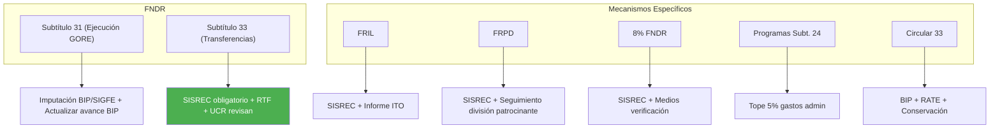

---
_manifest:
  urn: urn:gn:kb:gestion-rendiciones-p02
  provenance:
    created_by: FS
    created_at: '2026-03-15'
    source: Guía integrada para la gestión de rendiciones de cuentas en el GORE Ñuble
      + BPMN D08 Rendiciones + ssot-rendiciones v1.2.1 + goreNubleRenditionData.ttl
      + goreNubleReferenceData.ttl
version: 1.2.0
status: published
tags:
- rendiciones
- control-financiero
- gore-nuble
- sisrec
- transferencias
- estados
- escalation
- sla
lang: es
extensions:
  gn:
    family: note
  kora:
    shard_index: 2
    shard_count: 2
    shard_root_urn: urn:gn:kb:gestion-rendiciones
---

# Gestión de Rendiciones de Cuentas — GORE Ñuble - Parte 02

## Estados de rendición — Modelo canónico y GORE_OS

### Estados canónicos ontológicos (6)

Fuente autoritativa: RenditionData.ttl (`gnub:RenditionState`, 6 instancias secuenciadas).

| Seq | Estado | Descripción |
|-----|--------|-------------|
| 1 | Pendiente | No presentada por entidad ejecutora |
| 2 | En Revisión | Recibida, en revisión por RTF/Analista Otorgante |
| 3 | Observada | Devuelta para subsanación |
| 4 | Aprobada Parcialmente | Aprobada con transacciones observadas pendientes de regularización |
| 5 | Aprobada Totalmente | Aprobada en totalidad, firmada con FEA por Encargado Otorgante |
| 6 | Contabilizada | Registrada en SIGFE, archivada por UCR/DAF |

### Mapeo ontológico ↔ GORE_OS (8 estados)

GORE_OS granulariza "En Revisión" en 3 subfases y agrega RECHAZADA. "Aprobada Parcialmente" (ontológico seq 4) se subsume bajo APROBADA sin distinción explícita en GORE_OS.

| Estado GORE_OS | Mapeo ontológico | Nota |
|----------------|-----------------|------|
| PENDIENTE | Pendiente (seq 1) | Equivalente directo |
| EN_REVISION_RTF | En Revisión (seq 2) — subfase RTF | Split: primera revisión técnico-financiera |
| VISADA_RTF | — (estado intermedio GORE_OS) | RTF aprobó, pendiente derivación a UCR |
| EN_REVISION_UCR | — (estado intermedio GORE_OS) | UCR contabiliza y realiza control final |
| OBSERVADA | Observada (seq 3) | Equivalente directo |
| APROBADA | Aprobada Totalmente (seq 5) | Subsume parcial + total |
| RECHAZADA | — (de ReferenceData, no en RenditionData) | Estado GORE_OS sin equivalente ontológico canónico |
| Archivada | Contabilizada (seq 6) | Vía campo `archived_at` |

Aritmética: 6 ontológicos - 1 reemplazado (En Revisión) + 3 subfases + 1 nuevo (RECHAZADA) - 1 subsumido (Aprobada Parcial) = 8 estados GORE_OS.

### Subfases de revisión GORE_OS

El estado ontológico "En Revisión" (seq 2) se descompone en 3 fases operativas:

```
EN_REVISION_RTF → VISADA_RTF → EN_REVISION_UCR
```

| Subfase | Responsable | Acción | Salida |
|---------|-------------|--------|--------|
| EN_REVISION_RTF | Analista Otorgante (RTF) | Revisa transacciones, coherencia técnico-financiera, documentación de respaldo | Aprobación RTF o devolución (→ OBSERVADA) |
| VISADA_RTF | Encargado Otorgante (Jefe DAF) | Revisa propuesta RTF, firma Informe de Aprobación con FEA | Visa o devuelve a RTF |
| EN_REVISION_UCR | UCR/DAF | Control final, contabilización SIGFE, archivo | Rendición contabilizada (→ Archivada) |

### SLAs canónicos por etapa

Definidos en GORE_OS (no en ontología). Meta CGR: 14 días totales para ciclo de revisión GORE.

| Etapa | Plazo | Responsable |
|-------|-------|-------------|
| Presentación rendición | 15 del mes siguiente | Entidad Ejecutora |
| Revisión técnica RTF | 7 días hábiles | Analista Otorgante |
| Devolución por observación | 1 día hábil | Jefe DAF |
| Contabilización UCR | 2 días hábiles | UCR/DAF |
| Resubsanación (OBSERVADA) | 15 días hábiles | Entidad Ejecutora |
| Plazo máximo pronunciamiento | 3 meses desde finalización convenio | GORE (Art. 23-26 Ley 21.796) |

Desglose operativo sin SISREC suma 18 días hábiles GORE (2+2+7+4+2+1). La meta de 14 días es aspiracional.

### Sistema de escalation (3 niveles)

Escalation automático basado en antigüedad respecto al SLA de cada etapa.

| Nivel | Umbral | Acción |
|-------|--------|--------|
| 1 — Atención | 1× SLA (plazo cumplido) | Alerta automática al responsable directo |
| 2 — Advertencia | 1,5× SLA | Escalamiento a jefatura de la unidad responsable |
| 3 — Crítico | 2× SLA | Escalamiento a DAF y alerta a nivel directivo |

Cálculo SLA-accurate: basado en `phase_entered_at` por cada `core.rendition_phase`. Seed: 8 fases en `core.rendition_phase`, 3 niveles en `core.rendition_escalation`.

### Excepción SISREC para montos menores

Rendiciones de convenios cuyo monto total sea ≤500 UTM bajo Subvención 8% pueden rendirse fuera de SISREC (modalidad papel). Aplica exclusivamente a Subvención 8%; todas las demás transferencias Subtítulos 24 y 33 requieren SISREC sin excepción (Res. Ex. 1858/2023 CGR).

### Reconciliación ontológica — RenditionState vs AccountabilityState

Dos clases coexisten en la ontología sin `owl:equivalentClass`:

| Aspecto | RenditionState (RenditionData.ttl) | AccountabilityState (ReferenceData.ttl) |
|---------|-----------------------------------|----------------------------------------|
| Instancias | 6 estados secuenciados | 5 estados (Pending, InReview, Observed, Approved, Rejected) |
| Granularidad | Distingue Aprobada Parcial vs Total | Solo "Approved" genérico; agrega "Rejected" |
| Dominio | `Rendition` | `AccountabilityProcess` |
| Superclase | `gist:Category` | `gist:Category` |
| Canónico | **Sí** — mayor granularidad refleja realidad CGR | No — pendiente deprecar |

Ambas clases comparten superclase `gist:Category` pero con dominios disjuntos (`Rendition` vs `AccountabilityProcess`) sin `owl:sameAs`. Pendiente: consolidar en ontología deprecando `AccountabilityState`.

---

## Rendición consolidada por fondo

| Fondo | Plataforma | Requisito especial | Documentos clave |
|-------|-----------|-------------------|-----------------|
| FNDR S.31 (ejecución directa) | BIP + SIGFE | Estado de pago ITO | Certificado recepción provisoria/definitiva |
| FNDR S.33 (transferencias) | BIP + SISREC | Convenio vigente | Informe avance + comprobantes |
| FRIL | BIP + SISREC | Convenio transferencia municipal | Estado de pago municipal + informe ITO |
| FRPD CTCI | SISREC | Acreditación hitos I+D+i | Informes técnicos ANID/CORFO |
| Subvención 8% | SISREC (≤500 UTM: papel) | Pagaré notarial vigente | Rendición detallada por ítem + medios verificación |
| Glosa 06 Directa | SISREC | Informe evaluación SES | Rendición mensual ejecución + tope 5% admin |
| C33 Conservación | SISREC | Certificación estado actual ≤30% costo reposición | Informe técnico conservación |

---

## Rendición por tipología de fondos



### FNDR — Iniciativas de Inversión (Subtítulo 31, ejecución directa GORE)

- Rendición interna de gastos y cumplimiento de etapas.
- Respaldo clave: contratos, estados de pago visados por ITO, facturas, resoluciones de adjudicación, boletas de garantía.
- Gastos imputados al código BIP en SIGFE; actualización de avance físico-financiero en BIP.
- Al finalizar: completar Carpeta Digital Ex Post en BIP.

### FNDR — Transferencias de Capital (Subtítulo 33, ejecución por terceros)

- Convenio de Transferencia detalla proyecto, monto, plazos y obligaciones.
- Rendición del ejecutor: obligatoria vía SISREC, con informe, comprobantes de gasto, informes de avance y actas de recepción.
- Revisión GORE: RTF revisa coherencia técnica-financiera; DAF/U.C.R. revisan legalidad y documentación.

### FRIL

- Proyectos FRIL deben contar con informe favorable del MDSF.
- **Excepción <5.000 UTM:** Los proyectos cuyo costo total sea inferior a 5.000 UTM (valorizadas al 1 de enero del ejercicio presupuestario vigente) no requerirán informe favorable del MDSF, pero deben ingresar información al SNI según Oficio Ordinario N°2 del 26 de enero de 2024 del Ministerio de Hacienda y MDSF.
- Prohibición: financiar proyectos por etapas o fraccionados.
- Rendición: municipalidades rinden al GORE vía SISREC, acreditando gastos y avance de obras.

### FRPD

- Ejecutores: universidades, centros de investigación, corporaciones, empresas.
- Rendición vía SISREC: acredita gasto financiero y logro de hitos, productos y resultados de I+D+i.
- Supervisión: DIFOI y DIPIR siguen cumplimiento de metas.

### Subvenciones 8% FNDR

- Base normativa: Glosa 07 Ley de Presupuestos, bases del concurso, instructivo regional.
- Rendición vía SISREC; énfasis en coherencia del gasto con el proyecto adjudicado.
- Respaldo clave: boletas de honorarios con cotizaciones, facturas específicas de la actividad.
- Medios de verificación: listas de asistencia, fotos, material de difusión.
- Gastos prohibidos: definidos en bases (operativos, premios en dinero, alcohol, etc.); deben fiscalizarse.

### Programas FNDR — Subtítulo 24 (ejecución directa GORE, Glosa 06)

- Hasta 5% del programa puede destinarse a gastos de administración del GORE, imputados al presupuesto del programa.
- Rendición interna: DAF controla tope del 5% y correcta imputación.
- Rendición externa: cumplimiento de componentes y metas, coherente con diseño aprobado ex ante por DIPRES/SES.

### Conservación de Infraestructura (Circular 33)

- Aplicable a mantención/reparación que no afecta capacidad original del activo.
- Base: Oficio Circular N°33/2009 MINHAC, NIP 2025.
- RATE del MDSF: "AD (Admisible para Financiamiento)" vía BIP.
- Prohibición: costo de reparación > 30% del costo de reposición del activo (si ocurre, debe ir a SNI estándar).
- Rendición: sigue flujo estándar de proyecto de inversión, acreditando partidas de conservación.

## Control, fiscalización y transparencia

### Control interno

- **Unidad de Control Interno:** revisión preventiva y auditorías selectivas; informa al Gobernador y al CORE.
- **Listas de chequeo:** aplicación de checklists estandarizadas para revisión formal, documental, financiera y técnica (Anexo 10.3 del manual de procedimientos).
- **Seguimiento físico-financiero:** verificar que el gasto se traduzca en avances concretos; análisis integrado de informes y visitas a terreno por RTF.

### Fiscalización externa

- **CGR:** examen y juzgamiento de cuentas; auditorías financieras y de cumplimiento; formulación de observaciones y reparos; Juicios de Cuentas para responsabilidades pecuniarias.
- **DIPRES:** monitoreo de ejecución presupuestaria y programática; evaluación de programas regionales.

### Transparencia y acceso a información

**Transparencia activa (Ley N°20.285):** publicación proactiva y mensual de convenios de transferencia, detalle de transferencias, nóminas de beneficiarios, presupuesto y ejecución, resultados de auditorías.

**Transparencia pasiva:** respuesta a solicitudes de acceso a la información dentro de plazos legales, resguardando datos personales sensibles (Ley N°21.719).

**Obligaciones Partida 31 — Corporaciones y Fundaciones (Glosa 08):**
- Informar a DIPRES y publicar en páginas web información institucional (misión, objetivos, directorio, financiamiento, planificación anual) a más tardar al término del primer trimestre.
- Informar y publicar trimestralmente, dentro de los 30 días siguientes al término de cada trimestre: dotación, remuneraciones, concursos, recursos transferidos/ejecutados, indicadores.
- Exigir cuenta pública anual, estados financieros publicados y cumplimiento de Ley N°20.285.

**Obligaciones de información y publicación (Glosa 16):**
- Publicar mensualmente la cartera de proyectos financiada con cargo a presupuestos de inversión regional.
- Publicar acuerdos CORE dentro de 5 días hábiles desde su adopción.
- Informar trimestralmente el uso de recursos (beneficiarios, comuna, instituciones receptoras, montos, productos y aplicación regional) a las instancias definidas en la glosa; publicar en los mismos plazos.
- Publicar trimestralmente e informar a senadores y diputados los proyectos adjudicados/contratados con cargo a Subtítulos 24, 31 y 33: identificación, montos, postulantes, pauta de evaluación, seleccionado, presupuesto aprobado y votaciones CORE.

## Responsabilidades y sanciones

### Tipos de responsabilidad

| Tipo | Causa | Procedimiento | Consecuencia |
| :--- | :--- | :--- | :--- |
| Administrativa | Infracción a deberes de cuidado, supervisión o probidad por funcionarios GORE. | Sumario administrativo (Estatuto Administrativo, Art. 119). | Censura, multa, suspensión o destitución (Ley 18.834). |
| Civil | Perjuicio patrimonial al Fisco por acción negligente o dolosa. | Juicio de Cuentas ante CGR o demanda civil. | Orden de restituir los fondos. |
| Penal | Hechos constitutivos de delito (malversación, fraude al fisco, cohecho, etc.). | Investigación del Ministerio Público y juicio penal. | Multas, inhabilitación, penas privativas de libertad. |

### Consecuencias directas por rendiciones pendientes o observadas

| Condición | Resultado |
| :--- | :--- |
| Rendición no presentada, no aprobada u observada por CGR | Obligación de reintegro (Res. 30 CGR, Art. 31). |
| Rendiciones exigibles pendientes | GORE no debe entregar nuevos fondos (Res. 30 CGR, Art. 18). |

## Gestión estratégica y contingencias

### Buenas prácticas

- Planificación anual de rendiciones y programación de revisiones internas.
- Coordinación interdivisional entre DAF, DIPIR y unidades técnicas con roles claros.
- Capacitación continua a funcionarios GORE y entidades ejecutoras, especialmente en uso de SISREC.
- Uso óptimo de tecnología (SIGFE, BIP, SISREC).
- Desarrollo y actualización de manuales internos de procedimientos.
- Gestión de riesgos (fraude, errores, demoras) con medidas preventivas y de control.
- Enfoque en resultados: articular rendición financiera con medición de impacto.

### Planes de contingencia

| Caso | Procedimiento |
| :--- | :--- |
| Pérdida de rendición al interior del GORE | Mantener registros digitales o libros de correspondencia en cada unidad (OP, U.C.R., RTF); como último recurso, solicitar copia a entidad ejecutora. SISREC minimiza este riesgo. |
| Entidad privada solicita cuota siguiente sin haber rendido la anterior | Aplicar Art. 18 Res. 30 CGR; si el convenio lo permite, autorizar adelanto solo contra garantía (vale vista, póliza) por monto no rendido, fijando plazo perentorio para rendir o ejecutar garantía. |
| Demoras en revisión interna por alta carga de trabajo | Usar planificación anual para anticipar peaks; reasignar revisores; priorizar rendiciones que habilitan transferencias críticas. |

## Procedimientos contables en SIGFE

### F07 — Transferencias condicionadas sector privado

Aplicación: Subvenciones 8% FNDR y programas con ONGs.

| Fase | Asiento |
| :--- | :--- |
| Fase 1 — Entrega de fondos | Devengo: Debe 12106 Deudores por Transferencias Reintegrables / Haber 21524 o 21533. Pago: Debe 21524/21533 / Haber 11102/11103 Banco. |
| Fase 2 — Aprobación rendición | Reconocimiento del gasto: Debe 54101 Transf. Corr. Sector Privado o 54201 Transf. Cap. Sector Privado / Haber 12106. |
| Fase 3 — Reintegro | Devengo del cobro: Debe 11508 Cuentas por Cobrar / Haber 12106. Recepción: Debe 11102/11103 Banco / Haber 11508. |

### F08 — Transferencias condicionadas sector público

Aplicación: FNDR a Municipalidades (FRIL, proyectos) y transferencias a otros Servicios Públicos.

Advertencia: Para transferencias a otros Servicios Públicos (no Municipalidades), el devengo del gasto se realiza al aprobar la rendición; para Municipalidades, al momento de la transferencia.

| Fase | Asiento |
| :--- | :--- |
| Fase 1 — Entrega de fondos | Devengo: Debe 12106 / Haber 21524/21533. Pago: Debe 21524/21533 / Haber 11102/11103. |
| Fase 2 — Aprobación rendición | Reconocimiento del gasto: Debe 54103 Transf. Corr. Otras Ent. Públicas o 54203 Transf. Cap. Otras Ent. Públicas / Haber 12106. |
| Fase 3 — Reintegro | Devengo del cobro: Debe 11508 Cuentas por Cobrar / Haber 12106. Recepción: Debe 11102/11103 Banco / Haber 11508. |

Los números de cuenta corresponden al Plan de Cuentas del Sector Público.

## Sistemas de información

| Sistema | Función en rendiciones |
| :--- | :--- |
| SISREC | Rendición electrónica de cuentas (CGR); plataforma obligatoria para Subtítulos 24 y 33 |
| SIGFE | Contabilización de transferencias, devengos, pagos y reintegros |
| BIP-SNI | Seguimiento de avance físico-financiero de iniciativas de inversión |
| FIRMAGOB | Firma Electrónica Avanzada para resoluciones e informes oficiales |
