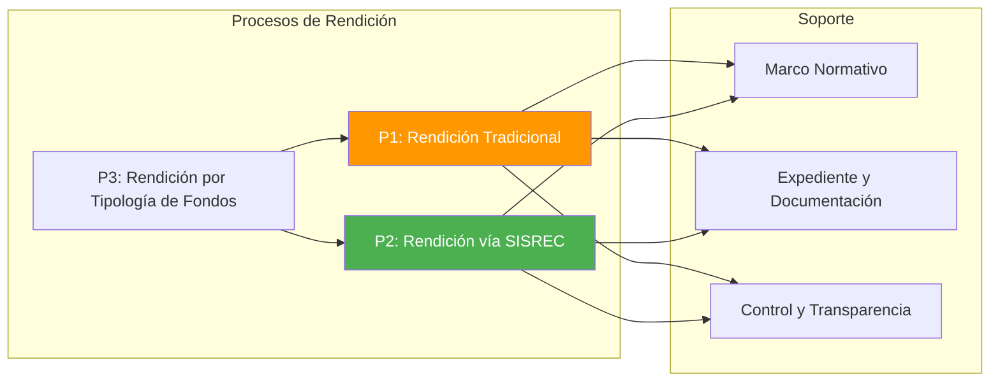
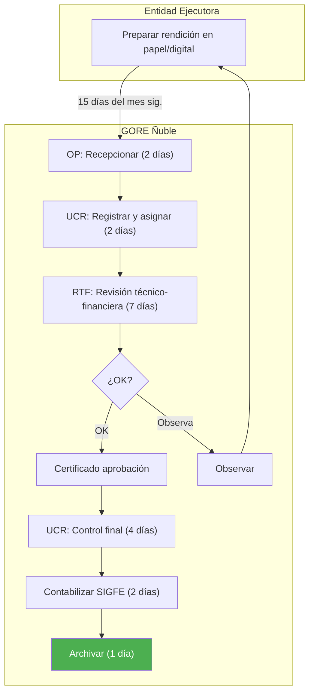
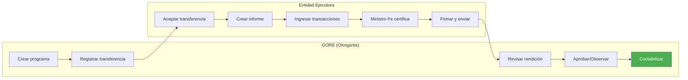
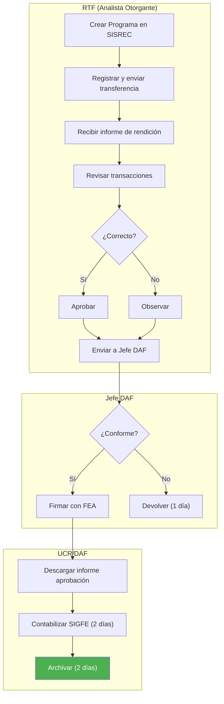
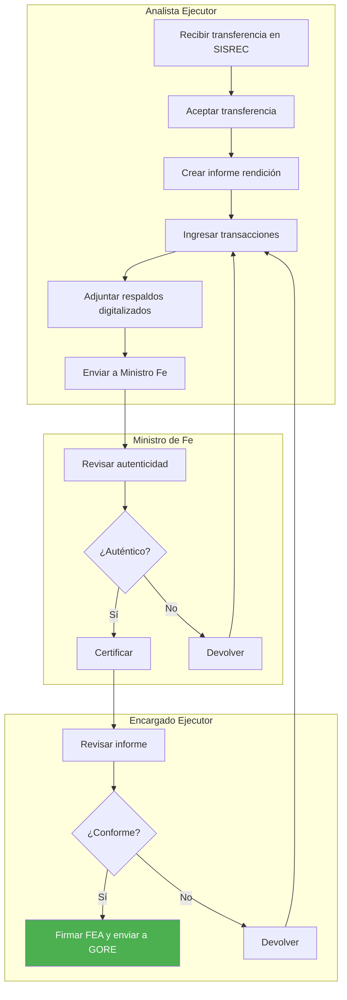

---
_manifest:
  urn: urn:gn:kb:gestion-rendiciones
  provenance:
    created_by: FS
    created_at: '2026-03-15'
    source: Guía integrada para la gestión de rendiciones de cuentas en el GORE Ñuble
      + BPMN D08 Rendiciones + ssot-rendiciones v1.2.1 + goreNubleRenditionData.ttl
      + goreNubleReferenceData.ttl
version: 1.2.0
status: published
tags:
- rendiciones
- control-financiero
- gore-nuble
- sisrec
- transferencias
- estados
- escalation
- sla
lang: es
extensions:
  gn:
    family: note
  kora:
    shard_index: 1
    shard_count: 2
    shard_root_urn: urn:gn:kb:gestion-rendiciones
---

# Gestión de Rendiciones de Cuentas — GORE Ñuble

## Resumen

Guía integrada para la gestión de rendiciones de cuentas en el GORE Ñuble. Cubre marco normativo, actores y responsabilidades, procesos operativos (modalidad legado y SISREC), estados canónicos y GORE_OS con mapeo ontológico, subfases de revisión, SLAs por etapa, sistema de escalation 3 niveles, rendición por tipología de fondos con tabla consolidada, control y fiscalización, responsabilidades, sanciones y procedimientos contables en SIGFE.

## Glosario

| Sigla / Término | Definición |
| :--- | :--- |
| Rendición de Cuentas | Procedimiento administrativo y de control mediante el cual quien administra fondos públicos demuestra y justifica su correcta utilización conforme a la normativa. |
| GORE | Gobierno Regional; administración superior de la región, con personalidad jurídica y patrimonio propio. |
| Entidad Ejecutora | Municipalidad, servicio público u entidad privada que recibe fondos del GORE y debe rendir cuentas. |
| SISREC | Sistema de Rendición Electrónica de Cuentas de CGR; obligatorio para Subtítulos 24 y 33 (Res. Ex. 1858/2023 CGR). |
| SIGFE | Sistema de Información para la Gestión Financiera del Estado; registra transferencias, devengos, pagos y reintegros. |
| Expediente de Rendición | Conjunto ordenado de documentos que respaldan recepción, uso y justificación de fondos públicos. |
| DAF | División de Administración y Finanzas; responsable de gestión financiera y administrativa de rendiciones. |
| U.C.R. | Unidad de Control de Rendiciones; unidad especializada dentro de la DAF que centraliza el control operativo. |
| RTF | Referente Técnico-Financiero; profesional GORE responsable de la revisión técnica y financiera de rendiciones. |
| FNDR | Fondo Nacional de Desarrollo Regional; principal fuente de financiamiento de proyectos y programas regionales. |
| FRIL | Fondo Regional de Iniciativa Local; FNDR para proyectos de pequeña escala ejecutados principalmente por municipalidades. |
| FRPD | Fondo Regional para la Productividad y el Desarrollo; derivado del Royalty Minero, para innovación y competitividad. |
| Subvenciones 8% FNDR | Recursos FNDR para actividades comunitarias (cultura, deporte, social, seguridad, medio ambiente) con concurso público. |
| LOCBGAE | Ley N°18.575 Orgánica Constitucional de Bases Generales de la Administración del Estado. |
| LBPA | Ley N°19.880 de Bases de los Procedimientos Administrativos. |
| Resolución N°30/2015 CGR | Norma de procedimiento sobre rendición de cuentas; aplicación obligatoria para GORE y entidades ejecutoras. |
| Resolución Exenta N°1.858/2023 CGR | Establece obligatoriedad del uso de SISREC para Subtítulos 24 y 33. |

## Marco normativo

| Norma | Artículos clave |
| :--- | :--- |
| Constitución Política de la República | Art. 3 (responsabilidad, eficiencia, probidad, transparencia); Art. 8 (publicidad); Art. 98-99 (facultad CGR para examinar y juzgar cuentas); Art. 111 ss. (régimen GORE). |
| Resolución N°30/2015 CGR | Art. 1 (ámbito: GORE y entidades receptoras); Art. 2 (expediente de rendición); Art. 13 (gastos posteriores a tramitación del acto); Art. 18 (prohibición de nuevas transferencias con rendiciones exigibles pendientes); Art. 26 (transferencias a servicios públicos); Art. 27 (transferencias a entidades privadas); Art. 31 (restitución de fondos). |
| Ley N°18.575 (LOCBGAE) | Art. 3 (principios de responsabilidad, eficiencia, probidad); Art. 52-53 (probidad administrativa). |
| Ley N°19.880 (LBPA) | Art. 5, 16bis, 18, 19 (expediente electrónico, escrituración electrónica). |
| Ley de Presupuestos (anual) | Art. 23-26 (Ley 21.796/2026): marco para transferencias a privados (concurso, convenio, SISREC, garantías, prohibiciones). Glosa 06: oferta programática, tope 5% gastos adm. Glosa 07: 8% FNDR. Glosa 12: FRIL. Glosa 13: FRPD. |
| Ley N°21.180 (Transformación Digital) | Digitalización obligatoria de procedimientos; expediente electrónico; firma electrónica. |
| Ley N°21.719 (Protección Datos Personales) | Tratamiento de datos en expedientes y publicaciones de transparencia: licitud, finalidad, proporcionalidad, seguridad. |

## Actores y responsabilidades

### Actores internos GORE

| Actor | Rol | Funciones principales |
| :--- | :--- | :--- |
| Gobernador/a Regional | Máxima autoridad ejecutiva; responsable final de la correcta inversión de todos los fondos. | Aprobar convenios mediante resolución; velar por sistema de control interno; representar al GORE ante organismos de control. |
| Consejo Regional (CORE) | Órgano fiscalizador. | Fiscalizar actos GORE; requerir informes sobre estado de rendiciones; considerar historial de rendiciones al aprobar nuevos fondos. |
| Administrador/a Regional | Coordinador de la gestión administrativa interna. | Supervisar eficiencia de procesos de rendición; coordinar DAF, DIPIR y unidades técnicas. |
| DAF | Unidad central en gestión financiera y administrativa de rendiciones. | Elaborar convenios y resoluciones de pago; recepcionar, registrar y custodiar expedientes; revisión financiera y de legalidad; contabilizar en SIGFE; gestionar SISREC (roles Administrador y Encargado Otorgante). |
| U.C.R. (dentro de DAF) | Centraliza y especializa el control operativo de rendiciones. | Registrar en base de datos; derivar a RTF; controlar antecedentes para contabilización; contabilizar en SIGFE; archivar; supervisar tiempos de revisión. |
| Divisiones Técnicas (DIPIR, DIDESOH, DIFOI, DIT) | Albergan a los RTF. | Definir aspectos técnicos en convenios; seguimiento técnico de ejecución; revisar coherencia de gastos con avance físico; emitir informes técnicos. |
| RTF | Primera línea de revisión y seguimiento. Corresponde al "Analista Otorgante" en SISREC. | Supervisar cumplimiento del convenio; vigilar que la entidad ejecutora rinda mensualmente; revisar detalladamente rendiciones (técnica y financiera); solicitar subsanación; aprobar técnicamente y derivar a DAF/U.C.R. |
| Unidad de Control Interno | Control preventivo y posterior de legalidad. | Auditar selectivamente procesos; asesorar en procedimientos de control; informar al Gobernador y al CORE. |

### Entidades ejecutoras

**Deberes:**
- Usar fondos exclusivamente para fines convenidos.
- Administrar con probidad, eficiencia y transparencia.
- Llevar registros y documentación de respaldo completa y fidedigna.
- Presentar rendiciones en forma y plazos establecidos (vía SISREC).
- Subsanar observaciones oportunamente.
- Reintegrar fondos no utilizados o mal rendidos.

| Tipo | Obligaciones específicas |
| :--- | :--- |
| Municipalidades | Obligadas a usar SISREC (Res. Ex. 1858/2023 CGR). |
| Otros Servicios Públicos (SERVIU, Vialidad, etc.) | Rinden al GORE según convenio; CGR examina inversión en sede del servicio ejecutor (Res. 30 CGR, Art. 26). |
| Entidades Privadas (Corporaciones, Fundaciones, ONGs) | Sujetos a marco Ley de Presupuestos 2026 Art. 23-26; inscripción en Registro de Colaboradores del Estado (Ley 19.862); obligadas a usar SISREC. |

### Organismos de control externo

| Organismo | Funciones |
| :--- | :--- |
| CGR | Toma de Razón; fiscalización de ingreso e inversión de fondos; examen y juzgamiento de cuentas; auditorías; formulación de reparos; Juicios de Cuentas; administración de SISREC. |
| DIPRES | Monitoreo de ejecución presupuestaria vía SIGFE; evaluación de programas regionales; velar por cumplimiento de glosas. |

## Documentación del expediente de rendición

**Componentes esenciales (Res. 30 CGR, Art. 2):**

- Informe de Rendición de Cuentas: documento formal de la entidad ejecutora; en SISREC corresponde al informe electrónico firmado con FEA.
- Comprobantes de Ingresos: documentación que acredita recepción de fondos.
- Comprobantes de Egresos: documentación auténtica que respalda cada desembolso.
- Comprobantes de Traspasos: documentos de operaciones contables sin movimiento de efectivo.
- Registro Ley N°19.862: cuando corresponda (transferencias a privados).
- Medios de Verificación: evidencia de cumplimiento de objetivos (informes técnicos, fotos, listas, etc.).

**Tipos de soporte aceptado:**

| Soporte | Validez |
| :--- | :--- |
| Papel (original) | Plena. Copias solo si autentificadas por ministro de fe o funcionario autorizado. |
| Electrónico (Ley 19.799) | Plena, con firma electrónica. |
| Digitalizado | Considerado copia simple, salvo autentificación con FEA; en SISREC el Ministro de Fe del ejecutor cumple esta función. |

Tipos comunes: facturas y boletas electrónicas, contratos, liquidaciones de sueldo, comprobantes de cotizaciones, comprobantes de transferencia bancaria, actas de recepción.

## Mapa general de procesos de rendición

Criticidad: alta. Dueño funcional: UCR/DAF.

**SLA:**
- Operativo (suma de etapas): 18 días hábiles GORE (2+2+7+4+2+1) + 15 días EE presentación.
- Meta interna GORE: 14 días hábiles para completar ciclo de revisión GORE (target aspiracional de implementación; el desglose por etapa suma 18 días).
- Plazo máximo pronunciamiento sobre rendición: 3 meses desde finalización del convenio (Art. 23-26 Ley 21.796).

## Flujo sin SISREC (modalidad legado)

Aplicable a convenios antiguos no migrados a SISREC.

| Paso | Responsable | Acción | Plazo |
| :--- | :--- | :--- | :--- |
| 1 | Entidad Ejecutora | Prepara y presenta rendición en papel/digital a Oficina de Partes (OP). | 15 días hábiles del mes siguiente |
| 2 | Oficina de Partes | Recepciona, registra y deriva a U.C.R./DAF. | 2 días hábiles (GORE) |
| 3 | U.C.R./DAF | Registra en base de datos y deriva a RTF. | 2 días hábiles (GORE) |
| 4 | RTF | Revisa técnica y financieramente. Si OK: emite certificado de aprobación y devuelve a U.C.R./DAF. Si observa: comunica a EE para subsanación (2 días hábiles GORE para comunicar; EE reingresa correcciones). | 7 días hábiles (GORE) |
| 5 | U.C.R./DAF | Control final mediante checklist. | 4 días hábiles (GORE) |
| 6 | U.C.R./DAF | Contabiliza en SIGFE. | 2 días hábiles (GORE) |
| 7 | U.C.R./DAF | Archiva expediente. | 1 día hábil (GORE) |

## Flujo con SISREC (modalidad estándar)

Procedimiento obligatorio para nuevas transferencias Subtítulos 24 y 33.

**Flujo de la Entidad Otorgante (GORE):**

| Paso | Responsable | Acciones | Plazo / Condición |
| :--- | :--- | :--- | :--- |
| 1 | Analista Otorgante (RTF) | Crea Programa/Proyecto en SISREC; registra y envía transferencia al Ejecutor; recibe y revisa rendición; aprueba u observa cada transacción; envía a Encargado Otorgante para firma. | 7 días hábiles GORE para revisión |
| 2 | Encargado Otorgante (Jefe DAF) | Revisa propuesta. Si observa: devuelve al Ejecutor con FEA (1 día hábil GORE). Si aprueba: firma Informe de Aprobación (total/parcial) con FEA. | — |
| 3 | Analista Otorgante (RTF) | Descarga Informe de Aprobación firmado; deriva a U.C.R./DAF para contabilización. | — |
| 4 | U.C.R./DAF | Recibe informe; contabiliza en SIGFE (2 días hábiles GORE); archiva registro (2 días hábiles GORE). | — |

**Flujo de la Entidad Ejecutora:**

| Paso | Responsable | Acciones | Plazo / Condición |
| :--- | :--- | :--- | :--- |
| 1 | Analista Ejecutor | Acepta transferencia en SISREC; crea informe de rendición (mensual, regularización o sin movimiento); ingresa transacciones y adjunta documentos digitalizados; envía a Ministro de Fe. | 15 días hábiles del mes siguiente |
| 2 | Ministro de Fe del Ejecutor | Revisa autenticidad. Si OK: aprueba/certifica y pasa a Encargado Ejecutor. Si observa: devuelve a Analista Ejecutor. | — |
| 3 | Encargado Ejecutor | Revisa rendición. Si OK: firma Informe de Rendición con FEA y envía al GORE. Si observa: devuelve a Analista Ejecutor. | — |
| 4 | Analista Ejecutor (si hay devolución del GORE) | Recibe rendición observada; crea informe de "Regularización"; corrige transacciones observadas y reenvía por el mismo flujo. | — |

## Tipos de informe SISREC

| Tipo | Uso |
| :--- | :--- |
| Mensual | Rendición regular con transacciones del período |
| Regularización | Corrección de transacciones observadas por el GORE |
| Sin Movimiento | Período sin gastos ejecutados |

---
