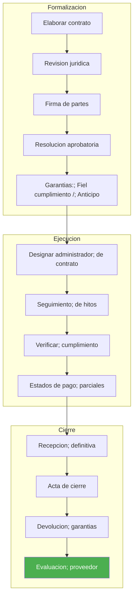

---
_manifest:
  urn: urn:gn:kb:manual-compras-contrataciones-p02
  provenance:
    created_by: FS
    created_at: '2026-03-15'
    source: Manual 2.1 Gestión de Compras y Contrataciones GORE Ñuble + BPMN D04 Compras
      y Contrataciones
version: 1.0.0
status: published
tags:
- compras
- contrataciones
- licitaciones
- mercado-publico
- gore-nuble
lang: es
extensions:
  gn:
    family: note
  kora:
    shard_index: 2
    shard_count: 2
    shard_root_urn: urn:gn:kb:manual-compras-contrataciones
---

# Gestión de Compras y Contrataciones — GORE Ñuble - Parte 02

## P4 — Gestión de Contratos

Responsable principal: Administrador de Contrato.

### Flujo de gestión contractual

### Formalización de contratos

Contrato obligatorio para:

- Licitaciones > 1.000 UTM.
- Servicios de tracto sucesivo.
- Obras civiles.

**Contenido del contrato:**

- Identificación de las partes.
- Objeto y alcance.
- Precio y modalidad de pago (hitos, mensualidades, etc.).
- Plazos de ejecución.
- Garantías exigidas.
- Multas y sanciones.
- Causales de término anticipado.

### Administración del contrato

**Administrador del Contrato:** funcionario designado por resolución, responsable del seguimiento técnico y cumplimiento de hitos.

**Funciones del Administrador:**

| Función | Descripción |
| :--- | :--- |
| Supervisión | Verificar cumplimiento técnico |
| Comunicación | Enlace con proveedor |
| Documentación | Mantener expediente |
| Hitos | Certificar avances |
| Pagos | Autorizar estados de pago |

**Libro de Obra / Bitácora:** registro de incidencias, instrucciones y acuerdos durante la ejecución (obligatorio en contratos de obra).

**Estados de Pago:** documentos que certifican el avance para liberar pagos parciales según hitos.

**Modificaciones contractuales:**

- Aumentos o disminuciones de hasta 30% del monto original requieren resolución fundada.
- Sobre 30% requieren nueva licitación.

### Garantías contractuales

| Tipo | Descripción |
| :--- | :--- |
| Seriedad de la Oferta | Devuelta tras adjudicación a oferentes no seleccionados |
| Fiel Cumplimiento | Generalmente 5% del monto contratado, vigente hasta recepción final + plazo de responsabilidad |
| Correcta Ejecución (Obras) | Puede exigirse por el plazo de responsabilidad post-recepción (típicamente 12 meses) |

**Custodia:** las garantías físicas (boletas, pólizas) se custodian en Tesorería. Las electrónicas se registran en el sistema de garantías.

### Multas y sanciones

Deben estar contempladas en las bases y el contrato. Causales típicas: atraso en entrega, incumplimiento parcial, calidad deficiente.

**Procedimiento:**

1. Informe del administrador.
2. Notificación al proveedor.
3. Plazo de descargos (5 días hábiles).
4. Resolución que aplica o desestima la multa.

**Cobro:** descuento directo de estados de pago o ejecución de garantía.

### Término del contrato

| Tipo | Descripción |
| :--- | :--- |
| Término Natural | Cumplimiento del objeto en plazo |
| Término Anticipado | Por incumplimiento grave, mutuo acuerdo o causales de fuerza mayor |
| Recepción Final | Acta que cierra el contrato y libera garantías (tras plazo de responsabilidad si aplica) |

## Control, Transparencia y Evaluación

### Interoperabilidad con Mercado Público

- Toda operación debe reflejarse en www.mercadopublico.cl.
- El sistema institucional (SIGAS o equivalente) debe sincronizar OC, estados de pago y recepciones.
- Descarga automática de actas de adjudicación para trazabilidad.

### Obligaciones de publicación

| Información | Plataforma |
| :--- | :--- |
| PAC | Mercado Público |
| Licitaciones | Mercado Público |
| Adjudicaciones | Mercado Público |
| Contratos | Transparencia Activa |
| Órdenes de Compra | Mercado Público |

### Portal de Proveedores

Herramienta de transparencia que permite a proveedores consultar:

- Estado de sus órdenes de compra.
- Estado de facturas y pagos.
- Historial de transacciones.

### Evaluación de proveedores

**Frecuencia:** al cierre de cada contrato; anualmente para contratos de tracto sucesivo.

**Criterios:**

- Cumplimiento de plazos.
- Calidad del producto/servicio.
- Respuesta ante incidencias.

**Registro:** la calificación se incorpora al Historial de Proveedores institucional.

**Consecuencias:** proveedores con evaluación deficiente pueden ser excluidos de futuras licitaciones (según bases).

### Reportes y auditoría

**Reportes periódicos:**

- Informe Mensual de Compras: resumen de OC emitidas, montos, mecanismos utilizados.
- Informe de Contratos Vigentes: estado de avance, hitos pendientes, alertas de vencimiento.

**Indicadores de gestión:**

| Indicador | Tipo |
| :--- | :--- |
| % de compras vía Convenio Marco | Eficiencia |
| % de licitaciones declaradas desiertas | Efectividad |
| Tiempo promedio de adjudicación | Oportunidad |
| Cumplimiento de plazos de pago a 30 días | Cumplimiento |

## Normativa Aplicable

| Norma | Alcance |
| :--- | :--- |
| Ley N° 19.886 | Compras públicas |
| Ley N° 21.634 (Compras 2.0) | Modernización compras públicas |
| Decreto N° 661 (2024) | Nuevo Reglamento Ley de Compras |
| D.S. 250 | Procedimientos (reglamento anterior) |
| Ley de Presupuestos (Partida 31) | Presupuesto regional |
| Directivas ChileCompra | Operativas |
| Ley N° 21.180 | Transformación digital |
| Ley N° 20.730 | Lobby y conflictos de intereses |
| Art. 8 Ley de Presupuestos | Pago electrónico obligatorio |

## Sistemas de Información

| Sistema | Función |
| :--- | :--- |
| Mercado Público (ChileCompra) | OC, licitaciones, PAC, adjudicaciones |
| SIGFE | CDP, compromisos, pagos |
| Doc Digital | Contratos, resoluciones |
| SIGAS (o equivalente) | Sincronización OC, estados de pago, recepciones |
