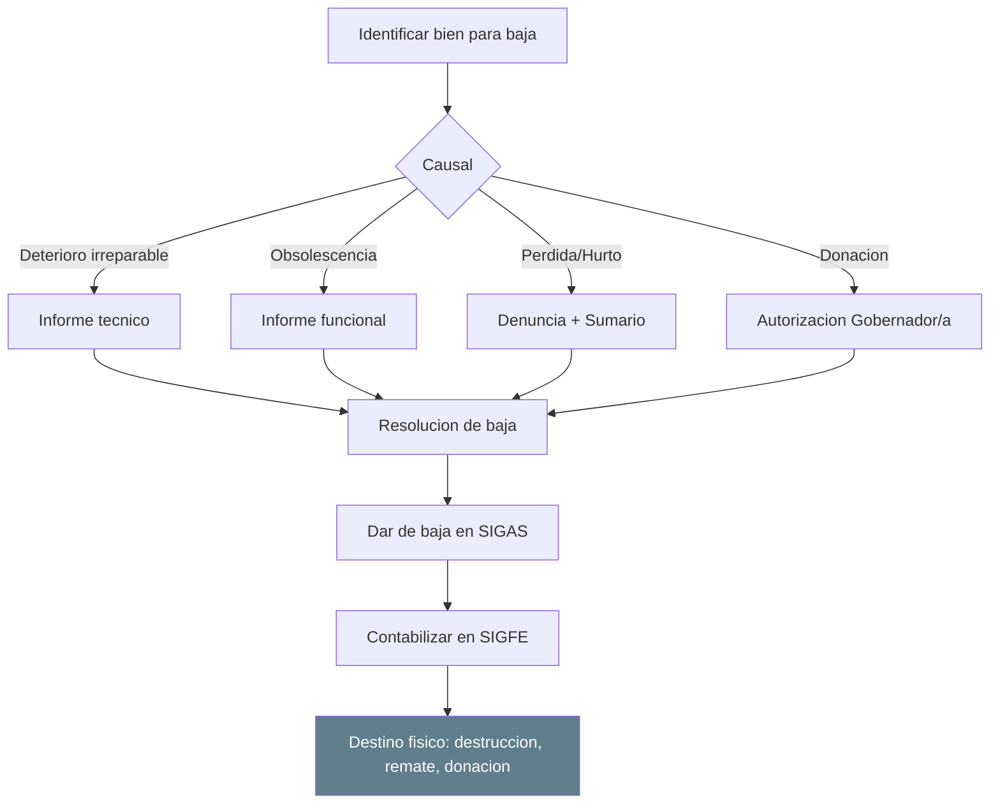
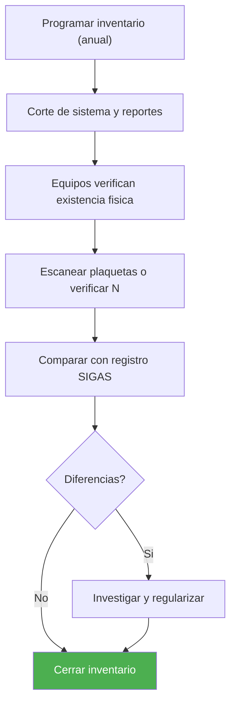
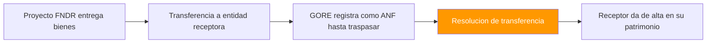

---
_manifest:
  urn: urn:gn:kb:manual-inventarios-activo-fijo-p03
  provenance:
    created_by: FS
    created_at: '2026-03-15'
    source: Manual 2.2 Inventarios/Bodegas + Manual 2.3 Activo Fijo GORE Ñuble + BPMN
      D05 Inventarios y Activo Fijo
version: 1.0.0
status: published
tags:
- inventarios
- activo-fijo
- bodegas
- gore-nuble
- patrimonio
lang: es
extensions:
  gn:
    family: note
  kora:
    shard_index: 3
    shard_count: 3
    shard_root_urn: urn:gn:kb:manual-inventarios-activo-fijo
---

# Gestion de Inventarios y Activo Fijo — GORE Nuble - Parte 03

## Baja de Bienes

### Causales de baja

- **Obsolescencia:** tecnologica o funcional.
- **Deterioro Irreparable:** dano que hace inviable la reparacion.
- **Siniestro:** robo, incendio, catastrofe.
- **Termino de Vida Util:** bien completamente depreciado y sin utilidad.
- **Venta o Remate:** enajenacion mediante proceso publico.
- **Donacion:** cesion gratuita a otra entidad.
- **Canje:** intercambio con proveedor.

### Procedimiento de baja

1. **Informe Tecnico:** el area usuaria o mantencion certifica el estado del bien.
2. **Resolucion de Baja:** acto administrativo firmado por autoridad competente.
3. **Registro en Sistema:** cambio de estado a "Dado de Baja", fecha y causal.
4. **Contabilizacion:** reverso del valor libro (Activo y Depreciacion Acumulada) y reconocimiento de perdida/utilidad si aplica.
5. **Disposicion Final:** destruccion certificada, entrega a beneficiario (donacion), o venta/remate.

### Remate de bienes

- **Normativa:** segun instrucciones CGR y reglamento interno.
- **Publicidad:** aviso publico con descripcion, valor base y fecha de remate.
- **Modalidad:** presencial o electronica.
- **Adjudicacion:** al mejor postor sobre valor base.
- **Registro:** baja del bien e ingreso contable por venta.

### Donacion de bienes

Requiere resolucion fundada del Gobernador Regional. Beneficiarios tipicos: municipalidades, organizaciones sin fines de lucro, otras entidades publicas. El bien se da de baja sin generar ingreso.

## Control e Inventario de Activo Fijo

### Toma de inventario fisico

Verificacion periodica obligatoria. Frecuencia: al menos anual (obligatorio al 31/12). Alcance: totalidad de bienes o por ubicacion/responsable.

Metodo:

- Lectura de codigos de barras/QR con capturador.
- Verificacion visual del estado.
- Registro de ubicacion real.
- Actualizacion de fotografia (opcional).
- Conciliacion: comparar inventario fisico vs. registro en sistema.

### Tratamiento de diferencias

- **Sobrante:** bien fisico sin registro. Investigar origen y regularizar con alta por revalorizacion.
- **Faltante:** registro sin respaldo fisico. Investigacion administrativa; si hay responsabilidad: sumario y reintegro; si no hay responsabilidad demostrable: baja por perdida.

### Asignacion de responsables

- Cada bien debe tener un funcionario responsable de su custodia.
- El cambio de responsable se formaliza con acta de entrega-recepcion.
- El responsable tiene obligacion de informar danos, perdidas o traslados.
- La desvinculacion de un funcionario obliga a reasignar sus bienes.

## Cierre y Reporteria de Activo Fijo

### Cierre mensual

- Ejecucion de depreciacion del periodo.
- Generacion de comprobante contable (Depreciacion/Deterioro).
- Cuadratura entre modulo de Activo Fijo y Contabilidad Patrimonial.

### Cierre anual

- Inventario fisico obligatorio.
- Ajustes de deterioro si corresponde.
- Informe de Activos Fijos para CGR y memorias institucionales.
- Traspaso de saldos al ejercicio siguiente.

### Reportes estandar

- **Inventario Valorizado:** listado de bienes con valor libro actual.
- **Bienes por Responsable:** asignacion por funcionario.
- **Bienes por Ubicacion:** distribucion geografica/fisica.
- **Cuadro de Depreciacion:** valores iniciales, depreciacion acumulada, valor libro.
- **Bienes Totalmente Depreciados:** para evaluacion de baja o continuidad de uso.
- **Movimientos del Periodo:** altas, bajas, traslados, revalorizaciones.

## Casos Especiales

### Bienes inmuebles

- Registro detallado: Rol de avaluo, superficie, inscripcion CBR.
- Avaluo fiscal actualizado anualmente.
- Seguros y polizas asociadas.
- Control de concesiones o arriendos si aplica.

### Vehiculos

- Datos especificos: patente, ano, kilometraje, revision tecnica.
- Integracion con modulo de Flota.
- Seguros obligatorios (SOAP) y voluntarios.
- Control de mantenciones y combustible.

### Equipamiento TIC

- Registro de licencias asociadas.
- Control de garantias y soporte tecnico.
- Vida util acelerada (3-5 anos).
- Procedimiento de sanitizacion de datos antes de baja.

### Concesiones

Bienes recibidos o entregados en concesion con tratamiento NICSP especifico (NICSP 32).

Fases: construccion, explotacion, devolucion. Registro segun modelo NICSP 32 (Acuerdos de Concesion de Servicios). Control: seguimiento de obligaciones del concesionario.

### Bienes de Proyectos FNDR

---

## Normativa Aplicable

| Norma | Alcance |
| :--- | :--- |
| NICSP 17 | Propiedad, planta y equipo |
| NICSP 21 | Deterioro del valor de activos no generadores de efectivo |
| NICSP 31 | Activos intangibles |
| NICSP 32 | Acuerdos de concesion de servicios |
| Resoluciones CGR | Control patrimonial, rendicion de cuentas, procedimientos de baja |
| DL 1.263/1975 | Administracion Financiera del Estado |
| Ley 18.575 | Responsabilidad patrimonial |
| Ley 21.180 | Transformacion Digital — registro electronico obligatorio |
| Reglamento Interno de Bodegas | Procedimientos operativos y responsabilidades de bodega |

---

## Sistemas de Informacion

| Sistema | Funcion |
| :--- | :--- |
| SIGAS | Gestion de inventarios y activo fijo (catalogo, movimientos, depreciacion, inventario fisico) |
| SIGFE | Contabilizacion patrimonial (asientos, cierre, reportes CGR) |
| SIGFIN | Integracion financiera |
