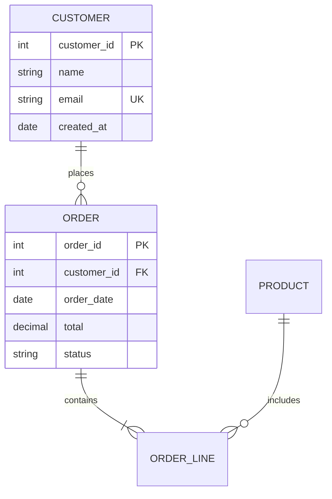

---
_manifest:
  urn: urn:kora:artefacto:data-modeling
  type: artefacto
  provenance:
    created_by: FS
    created_at: '2026-04-23'
    source: Migracion desde artifacts/skills/_TALLER/INBOX/data-modeling/SKILL.md
      (legacy overlay v1, 537 lineas en ingles) a shape unified v1.2 en espanol con
      compresion estructural y detalle canonico movido a referencias/
version: 1.0.0
status: activo
nombre: data-modeling
descripcion: Modela datos con Entity-Relationship Diagrams (ERDs), data dictionaries
  y modelos conceptual/logico/fisico. Produce schemas documentados, ERDs en Mermaid
  y DDL para PostgreSQL o SQL Server. Usar al disenar bases de datos, auditar modelos
  o generar data dictionaries.
tags:
- data-modeling
- erd
- schema
- disciplina
- bases-de-datos
lang: es
extensions:
  kora:
    vector_ontologico:
      pi: 2
      mu: 0
      xi: 1
      lambda: 0
      phi: 1
      sigma:
      - 1
      - 1
      - 2
      - 1
      - 0
    presentacion: estado-primario
    atlas:
      arnes_categorico: disciplina
      forma_material: habilidad
      metafora_relacional: supertool
    entornos_objetivo:
    - claude-code
    - codex
    - gemini
    nivel_prescripcion: medio
    conocimiento_permitido:
    - urn:tde:kb:guia-tecnica-marco-gestion-datos
    - urn:tde:kb:guia-tecnica-metadatos-documentos-expedientes
    - urn:kora:kb:cat-skill-algebra
    componible_con:
    - urn:kora:artefacto:cat-thinking
artefacto:
  perfil:
    descripcion: Habilidad de modelado de datos para convertir requerimientos en ERDs,
      data dictionaries, modelos logicos/fisicos y DDL documentado.
    dominio:
    - modelado conceptual de datos
    - normalizacion relacional
    - diseno fisico de bases de datos
    salidas:
    - ERDs
    - data dictionaries
    - DDL para PostgreSQL o SQL Server
  interfaz:
    herramientas: []
    permisos:
      allow: []
      deny: []
---

# Data Modeling

Skill para modelar datos via ERD, data dictionaries y DDL. Cubre tres niveles de abstraccion (conceptual, logico, fisico) y produce artefactos listos para consumo por equipos de desarrollo y DBAs.

## Objetivo

Transformar requerimientos de negocio en modelos de datos gobernables, con preservacion explicita de semantica entre niveles y trazabilidad desde entidad a columna fisica.

## Cuando Usar

- Disenar una base de datos desde cero a partir de requerimientos.
- Auditar un modelo existente contra normalizacion (1NF, 2NF, 3NF, BCNF).
- Generar data dictionary o ERD desde schema productivo.
- Planificar migracion de schema con preservacion de constraints.
- Documentar el modelo conceptual de un dominio para stakeholders no tecnicos.

## Distincion con `arquitecto-categorico`

| data-modeling | arquitecto-categorico |
|---------------|----------------------|
| QUE datos modelar (schema) | POR QUE compone (fundamento formal) |
| ERD, cardinalidad, normalizacion | Funtores, limites, adjunciones |
| Produce schema relacional | Produce la fundamentacion categorica |
| Dominio: datos | Agnostica de dominio |

`arquitecto-categorico` es upstream: primero se formaliza la categoria, luego se materializa como schema relacional. Para trabajo rutinario, `data-modeling` basta.

## Workflow

### Fase 1 — Entidades

1. Extraer sustantivos de los requerimientos.
2. Filtrar candidatos: conservar conceptos independientes con multiples instancias; descartar sinonimos, acciones y atributos.
3. Clasificar por tipo: `strong` (independiente), `weak` (depende de otra), `associative` (resuelve M:N).
4. Documentar como tabla `Entidad | Descripcion | Ejemplo`.

### Fase 2 — Atributos

1. Listar atributos por entidad respondiendo "que necesitamos saber de esto".
2. Identificar claves: PK surrogate, natural keys, composite keys.
3. Clasificar tipo: `string`, `integer`, `decimal`, `date`, `timestamp`, `boolean`, `uuid`.
4. Marcar obligatoriedad: `NOT NULL` vs `NULL`.
5. Marcar derivados (calculados) y multi-valor (coleccion).

### Fase 3 — Relaciones

1. Identificar conexiones entre pares de entidades.
2. Nombrar relacion en verbo activo (`places`, `contains`, `owns`).
3. Declarar cardinalidad: 1:1, 1:M, M:N.
4. Descomponer M:N en dos 1:M via entidad asociativa.
5. Documentar como tabla `Relacion | From | To | Cardinalidad | Descripcion`.

### Fase 4 — Normalizacion

| Forma | Regla | Ejemplo de violacion |
|-------|-------|----------------------|
| 1NF | Valores atomicos, sin grupos repetidos | `phone1`, `phone2`, `phone3` |
| 2NF | Sin dependencias parciales | No-clave depende de parte de composite key |
| 3NF | Sin dependencias transitivas | No-clave depende de no-clave |
| BCNF | Todo determinante es clave candidata | Solapamiento en claves candidatas |

Denormalizar solo cuando: performance critica de lectura, reporting/analytics, data warehouse, o el trade-off esta justificado y documentado.

### Fase 5 — Modelo fisico

1. Mapear tipos logicos a fisicos segun motor (ver `referencias/tipos-fisicos.md`).
2. Definir constraints: PK, FK, UNIQUE, CHECK, DEFAULT.
3. Planificar indices: PK automatico, FK para joins, columnas de filtro frecuente, covering indexes.
4. Declarar cascadas: `ON DELETE CASCADE`, `ON UPDATE CASCADE`, o `RESTRICT` por default.
5. Emitir DDL ejecutable.

## Notacion

### Crow's Foot (estandar industrial)

| Simbolo | Significado |
|---------|-------------|
| `──` | Uno (obligatorio) |
| `──o` | Cero o uno (opcional) |
| `──<` | Muchos |
| `──o<` | Cero o muchos |

### Cardinalidad legible

- 1:1 `employee -> workstation`.
- 1:M `customer -> orders`.
- M:N `students <-> courses` (requiere entidad asociativa).

## Formatos de salida

### Mermaid ERD

### Data Dictionary

Tabla por entidad con `Column | Type | Null | Key | Default | Description`.

### DDL PostgreSQL / SQL Server

Ver plantillas en `referencias/ddl-postgres.sql` y `referencias/ddl-sqlserver.sql`.

## Recursos

### Referencias

- `referencias/tipos-fisicos.md`: mapeo `logico -> PostgreSQL | SQL Server | MySQL`.
- `referencias/patrones-denormalizacion.md`: catalogo de patrones con trade-offs.
- `referencias/ddl-postgres.sql`: plantilla DDL para PostgreSQL 16+.
- `referencias/ddl-sqlserver.sql`: plantilla DDL para SQL Server 2022.

## Invariantes

- Un modelo logico **DEBE** estar al menos en 3NF antes de denormalizacion.
- Toda denormalizacion **DEBE** registrar el trade-off: ganancia (read latency, reporting) vs costo (update complexity, storage).
- Un ERD **DEBE** ser consumible por herramienta estandar (Mermaid, dbdiagram.io, PlantUML).
- Data dictionary **DEBE** incluir descripcion de columna, no solo tipo.

## Salida Esperada

1. Modelo conceptual: entidades + relaciones sin atributos, en prosa o tabla.
2. Modelo logico: entidades + atributos + claves + relaciones normalizadas.
3. Modelo fisico: DDL ejecutable con constraints e indices.
4. Data dictionary: tabla completa por entidad.
5. ERD en Mermaid embebido en el reporte.
