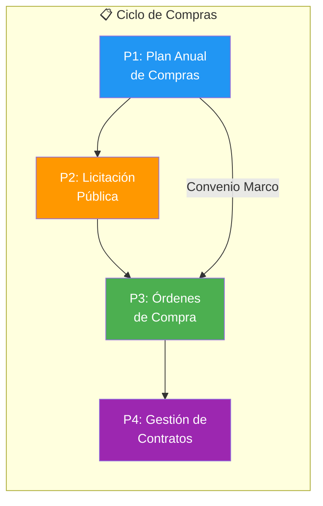
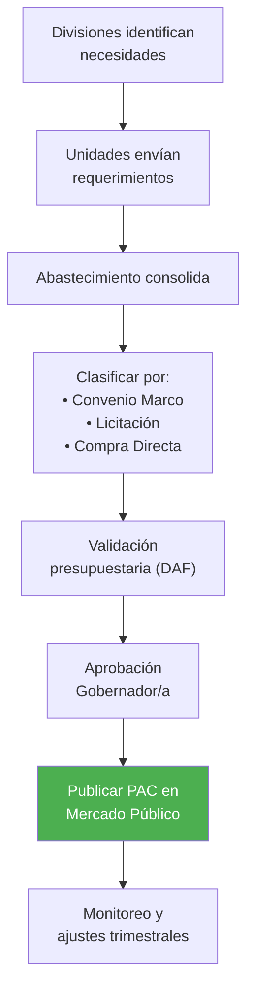
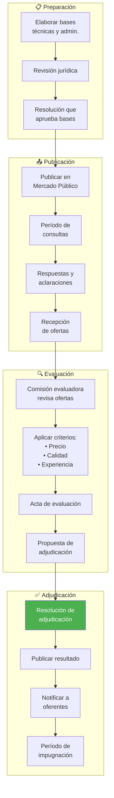
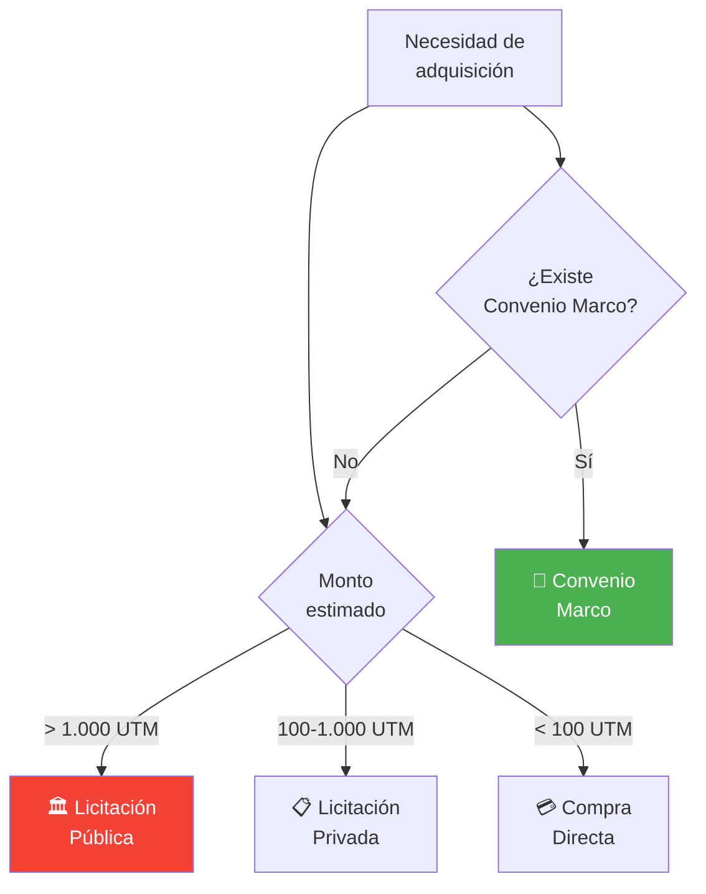
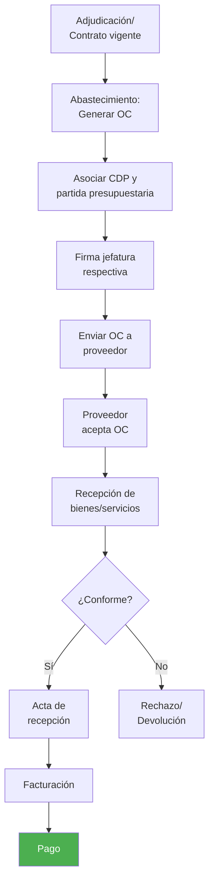
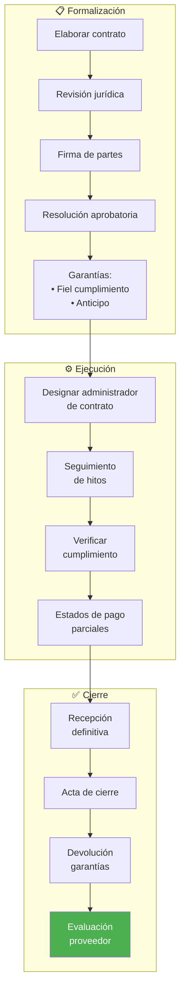

---
_manifest:
  urn: urn:gn:kb:bpmn-d04-compras-contrataciones
  provenance:
    created_by: gn_rebuild.py
    created_at: '2026-03-08'
    source: domains/gn/04_habilitadores/arquitectura/bpmn/D04_compras_contrataciones_koda.yml
version: 2.0.0
status: draft
tags:
- gore-nuble
- gobierno-regional
- compras-publicas
- bpmn
- gn
lang: es
extensions:
  gn:
    source_paths:
    - domains/gn/04_habilitadores/arquitectura/bpmn/D04_compras_contrataciones_koda.yml
    source_hashes:
      domains/gn/04_habilitadores/arquitectura/bpmn/D04_compras_contrataciones_koda.yml: 19700dc6bb9e38a84be1d89d8043f4178da2cc3349e284b132420e3bfb0a8c87
    source_type: koda_yaml
    transformation_mode: korafy_direct
    fs: 100
    cr: 1.18
    run_id: gn-smoke
    review_gate: auto
    scope_statement: null
    dependencies: []
    expected_sections:
    - Contenido
    skeleton_count: 16
    meat_count: 43
    fat_count: 0
    preserved_facts:
    - AI-Remediator=KODA-TRANSFORMER
    - "Body_MD.Content=\\# D04: Compras Públicas y Contrataciones\n\n\\## Metadatos\
      \ del Dominio\n\n| Campo           | Valor                                 \
      \                                                                          \
      \                                     |\n| --------------- | ----------------------------------------------------------------------------------------------------------------------------------------------------\
      \ |\n| **ID**          | `DOM-COMPRAS`                                     \
      \                                                                          \
      \                         |\n| **Criticidad**  | \U0001F7E0 Alta           \
      \                                                                          \
      \                                                          |\n| **Dueño**  \
      \     | Unidad de Abastecimiento                                           \
      \                                                                          \
      \        |\n| **Procesos**    | 4                                          \
      \                                                                          \
      \                                |\n| **Subprocesos** | ~12                \
      \                                                                          \
      \                                                        |\n| **Ref. Fuente**\
      \ | [kb_gn_054_bpmn_c4_koda.yml](file:///Users/felixsanhueza/Developer/gorenuble/knowledge/domains/gn/arquitectura/kb_gn_054_bpmn_c4_koda.yml)\
      \ L.700-950 |\n\n---\n\n\\## Mapa General del Dominio\n\n```mermaid\nflowchart\
      \ LR\n    subgraph CICLO[\"\U0001F4CB Ciclo de Compras\"]\n        P1[\"P1:\
      \ Plan Anual<br/>de Compras\"]\n        P2[\"P2: Licitación<br/>Pública\"]\n\
      \        P3[\"P3: Órdenes<br/>de Compra\"]\n        P4[\"P4: Gestión de<br/>Contratos\"\
      ]\n    end\n\n    P1 --> P2 --> P3 --> P4\n    P1 -->|\"Convenio Marco\"| P3\n\
      \n    style P1 fill:#2196F3,color:#fff\n    style P2 fill:#FF9800,color:#fff\n\
      \    style P3 fill:#4CAF50,color:#fff\n    style P4 fill:#9C27B0,color:#fff\n\
      ```\n\n---\n\n\\## P1: Plan Anual de Compras (PAC)\n\n| Campo       | Valor\
      \                    |\n| ----------- | ------------------------ |\n| **ID**\
      \      | `BPMN-GN-COMPRAS-PAC-01` |\n| **Período** | Anual (Diciembre-Enero)\
      \  |\n\n\\### Diagrama de Flujo\n\n```mermaid\nflowchart TD\n    A[\"Divisiones\
      \ identifican<br/>necesidades\"] --> B[\"Unidades envían<br/>requerimientos\"\
      ]\n    B --> C[\"Abastecimiento consolida\"]\n    C --> D[\"Clasificar por:<br/>•\
      \ Convenio Marco<br/>• Licitación<br/>• Compra Directa\"]\n    D --> E[\"Validación<br/>presupuestaria\
      \ (DAF)\"]\n    E --> F[\"Aprobación<br/>Gobernador/a\"]\n    F --> G[\"Publicar\
      \ PAC en<br/>Mercado Público\"]\n    G --> H[\"Monitoreo y<br/>ajustes trimestrales\"\
      ]\n\n    style G fill:#4CAF50,color:#fff\n```\n\n\\### Contenido del PAC\n\n\
      | Elemento          | Descripción              |\n| ----------------- | ------------------------\
      \ |\n| Producto/Servicio | Descripción detallada    |\n| Cantidad estimada |\
      \ Unidades requeridas      |\n| Monto estimado    | Valor en pesos         \
      \  |\n| Período           | Trimestre de adquisición |\n| Mecanismo        \
      \ | CM/LP/CD/TDP             |\n\n---\n\n\\## P2: Licitación Pública\n\n| Campo\
      \      | Valor                           |\n| ---------- | -------------------------------\
      \ |\n| **ID**     | `BPMN-GN-COMPRAS-MECANISMOS-01` |\n| **Umbral** | > 1.000\
      \ UTM                     |\n\n\\### Diagrama de Flujo\n\n```mermaid\nflowchart\
      \ TD\n    subgraph PREPARACION[\"\U0001F4CB Preparación\"]\n        A[\"Elaborar\
      \ bases<br/>técnicas y admin.\"]\n        B[\"Revisión jurídica\"]\n       \
      \ C[\"Resolución que<br/>aprueba bases\"]\n    end\n\n    subgraph PUBLICACION[\"\
      \U0001F4E4 Publicación\"]\n        D[\"Publicar en<br/>Mercado Público\"]\n\
      \        E[\"Período de<br/>consultas\"]\n        F[\"Respuestas y<br/>aclaraciones\"\
      ]\n        G[\"Recepción<br/>de ofertas\"]\n    end\n\n    subgraph EVALUACION[\"\
      \U0001F50D Evaluación\"]\n        H[\"Comisión evaluadora<br/>revisa ofertas\"\
      ]\n        I[\"Aplicar criterios:<br/>• Precio<br/>• Calidad<br/>• Experiencia\"\
      ]\n        J[\"Acta de evaluación\"]\n        K[\"Propuesta de<br/>adjudicación\"\
      ]\n    end\n\n    subgraph ADJUDICACION[\"✅ Adjudicación\"]\n        L[\"Resolución\
      \ de<br/>adjudicación\"]\n        M[\"Publicar resultado\"]\n        N[\"Notificar\
      \ a<br/>oferentes\"]\n        O[\"Período de<br/>impugnación\"]\n    end\n\n\
      \    A --> B --> C --> D --> E --> F --> G --> H --> I --> J --> K --> L -->\
      \ M --> N --> O\n\n    style L fill:#4CAF50,color:#fff\n```\n\n\\### Mecanismos\
      \ de Compra\n\n```mermaid\nflowchart TD\n    A[\"Necesidad de<br/>adquisición\"\
      ] --> B{\"Monto<br/>estimado\"}\n    \n    B -->|\"> 1.000 UTM\"| C[\"\U0001F3DB\
      ️ Licitación<br/>Pública\"]\n    B -->|\"100-1.000 UTM\"| D[\"\U0001F4CB Licitación<br/>Privada\"\
      ]\n    B -->|\"< 100 UTM\"| E[\"\U0001F4B3 Compra<br/>Directa\"]\n    \n   \
      \ A --> F{\"¿Existe<br/>Convenio Marco?\"}\n    F -->|\"Sí\"| G[\"\U0001F6D2\
      \ Convenio<br/>Marco\"]\n    F -->|\"No\"| B\n\n    style C fill:#f44336,color:#fff\n\
      \    style G fill:#4CAF50,color:#fff\n```\n\n---\n\n\\## P3: Ejecución de Órdenes\
      \ de Compra\n\n| Campo       | Valor                   |\n| ----------- | -----------------------\
      \ |\n| **ID**      | `BPMN-GN-COMPRAS-OC-01` |\n| **Sistema** | Mercado Público\
      \         |\n\n\\### Diagrama de Flujo\n\n```mermaid\nflowchart TD\n    A[\"\
      Adjudicación/<br/>Contrato vigente\"] --> B[\"Abastecimiento:<br/>Generar OC\"\
      ]\n    B --> C[\"Asociar CDP y<br/>partida presupuestaria\"]\n    C --> D[\"\
      Firma jefatura<br/>respectiva\"]\n    D --> E[\"Enviar OC a<br/>proveedor\"\
      ]\n    E --> F[\"Proveedor<br/>acepta OC\"]\n    F --> G[\"Recepción de<br/>bienes/servicios\"\
      ]\n    G --> H{\"¿Conforme?\"}\n    H -->|\"Sí\"| I[\"Acta de<br/>recepción\"\
      ]\n    H -->|\"No\"| J[\"Rechazo/<br/>Devolución\"]\n    I --> K[\"Facturación\"\
      ]\n    K --> L[\"Pago\"]\n\n    style L fill:#4CAF50,color:#fff\n```\n\n\\###\
      \ Estados de la OC\n\n| Estado       | Descripción                 |\n| ------------\
      \ | --------------------------- |\n| Generada     | OC creada en el sistema\
      \     |\n| Enviada      | Notificada al proveedor     |\n| Aceptada     | Proveedor\
      \ confirma          |\n| Recepcionada | Bienes/servicios entregados |\n| Pagada\
      \       | Proceso completado          |\n\n---\n\n\\## P4: Gestión de Contratos\n\
      \n| Campo           | Valor                          |\n| --------------- |\
      \ ------------------------------ |\n| **ID**          | `BPMN-GN-COMPRAS-CONTRATOS-01`\
      \ |\n| **Responsable** | Administrador de Contrato      |\n\n\\### Diagrama\
      \ de Flujo\n\n```mermaid\nflowchart TD\n    subgraph FORMALIZACION[\"\U0001F4CB\
      \ Formalización\"]\n        A[\"Elaborar contrato\"]\n        B[\"Revisión jurídica\"\
      ]\n        C[\"Firma de partes\"]\n        D[\"Resolución aprobatoria\"]\n \
      \       E[\"Garantías:<br/>• Fiel cumplimiento<br/>• Anticipo\"]\n    end\n\n\
      \    subgraph EJECUCION[\"⚙️ Ejecución\"]\n        F[\"Designar administrador<br/>de\
      \ contrato\"]\n        G[\"Seguimiento<br/>de hitos\"]\n        H[\"Verificar<br/>cumplimiento\"\
      ]\n        I[\"Estados de pago<br/>parciales\"]\n    end\n\n    subgraph CIERRE[\"\
      ✅ Cierre\"]\n        J[\"Recepción<br/>definitiva\"]\n        K[\"Acta de cierre\"\
      ]\n        L[\"Devolución<br/>garantías\"]\n        M[\"Evaluación<br/>proveedor\"\
      ]\n    end\n\n    A --> B --> C --> D --> E --> F --> G --> H --> I --> J -->\
      \ K --> L --> M\n\n    style M fill:#4CAF50,color:#fff\n```\n\n\\### Funciones\
      \ del Administrador de Contrato\n\n| Función       | Descripción           \
      \         |\n| ------------- | ------------------------------ |\n| Supervisión\
      \   | Verificar cumplimiento técnico |\n| Comunicación  | Enlace con proveedor\
      \           |\n| Documentación | Mantener expediente            |\n| Hitos \
      \        | Certificar avances             |\n| Pagos         | Autorizar estados\
      \ de pago      |\n\n---\n\n\\## Control y Transparencia\n\n\\### Obligaciones\
      \ de Publicación\n\n| Información       | Plataforma           |\n| -----------------\
      \ | -------------------- |\n| PAC               | Mercado Público      |\n|\
      \ Licitaciones      | Mercado Público      |\n| Adjudicaciones    | Mercado\
      \ Público      |\n| Contratos         | Transparencia Activa |\n| Órdenes de\
      \ Compra | Mercado Público      |\n\n\\### Prohibiciones\n\n> ⚠️ **Fraccionamiento\
      \ prohibido**: No dividir compras para eludir umbrales.\n\n> ⚠️ **Conflicto\
      \ de intereses**: Funcionarios deben declarar inhabilidades.\n\n---\n\n\\##\
      \ Sistemas Involucrados\n\n| Sistema           | Función                   \
      \        |\n| ----------------- | --------------------------------- |\n| `ORG-CHILECOMPRA`\
      \ | Mercado Público, OC, licitaciones |\n| `SYS-SIGFE`       | CDP, compromisos,\
      \ pagos           |\n| `SYS-DOCDIGITAL`  | Contratos, resoluciones         \
      \  |\n\n---\n\n\\## Normativa Aplicable\n\n| Norma                      | Alcance\
      \            |\n| -------------------------- | ------------------ |\n| **Ley\
      \ 19.886**             | Compras públicas   |\n| **Reglamento D.S. 250**   \
      \ | Procedimientos     |\n| **Directivas ChileCompra** | Operativas        \
      \ |\n| **Ley 20.730**             | Lobby y conflictos |\n\n---\n\n\\## Referencias\
      \ Cruzadas\n\n| Dominio Relacionado                                        \
      \                                                                          \
      \            | Vínculo                      |\n| ------------------------------------------------------------------------------------------------------------------------------------------------\
      \ | ---------------------------- |\n| [D02 Ciclo Presupuestario](file:///Users/felixsanhueza/Developer/gorenuble/knowledge/domains/gn/arquitectura/bpmn/D02_ciclo_presupuestario.md)\
      \   | CDP, compromisos             |\n| [D05 Inventarios](file:///Users/felixsanhueza/Developer/gorenuble/knowledge/domains/gn/arquitectura/bpmn/D05_inventarios_activo_fijo.md)\
      \         | Recepción de bienes          |\n| [D01 Actos Administrativos](file:///Users/felixsanhueza/Developer/gorenuble/knowledge/domains/gn/arquitectura/bpmn/D01_actos_administrativos.md)\
      \ | Resoluciones de adjudicación |\n\n---\n\n*Última actualización: 2025-12-16*\n"
    - Body_MD.ID=BPMN-GN-D04-COMPRAS-BODY-01
    - Body_MD.Src=sources/gn/arquitectura/bpmn/D04_compras_contrataciones.md
    - Creation-Date=2025-12-22
    - 'Ctx=Especificación STS del dominio D04: Compras Públicas y Contrataciones del
      GORE Ñuble, modelado en BPMN.'
    - Format=KODA/Spec
    - Human-Creator=FS
    - Human-Editor=FS
    - ID=BPMN-GN-D04-COMPRAS-KODA
    - 'LLM_Parsing_Instructions.Content=BEGIN_LLM_INSTRUCTIONS

      You are an AI agent consuming a KODA artifact. Parse with absolute fidelity.


      FIDELITY: Preserve meat (essential information) and skeleton (structure: headers,
      IDs, lists, tables) with zero loss. Ignore fat (filler words, rhetoric, stylistic
      prose).


      LEXICON (expand before processing): Act->Action, Cond->Condition, Cpt->Concept,
      Ctx->Context, Def->Definition, Fnd->Foundation, ID->ID, Mech->Mechanism, Mssn->Mission,
      Nat->Nature, Obj->Objective, Proc->Process, Prohib->Prohibition, Purp->Purpose,
      Ref->Reference, Req->Requirement, Res->Result, Resp->Responsible, Src->Source,
      Warn->Warning.


      REFERENCE POLICY: Ref: is internal only—must point to existing ID within THIS
      document. External documents and legal sources are mentioned as contextual information
      under Ctx: or Src:.


      LANGUAGE POLICY: Keywords in English (and abbreviated forms as listed), content
      in original language (Spanish). Never translate content.

      END_LLM_INSTRUCTIONS

      '
    - LLM_Parsing_Instructions.ID=KODA-LLM-PARSER-01
    - LLM_Parsing_Instructions.Prohib=Using for artifact creation or translation.
    - LLM_Parsing_Instructions.Req=Mandatory block following Metadata.
    - Metadatos_Dominio.Criticidad=🟠 Alta
    - Metadatos_Dominio.Dueno=Unidad de Abastecimiento
    - Metadatos_Dominio.ID=DOM-COMPRAS
    - Metadatos_Dominio.Procesos=4
    - Metadatos_Dominio.Ref_Fuente.Ctx_Required[0]=knowledge/domains/gn/arquitectura/kb_gn_054_bpmn_c4_koda.yml
      L.700-950
    - Metadatos_Dominio.Subprocesos=~12
    - Model-Collaborator[0]=Cascade
    - Modification-Date=2025-12-22
    - Source.Ctx_Required[0]=knowledge/domains/gn/arquitectura/kb_gn_054_bpmn_c4_koda.yml
    - Source.Primary-Source=sources/gn/arquitectura/bpmn/D04_compras_contrataciones.md
    - Status=Draft
    - Version=1.0.0
    - _manifest.compatibility.breaking_changes_from=null
    - _manifest.compatibility.min_consumer_version=1.0.0
    - _manifest.dependencies.requires[0].reason=KODA/Spec format compliance
    - _manifest.dependencies.requires[0].urn=urn:knowledge:koda:core:spec:1.0.0
    - _manifest.dependencies.requires[1].reason=Transformation methodology reference
    - _manifest.dependencies.requires[1].urn=urn:knowledge:koda:core:transform:1.0.0
    - _manifest.dependencies.requires[2].reason=Marco integrado BPMN/C4
    - _manifest.dependencies.requires[2].urn=urn:knowledge:gorenuble:gn:bpmn-c4:1.0.0
    - _manifest.federation.license=Institutional Use
    - _manifest.federation.visibility=internal
    - _manifest.provenance.created_at=2025-12-22
    - _manifest.provenance.created_by=FS
    - _manifest.provenance.last_modified_at=2025-12-22
    - _manifest.provenance.model_collaborators[0]=Cascade
    - _manifest.provenance.model_collaborators[1]=KODA-TRANSFORMER
    - _manifest.resolution.canonical_url=file://knowledge/domains/gn/arquitectura/bpmn/D04_compras_contrataciones_koda.yml
    - _manifest.urn=urn:knowledge:gorenuble:gn:bpmn-d04-compras-contrataciones:1.0.0
    cr_justification: Fuente altamente estructurada o derivacion de alcance acotado.
---

# BPMN D04: Compras Públicas y Contrataciones
## ID
BPMN-GN-D04-COMPRAS-KODA

## Version
1.0.0

## Status
Draft

## Format
KODA/Spec

## Human Creator
FS

## Human Editor
FS

## Model Collaborator
- Cascade

## AI Remediator
KODA-TRANSFORMER

## Creation Date
2025-12-22

## Modification Date
2025-12-22

## Ctx
Especificación STS del dominio D04: Compras Públicas y Contrataciones del GORE Ñuble, modelado en BPMN.

## Source
### Ctx Required
- knowledge/domains/gn/arquitectura/kb_gn_054_bpmn_c4_koda.yml
### Primary Source
sources/gn/arquitectura/bpmn/D04_compras_contrataciones.md

## LLM Parsing Instructions
### ID
KODA-LLM-PARSER-01
### Req
Mandatory block following Metadata.
### Prohib
Using for artifact creation or translation.
### Content
BEGIN_LLM_INSTRUCTIONS
You are an AI agent consuming a KODA artifact. Parse with absolute fidelity.

FIDELITY: Preserve meat (essential information) and skeleton (structure: headers, IDs, lists, tables) with zero loss. Ignore fat (filler words, rhetoric, stylistic prose).

LEXICON (expand before processing): Act->Action, Cond->Condition, Cpt->Concept, Ctx->Context, Def->Definition, Fnd->Foundation, ID->ID, Mech->Mechanism, Mssn->Mission, Nat->Nature, Obj->Objective, Proc->Process, Prohib->Prohibition, Purp->Purpose, Ref->Reference, Req->Requirement, Res->Result, Resp->Responsible, Src->Source, Warn->Warning.

REFERENCE POLICY: Ref: is internal only—must point to existing ID within THIS document. External documents and legal sources are mentioned as contextual information under Ctx: or Src:.

LANGUAGE POLICY: Keywords in English (and abbreviated forms as listed), content in original language (Spanish). Never translate content.
END_LLM_INSTRUCTIONS


## Metadatos Dominio
### ID
DOM-COMPRAS
### Criticidad
🟠 Alta
### Dueno
Unidad de Abastecimiento
### Procesos
4
### Subprocesos
~12
### Ref Fuente
#### Ctx Required
- knowledge/domains/gn/arquitectura/kb_gn_054_bpmn_c4_koda.yml L.700-950

## Body MD
### ID
BPMN-GN-D04-COMPRAS-BODY-01
### Src
sources/gn/arquitectura/bpmn/D04_compras_contrataciones.md
### Content
\# D04: Compras Públicas y Contrataciones

\## Metadatos del Dominio

| Campo           | Valor                                                                                                                                                |
| --------------- | ---------------------------------------------------------------------------------------------------------------------------------------------------- |
| **ID**          | `DOM-COMPRAS`                                                                                                                                        |
| **Criticidad**  | 🟠 Alta                                                                                                                                               |
| **Dueño**       | Unidad de Abastecimiento                                                                                                                             |
| **Procesos**    | 4                                                                                                                                                    |
| **Subprocesos** | ~12                                                                                                                                                  |
| **Ref. Fuente** | [kb_gn_054_bpmn_c4_koda.yml](file:///Users/felixsanhueza/Developer/gorenuble/knowledge/domains/gn/arquitectura/kb_gn_054_bpmn_c4_koda.yml) L.700-950 |

---

\## Mapa General del Dominio



---

\## P1: Plan Anual de Compras (PAC)

| Campo       | Valor                    |
| ----------- | ------------------------ |
| **ID**      | `BPMN-GN-COMPRAS-PAC-01` |
| **Período** | Anual (Diciembre-Enero)  |

\### Diagrama de Flujo



\### Contenido del PAC

| Elemento          | Descripción              |
| ----------------- | ------------------------ |
| Producto/Servicio | Descripción detallada    |
| Cantidad estimada | Unidades requeridas      |
| Monto estimado    | Valor en pesos           |
| Período           | Trimestre de adquisición |
| Mecanismo         | CM/LP/CD/TDP             |

---

\## P2: Licitación Pública

| Campo      | Valor                           |
| ---------- | ------------------------------- |
| **ID**     | `BPMN-GN-COMPRAS-MECANISMOS-01` |
| **Umbral** | > 1.000 UTM                     |

\### Diagrama de Flujo



\### Mecanismos de Compra



---

\## P3: Ejecución de Órdenes de Compra

| Campo       | Valor                   |
| ----------- | ----------------------- |
| **ID**      | `BPMN-GN-COMPRAS-OC-01` |
| **Sistema** | Mercado Público         |

\### Diagrama de Flujo



\### Estados de la OC

| Estado       | Descripción                 |
| ------------ | --------------------------- |
| Generada     | OC creada en el sistema     |
| Enviada      | Notificada al proveedor     |
| Aceptada     | Proveedor confirma          |
| Recepcionada | Bienes/servicios entregados |
| Pagada       | Proceso completado          |

---

\## P4: Gestión de Contratos

| Campo           | Valor                          |
| --------------- | ------------------------------ |
| **ID**          | `BPMN-GN-COMPRAS-CONTRATOS-01` |
| **Responsable** | Administrador de Contrato      |

\### Diagrama de Flujo



\### Funciones del Administrador de Contrato

| Función       | Descripción                    |
| ------------- | ------------------------------ |
| Supervisión   | Verificar cumplimiento técnico |
| Comunicación  | Enlace con proveedor           |
| Documentación | Mantener expediente            |
| Hitos         | Certificar avances             |
| Pagos         | Autorizar estados de pago      |

---

\## Control y Transparencia

\### Obligaciones de Publicación

| Información       | Plataforma           |
| ----------------- | -------------------- |
| PAC               | Mercado Público      |
| Licitaciones      | Mercado Público      |
| Adjudicaciones    | Mercado Público      |
| Contratos         | Transparencia Activa |
| Órdenes de Compra | Mercado Público      |

\### Prohibiciones

> ⚠️ **Fraccionamiento prohibido**: No dividir compras para eludir umbrales.

> ⚠️ **Conflicto de intereses**: Funcionarios deben declarar inhabilidades.

---

\## Sistemas Involucrados

| Sistema           | Función                           |
| ----------------- | --------------------------------- |
| `ORG-CHILECOMPRA` | Mercado Público, OC, licitaciones |
| `SYS-SIGFE`       | CDP, compromisos, pagos           |
| `SYS-DOCDIGITAL`  | Contratos, resoluciones           |

---

\## Normativa Aplicable

| Norma                      | Alcance            |
| -------------------------- | ------------------ |
| **Ley 19.886**             | Compras públicas   |
| **Reglamento D.S. 250**    | Procedimientos     |
| **Directivas ChileCompra** | Operativas         |
| **Ley 20.730**             | Lobby y conflictos |

---

\## Referencias Cruzadas

| Dominio Relacionado                                                                                                                              | Vínculo                      |
| ------------------------------------------------------------------------------------------------------------------------------------------------ | ---------------------------- |
| [D02 Ciclo Presupuestario](file:///Users/felixsanhueza/Developer/gorenuble/knowledge/domains/gn/arquitectura/bpmn/D02_ciclo_presupuestario.md)   | CDP, compromisos             |
| [D05 Inventarios](file:///Users/felixsanhueza/Developer/gorenuble/knowledge/domains/gn/arquitectura/bpmn/D05_inventarios_activo_fijo.md)         | Recepción de bienes          |
| [D01 Actos Administrativos](file:///Users/felixsanhueza/Developer/gorenuble/knowledge/domains/gn/arquitectura/bpmn/D01_actos_administrativos.md) | Resoluciones de adjudicación |

---

*Última actualización: 2025-12-16*
