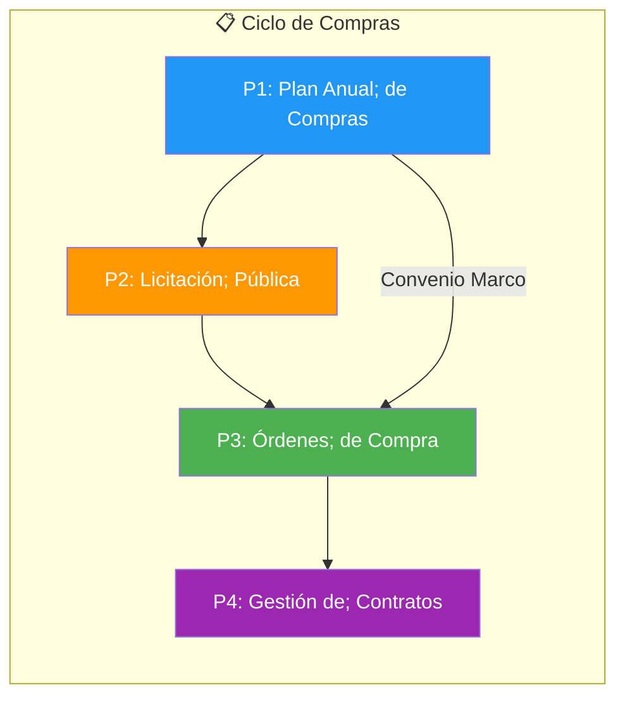
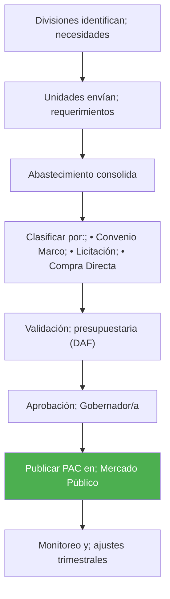
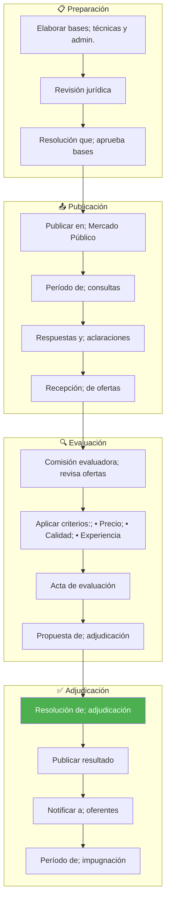
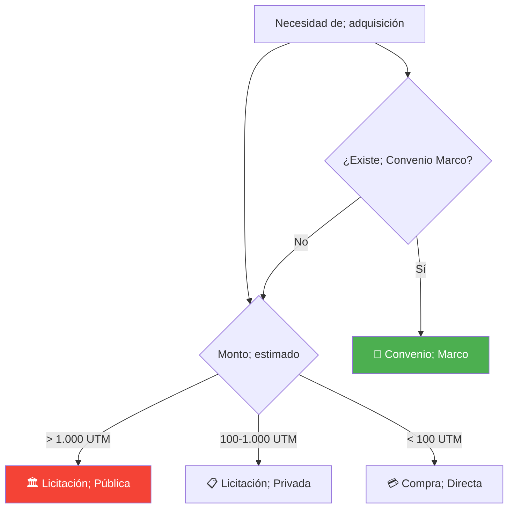
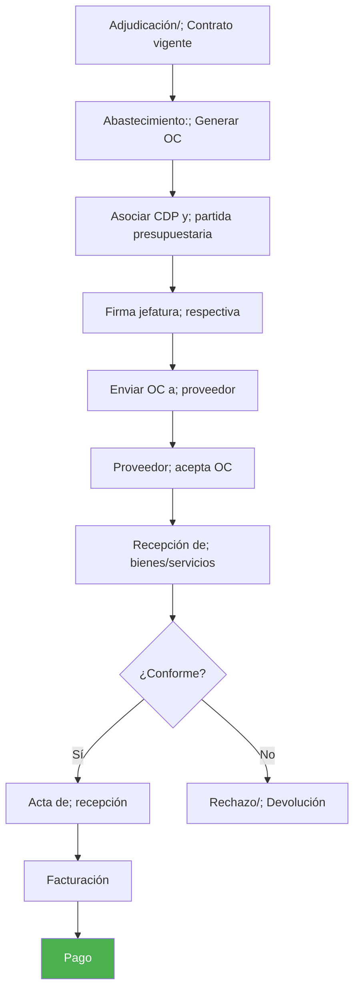
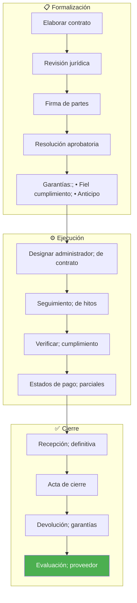

---
_manifest:
  urn: urn:gn:kb:bpmn-d04-compras-contrataciones
  provenance:
    created_by: gn_rebuild.py
    created_at: '2026-03-09'
    source: domains/gn/04_habilitadores/arquitectura/bpmn/D04_compras_contrataciones_koda.yml
version: 2.0.0
status: draft
tags:
- gore-nuble
- gobierno-regional
- compras-publicas
- bpmn
- gn
lang: es
extensions:
  gn:
    source_paths:
    - domains/gn/04_habilitadores/arquitectura/bpmn/D04_compras_contrataciones_koda.yml
    source_hashes:
      domains/gn/04_habilitadores/arquitectura/bpmn/D04_compras_contrataciones_koda.yml: 19700dc6bb9e38a84be1d89d8043f4178da2cc3349e284b132420e3bfb0a8c87
    source_type: koda_yaml
    transformation_mode: korafy_direct
    fs: 100
    cr: 1.06
    run_id: gn-smoke
    review_gate: auto
    scope_statement: null
    dependencies: []
    expected_sections:
    - Contenido
    document_family: generic
    publication_class: knowledge
    skeleton_count: 3
    meat_count: 11
    fat_count: 0
    cr_justification: Fuente altamente estructurada o derivacion de alcance acotado.
    evidence_path: build/gn-rebuild/gn-smoke/evidence/bpmn__bpmn-d04-compras-contrataciones.md.json
  kora:
    shard_index: 1
    shard_count: 1
    shard_root_urn: urn:gn:kb:bpmn-d04-compras-contrataciones
---

# D04: Compras Públicas y Contrataciones

## Metadatos del Dominio

| Campo | Valor |
| --------------- | ---------------------------------------------------------------------------------------------------------------------------------------------------- |
| **ID** | `DOM-COMPRAS` |
| **Criticidad** | 🟠 Alta |
| **Dueño** | Unidad de Abastecimiento |
| **Procesos** | 4 |
| **Subprocesos** | ~12 |
| **Ref. Fuente** | [kb_gn_054_bpmn_c4_koda.yml](file:///Users/felixsanhueza/Developer/gorenuble/knowledge/domains/gn/arquitectura/kb_gn_054_bpmn_c4_koda.yml) L.700-950 |

---

## Mapa General del Dominio

---

## P1: Plan Anual de Compras (PAC)

| Campo | Valor |
| ----------- | ------------------------ |
| **ID** | `BPMN-GN-COMPRAS-PAC-01` |
| **Período** | Anual (Diciembre-Enero) |

### Diagrama de Flujo

### Contenido del PAC

| Elemento | Descripción |
| ----------------- | ------------------------ |
| Producto/Servicio | Descripción detallada |
| Cantidad estimada | Unidades requeridas |
| Monto estimado | Valor en pesos |
| Período | Trimestre de adquisición |
| Mecanismo | CM/LP/CD/TDP |

---

## P2: Licitación Pública

| Campo | Valor |
| ---------- | ------------------------------- |
| **ID** | `BPMN-GN-COMPRAS-MECANISMOS-01` |
| **Umbral** | > 1.000 UTM |

### Diagrama de Flujo

### Mecanismos de Compra

---

## P3: Ejecución de Órdenes de Compra

| Campo | Valor |
| ----------- | ----------------------- |
| **ID** | `BPMN-GN-COMPRAS-OC-01` |
| **Sistema** | Mercado Público |

### Diagrama de Flujo

### Estados de la OC

| Estado | Descripción |
| ------------ | --------------------------- |
| Generada | OC creada en el sistema |
| Enviada | Notificada al proveedor |
| Aceptada | Proveedor confirma |
| Recepcionada | Bienes/servicios entregados |
| Pagada | Proceso completado |

---

## P4: Gestión de Contratos

| Campo | Valor |
| --------------- | ------------------------------ |
| **ID** | `BPMN-GN-COMPRAS-CONTRATOS-01` |
| **Responsable** | Administrador de Contrato |

### Diagrama de Flujo

### Funciones del Administrador de Contrato

| Función | Descripción |
| ------------- | ------------------------------ |
| Supervisión | Verificar cumplimiento técnico |
| Comunicación | Enlace con proveedor |
| Documentación | Mantener expediente |
| Hitos | Certificar avances |
| Pagos | Autorizar estados de pago |

---

## Control y Transparencia

### Obligaciones de Publicación

| Información | Plataforma |
| ----------------- | -------------------- |
| PAC | Mercado Público |
| Licitaciones | Mercado Público |
| Adjudicaciones | Mercado Público |
| Contratos | Transparencia Activa |
| Órdenes de Compra | Mercado Público |

### Prohibiciones

> ⚠️ **Fraccionamiento prohibido**: No dividir compras para eludir umbrales.

> ⚠️ **Conflicto de intereses**: Funcionarios deben declarar inhabilidades.

---

## Sistemas Involucrados

| Sistema | Función |
| ----------------- | --------------------------------- |
| `ORG-CHILECOMPRA` | Mercado Público, OC, licitaciones |
| `SYS-SIGFE` | CDP, compromisos, pagos |
| `SYS-DOCDIGITAL` | Contratos, resoluciones |

---

## Normativa Aplicable

| Norma | Alcance |
| -------------------------- | ------------------ |
| **Ley 19.886** | Compras públicas |
| **Reglamento D.S. 250** | Procedimientos |
| **Directivas ChileCompra** | Operativas |
| **Ley 20.730** | Lobby y conflictos |

---

## Referencias Cruzadas

| Dominio Relacionado | Vínculo |
| ------------------------------------------------------------------------------------------------------------------------------------------------ | ---------------------------- |
| [D02 Ciclo Presupuestario](file:///Users/felixsanhueza/Developer/gorenuble/knowledge/domains/gn/arquitectura/bpmn/D02_ciclo_presupuestario.md) | CDP, compromisos |
| [D05 Inventarios](file:///Users/felixsanhueza/Developer/gorenuble/knowledge/domains/gn/arquitectura/bpmn/D05_inventarios_activo_fijo.md) | Recepción de bienes |
| [D01 Actos Administrativos](file:///Users/felixsanhueza/Developer/gorenuble/knowledge/domains/gn/arquitectura/bpmn/D01_actos_administrativos.md) | Resoluciones de adjudicación |

---

*Última actualización: 2025-12-16*
