---
_manifest:
  urn: urn:gn:kb:bpmn-d05-inventarios-activo-fijo
  provenance:
    created_by: gn_rebuild.py
    created_at: '2026-03-10'
    source: domains/gn/04_habilitadores/arquitectura/bpmn/D05_inventarios_activo_fijo_koda.yml
version: 2.0.0
status: draft
tags:
- gore-nuble
- gobierno-regional
- bpmn
- inventarios
- activo-fijo
- sigas
- sigfe
- gn
lang: es
extensions:
  gn:
    source_paths:
    - domains/gn/04_habilitadores/arquitectura/bpmn/D05_inventarios_activo_fijo_koda.yml
    source_hashes:
      domains/gn/04_habilitadores/arquitectura/bpmn/D05_inventarios_activo_fijo_koda.yml: 866b4cd7ee85542957200f88eb2a6f4dd9e97886a4eeb904c40ca0aa0751050c
    source_type: koda_yaml
    transformation_mode: korafy_direct
    fs: 100
    cr: 1.06
    run_id: gn-smoke
    review_gate: auto
    scope_statement: null
    dependencies: []
    expected_sections:
    - Contenido
    document_family: generic
    publication_class: knowledge
    skeleton_count: 3
    meat_count: 11
    fat_count: 0
    cr_justification: Fuente altamente estructurada o derivacion de alcance acotado.
    evidence_path: build/gn-rebuild/gn-smoke/evidence/bpmn__bpmn-d05-inventarios-activo-fijo.md.json
  kora:
    shard_index: 1
    shard_count: 1
    shard_root_urn: urn:gn:kb:bpmn-d05-inventarios-activo-fijo
---

# D05: Gestión de Inventarios y Activo Fijo

## Metadatos del Dominio

| Campo | Valor |
| --------------- | ----------------------------------------------------------------------------------------------------------------------------------------------------- |
| **ID** | `DOM-INVENTARIOS-AF` |
| **Criticidad** | 🟡 Media |
| **Dueño** | DAF |
| **Procesos** | 2 |
| **Subprocesos** | ~10 |
| **Ref. Fuente** | [kb_gn_054_bpmn_c4_koda.yml] L.960-1200 |

---

## Mapa General del Dominio

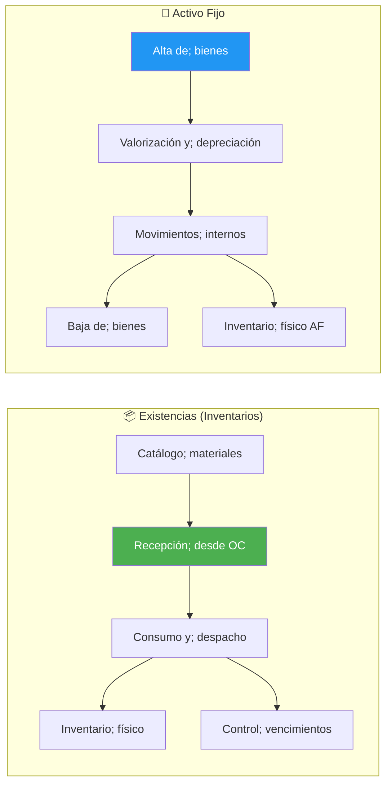

---

## P1: Gestión de Inventarios y Bodegas

| Campo | Valor |
| ----------- | -------------------------------- |
| **ID** | `BPMN-GN-INVENTARIOS-BODEGAS-01` |
| **Sistema** | SIGAS |

### Catálogo de Materiales

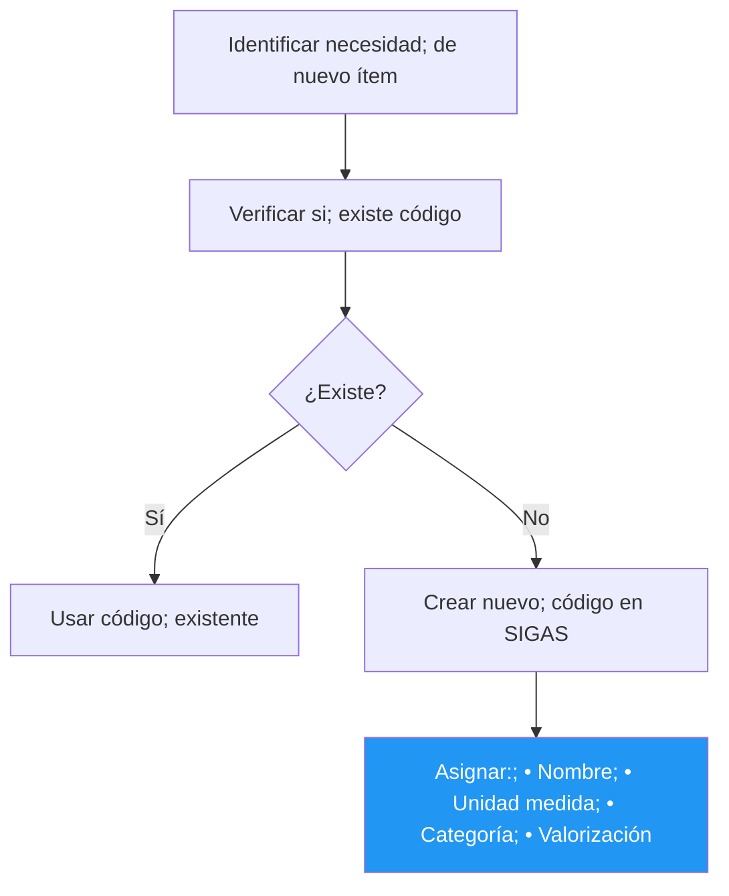

### Recepción de Bienes desde OC

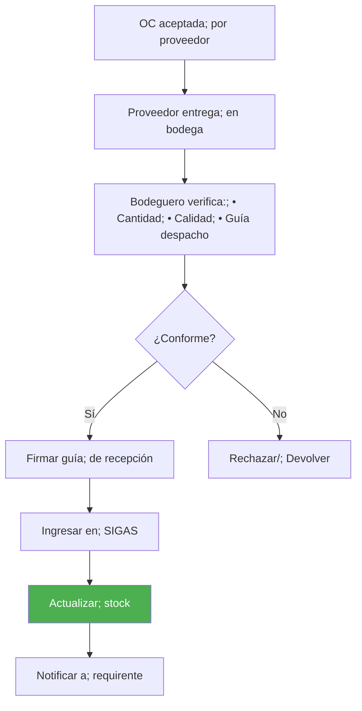

### Consumo y Despacho

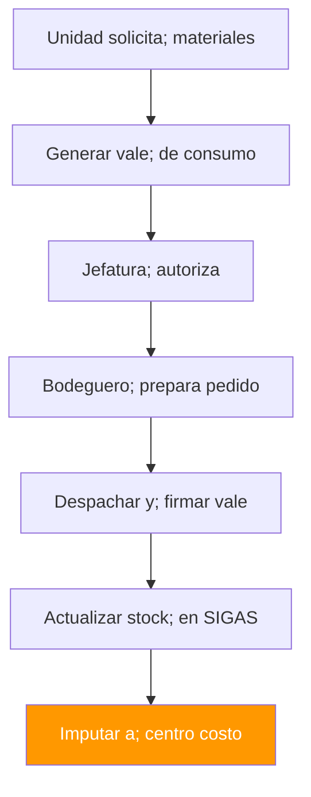

### Inventario Físico

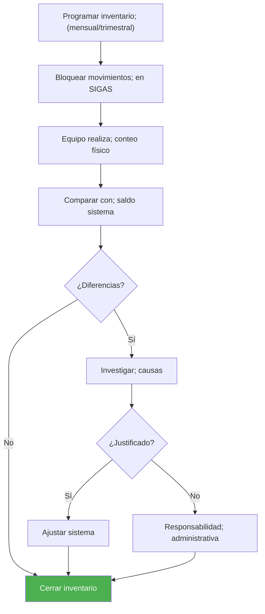

### Control de Vencimientos (FEFO)

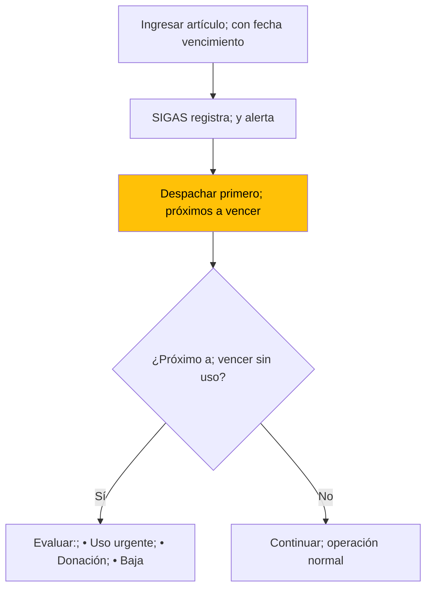

### Valorización de Existencias

| Método | Descripción | Uso |
| -------- | ------------------------- | ----------- |
| **PPP** | Precio Promedio Ponderado | Default |
| **FIFO** | First In, First Out | Alternativo |
| **FEFO** | First Expired, First Out | Perecibles |

---

## P2: Gestión de Activo Fijo

| Campo | Valor |
| ------------- | ------------------------ |
| **ID** | `BPMN-GN-ACTIVO-FIJO-01` |
| **Umbral** | ≥ 3 UTM para capitalizar |
| **Normativa** | NICSP 17, 21, 31 |

### Alta de Bienes

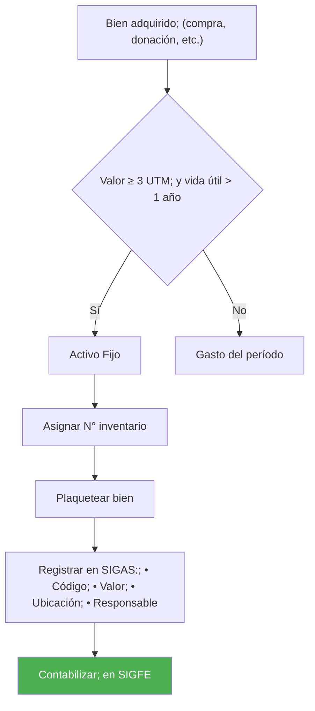

### Valorización y Depreciación

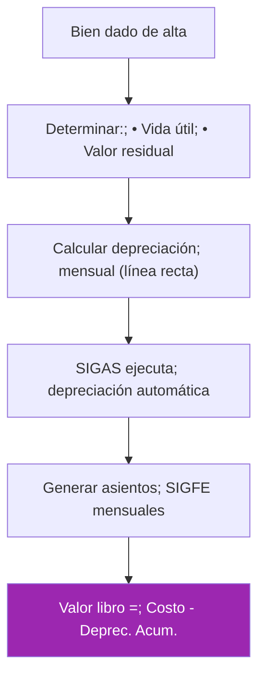

### Movimientos Internos

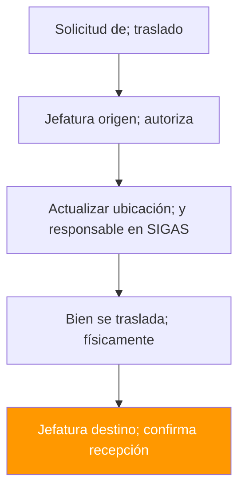

### Baja de Bienes

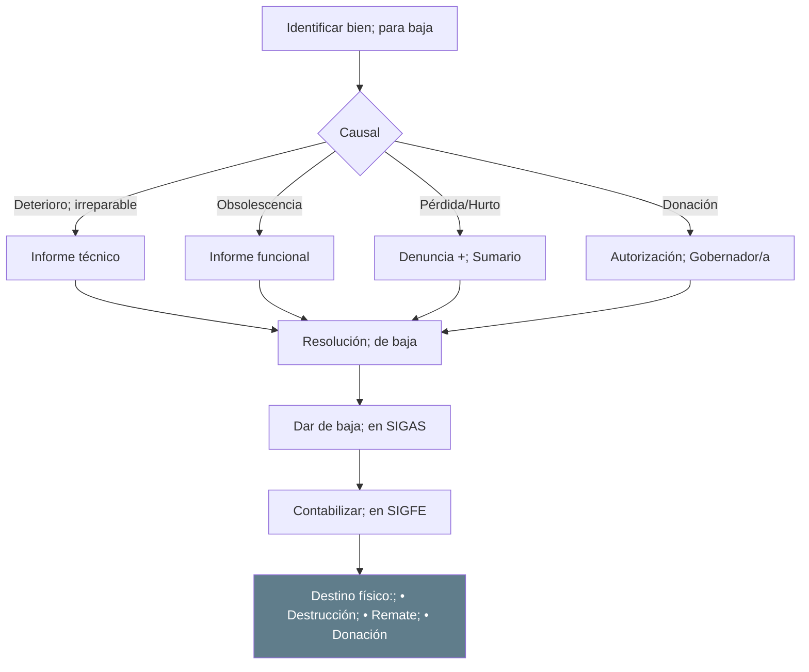

### Inventario Físico Activo Fijo

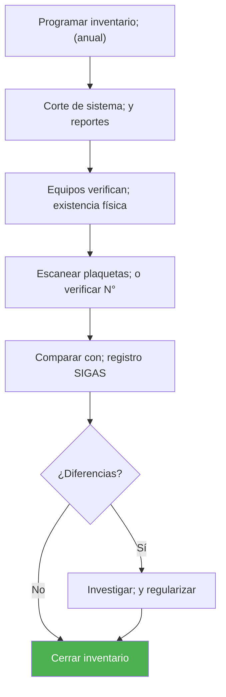

---

## Casos Especiales

### Bienes de Proyectos FNDR

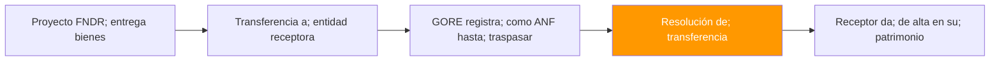

### Comodatos y Préstamos

| Tipo | Descripción |
| ---------------------- | -------------------------------- |
| **Comodato recibido** | Bien de tercero en custodia GORE |
| **Comodato entregado** | Bien GORE en custodia de tercero |

> ⚠️ Ambos requieren convenio y registro separado en control paralelo.

---

## Sistemas Involucrados

| Sistema | Función |
| ------------ | --------------------------- |
| `SYS-SIGAS` | Gestión de inventarios y AF |
| `SYS-SIGFE` | Contabilización |
| `SYS-SIGFIN` | Integración financiera |

---

## Normativa Aplicable

| Norma | Alcance |
| -------------- | -------------------------------- |
| **NICSP 17** | Propiedad, planta y equipo |
| **NICSP 21** | Deterioro activos no generadores |
| **NICSP 31** | Activos intangibles |
| **Res. CGR** | Procedimientos de baja |
| **Ley 18.575** | Responsabilidad patrimonial |

---

## Referencias Cruzadas

| Dominio Relacionado | Vínculo |
| ---------------------------------------------------------------------------------------------------------------------------------------------- | ------------------ |
| [D04 Compras] | Recepción desde OC |
| [D02 Ciclo Presupuestario] | Contabilización AF |

---

*Última actualización: 2025-12-16*
