---
_manifest:
  urn: urn:gn:kb:bpmn-d05-inventarios-activo-fijo
  provenance:
    created_by: gn_rebuild.py
    created_at: '2026-03-08'
    source: domains/gn/04_habilitadores/arquitectura/bpmn/D05_inventarios_activo_fijo_koda.yml
version: 2.0.0
status: draft
tags:
- gore-nuble
- gobierno-regional
- bpmn
- inventarios
- activo-fijo
- sigas
- sigfe
- gn
lang: es
extensions:
  gn:
    source_paths:
    - domains/gn/04_habilitadores/arquitectura/bpmn/D05_inventarios_activo_fijo_koda.yml
    source_hashes:
      domains/gn/04_habilitadores/arquitectura/bpmn/D05_inventarios_activo_fijo_koda.yml: 866b4cd7ee85542957200f88eb2a6f4dd9e97886a4eeb904c40ca0aa0751050c
    source_type: koda_yaml
    transformation_mode: korafy_direct
    fs: 100
    cr: 1.18
    run_id: gn-smoke
    review_gate: auto
    scope_statement: null
    dependencies: []
    expected_sections:
    - Contenido
    skeleton_count: 16
    meat_count: 43
    fat_count: 0
    preserved_facts:
    - AI-Remediator=KODA-TRANSFORMER
    - "Body_MD.Content=\\# D05: Gestión de Inventarios y Activo Fijo\n\n\\## Metadatos\
      \ del Dominio\n\n| Campo           | Valor                                 \
      \                                                                          \
      \                                      |\n| --------------- | -----------------------------------------------------------------------------------------------------------------------------------------------------\
      \ |\n| **ID**          | `DOM-INVENTARIOS-AF`                              \
      \                                                                          \
      \                          |\n| **Criticidad**  | \U0001F7E1 Media         \
      \                                                                          \
      \                                                            |\n| **Dueño**\
      \       | DAF                                                              \
      \                                                                          \
      \           |\n| **Procesos**    | 2                                       \
      \                                                                          \
      \                                    |\n| **Subprocesos** | ~10            \
      \                                                                          \
      \                                                             |\n| **Ref. Fuente**\
      \ | [kb_gn_054_bpmn_c4_koda.yml](file:///Users/felixsanhueza/Developer/gorenuble/knowledge/domains/gn/arquitectura/kb_gn_054_bpmn_c4_koda.yml)\
      \ L.960-1200 |\n\n---\n\n\\## Mapa General del Dominio\n\n```mermaid\nflowchart\
      \ LR\n    subgraph EXISTENCIAS[\"\U0001F4E6 Existencias (Inventarios)\"]\n \
      \       P1A[\"Catálogo<br/>materiales\"]\n        P1B[\"Recepción<br/>desde\
      \ OC\"]\n        P1C[\"Consumo y<br/>despacho\"]\n        P1D[\"Inventario<br/>físico\"\
      ]\n        P1E[\"Control<br/>vencimientos\"]\n    end\n\n    subgraph ACTIVO_FIJO[\"\
      \U0001F3E2 Activo Fijo\"]\n        P2A[\"Alta de<br/>bienes\"]\n        P2B[\"\
      Valorización y<br/>depreciación\"]\n        P2C[\"Movimientos<br/>internos\"\
      ]\n        P2D[\"Baja de<br/>bienes\"]\n        P2E[\"Inventario<br/>físico\
      \ AF\"]\n    end\n\n    P1A --> P1B --> P1C --> P1D\n    P1C --> P1E\n    P2A\
      \ --> P2B --> P2C\n    P2C --> P2D\n    P2C --> P2E\n\n    style P1B fill:#4CAF50,color:#fff\n\
      \    style P2A fill:#2196F3,color:#fff\n```\n\n---\n\n\\## P1: Gestión de Inventarios\
      \ y Bodegas\n\n| Campo       | Valor                            |\n| -----------\
      \ | -------------------------------- |\n| **ID**      | `BPMN-GN-INVENTARIOS-BODEGAS-01`\
      \ |\n| **Sistema** | SIGAS                            |\n\n\\### Catálogo de\
      \ Materiales\n\n```mermaid\nflowchart TD\n    A[\"Identificar necesidad<br/>de\
      \ nuevo ítem\"] --> B[\"Verificar si<br/>existe código\"]\n    B --> C{\"¿Existe?\"\
      }\n    C -->|\"Sí\"| D[\"Usar código<br/>existente\"]\n    C -->|\"No\"| E[\"\
      Crear nuevo<br/>código en SIGAS\"]\n    E --> F[\"Asignar:<br/>• Nombre<br/>•\
      \ Unidad medida<br/>• Categoría<br/>• Valorización\"]\n\n    style F fill:#2196F3,color:#fff\n\
      ```\n\n\\### Recepción de Bienes desde OC\n\n```mermaid\nflowchart TD\n    A[\"\
      OC aceptada<br/>por proveedor\"] --> B[\"Proveedor entrega<br/>en bodega\"]\n\
      \    B --> C[\"Bodeguero verifica:<br/>• Cantidad<br/>• Calidad<br/>• Guía despacho\"\
      ]\n    C --> D{\"¿Conforme?\"}\n    D -->|\"Sí\"| E[\"Firmar guía<br/>de recepción\"\
      ]\n    D -->|\"No\"| F[\"Rechazar/<br/>Devolver\"]\n    E --> G[\"Ingresar en<br/>SIGAS\"\
      ]\n    G --> H[\"Actualizar<br/>stock\"]\n    H --> I[\"Notificar a<br/>requirente\"\
      ]\n\n    style H fill:#4CAF50,color:#fff\n```\n\n\\### Consumo y Despacho\n\n\
      ```mermaid\nflowchart TD\n    A[\"Unidad solicita<br/>materiales\"] --> B[\"\
      Generar vale<br/>de consumo\"]\n    B --> C[\"Jefatura<br/>autoriza\"]\n   \
      \ C --> D[\"Bodeguero<br/>prepara pedido\"]\n    D --> E[\"Despachar y<br/>firmar\
      \ vale\"]\n    E --> F[\"Actualizar stock<br/>en SIGAS\"]\n    F --> G[\"Imputar\
      \ a<br/>centro costo\"]\n\n    style G fill:#FF9800,color:#fff\n```\n\n\\###\
      \ Inventario Físico\n\n```mermaid\nflowchart TD\n    A[\"Programar inventario<br/>(mensual/trimestral)\"\
      ] --> B[\"Bloquear movimientos<br/>en SIGAS\"]\n    B --> C[\"Equipo realiza<br/>conteo\
      \ físico\"]\n    C --> D[\"Comparar con<br/>saldo sistema\"]\n    D --> E{\"\
      ¿Diferencias?\"}\n    E -->|\"Sí\"| F[\"Investigar<br/>causas\"]\n    E -->|\"\
      No\"| G[\"Cerrar inventario\"]\n    F --> H{\"¿Justificado?\"}\n    H -->|\"\
      Sí\"| I[\"Ajustar sistema\"]\n    H -->|\"No\"| J[\"Responsabilidad<br/>administrativa\"\
      ]\n    I --> G\n    J --> G\n\n    style G fill:#4CAF50,color:#fff\n```\n\n\\\
      ### Control de Vencimientos (FEFO)\n\n```mermaid\nflowchart TD\n    A[\"Ingresar\
      \ artículo<br/>con fecha vencimiento\"] --> B[\"SIGAS registra<br/>y alerta\"\
      ]\n    B --> C[\"Despachar primero<br/>próximos a vencer\"]\n    C --> D{\"\
      ¿Próximo a<br/>vencer sin uso?\"}\n    D -->|\"Sí\"| E[\"Evaluar:<br/>• Uso\
      \ urgente<br/>• Donación<br/>• Baja\"]\n    D -->|\"No\"| F[\"Continuar<br/>operación\
      \ normal\"]\n\n    style C fill:#FFC107,color:#000\n```\n\n\\### Valorización\
      \ de Existencias\n\n| Método   | Descripción               | Uso         |\n\
      | -------- | ------------------------- | ----------- |\n| **PPP**  | Precio\
      \ Promedio Ponderado | Default     |\n| **FIFO** | First In, First Out     \
      \  | Alternativo |\n| **FEFO** | First Expired, First Out  | Perecibles  |\n\
      \n---\n\n\\## P2: Gestión de Activo Fijo\n\n| Campo         | Valor        \
      \            |\n| ------------- | ------------------------ |\n| **ID**     \
      \   | `BPMN-GN-ACTIVO-FIJO-01` |\n| **Umbral**    | ≥ 3 UTM para capitalizar\
      \ |\n| **Normativa** | NICSP 17, 21, 31         |\n\n\\### Alta de Bienes\n\n\
      ```mermaid\nflowchart TD\n    A[\"Bien adquirido<br/>(compra, donación, etc.)\"\
      ] --> B{\"Valor ≥ 3 UTM<br/>y vida útil > 1 año\"}\n    B -->|\"Sí\"| C[\"Activo\
      \ Fijo\"]\n    B -->|\"No\"| D[\"Gasto del período\"]\n    C --> E[\"Asignar\
      \ N° inventario\"]\n    E --> F[\"Plaquetear bien\"]\n    F --> G[\"Registrar\
      \ en SIGAS:<br/>• Código<br/>• Valor<br/>• Ubicación<br/>• Responsable\"]\n\
      \    G --> H[\"Contabilizar<br/>en SIGFE\"]\n\n    style H fill:#4CAF50,color:#fff\n\
      ```\n\n\\### Valorización y Depreciación\n\n```mermaid\nflowchart TD\n    A[\"\
      Bien dado de alta\"] --> B[\"Determinar:<br/>• Vida útil<br/>• Valor residual\"\
      ]\n    B --> C[\"Calcular depreciación<br/>mensual (línea recta)\"]\n    C -->\
      \ D[\"SIGAS ejecuta<br/>depreciación automática\"]\n    D --> E[\"Generar asientos<br/>SIGFE\
      \ mensuales\"]\n    E --> F[\"Valor libro =<br/>Costo - Deprec. Acum.\"]\n\n\
      \    style F fill:#9C27B0,color:#fff\n```\n\n\\### Movimientos Internos\n\n\
      ```mermaid\nflowchart TD\n    A[\"Solicitud de<br/>traslado\"] --> B[\"Jefatura\
      \ origen<br/>autoriza\"]\n    B --> C[\"Actualizar ubicación<br/>y responsable\
      \ en SIGAS\"]\n    C --> D[\"Bien se traslada<br/>físicamente\"]\n    D -->\
      \ E[\"Jefatura destino<br/>confirma recepción\"]\n\n    style E fill:#FF9800,color:#fff\n\
      ```\n\n\\### Baja de Bienes\n\n```mermaid\nflowchart TD\n    A[\"Identificar\
      \ bien<br/>para baja\"] --> B{\"Causal\"}\n    B -->|\"Deterioro<br/>irreparable\"\
      | C[\"Informe técnico\"]\n    B -->|\"Obsolescencia\"| D[\"Informe funcional\"\
      ]\n    B -->|\"Pérdida/Hurto\"| E[\"Denuncia +<br/>Sumario\"]\n    B -->|\"\
      Donación\"| F[\"Autorización<br/>Gobernador/a\"]\n    \n    C & D & E & F -->\
      \ G[\"Resolución<br/>de baja\"]\n    G --> H[\"Dar de baja<br/>en SIGAS\"]\n\
      \    H --> I[\"Contabilizar<br/>en SIGFE\"]\n    I --> J[\"Destino físico:<br/>•\
      \ Destrucción<br/>• Remate<br/>• Donación\"]\n\n    style J fill:#607D8B,color:#fff\n\
      ```\n\n\\### Inventario Físico Activo Fijo\n\n```mermaid\nflowchart TD\n   \
      \ A[\"Programar inventario<br/>(anual)\"] --> B[\"Corte de sistema<br/>y reportes\"\
      ]\n    B --> C[\"Equipos verifican<br/>existencia física\"]\n    C --> D[\"\
      Escanear plaquetas<br/>o verificar N°\"]\n    D --> E[\"Comparar con<br/>registro\
      \ SIGAS\"]\n    E --> F{\"¿Diferencias?\"}\n    F -->|\"Sí\"| G[\"Investigar<br/>y\
      \ regularizar\"]\n    F -->|\"No\"| H[\"Cerrar inventario\"]\n    G --> H\n\n\
      \    style H fill:#4CAF50,color:#fff\n```\n\n---\n\n\\## Casos Especiales\n\n\
      \\### Bienes de Proyectos FNDR\n\n```mermaid\nflowchart LR\n    A[\"Proyecto\
      \ FNDR<br/>entrega bienes\"] --> B[\"Transferencia a<br/>entidad receptora\"\
      ]\n    B --> C[\"GORE registra<br/>como ANF hasta<br/>traspasar\"]\n    C -->\
      \ D[\"Resolución de<br/>transferencia\"]\n    D --> E[\"Receptor da<br/>de alta\
      \ en su<br/>patrimonio\"]\n\n    style D fill:#FF9800,color:#fff\n```\n\n\\\
      ### Comodatos y Préstamos\n\n| Tipo                   | Descripción        \
      \              |\n| ---------------------- | --------------------------------\
      \ |\n| **Comodato recibido**  | Bien de tercero en custodia GORE |\n| **Comodato\
      \ entregado** | Bien GORE en custodia de tercero |\n\n> ⚠️ Ambos requieren convenio\
      \ y registro separado en control paralelo.\n\n---\n\n\\## Sistemas Involucrados\n\
      \n| Sistema      | Función                     |\n| ------------ | ---------------------------\
      \ |\n| `SYS-SIGAS`  | Gestión de inventarios y AF |\n| `SYS-SIGFE`  | Contabilización\
      \             |\n| `SYS-SIGFIN` | Integración financiera      |\n\n---\n\n\\\
      ## Normativa Aplicable\n\n| Norma          | Alcance                       \
      \   |\n| -------------- | -------------------------------- |\n| **NICSP 17**\
      \   | Propiedad, planta y equipo       |\n| **NICSP 21**   | Deterioro activos\
      \ no generadores |\n| **NICSP 31**   | Activos intangibles              |\n\
      | **Res. CGR**   | Procedimientos de baja           |\n| **Ley 18.575** | Responsabilidad\
      \ patrimonial      |\n\n---\n\n\\## Referencias Cruzadas\n\n| Dominio Relacionado\
      \                                                                          \
      \                                                  | Vínculo            |\n\
      | ----------------------------------------------------------------------------------------------------------------------------------------------\
      \ | ------------------ |\n| [D04 Compras](file:///Users/felixsanhueza/Developer/gorenuble/knowledge/domains/gn/arquitectura/bpmn/D04_compras_contrataciones.md)\
      \            | Recepción desde OC |\n| [D02 Ciclo Presupuestario](file:///Users/felixsanhueza/Developer/gorenuble/knowledge/domains/gn/arquitectura/bpmn/D02_ciclo_presupuestario.md)\
      \ | Contabilización AF |\n\n---\n\n*Última actualización: 2025-12-16*\n"
    - Body_MD.ID=BPMN-GN-D05-INVENTARIOS-AF-BODY-01
    - Body_MD.Src=sources/gn/arquitectura/bpmn/D05_inventarios_activo_fijo.md
    - Creation-Date=2025-12-22
    - 'Ctx=Especificación STS del dominio D05: Gestión de Inventarios y Activo Fijo
      del GORE Ñuble, modelado en BPMN.'
    - Format=KODA/Spec
    - Human-Creator=FS
    - Human-Editor=FS
    - ID=BPMN-GN-D05-INVENTARIOS-AF-KODA
    - 'LLM_Parsing_Instructions.Content=BEGIN_LLM_INSTRUCTIONS

      You are an AI agent consuming a KODA artifact. Parse with absolute fidelity.


      FIDELITY: Preserve meat (essential information) and skeleton (structure: headers,
      IDs, lists, tables) with zero loss. Ignore fat (filler words, rhetoric, stylistic
      prose).


      LEXICON (expand before processing): Act->Action, Cond->Condition, Cpt->Concept,
      Ctx->Context, Def->Definition, Fnd->Foundation, ID->ID, Mech->Mechanism, Mssn->Mission,
      Nat->Nature, Obj->Objective, Proc->Process, Prohib->Prohibition, Purp->Purpose,
      Ref->Reference, Req->Requirement, Res->Result, Resp->Responsible, Src->Source,
      Warn->Warning.


      REFERENCE POLICY: Ref: is internal only—must point to existing ID within THIS
      document. External documents and legal sources are mentioned as contextual information
      under Ctx: or Src:.


      LANGUAGE POLICY: Keywords in English (and abbreviated forms as listed), content
      in original language (Spanish). Never translate content.

      END_LLM_INSTRUCTIONS

      '
    - LLM_Parsing_Instructions.ID=KODA-LLM-PARSER-01
    - LLM_Parsing_Instructions.Prohib=Using for artifact creation or translation.
    - LLM_Parsing_Instructions.Req=Mandatory block following Metadata.
    - Metadatos_Dominio.Criticidad=🟡 Media
    - Metadatos_Dominio.Dueno=DAF
    - Metadatos_Dominio.ID=DOM-INVENTARIOS-AF
    - Metadatos_Dominio.Procesos=2
    - Metadatos_Dominio.Ref_Fuente.Ctx_Required[0]=knowledge/domains/gn/arquitectura/kb_gn_054_bpmn_c4_koda.yml
      L.960-1200
    - Metadatos_Dominio.Subprocesos=~10
    - Model-Collaborator[0]=Cascade
    - Modification-Date=2025-12-22
    - Source.Ctx_Required[0]=knowledge/domains/gn/arquitectura/kb_gn_054_bpmn_c4_koda.yml
    - Source.Primary-Source=sources/gn/arquitectura/bpmn/D05_inventarios_activo_fijo.md
    - Status=Draft
    - Version=1.0.0
    - _manifest.compatibility.breaking_changes_from=null
    - _manifest.compatibility.min_consumer_version=1.0.0
    - _manifest.dependencies.requires[0].reason=KODA/Spec format compliance
    - _manifest.dependencies.requires[0].urn=urn:knowledge:koda:core:spec:1.0.0
    - _manifest.dependencies.requires[1].reason=Transformation methodology reference
    - _manifest.dependencies.requires[1].urn=urn:knowledge:koda:core:transform:1.0.0
    - _manifest.dependencies.requires[2].reason=Marco integrado BPMN/C4
    - _manifest.dependencies.requires[2].urn=urn:knowledge:gorenuble:gn:bpmn-c4:1.0.0
    - _manifest.federation.license=Institutional Use
    - _manifest.federation.visibility=internal
    - _manifest.provenance.created_at=2025-12-22
    - _manifest.provenance.created_by=FS
    - _manifest.provenance.last_modified_at=2025-12-22
    - _manifest.provenance.model_collaborators[0]=Cascade
    - _manifest.provenance.model_collaborators[1]=KODA-TRANSFORMER
    - _manifest.resolution.canonical_url=file://knowledge/domains/gn/arquitectura/bpmn/D05_inventarios_activo_fijo_koda.yml
    - _manifest.urn=urn:knowledge:gorenuble:gn:bpmn-d05-inventarios-activo-fijo:1.0.0
    cr_justification: Fuente altamente estructurada o derivacion de alcance acotado.
---

# BPMN D05: Gestión de Inventarios y Activo Fijo
## ID
BPMN-GN-D05-INVENTARIOS-AF-KODA

## Version
1.0.0

## Status
Draft

## Format
KODA/Spec

## Human Creator
FS

## Human Editor
FS

## Model Collaborator
- Cascade

## AI Remediator
KODA-TRANSFORMER

## Creation Date
2025-12-22

## Modification Date
2025-12-22

## Ctx
Especificación STS del dominio D05: Gestión de Inventarios y Activo Fijo del GORE Ñuble, modelado en BPMN.

## Source
### Ctx Required
- knowledge/domains/gn/arquitectura/kb_gn_054_bpmn_c4_koda.yml
### Primary Source
sources/gn/arquitectura/bpmn/D05_inventarios_activo_fijo.md

## LLM Parsing Instructions
### ID
KODA-LLM-PARSER-01
### Req
Mandatory block following Metadata.
### Prohib
Using for artifact creation or translation.
### Content
BEGIN_LLM_INSTRUCTIONS
You are an AI agent consuming a KODA artifact. Parse with absolute fidelity.

FIDELITY: Preserve meat (essential information) and skeleton (structure: headers, IDs, lists, tables) with zero loss. Ignore fat (filler words, rhetoric, stylistic prose).

LEXICON (expand before processing): Act->Action, Cond->Condition, Cpt->Concept, Ctx->Context, Def->Definition, Fnd->Foundation, ID->ID, Mech->Mechanism, Mssn->Mission, Nat->Nature, Obj->Objective, Proc->Process, Prohib->Prohibition, Purp->Purpose, Ref->Reference, Req->Requirement, Res->Result, Resp->Responsible, Src->Source, Warn->Warning.

REFERENCE POLICY: Ref: is internal only—must point to existing ID within THIS document. External documents and legal sources are mentioned as contextual information under Ctx: or Src:.

LANGUAGE POLICY: Keywords in English (and abbreviated forms as listed), content in original language (Spanish). Never translate content.
END_LLM_INSTRUCTIONS


## Metadatos Dominio
### ID
DOM-INVENTARIOS-AF
### Criticidad
🟡 Media
### Dueno
DAF
### Procesos
2
### Subprocesos
~10
### Ref Fuente
#### Ctx Required
- knowledge/domains/gn/arquitectura/kb_gn_054_bpmn_c4_koda.yml L.960-1200

## Body MD
### ID
BPMN-GN-D05-INVENTARIOS-AF-BODY-01
### Src
sources/gn/arquitectura/bpmn/D05_inventarios_activo_fijo.md
### Content
\# D05: Gestión de Inventarios y Activo Fijo

\## Metadatos del Dominio

| Campo           | Valor                                                                                                                                                 |
| --------------- | ----------------------------------------------------------------------------------------------------------------------------------------------------- |
| **ID**          | `DOM-INVENTARIOS-AF`                                                                                                                                  |
| **Criticidad**  | 🟡 Media                                                                                                                                               |
| **Dueño**       | DAF                                                                                                                                                   |
| **Procesos**    | 2                                                                                                                                                     |
| **Subprocesos** | ~10                                                                                                                                                   |
| **Ref. Fuente** | [kb_gn_054_bpmn_c4_koda.yml](file:///Users/felixsanhueza/Developer/gorenuble/knowledge/domains/gn/arquitectura/kb_gn_054_bpmn_c4_koda.yml) L.960-1200 |

---

\## Mapa General del Dominio

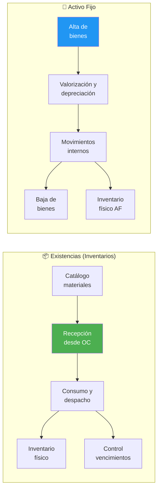

---

\## P1: Gestión de Inventarios y Bodegas

| Campo       | Valor                            |
| ----------- | -------------------------------- |
| **ID**      | `BPMN-GN-INVENTARIOS-BODEGAS-01` |
| **Sistema** | SIGAS                            |

\### Catálogo de Materiales

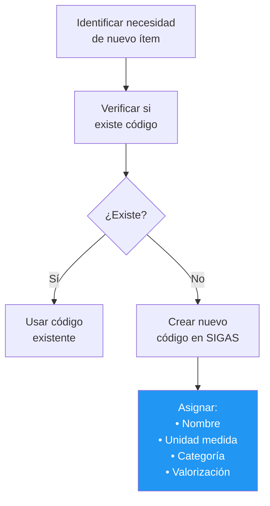

\### Recepción de Bienes desde OC

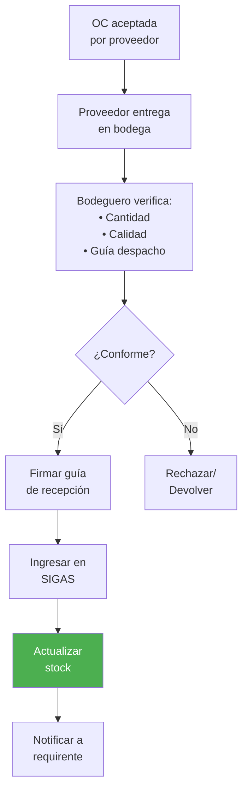

\### Consumo y Despacho

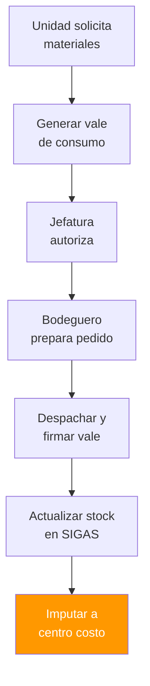

\### Inventario Físico

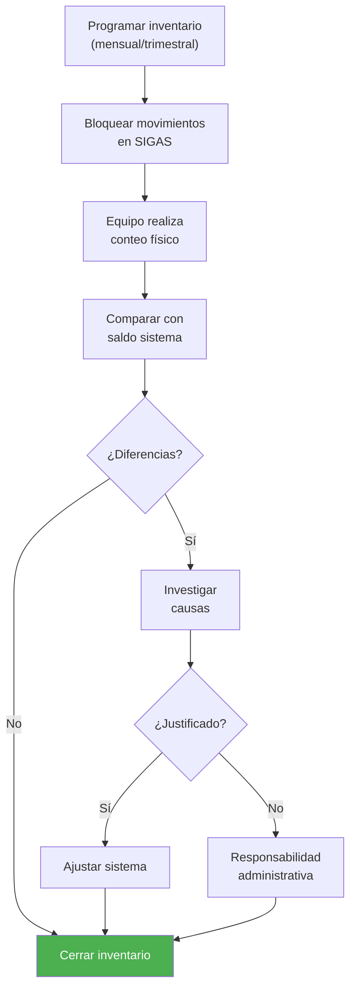

\### Control de Vencimientos (FEFO)

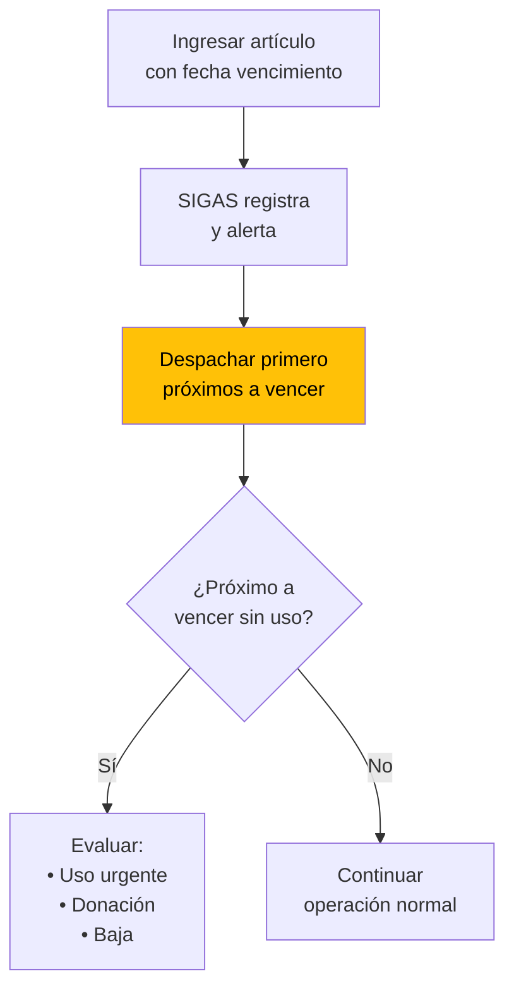

\### Valorización de Existencias

| Método   | Descripción               | Uso         |
| -------- | ------------------------- | ----------- |
| **PPP**  | Precio Promedio Ponderado | Default     |
| **FIFO** | First In, First Out       | Alternativo |
| **FEFO** | First Expired, First Out  | Perecibles  |

---

\## P2: Gestión de Activo Fijo

| Campo         | Valor                    |
| ------------- | ------------------------ |
| **ID**        | `BPMN-GN-ACTIVO-FIJO-01` |
| **Umbral**    | ≥ 3 UTM para capitalizar |
| **Normativa** | NICSP 17, 21, 31         |

\### Alta de Bienes

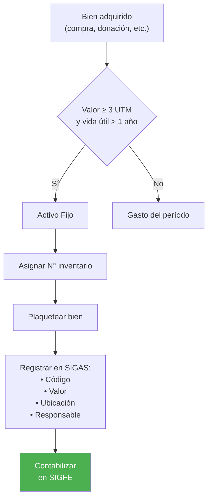

\### Valorización y Depreciación

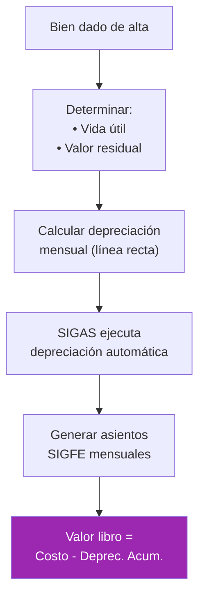

\### Movimientos Internos

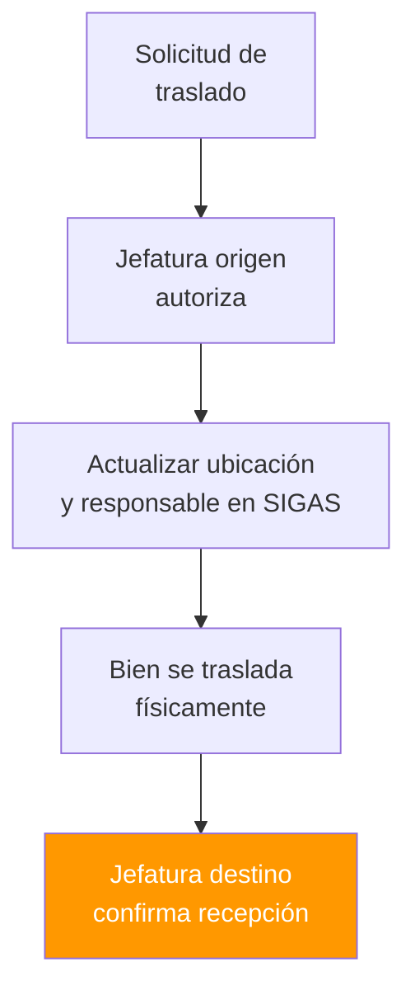

\### Baja de Bienes

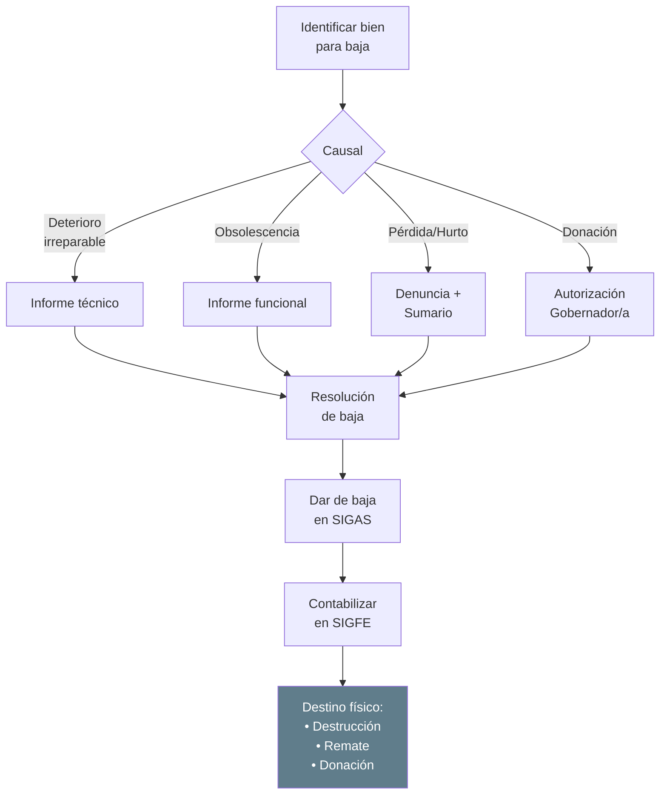

\### Inventario Físico Activo Fijo

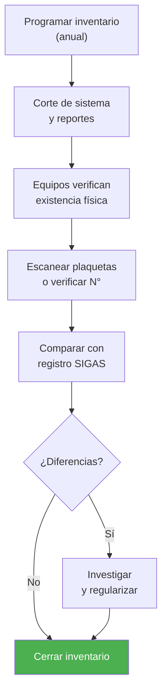

---

\## Casos Especiales

\### Bienes de Proyectos FNDR

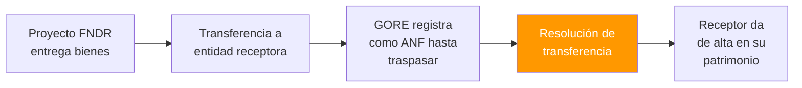

\### Comodatos y Préstamos

| Tipo                   | Descripción                      |
| ---------------------- | -------------------------------- |
| **Comodato recibido**  | Bien de tercero en custodia GORE |
| **Comodato entregado** | Bien GORE en custodia de tercero |

> ⚠️ Ambos requieren convenio y registro separado en control paralelo.

---

\## Sistemas Involucrados

| Sistema      | Función                     |
| ------------ | --------------------------- |
| `SYS-SIGAS`  | Gestión de inventarios y AF |
| `SYS-SIGFE`  | Contabilización             |
| `SYS-SIGFIN` | Integración financiera      |

---

\## Normativa Aplicable

| Norma          | Alcance                          |
| -------------- | -------------------------------- |
| **NICSP 17**   | Propiedad, planta y equipo       |
| **NICSP 21**   | Deterioro activos no generadores |
| **NICSP 31**   | Activos intangibles              |
| **Res. CGR**   | Procedimientos de baja           |
| **Ley 18.575** | Responsabilidad patrimonial      |

---

\## Referencias Cruzadas

| Dominio Relacionado                                                                                                                            | Vínculo            |
| ---------------------------------------------------------------------------------------------------------------------------------------------- | ------------------ |
| [D04 Compras](file:///Users/felixsanhueza/Developer/gorenuble/knowledge/domains/gn/arquitectura/bpmn/D04_compras_contrataciones.md)            | Recepción desde OC |
| [D02 Ciclo Presupuestario](file:///Users/felixsanhueza/Developer/gorenuble/knowledge/domains/gn/arquitectura/bpmn/D02_ciclo_presupuestario.md) | Contabilización AF |

---

*Última actualización: 2025-12-16*
