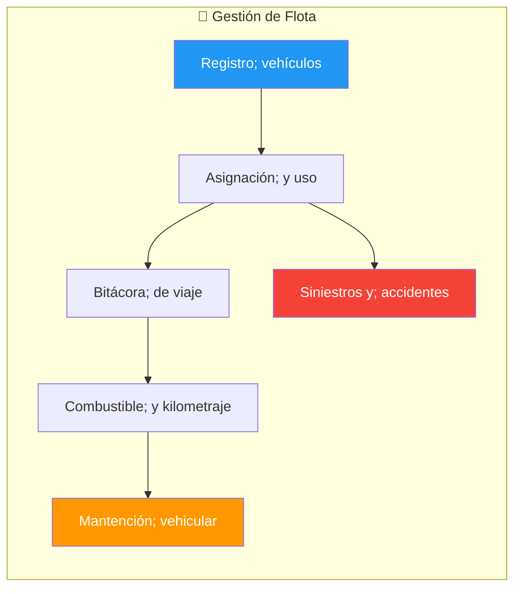
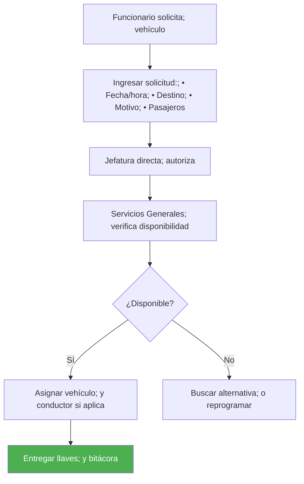
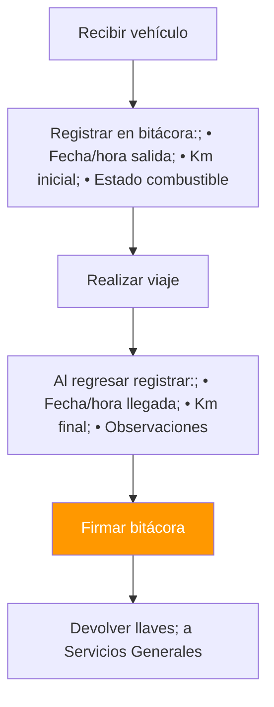
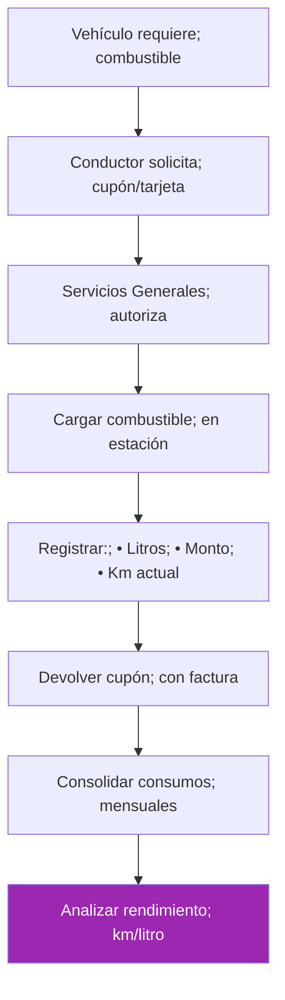
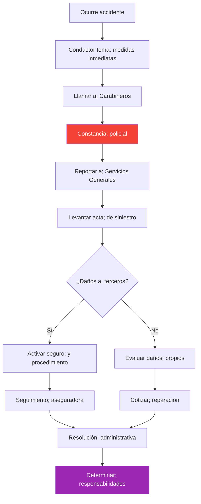

---
_manifest:
  urn: urn:gn:kb:bpmn-d06-flota-vehicular
  provenance:
    created_by: gn_rebuild.py
    created_at: '2026-03-09'
    source: domains/gn/04_habilitadores/arquitectura/bpmn/D06_flota_vehicular_koda.yml
version: 2.0.0
status: draft
tags:
- gore-nuble
- gobierno-regional
- flota-vehicular
- logistica
- bpmn
- gn
lang: es
extensions:
  gn:
    source_paths:
    - domains/gn/04_habilitadores/arquitectura/bpmn/D06_flota_vehicular_koda.yml
    source_hashes:
      domains/gn/04_habilitadores/arquitectura/bpmn/D06_flota_vehicular_koda.yml: dcdcd9dc7b0277afeb94fb6b32671d1419343479bac5fb78ace21e952acd9bb6
    source_type: koda_yaml
    transformation_mode: korafy_direct
    fs: 100
    cr: 1.07
    run_id: gn-smoke
    review_gate: auto
    scope_statement: null
    dependencies: []
    expected_sections:
    - Contenido
    document_family: generic
    publication_class: knowledge
    skeleton_count: 3
    meat_count: 11
    fat_count: 0
    cr_justification: Fuente altamente estructurada o derivacion de alcance acotado.
    evidence_path: build/gn-rebuild/gn-smoke/evidence/bpmn__bpmn-d06-flota-vehicular.md.json
  kora:
    shard_index: 1
    shard_count: 1
    shard_root_urn: urn:gn:kb:bpmn-d06-flota-vehicular
---

# D06: Gestión de Flota Vehicular

## Metadatos del Dominio

| Campo | Valor |
| --------------- | ------------------------------------------------------------------------------------------------------------------------------------------------------ |
| **ID** | `DOM-FLOTA` |
| **Criticidad** | 🟡 Media |
| **Dueño** | Jefe Servicios Generales |
| **Procesos** | 1 (con 6 subprocesos) |
| **Ref. Fuente** | [kb_gn_054_bpmn_c4_koda.yml](file:///Users/felixsanhueza/Developer/gorenuble/knowledge/domains/gn/arquitectura/kb_gn_054_bpmn_c4_koda.yml) L.1210-1400 |

---

## Mapa General del Dominio

---

## P1: Gestión de Flota Vehicular

| Campo | Valor |
| ------------- | ---------------------------- |
| **ID** | `BPMN-GN-FLOTA-VEHICULAR-01` |
| **Normativa** | D.L. 799 (restricción uso) |

## S1: Registro de Vehículos y Conductores

```mermaid
flowchart TD
 subgraph VEHICULOS["🚗 Registro de Vehículos"]
 A["Adquisición de; vehículo"]
 B["Registrar en; sistema interno"]
 C["Datos:; • Patente; • Modelo; • Año; • Tipo combustible"]
 D["Asignar a; división/área"]
 E["Inscribir en; Registro Automotor"]
 end

 subgraph CONDUCTORES["👤 Registro de Conductores"]
 F["Funcionario solicita; autorización"]
 G["Verificar:; • Licencia vigente; • Clase apropiada; • Hoja de vida"]
 H["Autorización de; Jefe Servicios"]
 I["Registrar en; nómina conductores"]
 end

 A --> B --> C --> D --> E
 F --> G --> H --> I

 style E fill:#2196F3,color:#fff
 style I fill:#4CAF50,color:#fff
```

## S2: Solicitud y Asignación

## S3: Bitácora de Viaje

## S4: Gestión de Combustible

## S5: Mantención Vehicular

```mermaid
flowchart TD
 subgraph PREVENTIVA["🔧 Mantención Preventiva"]
 A["Programar según; km/tiempo"]
 B["Alertar próxima; mantención"]
 C["Agendar con; taller"]
 D["Ejecutar mantención"]
 E["Registrar en; historial"]
 end

 subgraph CORRECTIVA["⚠️ Mantención Correctiva"]
 F["Detectar falla"]
 G["Reportar a; Servicios Generales"]
 H["Evaluar:; • Taller interno; • Taller externo"]
 I["Reparar"]
 J["Certificar OK; para uso"]
 end

 A --> B --> C --> D --> E
 F --> G --> H --> I --> J

 style E fill:#4CAF50,color:#fff
 style J fill:#FF9800,color:#fff
```

## Programa de Mantención

| Tipo | Frecuencia | Acciones |
| -------------- | ---------- | ------------------------- |
| **Básica** | 5.000 km | Cambio aceite, filtros |
| **Intermedia** | 15.000 km | Frenos, neumáticos |
| **Mayor** | 30.000 km | Revisión completa |
| **Documentos** | Anual | Revisión técnica, permiso |

## S6: Siniestros y Accidentes

## Información del Acta de Siniestro

| Dato | Descripción |
| ------------ | -------------------- |
| Fecha y hora | Del accidente |
| Lugar | Dirección exacta |
| Conductor | Funcionario a cargo |
| Descripción | Circunstancias |
| Testigos | Identificación |
| Daños | Propios y a terceros |
| N° Parte | Carabineros |

---

## Restricciones Normativas

### D.L. 799 (Uso de Vehículos Fiscales)

| Restricción | Detalle |
| ---------------------- | --------------------------------------- |
| **Fines de semana** | Prohibido uso sin autorización especial |
| **Uso particular** | Prohibido |
| **Fuera de la región** | Requiere autorización |
| **Horario** | Jornada laboral (salvo excepciones) |

> ⚠️ **Incumplimiento genera responsabilidad administrativa y patrimonial.**

---

## Métricas de Control

| Indicador | Fórmula | Meta |
| ------------------------ | ------------------------------ | ---------- |
| Rendimiento combustible | Km / Litros | > 10 km/lt |
| % Mantención cumplida | Mantenciones OK / Programadas | > 95% |
| Tasa de accidentabilidad | Accidentes / Vehículos | < 5% |
| Disponibilidad flota | Días operativos / Días totales | > 90% |

---

## Sistemas Involucrados

| Sistema | Función |
| ------------------------ | ----------------------- |
| `SYS-SIGAS` | Inventario de vehículos |
| Sistema interno de flota | Bitácoras, mantenciones |

---

## Referencias Cruzadas

| Dominio Relacionado | Vínculo |
| --------------------------------------------------------------------------------------------------------------------------------------------- | ---------------------------------- |
| [D05 Inventarios y AF](file:///Users/felixsanhueza/Developer/gorenuble/knowledge/domains/gn/arquitectura/bpmn/D05_inventarios_activo_fijo.md) | Vehículos como activo fijo |
| [D04 Compras](file:///Users/felixsanhueza/Developer/gorenuble/knowledge/domains/gn/arquitectura/bpmn/D04_compras_contrataciones.md) | Adquisición vehículos, combustible |

---

*Última actualización: 2025-12-16*
