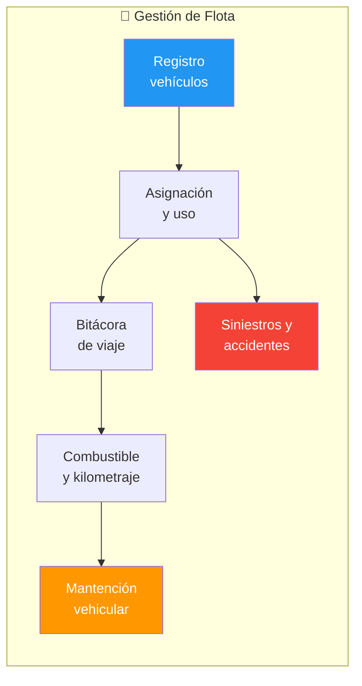
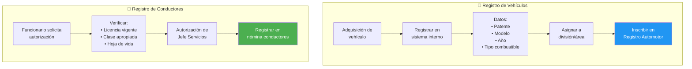
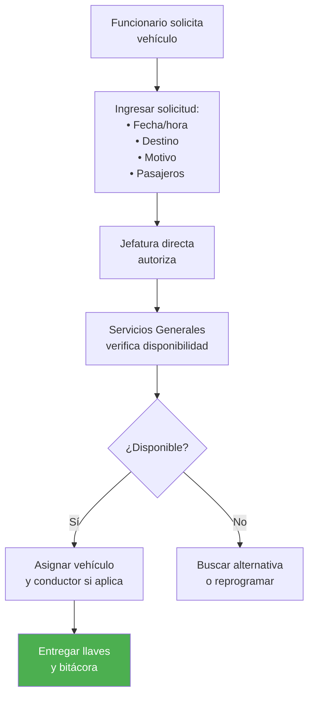
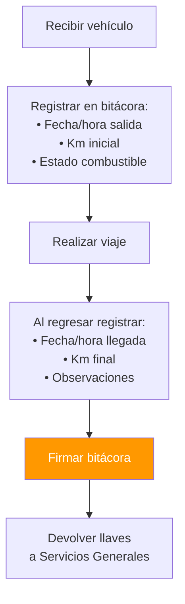
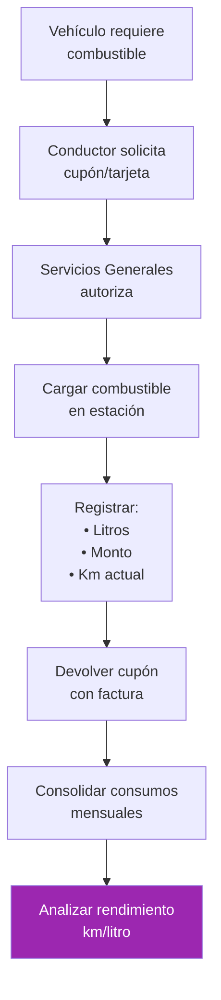
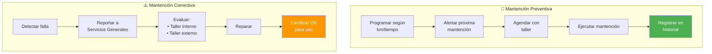
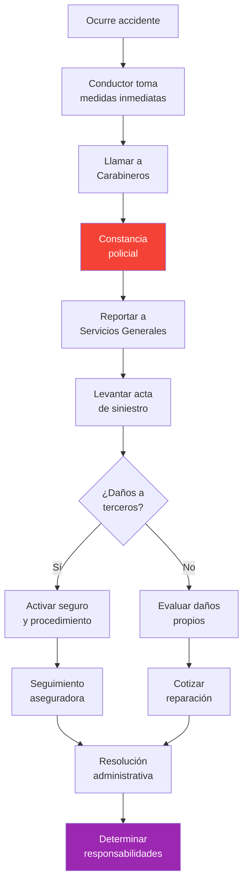

---
_manifest:
  urn: urn:gn:kb:bpmn-d06-flota-vehicular
  provenance:
    created_by: gn_rebuild.py
    created_at: '2026-03-08'
    source: domains/gn/04_habilitadores/arquitectura/bpmn/D06_flota_vehicular_koda.yml
version: 2.0.0
status: draft
tags:
- gore-nuble
- gobierno-regional
- flota-vehicular
- logistica
- bpmn
- gn
lang: es
extensions:
  gn:
    source_paths:
    - domains/gn/04_habilitadores/arquitectura/bpmn/D06_flota_vehicular_koda.yml
    source_hashes:
      domains/gn/04_habilitadores/arquitectura/bpmn/D06_flota_vehicular_koda.yml: dcdcd9dc7b0277afeb94fb6b32671d1419343479bac5fb78ace21e952acd9bb6
    source_type: koda_yaml
    transformation_mode: korafy_direct
    fs: 100
    cr: 1.17
    run_id: gn-smoke
    review_gate: auto
    scope_statement: null
    dependencies: []
    expected_sections:
    - Contenido
    skeleton_count: 16
    meat_count: 43
    fat_count: 0
    preserved_facts:
    - AI-Remediator=KODA-TRANSFORMER
    - "Body_MD.Content=\\# D06: Gestión de Flota Vehicular\n\n\\## Metadatos del Dominio\n\
      \n| Campo           | Valor                                                \
      \                                                                          \
      \                        |\n| --------------- | ------------------------------------------------------------------------------------------------------------------------------------------------------\
      \ |\n| **ID**          | `DOM-FLOTA`                                       \
      \                                                                          \
      \                           |\n| **Criticidad**  | \U0001F7E1 Media        \
      \                                                                          \
      \                                                              |\n| **Dueño**\
      \       | Jefe Servicios Generales                                         \
      \                                                                          \
      \            |\n| **Procesos**    | 1 (con 6 subprocesos)                  \
      \                                                                          \
      \                                      |\n| **Ref. Fuente** | [kb_gn_054_bpmn_c4_koda.yml](file:///Users/felixsanhueza/Developer/gorenuble/knowledge/domains/gn/arquitectura/kb_gn_054_bpmn_c4_koda.yml)\
      \ L.1210-1400 |\n\n---\n\n\\## Mapa General del Dominio\n\n```mermaid\nflowchart\
      \ LR\n    subgraph CICLO_FLOTA[\"\U0001F697 Gestión de Flota\"]\n        S1[\"\
      Registro<br/>vehículos\"]\n        S2[\"Asignación<br/>y uso\"]\n        S3[\"\
      Bitácora<br/>de viaje\"]\n        S4[\"Combustible<br/>y kilometraje\"]\n  \
      \      S5[\"Mantención<br/>vehicular\"]\n        S6[\"Siniestros y<br/>accidentes\"\
      ]\n    end\n\n    S1 --> S2 --> S3 --> S4\n    S4 --> S5\n    S2 --> S6\n\n\
      \    style S1 fill:#2196F3,color:#fff\n    style S5 fill:#FF9800,color:#fff\n\
      \    style S6 fill:#f44336,color:#fff\n```\n\n---\n\n\\## P1: Gestión de Flota\
      \ Vehicular\n\n| Campo         | Valor                        |\n| -------------\
      \ | ---------------------------- |\n| **ID**        | `BPMN-GN-FLOTA-VEHICULAR-01`\
      \ |\n| **Normativa** | D.L. 799 (restricción uso)   |\n\n\\### S1: Registro\
      \ de Vehículos y Conductores\n\n```mermaid\nflowchart TD\n    subgraph VEHICULOS[\"\
      \U0001F697 Registro de Vehículos\"]\n        A[\"Adquisición de<br/>vehículo\"\
      ]\n        B[\"Registrar en<br/>sistema interno\"]\n        C[\"Datos:<br/>•\
      \ Patente<br/>• Modelo<br/>• Año<br/>• Tipo combustible\"]\n        D[\"Asignar\
      \ a<br/>división/área\"]\n        E[\"Inscribir en<br/>Registro Automotor\"\
      ]\n    end\n\n    subgraph CONDUCTORES[\"\U0001F464 Registro de Conductores\"\
      ]\n        F[\"Funcionario solicita<br/>autorización\"]\n        G[\"Verificar:<br/>•\
      \ Licencia vigente<br/>• Clase apropiada<br/>• Hoja de vida\"]\n        H[\"\
      Autorización de<br/>Jefe Servicios\"]\n        I[\"Registrar en<br/>nómina conductores\"\
      ]\n    end\n\n    A --> B --> C --> D --> E\n    F --> G --> H --> I\n\n   \
      \ style E fill:#2196F3,color:#fff\n    style I fill:#4CAF50,color:#fff\n```\n\
      \n\\### S2: Solicitud y Asignación\n\n```mermaid\nflowchart TD\n    A[\"Funcionario\
      \ solicita<br/>vehículo\"] --> B[\"Ingresar solicitud:<br/>• Fecha/hora<br/>•\
      \ Destino<br/>• Motivo<br/>• Pasajeros\"]\n    B --> C[\"Jefatura directa<br/>autoriza\"\
      ]\n    C --> D[\"Servicios Generales<br/>verifica disponibilidad\"]\n    D -->\
      \ E{\"¿Disponible?\"}\n    E -->|\"Sí\"| F[\"Asignar vehículo<br/>y conductor\
      \ si aplica\"]\n    E -->|\"No\"| G[\"Buscar alternativa<br/>o reprogramar\"\
      ]\n    F --> H[\"Entregar llaves<br/>y bitácora\"]\n\n    style H fill:#4CAF50,color:#fff\n\
      ```\n\n\\### S3: Bitácora de Viaje\n\n```mermaid\nflowchart TD\n    A[\"Recibir\
      \ vehículo\"] --> B[\"Registrar en bitácora:<br/>• Fecha/hora salida<br/>• Km\
      \ inicial<br/>• Estado combustible\"]\n    B --> C[\"Realizar viaje\"]\n   \
      \ C --> D[\"Al regresar registrar:<br/>• Fecha/hora llegada<br/>• Km final<br/>•\
      \ Observaciones\"]\n    D --> E[\"Firmar bitácora\"]\n    E --> F[\"Devolver\
      \ llaves<br/>a Servicios Generales\"]\n\n    style E fill:#FF9800,color:#fff\n\
      ```\n\n\\### S4: Gestión de Combustible\n\n```mermaid\nflowchart TD\n    A[\"\
      Vehículo requiere<br/>combustible\"] --> B[\"Conductor solicita<br/>cupón/tarjeta\"\
      ]\n    B --> C[\"Servicios Generales<br/>autoriza\"]\n    C --> D[\"Cargar combustible<br/>en\
      \ estación\"]\n    D --> E[\"Registrar:<br/>• Litros<br/>• Monto<br/>• Km actual\"\
      ]\n    E --> F[\"Devolver cupón<br/>con factura\"]\n    F --> G[\"Consolidar\
      \ consumos<br/>mensuales\"]\n    G --> H[\"Analizar rendimiento<br/>km/litro\"\
      ]\n\n    style H fill:#9C27B0,color:#fff\n```\n\n\\### S5: Mantención Vehicular\n\
      \n```mermaid\nflowchart TD\n    subgraph PREVENTIVA[\"\U0001F527 Mantención\
      \ Preventiva\"]\n        A[\"Programar según<br/>km/tiempo\"]\n        B[\"\
      Alertar próxima<br/>mantención\"]\n        C[\"Agendar con<br/>taller\"]\n \
      \       D[\"Ejecutar mantención\"]\n        E[\"Registrar en<br/>historial\"\
      ]\n    end\n\n    subgraph CORRECTIVA[\"⚠️ Mantención Correctiva\"]\n      \
      \  F[\"Detectar falla\"]\n        G[\"Reportar a<br/>Servicios Generales\"]\n\
      \        H[\"Evaluar:<br/>• Taller interno<br/>• Taller externo\"]\n       \
      \ I[\"Reparar\"]\n        J[\"Certificar OK<br/>para uso\"]\n    end\n\n   \
      \ A --> B --> C --> D --> E\n    F --> G --> H --> I --> J\n\n    style E fill:#4CAF50,color:#fff\n\
      \    style J fill:#FF9800,color:#fff\n```\n\n\\### Programa de Mantención\n\n\
      | Tipo           | Frecuencia | Acciones                  |\n| --------------\
      \ | ---------- | ------------------------- |\n| **Básica**     | 5.000 km  \
      \ | Cambio aceite, filtros    |\n| **Intermedia** | 15.000 km  | Frenos, neumáticos\
      \        |\n| **Mayor**      | 30.000 km  | Revisión completa         |\n| **Documentos**\
      \ | Anual      | Revisión técnica, permiso |\n\n\\### S6: Siniestros y Accidentes\n\
      \n```mermaid\nflowchart TD\n    A[\"Ocurre accidente\"] --> B[\"Conductor toma<br/>medidas\
      \ inmediatas\"]\n    B --> C[\"Llamar a<br/>Carabineros\"]\n    C --> D[\"Constancia<br/>policial\"\
      ]\n    D --> E[\"Reportar a<br/>Servicios Generales\"]\n    E --> F[\"Levantar\
      \ acta<br/>de siniestro\"]\n    F --> G{\"¿Daños a<br/>terceros?\"}\n    G -->|\"\
      Sí\"| H[\"Activar seguro<br/>y procedimiento\"]\n    G -->|\"No\"| I[\"Evaluar\
      \ daños<br/>propios\"]\n    H --> J[\"Seguimiento<br/>aseguradora\"]\n    I\
      \ --> K[\"Cotizar<br/>reparación\"]\n    J & K --> L[\"Resolución<br/>administrativa\"\
      ]\n    L --> M[\"Determinar<br/>responsabilidades\"]\n\n    style D fill:#f44336,color:#fff\n\
      \    style M fill:#9C27B0,color:#fff\n```\n\n\\### Información del Acta de Siniestro\n\
      \n| Dato         | Descripción          |\n| ------------ | --------------------\
      \ |\n| Fecha y hora | Del accidente        |\n| Lugar        | Dirección exacta\
      \     |\n| Conductor    | Funcionario a cargo  |\n| Descripción  | Circunstancias\
      \       |\n| Testigos     | Identificación       |\n| Daños        | Propios\
      \ y a terceros |\n| N° Parte     | Carabineros          |\n\n---\n\n\\## Restricciones\
      \ Normativas\n\n\\### D.L. 799 (Uso de Vehículos Fiscales)\n\n| Restricción\
      \            | Detalle                                 |\n| ----------------------\
      \ | --------------------------------------- |\n| **Fines de semana**    | Prohibido\
      \ uso sin autorización especial |\n| **Uso particular**     | Prohibido    \
      \                           |\n| **Fuera de la región** | Requiere autorización\
      \                   |\n| **Horario**            | Jornada laboral (salvo excepciones)\
      \     |\n\n> ⚠️ **Incumplimiento genera responsabilidad administrativa y patrimonial.**\n\
      \n---\n\n\\## Métricas de Control\n\n| Indicador                | Fórmula  \
      \                      | Meta       |\n| ------------------------ | ------------------------------\
      \ | ---------- |\n| Rendimiento combustible  | Km / Litros                 \
      \   | > 10 km/lt |\n| % Mantención cumplida    | Mantenciones OK / Programadas\
      \  | > 95%      |\n| Tasa de accidentabilidad | Accidentes / Vehículos     \
      \    | < 5%       |\n| Disponibilidad flota     | Días operativos / Días totales\
      \ | > 90%      |\n\n---\n\n\\## Sistemas Involucrados\n\n| Sistema         \
      \         | Función                 |\n| ------------------------ | -----------------------\
      \ |\n| `SYS-SIGAS`              | Inventario de vehículos |\n| Sistema interno\
      \ de flota | Bitácoras, mantenciones |\n\n---\n\n\\## Referencias Cruzadas\n\
      \n| Dominio Relacionado                                                    \
      \                                                                       | Vínculo\
      \                            |\n| ---------------------------------------------------------------------------------------------------------------------------------------------\
      \ | ---------------------------------- |\n| [D05 Inventarios y AF](file:///Users/felixsanhueza/Developer/gorenuble/knowledge/domains/gn/arquitectura/bpmn/D05_inventarios_activo_fijo.md)\
      \ | Vehículos como activo fijo         |\n| [D04 Compras](file:///Users/felixsanhueza/Developer/gorenuble/knowledge/domains/gn/arquitectura/bpmn/D04_compras_contrataciones.md)\
      \           | Adquisición vehículos, combustible |\n\n---\n\n*Última actualización:\
      \ 2025-12-16*\n"
    - Body_MD.ID=BPMN-GN-D06-FLOTA-BODY-01
    - Body_MD.Src=sources/gn/arquitectura/bpmn/D06_flota_vehicular.md
    - Creation-Date=2025-12-22
    - 'Ctx=Especificación STS del dominio D06: Gestión de Flota Vehicular del GORE
      Ñuble, modelado en BPMN.'
    - Format=KODA/Spec
    - Human-Creator=FS
    - Human-Editor=FS
    - ID=BPMN-GN-D06-FLOTA-KODA
    - 'LLM_Parsing_Instructions.Content=BEGIN_LLM_INSTRUCTIONS

      You are an AI agent consuming a KODA artifact. Parse with absolute fidelity.


      FIDELITY: Preserve meat (essential information) and skeleton (structure: headers,
      IDs, lists, tables) with zero loss. Ignore fat (filler words, rhetoric, stylistic
      prose).


      LEXICON (expand before processing): Act->Action, Cond->Condition, Cpt->Concept,
      Ctx->Context, Def->Definition, Fnd->Foundation, ID->ID, Mech->Mechanism, Mssn->Mission,
      Nat->Nature, Obj->Objective, Proc->Process, Prohib->Prohibition, Purp->Purpose,
      Ref->Reference, Req->Requirement, Res->Result, Resp->Responsible, Src->Source,
      Warn->Warning.


      REFERENCE POLICY: Ref: is internal only—must point to existing ID within THIS
      document. External documents and legal sources are mentioned as contextual information
      under Ctx: or Src:.


      LANGUAGE POLICY: Keywords in English (and abbreviated forms as listed), content
      in original language (Spanish). Never translate content.

      END_LLM_INSTRUCTIONS

      '
    - LLM_Parsing_Instructions.ID=KODA-LLM-PARSER-01
    - LLM_Parsing_Instructions.Prohib=Using for artifact creation or translation.
    - LLM_Parsing_Instructions.Req=Mandatory block following Metadata.
    - Metadatos_Dominio.Criticidad=🟡 Media
    - Metadatos_Dominio.Dueno=Jefe Servicios Generales
    - Metadatos_Dominio.ID=DOM-FLOTA
    - Metadatos_Dominio.Procesos=1
    - Metadatos_Dominio.Ref_Fuente.Ctx_Required[0]=knowledge/domains/gn/arquitectura/kb_gn_054_bpmn_c4_koda.yml
      L.1210-1400
    - Metadatos_Dominio.Subprocesos=6 subprocesos
    - Model-Collaborator[0]=Cascade
    - Modification-Date=2025-12-22
    - Source.Ctx_Required[0]=knowledge/domains/gn/arquitectura/kb_gn_054_bpmn_c4_koda.yml
    - Source.Primary-Source=sources/gn/arquitectura/bpmn/D06_flota_vehicular.md
    - Status=Draft
    - Version=1.0.0
    - _manifest.compatibility.breaking_changes_from=null
    - _manifest.compatibility.min_consumer_version=1.0.0
    - _manifest.dependencies.requires[0].reason=KODA/Spec format compliance
    - _manifest.dependencies.requires[0].urn=urn:knowledge:koda:core:spec:1.0.0
    - _manifest.dependencies.requires[1].reason=Transformation methodology reference
    - _manifest.dependencies.requires[1].urn=urn:knowledge:koda:core:transform:1.0.0
    - _manifest.dependencies.requires[2].reason=Marco integrado BPMN/C4
    - _manifest.dependencies.requires[2].urn=urn:knowledge:gorenuble:gn:bpmn-c4:1.0.0
    - _manifest.federation.license=Institutional Use
    - _manifest.federation.visibility=internal
    - _manifest.provenance.created_at=2025-12-22
    - _manifest.provenance.created_by=FS
    - _manifest.provenance.last_modified_at=2025-12-22
    - _manifest.provenance.model_collaborators[0]=Cascade
    - _manifest.provenance.model_collaborators[1]=KODA-TRANSFORMER
    - _manifest.resolution.canonical_url=file://knowledge/domains/gn/arquitectura/bpmn/D06_flota_vehicular_koda.yml
    - _manifest.urn=urn:knowledge:gorenuble:gn:bpmn-d06-flota-vehicular:1.0.0
    cr_justification: Fuente altamente estructurada o derivacion de alcance acotado.
---

# BPMN D06: Gestión de Flota Vehicular
## ID
BPMN-GN-D06-FLOTA-KODA

## Version
1.0.0

## Status
Draft

## Format
KODA/Spec

## Human Creator
FS

## Human Editor
FS

## Model Collaborator
- Cascade

## AI Remediator
KODA-TRANSFORMER

## Creation Date
2025-12-22

## Modification Date
2025-12-22

## Ctx
Especificación STS del dominio D06: Gestión de Flota Vehicular del GORE Ñuble, modelado en BPMN.

## Source
### Ctx Required
- knowledge/domains/gn/arquitectura/kb_gn_054_bpmn_c4_koda.yml
### Primary Source
sources/gn/arquitectura/bpmn/D06_flota_vehicular.md

## LLM Parsing Instructions
### ID
KODA-LLM-PARSER-01
### Req
Mandatory block following Metadata.
### Prohib
Using for artifact creation or translation.
### Content
BEGIN_LLM_INSTRUCTIONS
You are an AI agent consuming a KODA artifact. Parse with absolute fidelity.

FIDELITY: Preserve meat (essential information) and skeleton (structure: headers, IDs, lists, tables) with zero loss. Ignore fat (filler words, rhetoric, stylistic prose).

LEXICON (expand before processing): Act->Action, Cond->Condition, Cpt->Concept, Ctx->Context, Def->Definition, Fnd->Foundation, ID->ID, Mech->Mechanism, Mssn->Mission, Nat->Nature, Obj->Objective, Proc->Process, Prohib->Prohibition, Purp->Purpose, Ref->Reference, Req->Requirement, Res->Result, Resp->Responsible, Src->Source, Warn->Warning.

REFERENCE POLICY: Ref: is internal only—must point to existing ID within THIS document. External documents and legal sources are mentioned as contextual information under Ctx: or Src:.

LANGUAGE POLICY: Keywords in English (and abbreviated forms as listed), content in original language (Spanish). Never translate content.
END_LLM_INSTRUCTIONS


## Metadatos Dominio
### ID
DOM-FLOTA
### Criticidad
🟡 Media
### Dueno
Jefe Servicios Generales
### Procesos
1
### Subprocesos
6 subprocesos
### Ref Fuente
#### Ctx Required
- knowledge/domains/gn/arquitectura/kb_gn_054_bpmn_c4_koda.yml L.1210-1400

## Body MD
### ID
BPMN-GN-D06-FLOTA-BODY-01
### Src
sources/gn/arquitectura/bpmn/D06_flota_vehicular.md
### Content
\# D06: Gestión de Flota Vehicular

\## Metadatos del Dominio

| Campo           | Valor                                                                                                                                                  |
| --------------- | ------------------------------------------------------------------------------------------------------------------------------------------------------ |
| **ID**          | `DOM-FLOTA`                                                                                                                                            |
| **Criticidad**  | 🟡 Media                                                                                                                                                |
| **Dueño**       | Jefe Servicios Generales                                                                                                                               |
| **Procesos**    | 1 (con 6 subprocesos)                                                                                                                                  |
| **Ref. Fuente** | [kb_gn_054_bpmn_c4_koda.yml](file:///Users/felixsanhueza/Developer/gorenuble/knowledge/domains/gn/arquitectura/kb_gn_054_bpmn_c4_koda.yml) L.1210-1400 |

---

\## Mapa General del Dominio



---

\## P1: Gestión de Flota Vehicular

| Campo         | Valor                        |
| ------------- | ---------------------------- |
| **ID**        | `BPMN-GN-FLOTA-VEHICULAR-01` |
| **Normativa** | D.L. 799 (restricción uso)   |

\### S1: Registro de Vehículos y Conductores



\### S2: Solicitud y Asignación



\### S3: Bitácora de Viaje



\### S4: Gestión de Combustible



\### S5: Mantención Vehicular



\### Programa de Mantención

| Tipo           | Frecuencia | Acciones                  |
| -------------- | ---------- | ------------------------- |
| **Básica**     | 5.000 km   | Cambio aceite, filtros    |
| **Intermedia** | 15.000 km  | Frenos, neumáticos        |
| **Mayor**      | 30.000 km  | Revisión completa         |
| **Documentos** | Anual      | Revisión técnica, permiso |

\### S6: Siniestros y Accidentes



\### Información del Acta de Siniestro

| Dato         | Descripción          |
| ------------ | -------------------- |
| Fecha y hora | Del accidente        |
| Lugar        | Dirección exacta     |
| Conductor    | Funcionario a cargo  |
| Descripción  | Circunstancias       |
| Testigos     | Identificación       |
| Daños        | Propios y a terceros |
| N° Parte     | Carabineros          |

---

\## Restricciones Normativas

\### D.L. 799 (Uso de Vehículos Fiscales)

| Restricción            | Detalle                                 |
| ---------------------- | --------------------------------------- |
| **Fines de semana**    | Prohibido uso sin autorización especial |
| **Uso particular**     | Prohibido                               |
| **Fuera de la región** | Requiere autorización                   |
| **Horario**            | Jornada laboral (salvo excepciones)     |

> ⚠️ **Incumplimiento genera responsabilidad administrativa y patrimonial.**

---

\## Métricas de Control

| Indicador                | Fórmula                        | Meta       |
| ------------------------ | ------------------------------ | ---------- |
| Rendimiento combustible  | Km / Litros                    | > 10 km/lt |
| % Mantención cumplida    | Mantenciones OK / Programadas  | > 95%      |
| Tasa de accidentabilidad | Accidentes / Vehículos         | < 5%       |
| Disponibilidad flota     | Días operativos / Días totales | > 90%      |

---

\## Sistemas Involucrados

| Sistema                  | Función                 |
| ------------------------ | ----------------------- |
| `SYS-SIGAS`              | Inventario de vehículos |
| Sistema interno de flota | Bitácoras, mantenciones |

---

\## Referencias Cruzadas

| Dominio Relacionado                                                                                                                           | Vínculo                            |
| --------------------------------------------------------------------------------------------------------------------------------------------- | ---------------------------------- |
| [D05 Inventarios y AF](file:///Users/felixsanhueza/Developer/gorenuble/knowledge/domains/gn/arquitectura/bpmn/D05_inventarios_activo_fijo.md) | Vehículos como activo fijo         |
| [D04 Compras](file:///Users/felixsanhueza/Developer/gorenuble/knowledge/domains/gn/arquitectura/bpmn/D04_compras_contrataciones.md)           | Adquisición vehículos, combustible |

---

*Última actualización: 2025-12-16*
