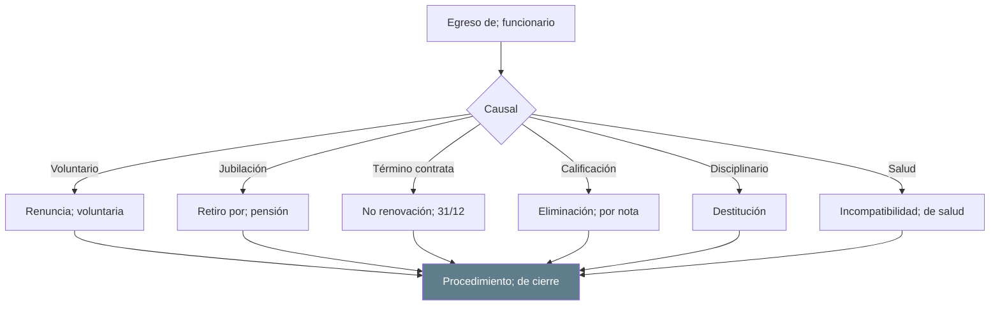
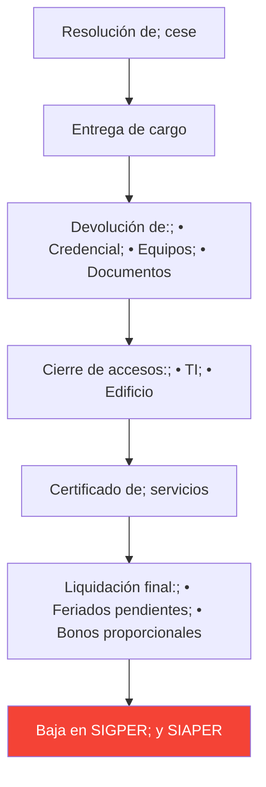

---
_manifest:
  urn: urn:gn:kb:bpmn-d07-rrhh-p02
  provenance:
    created_by: gn_rebuild.py
    created_at: '2026-03-10'
    source: domains/gn/04_habilitadores/arquitectura/bpmn/D07_rrhh_koda.yml
version: 2.0.0
status: draft
tags:
- gore-nuble
- gobierno-regional
- rrhh
- bpmn
- gestion-personas
- gn
lang: es
extensions:
  gn:
    source_paths:
    - domains/gn/04_habilitadores/arquitectura/bpmn/D07_rrhh_koda.yml
    source_hashes:
      domains/gn/04_habilitadores/arquitectura/bpmn/D07_rrhh_koda.yml: 6f057ef1f3c5dc59c43b5d51a1f7eac20fd95fcfdc2f0d043c2ee832ca215872
    source_type: koda_yaml
    transformation_mode: korafy_direct
    fs: 100
    cr: 1.05
    run_id: gn-smoke
    review_gate: auto
    scope_statement: null
    dependencies: []
    expected_sections:
    - Contenido
    document_family: generic
    publication_class: knowledge
    skeleton_count: 3
    meat_count: 11
    fat_count: 0
    cr_justification: Fuente altamente estructurada o derivacion de alcance acotado.
    evidence_path: build/gn-rebuild/gn-smoke/evidence/bpmn__bpmn-d07-rrhh.md.json
  kora:
    shard_index: 2
    shard_count: 2
    shard_root_urn: urn:gn:kb:bpmn-d07-rrhh
---

# D07: Gestión de Personas (RRHH) - Parte 02

## P7: Egreso y Desvinculación

| Campo | Valor |
| ------ | ------------------------ |
| **ID** | `BPMN-GN-RRHH-EGRESO-01` |

### Causales de Egreso

### Procedimiento de Cierre

---

## Sistemas Involucrados

| Sistema | Función |
| -------------- | ----------------------------------- |
| `SYS-SIGPER` | Gestión de personas, remuneraciones |
| `SYS-SIAPER` | Control personal Estado |
| `SYS-PREVIRED` | Cotizaciones previsionales |
| `SYS-SIGFE` | Contabilización |

---

## Normativa Aplicable

| Norma | Alcance |
| ---------------------- | --------------------------- |
| **Ley 18.834** | Estatuto Administrativo |
| **Ley 18.575** | Bases Administración Estado |
| **Ley 20.880** | Probidad, declaraciones |
| **Código del Trabajo** | Honorarios |

---

## Referencias Cruzadas

| Dominio Relacionado | Vínculo |
| ------------------------------------------------------------------------------------------------------------------------------------------------ | ---------------------------- |
| [D02 Ciclo Presupuestario] | Subtítulo 21, Remuneraciones |
| [D01 Actos Administrativos] | Resoluciones de nombramiento |

---

*Última actualización: 2025-12-16*
