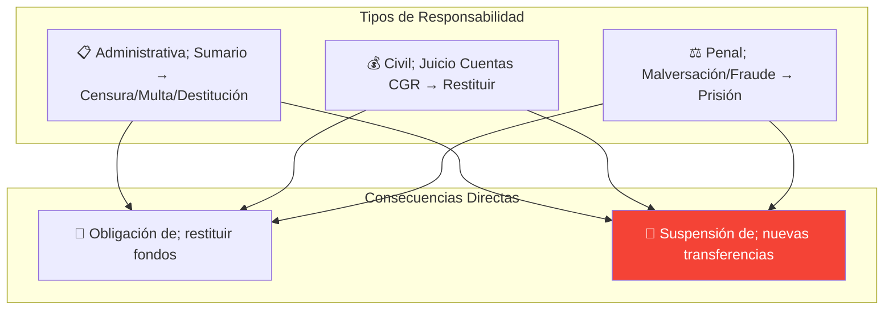

---
_manifest:
  urn: urn:gn:kb:bpmn-d08-rendiciones-p02
  provenance:
    created_by: gn_rebuild.py
    created_at: '2026-03-10'
    source: domains/gn/04_habilitadores/arquitectura/bpmn/D08_rendiciones_koda.yml
version: 2.0.0
status: draft
tags:
- gore-nuble
- gobierno-regional
- bpmn
- rendiciones
- finanzas
- gn
lang: es
extensions:
  gn:
    source_paths:
    - domains/gn/04_habilitadores/arquitectura/bpmn/D08_rendiciones_koda.yml
    source_hashes:
      domains/gn/04_habilitadores/arquitectura/bpmn/D08_rendiciones_koda.yml: 07c56ac7ee69f6a94324af64f09082686f9e5623274fcdf1f9ae1a527b770c22
    source_type: koda_yaml
    transformation_mode: korafy_direct
    fs: 100
    cr: 1.04
    run_id: gn-smoke
    review_gate: auto
    scope_statement: null
    dependencies: []
    expected_sections:
    - Contenido
    document_family: generic
    publication_class: knowledge
    skeleton_count: 3
    meat_count: 11
    fat_count: 0
    cr_justification: Fuente altamente estructurada o derivacion de alcance acotado.
    evidence_path: build/gn-rebuild/gn-smoke/evidence/bpmn__bpmn-d08-rendiciones.md.json
  kora:
    shard_index: 2
    shard_count: 2
    shard_root_urn: urn:gn:kb:bpmn-d08-rendiciones
---

# D08: Gestión de Rendiciones de Cuentas - Parte 02

## Expediente de Rendición

### Componentes

| Componente | Descripción |
| ------------------------ | ----------------------------- |
| Informe de Rendición | Documento formal del ejecutor |
| Comprobantes de Ingreso | Recepción de fondos |
| Comprobantes de Egreso | Facturas, boletas, contratos |
| Comprobantes de Traspaso | Operaciones sin efectivo |
| Registro Ley 19.862 | Si aplica (privados) |
| Medios de Verificación | Fotos, listas, informes |

### Documentación Auténtica

| Soporte | Requisito |
| ---------------- | ---------------------------------- |
| **Papel** | Original o copia autentificada |
| **Electrónico** | Firma electrónica según Ley 19.799 |
| **Digitalizado** | Autentificado por Ministro de Fe |

---

## Responsabilidades y Sanciones

---

## Control y Transparencia

### Control Interno

| Mecanismo | Responsable |
| ----------------------------- | ----------------- |
| Auditorías selectivas | Unidad de Control |
| Listas de chequeo | UCR/RTF |
| Seguimiento físico-financiero | RTF |

### Fiscalización Externa

| Organismo | Función |
| ---------- | --------------------------------------- |
| **CGR** | Juzgamiento cuentas, auditorías, SISREC |
| **DIPRES** | Monitoreo ejecución vía SIGFE |

### Transparencia

| Obligación | Detalle |
| ---------- | -------------------------------- |
| Glosa 08 | Info corporaciones/fundaciones |
| Glosa 16 | Cartera proyectos, acuerdos CORE |

---

## Sistemas Involucrados

| Sistema | Función |
| -------------- | -------------------------- |
| `SYS-SISREC` | Rendición electrónica CGR |
| `SYS-SIGFE` | Contabilización |
| `SYS-BIP-SNI` | Avance físico-financiero |
| `SYS-FIRMAGOB` | Firma Electrónica Avanzada |

---

## Referencias Cruzadas

| Dominio Relacionado | Vínculo |
| ---------------------------------------------------------------------------------------------------------------------------------------------- | ------------------------ |
| [D03 Gestión IPR] | Cierre financiero Fase 7 |
| [D02 Ciclo Presupuestario] | Contabilización, devengo |

---

*Última actualización: 2025-12-16*
