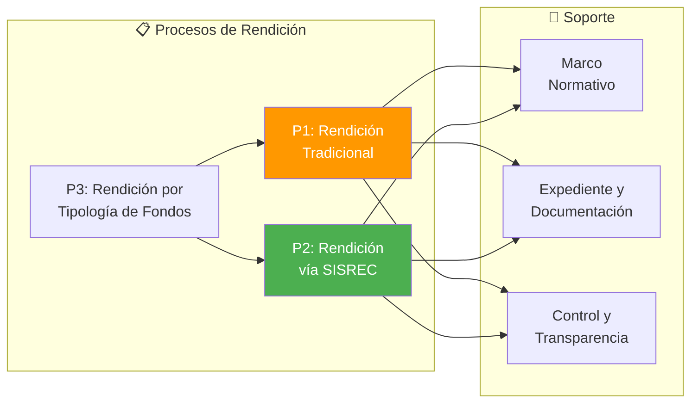
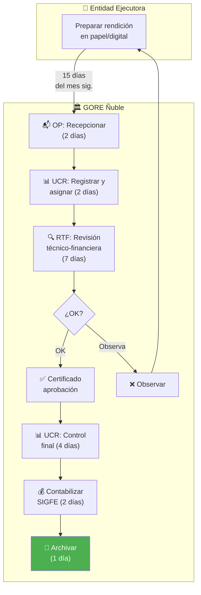
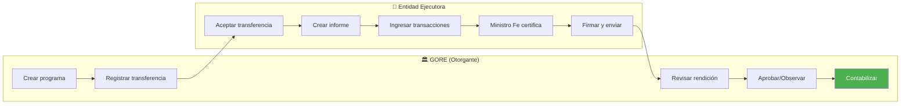
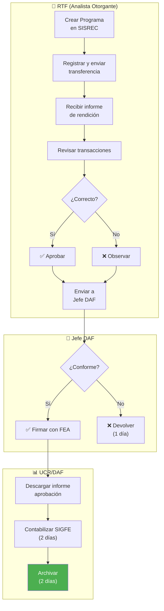
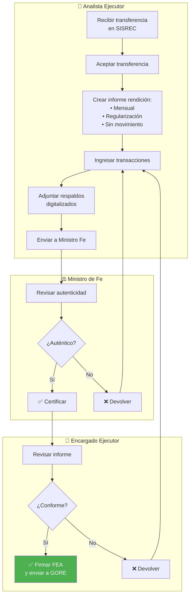
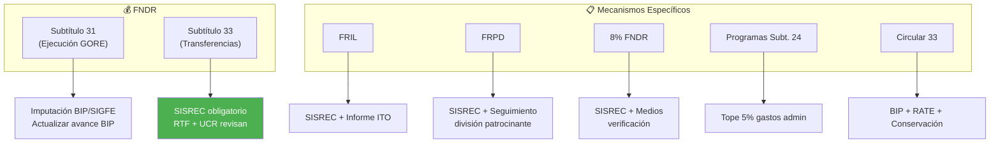
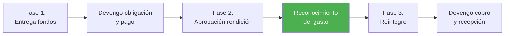
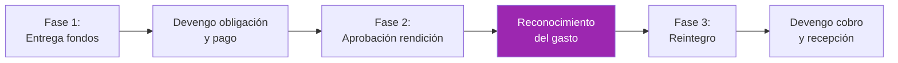
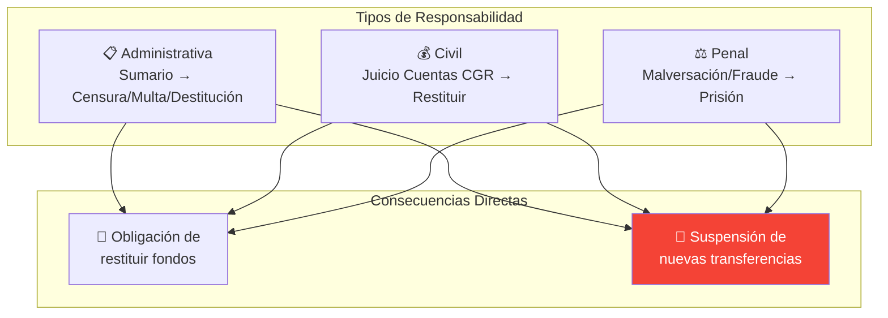

---
_manifest:
  urn: urn:gn:kb:bpmn-d08-rendiciones
  provenance:
    created_by: gn_rebuild.py
    created_at: '2026-03-08'
    source: domains/gn/04_habilitadores/arquitectura/bpmn/D08_rendiciones_koda.yml
version: 2.0.0
status: draft
tags:
- gore-nuble
- gobierno-regional
- bpmn
- rendiciones
- finanzas
- gn
lang: es
extensions:
  gn:
    source_paths:
    - domains/gn/04_habilitadores/arquitectura/bpmn/D08_rendiciones_koda.yml
    source_hashes:
      domains/gn/04_habilitadores/arquitectura/bpmn/D08_rendiciones_koda.yml: 07c56ac7ee69f6a94324af64f09082686f9e5623274fcdf1f9ae1a527b770c22
    source_type: koda_yaml
    transformation_mode: korafy_direct
    fs: 100
    cr: 1.16
    run_id: gn-smoke
    review_gate: auto
    scope_statement: null
    dependencies: []
    expected_sections:
    - Contenido
    skeleton_count: 16
    meat_count: 43
    fat_count: 0
    preserved_facts:
    - AI-Remediator=KODA-TRANSFORMER
    - "Body_MD.Content=\\# D08: Gestión de Rendiciones de Cuentas\n\n\\## Metadatos\
      \ del Dominio\n\n| Campo           | Valor                                 \
      \                                                                          \
      \                                       |\n| --------------- | ------------------------------------------------------------------------------------------------------------------------------------------------------\
      \ |\n| **ID**          | `DOM-RENDICIONES`                                 \
      \                                                                          \
      \                           |\n| **Criticidad**  | \U0001F534 Crítica      \
      \                                                                          \
      \                                                              |\n| **Dueño**\
      \       | UCR/DAF                                                          \
      \                                                                          \
      \            |\n| **Procesos**    | 3                                      \
      \                                                                          \
      \                                      |\n| **Subprocesos** | ~10          \
      \                                                                          \
      \                                                                |\n| **Ref.\
      \ Fuente** | [kb_gn_054_bpmn_c4_koda.yml](file:///Users/felixsanhueza/Developer/gorenuble/knowledge/domains/gn/arquitectura/kb_gn_054_bpmn_c4_koda.yml)\
      \ L.3735-4140 |\n\n---\n\n\\## Mapa General del Dominio\n\n```mermaid\nflowchart\
      \ LR\n    subgraph PROCESOS[\"\U0001F4CB Procesos de Rendición\"]\n        P1[\"\
      P1: Rendición<br/>Tradicional\"]\n        P2[\"P2: Rendición<br/>vía SISREC\"\
      ]\n        P3[\"P3: Rendición por<br/>Tipología de Fondos\"]\n    end\n\n  \
      \  subgraph SOPORTE[\"\U0001F527 Soporte\"]\n        S1[\"Marco<br/>Normativo\"\
      ]\n        S2[\"Expediente y<br/>Documentación\"]\n        S3[\"Control y<br/>Transparencia\"\
      ]\n    end\n\n    P1 --> S1 & S2 & S3\n    P2 --> S1 & S2 & S3\n    P3 --> P1\
      \ & P2\n\n    style P2 fill:#4CAF50,color:#fff\n    style P1 fill:#FF9800,color:#fff\n\
      ```\n\n---\n\n\\## P1: Rendición Tradicional (sin SISREC)\n\n| Campo      |\
      \ Valor                                |\n| ---------- | ------------------------------------\
      \ |\n| **ID**     | `BPMN-GN-RENDICIONES-TRADICIONAL-01` |\n| **SLA**    | 18\
      \ días hábiles GORE + 15 días EE    |\n| **Estado** | En transición a SISREC\
      \               |\n\n\\### Diagrama de Flujo\n\n```mermaid\nflowchart TD\n \
      \   subgraph EE[\"\U0001F3E2 Entidad Ejecutora\"]\n        A[\"Preparar rendición<br/>en\
      \ papel/digital\"]\n    end\n\n    subgraph GORE[\"\U0001F3DB️ GORE Ñuble\"\
      ]\n        B[\"\U0001F4EC OP: Recepcionar<br/>(2 días)\"]\n        C[\"\U0001F4CA\
      \ UCR: Registrar y<br/>asignar (2 días)\"]\n        D[\"\U0001F50D RTF: Revisión<br/>técnico-financiera<br/>(7\
      \ días)\"]\n        E{\"¿OK?\"}\n        F[\"✅ Certificado<br/>aprobación\"\
      ]\n        G[\"❌ Observar\"]\n        H[\"\U0001F4CA UCR: Control<br/>final\
      \ (4 días)\"]\n        I[\"\U0001F4B0 Contabilizar<br/>SIGFE (2 días)\"]\n \
      \       J[\"\U0001F4C1 Archivar<br/>(1 día)\"]\n    end\n\n    A -->|\"15 días<br/>del\
      \ mes sig.\"| B --> C --> D --> E\n    E -->|\"OK\"| F --> H --> I --> J\n \
      \   E -->|\"Observa\"| G --> A\n\n    style J fill:#4CAF50,color:#fff\n```\n\
      \n\\### Plazos por Etapa\n\n| Etapa                       | Plazo          \
      \               | Responsable       |\n| --------------------------- | -----------------------------\
      \ | ----------------- |\n| Presentación                | 15 días hábiles mes\
      \ siguiente | Entidad Ejecutora |\n| Recepción y registro        | 2 días hábiles\
      \                | Oficina de Partes |\n| Asignación a revisor        | 2 días\
      \ hábiles                | UCR/DAF           |\n| Revisión técnico-financiera\
      \ | 7 días hábiles                | RTF               |\n| Control final   \
      \            | 4 días hábiles                | UCR/DAF           |\n| Contabilización\
      \             | 2 días hábiles                | UCR/DAF           |\n| Archivo\
      \                     | 1 día hábil                   | UCR/DAF           |\n\
      \n---\n\n\\## P2: Rendición vía SISREC\n\n| Campo           | Valor        \
      \            |\n| --------------- | ------------------------ |\n| **ID**   \
      \       | `BPMN-GN-REND-SISREC-01` |\n| **Plataforma**  | SISREC CGR       \
      \        |\n| **Obligatorio** | Sí (Res. 1858/2023 CGR)  |\n\n\\### Visión General\n\
      \n```mermaid\nflowchart LR\n    subgraph GORE[\"\U0001F3DB️ GORE (Otorgante)\"\
      ]\n        G1[\"Crear programa\"]\n        G2[\"Registrar transferencia\"]\n\
      \        G3[\"Revisar rendición\"]\n        G4[\"Aprobar/Observar\"]\n     \
      \   G5[\"Contabilizar\"]\n    end\n\n    subgraph EE[\"\U0001F3E2 Entidad Ejecutora\"\
      ]\n        E1[\"Aceptar transferencia\"]\n        E2[\"Crear informe\"]\n  \
      \      E3[\"Ingresar transacciones\"]\n        E4[\"Ministro Fe certifica\"\
      ]\n        E5[\"Firmar y enviar\"]\n    end\n\n    G1 --> G2 --> E1 --> E2 -->\
      \ E3 --> E4 --> E5 --> G3 --> G4 --> G5\n\n    style G5 fill:#4CAF50,color:#fff\n\
      ```\n\n\\### Flujo Entidad Otorgante (GORE)\n\n```mermaid\nflowchart TD\n  \
      \  subgraph RTF[\"\U0001F464 RTF (Analista Otorgante)\"]\n        A[\"Crear\
      \ Programa<br/>en SISREC\"]\n        B[\"Registrar y enviar<br/>transferencia\"\
      ]\n        C[\"Recibir informe<br/>de rendición\"]\n        D[\"Revisar transacciones\"\
      ]\n        E{\"¿Correcto?\"}\n        F[\"✅ Aprobar\"]\n        G[\"❌ Observar\"\
      ]\n        H[\"Enviar a<br/>Jefe DAF\"]\n    end\n\n    subgraph JEFE_DAF[\"\
      \U0001F454 Jefe DAF\"]\n        I{\"¿Conforme?\"}\n        J[\"✅ Firmar con\
      \ FEA\"]\n        K[\"❌ Devolver<br/>(1 día)\"]\n    end\n\n    subgraph UCR[\"\
      \U0001F4CA UCR/DAF\"]\n        L[\"Descargar informe<br/>aprobación\"]\n   \
      \     M[\"Contabilizar SIGFE<br/>(2 días)\"]\n        N[\"Archivar<br/>(2 días)\"\
      ]\n    end\n\n    A --> B --> C --> D --> E\n    E -->|\"Sí\"| F --> H\n   \
      \ E -->|\"No\"| G --> H\n    H --> I\n    I -->|\"Sí\"| J --> L --> M --> N\n\
      \    I -->|\"No\"| K\n\n    style N fill:#4CAF50,color:#fff\n```\n\n\\### Flujo\
      \ Entidad Ejecutora\n\n```mermaid\nflowchart TD\n    subgraph ANALISTA[\"\U0001F464\
      \ Analista Ejecutor\"]\n        A[\"Recibir transferencia<br/>en SISREC\"]\n\
      \        B[\"Aceptar transferencia\"]\n        C[\"Crear informe rendición:<br/>•\
      \ Mensual<br/>• Regularización<br/>• Sin movimiento\"]\n        D[\"Ingresar\
      \ transacciones\"]\n        E[\"Adjuntar respaldos<br/>digitalizados\"]\n  \
      \      F[\"Enviar a Ministro Fe\"]\n    end\n\n    subgraph MF[\"⚖️ Ministro\
      \ de Fe\"]\n        G[\"Revisar autenticidad\"]\n        H{\"¿Auténtico?\"}\n\
      \        I[\"✅ Certificar\"]\n        J[\"❌ Devolver\"]\n    end\n\n    subgraph\
      \ ENCARGADO[\"\U0001F454 Encargado Ejecutor\"]\n        K[\"Revisar informe\"\
      ]\n        L{\"¿Conforme?\"}\n        M[\"✅ Firmar FEA<br/>y enviar a GORE\"\
      ]\n        N[\"❌ Devolver\"]\n    end\n\n    A --> B --> C --> D --> E --> F\
      \ --> G --> H\n    H -->|\"Sí\"| I --> K --> L\n    H -->|\"No\"| J --> D\n\
      \    L -->|\"Sí\"| M\n    L -->|\"No\"| N --> D\n\n    style M fill:#4CAF50,color:#fff\n\
      ```\n\n\\### Tipos de Informe\n\n| Tipo               | Uso                \
      \                 |\n| ------------------ | -----------------------------------\
      \ |\n| **Mensual**        | Rendición regular con transacciones |\n| **Regularización**\
      \ | Corrección de observaciones         |\n| **Sin Movimiento** | Período sin\
      \ gastos                  |\n\n---\n\n\\## P3: Rendición por Tipología de Fondos\n\
      \n| Campo          | Valor                       |\n| -------------- | ---------------------------\
      \ |\n| **ID**         | `BPMN-GN-REND-TIPOLOGIA-01` |\n| **Tipologías** | 7\
      \ tipos de fondos           |\n\n\\### Tipologías de Fondos\n\n```mermaid\n\
      flowchart TD\n    subgraph FNDR[\"\U0001F4B0 FNDR\"]\n        F1[\"Subtítulo\
      \ 31<br/>(Ejecución GORE)\"]\n        F2[\"Subtítulo 33<br/>(Transferencias)\"\
      ]\n    end\n\n    subgraph MECANISMOS[\"\U0001F4CB Mecanismos Específicos\"\
      ]\n        M1[\"FRIL\"]\n        M2[\"FRPD\"]\n        M3[\"8% FNDR\"]\n   \
      \     M4[\"Programas Subt. 24\"]\n        M5[\"Circular 33\"]\n    end\n\n \
      \   F1 --> R1[\"Imputación BIP/SIGFE<br/>Actualizar avance BIP\"]\n    F2 -->\
      \ R2[\"SISREC obligatorio<br/>RTF + UCR revisan\"]\n    M1 --> R3[\"SISREC +\
      \ Informe ITO\"]\n    M2 --> R4[\"SISREC + Seguimiento<br/>división patrocinante\"\
      ]\n    M3 --> R5[\"SISREC + Medios<br/>verificación\"]\n    M4 --> R6[\"Tope\
      \ 5% gastos admin\"]\n    M5 --> R7[\"BIP + RATE + Conservación\"]\n\n    style\
      \ R2 fill:#4CAF50,color:#fff\n```\n\n\\### Requisitos por Tipología\n\n| Fondo\
      \                  | Vía          | Requisitos Especiales                  |\n\
      | ---------------------- | ------------ | --------------------------------------\
      \ |\n| **FNDR Subt. 31**      | BIP + SIGFE  | Actualizar avance físico-financiero\
      \    |\n| **FNDR Subt. 33**      | SISREC       | RTF revisa coherencia técnica\
      \          |\n| **FRIL**               | SISREC       | Considerar informe ITO,\
      \ SNI            |\n| **FRPD**               | SISREC       | Seguimiento metas\
      \ por división         |\n| **8% FNDR**            | SISREC       | Medios verificación,\
      \ gastos prohibidos |\n| **Programas Subt. 24** | SISREC       | Tope 5% gastos\
      \ administración          |\n| **Circular 33**        | BIP + SISREC | RATE\
      \ conservación                      |\n\n---\n\n\\## Procedimientos Contables\
      \ SIGFE\n\n\\### F07: Transferencias a Sector Privado\n\n```mermaid\nflowchart\
      \ LR\n    A[\"Fase 1:<br/>Entrega fondos\"] --> B[\"Devengo obligación<br/>y\
      \ pago\"]\n    B --> C[\"Fase 2:<br/>Aprobación rendición\"]\n    C --> D[\"\
      Reconocimiento<br/>del gasto\"]\n    D --> E[\"Fase 3:<br/>Reintegro\"]\n  \
      \  E --> F[\"Devengo cobro<br/>y recepción\"]\n\n    style D fill:#4CAF50,color:#fff\n\
      ```\n\n\\### F08: Transferencias a Sector Público\n\n```mermaid\nflowchart LR\n\
      \    A[\"Fase 1:<br/>Entrega fondos\"] --> B[\"Devengo obligación<br/>y pago\"\
      ]\n    B --> C[\"Fase 2:<br/>Aprobación rendición\"]\n    C --> D[\"Reconocimiento<br/>del\
      \ gasto\"]\n    D --> E[\"Fase 3:<br/>Reintegro\"]\n    E --> F[\"Devengo cobro<br/>y\
      \ recepción\"]\n\n    style D fill:#9C27B0,color:#fff\n```\n\n> ⚠️ **Nota**:\
      \ Para servicios públicos no consolidables, el devengo del gasto ocurre al aprobar\
      \ la rendición.\n\n---\n\n\\## Marco Normativo\n\n| Norma                  \
      \      | Alcance                       |\n| ---------------------------- | -----------------------------\
      \ |\n| **Resolución 30/2015 CGR**   | Procedimiento general         |\n| **Resolución\
      \ 1858/2023 CGR** | Uso obligatorio SISREC        |\n| **Ley 19.862**      \
      \         | Registro Colaboradores Estado |\n| **Ley 21.719**              \
      \ | Protección Datos Personales   |\n\n\\### Artículos Clave Res. 30/2015\n\n\
      | Artículo    | Contenido                                             |\n| -----------\
      \ | ----------------------------------------------------- |\n| Art. 2      |\
      \ Constitución expediente                               |\n| Art. 4-5    | Documentación\
      \ auténtica                               |\n| Art. 10     | Expediente de rendición\
      \                               |\n| Art. 13     | Gastos post-tramitación \
      \                              |\n| **Art. 18** | ⚠️ Prohibe nuevos fondos si\
      \ hay rendiciones pendientes |\n| **Art. 31** | Obligación de restituir fondos\
      \                        |\n\n---\n\n\\## Expediente de Rendición\n\n\\### Componentes\n\
      \n| Componente               | Descripción                   |\n| ------------------------\
      \ | ----------------------------- |\n| Informe de Rendición     | Documento\
      \ formal del ejecutor |\n| Comprobantes de Ingreso  | Recepción de fondos  \
      \         |\n| Comprobantes de Egreso   | Facturas, boletas, contratos  |\n\
      | Comprobantes de Traspaso | Operaciones sin efectivo      |\n| Registro Ley\
      \ 19.862      | Si aplica (privados)          |\n| Medios de Verificación  \
      \ | Fotos, listas, informes       |\n\n\\### Documentación Auténtica\n\n| Soporte\
      \          | Requisito                          |\n| ---------------- | ----------------------------------\
      \ |\n| **Papel**        | Original o copia autentificada     |\n| **Electrónico**\
      \  | Firma electrónica según Ley 19.799 |\n| **Digitalizado** | Autentificado\
      \ por Ministro de Fe   |\n\n---\n\n\\## Responsabilidades y Sanciones\n\n```mermaid\n\
      flowchart TD\n    subgraph TIPOS[\"Tipos de Responsabilidad\"]\n        R1[\"\
      \U0001F4CB Administrativa<br/>Sumario → Censura/Multa/Destitución\"]\n     \
      \   R2[\"\U0001F4B0 Civil<br/>Juicio Cuentas CGR → Restituir\"]\n        R3[\"\
      ⚖️ Penal<br/>Malversación/Fraude → Prisión\"]\n    end\n\n    subgraph CONSECUENCIAS[\"\
      Consecuencias Directas\"]\n        C1[\"\U0001F504 Obligación de<br/>restituir\
      \ fondos\"]\n        C2[\"\U0001F6AB Suspensión de<br/>nuevas transferencias\"\
      ]\n    end\n\n    R1 & R2 & R3 --> C1 & C2\n\n    style C2 fill:#f44336,color:#fff\n\
      ```\n\n---\n\n\\## Control y Transparencia\n\n\\### Control Interno\n\n| Mecanismo\
      \                     | Responsable       |\n| -----------------------------\
      \ | ----------------- |\n| Auditorías selectivas         | Unidad de Control\
      \ |\n| Listas de chequeo             | UCR/RTF           |\n| Seguimiento físico-financiero\
      \ | RTF               |\n\n\\### Fiscalización Externa\n\n| Organismo  | Función\
      \                                 |\n| ---------- | ---------------------------------------\
      \ |\n| **CGR**    | Juzgamiento cuentas, auditorías, SISREC |\n| **DIPRES**\
      \ | Monitoreo ejecución vía SIGFE           |\n\n\\### Transparencia\n\n| Obligación\
      \ | Detalle                          |\n| ---------- | --------------------------------\
      \ |\n| Glosa 08   | Info corporaciones/fundaciones   |\n| Glosa 16   | Cartera\
      \ proyectos, acuerdos CORE |\n\n---\n\n\\## Sistemas Involucrados\n\n| Sistema\
      \        | Función                    |\n| -------------- | --------------------------\
      \ |\n| `SYS-SISREC`   | Rendición electrónica CGR  |\n| `SYS-SIGFE`    | Contabilización\
      \            |\n| `SYS-BIP-SNI`  | Avance físico-financiero   |\n| `SYS-FIRMAGOB`\
      \ | Firma Electrónica Avanzada |\n\n---\n\n\\## Referencias Cruzadas\n\n| Dominio\
      \ Relacionado                                                              \
      \                                                              | Vínculo   \
      \               |\n| ----------------------------------------------------------------------------------------------------------------------------------------------\
      \ | ------------------------ |\n| [D03 Gestión IPR](file:///Users/felixsanhueza/Developer/gorenuble/knowledge/domains/gn/arquitectura/bpmn/D03_gestion_ipr.md)\
      \                   | Cierre financiero Fase 7 |\n| [D02 Ciclo Presupuestario](file:///Users/felixsanhueza/Developer/gorenuble/knowledge/domains/gn/arquitectura/bpmn/D02_ciclo_presupuestario.md)\
      \ | Contabilización, devengo |\n\n---\n\n*Última actualización: 2025-12-16*\n"
    - Body_MD.ID=BPMN-GN-D08-RENDICIONES-BODY-01
    - Body_MD.Src=sources/gn/arquitectura/bpmn/D08_rendiciones.md
    - Creation-Date=2025-12-22
    - 'Ctx=Especificación STS del dominio D08: Gestión de Rendiciones de Cuentas del
      GORE Ñuble, modelado en BPMN.'
    - Format=KODA/Spec
    - Human-Creator=FS
    - Human-Editor=FS
    - ID=BPMN-GN-D08-RENDICIONES-KODA
    - 'LLM_Parsing_Instructions.Content=BEGIN_LLM_INSTRUCTIONS

      You are an AI agent consuming a KODA artifact. Parse with absolute fidelity.


      FIDELITY: Preserve meat (essential information) and skeleton (structure: headers,
      IDs, lists, tables) with zero loss. Ignore fat (filler words, rhetoric, stylistic
      prose).


      LEXICON (expand before processing): Act->Action, Cond->Condition, Cpt->Concept,
      Ctx->Context, Def->Definition, Fnd->Foundation, ID->ID, Mech->Mechanism, Mssn->Mission,
      Nat->Nature, Obj->Objective, Proc->Process, Prohib->Prohibition, Purp->Purpose,
      Ref->Reference, Req->Requirement, Res->Result, Resp->Responsible, Src->Source,
      Warn->Warning.


      REFERENCE POLICY: Ref: is internal only—must point to existing ID within THIS
      document. External documents and legal sources are mentioned as contextual information
      under Ctx: or Src:.


      LANGUAGE POLICY: Keywords in English (and abbreviated forms as listed), content
      in original language (Spanish). Never translate content.

      END_LLM_INSTRUCTIONS

      '
    - LLM_Parsing_Instructions.ID=KODA-LLM-PARSER-01
    - LLM_Parsing_Instructions.Prohib=Using for artifact creation or translation.
    - LLM_Parsing_Instructions.Req=Mandatory block following Metadata.
    - Metadatos_Dominio.Criticidad=🔴 Crítica
    - Metadatos_Dominio.Dueno=UCR/DAF
    - Metadatos_Dominio.ID=DOM-RENDICIONES
    - Metadatos_Dominio.Procesos=3
    - Metadatos_Dominio.Ref_Fuente.Ctx_Required[0]=knowledge/domains/gn/arquitectura/kb_gn_054_bpmn_c4_koda.yml
      L.3735-4140
    - Metadatos_Dominio.Subprocesos=~10
    - Model-Collaborator[0]=Cascade
    - Modification-Date=2025-12-22
    - Source.Ctx_Required[0]=knowledge/domains/gn/arquitectura/kb_gn_054_bpmn_c4_koda.yml
    - Source.Primary-Source=sources/gn/arquitectura/bpmn/D08_rendiciones.md
    - Status=Draft
    - Version=1.0.0
    - _manifest.compatibility.breaking_changes_from=null
    - _manifest.compatibility.min_consumer_version=1.0.0
    - _manifest.dependencies.requires[0].reason=KODA/Spec format compliance
    - _manifest.dependencies.requires[0].urn=urn:knowledge:koda:core:spec:1.0.0
    - _manifest.dependencies.requires[1].reason=Transformation methodology reference
    - _manifest.dependencies.requires[1].urn=urn:knowledge:koda:core:transform:1.0.0
    - _manifest.dependencies.requires[2].reason=Marco integrado BPMN/C4
    - _manifest.dependencies.requires[2].urn=urn:knowledge:gorenuble:gn:bpmn-c4:1.0.0
    - _manifest.federation.license=Institutional Use
    - _manifest.federation.visibility=internal
    - _manifest.provenance.created_at=2025-12-22
    - _manifest.provenance.created_by=FS
    - _manifest.provenance.last_modified_at=2025-12-22
    - _manifest.provenance.model_collaborators[0]=Cascade
    - _manifest.provenance.model_collaborators[1]=KODA-TRANSFORMER
    - _manifest.resolution.canonical_url=file://knowledge/domains/gn/arquitectura/bpmn/D08_rendiciones_koda.yml
    - _manifest.urn=urn:knowledge:gorenuble:gn:bpmn-d08-rendiciones:1.0.0
    cr_justification: Fuente altamente estructurada o derivacion de alcance acotado.
---

# BPMN D08: Gestión de Rendiciones de Cuentas
## ID
BPMN-GN-D08-RENDICIONES-KODA

## Version
1.0.0

## Status
Draft

## Format
KODA/Spec

## Human Creator
FS

## Human Editor
FS

## Model Collaborator
- Cascade

## AI Remediator
KODA-TRANSFORMER

## Creation Date
2025-12-22

## Modification Date
2025-12-22

## Ctx
Especificación STS del dominio D08: Gestión de Rendiciones de Cuentas del GORE Ñuble, modelado en BPMN.

## Source
### Ctx Required
- knowledge/domains/gn/arquitectura/kb_gn_054_bpmn_c4_koda.yml
### Primary Source
sources/gn/arquitectura/bpmn/D08_rendiciones.md

## LLM Parsing Instructions
### ID
KODA-LLM-PARSER-01
### Req
Mandatory block following Metadata.
### Prohib
Using for artifact creation or translation.
### Content
BEGIN_LLM_INSTRUCTIONS
You are an AI agent consuming a KODA artifact. Parse with absolute fidelity.

FIDELITY: Preserve meat (essential information) and skeleton (structure: headers, IDs, lists, tables) with zero loss. Ignore fat (filler words, rhetoric, stylistic prose).

LEXICON (expand before processing): Act->Action, Cond->Condition, Cpt->Concept, Ctx->Context, Def->Definition, Fnd->Foundation, ID->ID, Mech->Mechanism, Mssn->Mission, Nat->Nature, Obj->Objective, Proc->Process, Prohib->Prohibition, Purp->Purpose, Ref->Reference, Req->Requirement, Res->Result, Resp->Responsible, Src->Source, Warn->Warning.

REFERENCE POLICY: Ref: is internal only—must point to existing ID within THIS document. External documents and legal sources are mentioned as contextual information under Ctx: or Src:.

LANGUAGE POLICY: Keywords in English (and abbreviated forms as listed), content in original language (Spanish). Never translate content.
END_LLM_INSTRUCTIONS


## Metadatos Dominio
### ID
DOM-RENDICIONES
### Criticidad
🔴 Crítica
### Dueno
UCR/DAF
### Procesos
3
### Subprocesos
~10
### Ref Fuente
#### Ctx Required
- knowledge/domains/gn/arquitectura/kb_gn_054_bpmn_c4_koda.yml L.3735-4140

## Body MD
### ID
BPMN-GN-D08-RENDICIONES-BODY-01
### Src
sources/gn/arquitectura/bpmn/D08_rendiciones.md
### Content
\# D08: Gestión de Rendiciones de Cuentas

\## Metadatos del Dominio

| Campo           | Valor                                                                                                                                                  |
| --------------- | ------------------------------------------------------------------------------------------------------------------------------------------------------ |
| **ID**          | `DOM-RENDICIONES`                                                                                                                                      |
| **Criticidad**  | 🔴 Crítica                                                                                                                                              |
| **Dueño**       | UCR/DAF                                                                                                                                                |
| **Procesos**    | 3                                                                                                                                                      |
| **Subprocesos** | ~10                                                                                                                                                    |
| **Ref. Fuente** | [kb_gn_054_bpmn_c4_koda.yml](file:///Users/felixsanhueza/Developer/gorenuble/knowledge/domains/gn/arquitectura/kb_gn_054_bpmn_c4_koda.yml) L.3735-4140 |

---

\## Mapa General del Dominio



---

\## P1: Rendición Tradicional (sin SISREC)

| Campo      | Valor                                |
| ---------- | ------------------------------------ |
| **ID**     | `BPMN-GN-RENDICIONES-TRADICIONAL-01` |
| **SLA**    | 18 días hábiles GORE + 15 días EE    |
| **Estado** | En transición a SISREC               |

\### Diagrama de Flujo



\### Plazos por Etapa

| Etapa                       | Plazo                         | Responsable       |
| --------------------------- | ----------------------------- | ----------------- |
| Presentación                | 15 días hábiles mes siguiente | Entidad Ejecutora |
| Recepción y registro        | 2 días hábiles                | Oficina de Partes |
| Asignación a revisor        | 2 días hábiles                | UCR/DAF           |
| Revisión técnico-financiera | 7 días hábiles                | RTF               |
| Control final               | 4 días hábiles                | UCR/DAF           |
| Contabilización             | 2 días hábiles                | UCR/DAF           |
| Archivo                     | 1 día hábil                   | UCR/DAF           |

---

\## P2: Rendición vía SISREC

| Campo           | Valor                    |
| --------------- | ------------------------ |
| **ID**          | `BPMN-GN-REND-SISREC-01` |
| **Plataforma**  | SISREC CGR               |
| **Obligatorio** | Sí (Res. 1858/2023 CGR)  |

\### Visión General



\### Flujo Entidad Otorgante (GORE)



\### Flujo Entidad Ejecutora



\### Tipos de Informe

| Tipo               | Uso                                 |
| ------------------ | ----------------------------------- |
| **Mensual**        | Rendición regular con transacciones |
| **Regularización** | Corrección de observaciones         |
| **Sin Movimiento** | Período sin gastos                  |

---

\## P3: Rendición por Tipología de Fondos

| Campo          | Valor                       |
| -------------- | --------------------------- |
| **ID**         | `BPMN-GN-REND-TIPOLOGIA-01` |
| **Tipologías** | 7 tipos de fondos           |

\### Tipologías de Fondos



\### Requisitos por Tipología

| Fondo                  | Vía          | Requisitos Especiales                  |
| ---------------------- | ------------ | -------------------------------------- |
| **FNDR Subt. 31**      | BIP + SIGFE  | Actualizar avance físico-financiero    |
| **FNDR Subt. 33**      | SISREC       | RTF revisa coherencia técnica          |
| **FRIL**               | SISREC       | Considerar informe ITO, SNI            |
| **FRPD**               | SISREC       | Seguimiento metas por división         |
| **8% FNDR**            | SISREC       | Medios verificación, gastos prohibidos |
| **Programas Subt. 24** | SISREC       | Tope 5% gastos administración          |
| **Circular 33**        | BIP + SISREC | RATE conservación                      |

---

\## Procedimientos Contables SIGFE

\### F07: Transferencias a Sector Privado



\### F08: Transferencias a Sector Público



> ⚠️ **Nota**: Para servicios públicos no consolidables, el devengo del gasto ocurre al aprobar la rendición.

---

\## Marco Normativo

| Norma                        | Alcance                       |
| ---------------------------- | ----------------------------- |
| **Resolución 30/2015 CGR**   | Procedimiento general         |
| **Resolución 1858/2023 CGR** | Uso obligatorio SISREC        |
| **Ley 19.862**               | Registro Colaboradores Estado |
| **Ley 21.719**               | Protección Datos Personales   |

\### Artículos Clave Res. 30/2015

| Artículo    | Contenido                                             |
| ----------- | ----------------------------------------------------- |
| Art. 2      | Constitución expediente                               |
| Art. 4-5    | Documentación auténtica                               |
| Art. 10     | Expediente de rendición                               |
| Art. 13     | Gastos post-tramitación                               |
| **Art. 18** | ⚠️ Prohibe nuevos fondos si hay rendiciones pendientes |
| **Art. 31** | Obligación de restituir fondos                        |

---

\## Expediente de Rendición

\### Componentes

| Componente               | Descripción                   |
| ------------------------ | ----------------------------- |
| Informe de Rendición     | Documento formal del ejecutor |
| Comprobantes de Ingreso  | Recepción de fondos           |
| Comprobantes de Egreso   | Facturas, boletas, contratos  |
| Comprobantes de Traspaso | Operaciones sin efectivo      |
| Registro Ley 19.862      | Si aplica (privados)          |
| Medios de Verificación   | Fotos, listas, informes       |

\### Documentación Auténtica

| Soporte          | Requisito                          |
| ---------------- | ---------------------------------- |
| **Papel**        | Original o copia autentificada     |
| **Electrónico**  | Firma electrónica según Ley 19.799 |
| **Digitalizado** | Autentificado por Ministro de Fe   |

---

\## Responsabilidades y Sanciones



---

\## Control y Transparencia

\### Control Interno

| Mecanismo                     | Responsable       |
| ----------------------------- | ----------------- |
| Auditorías selectivas         | Unidad de Control |
| Listas de chequeo             | UCR/RTF           |
| Seguimiento físico-financiero | RTF               |

\### Fiscalización Externa

| Organismo  | Función                                 |
| ---------- | --------------------------------------- |
| **CGR**    | Juzgamiento cuentas, auditorías, SISREC |
| **DIPRES** | Monitoreo ejecución vía SIGFE           |

\### Transparencia

| Obligación | Detalle                          |
| ---------- | -------------------------------- |
| Glosa 08   | Info corporaciones/fundaciones   |
| Glosa 16   | Cartera proyectos, acuerdos CORE |

---

\## Sistemas Involucrados

| Sistema        | Función                    |
| -------------- | -------------------------- |
| `SYS-SISREC`   | Rendición electrónica CGR  |
| `SYS-SIGFE`    | Contabilización            |
| `SYS-BIP-SNI`  | Avance físico-financiero   |
| `SYS-FIRMAGOB` | Firma Electrónica Avanzada |

---

\## Referencias Cruzadas

| Dominio Relacionado                                                                                                                            | Vínculo                  |
| ---------------------------------------------------------------------------------------------------------------------------------------------- | ------------------------ |
| [D03 Gestión IPR](file:///Users/felixsanhueza/Developer/gorenuble/knowledge/domains/gn/arquitectura/bpmn/D03_gestion_ipr.md)                   | Cierre financiero Fase 7 |
| [D02 Ciclo Presupuestario](file:///Users/felixsanhueza/Developer/gorenuble/knowledge/domains/gn/arquitectura/bpmn/D02_ciclo_presupuestario.md) | Contabilización, devengo |

---

*Última actualización: 2025-12-16*
