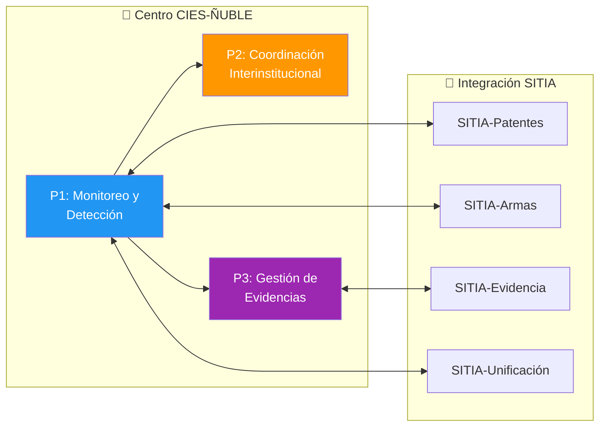
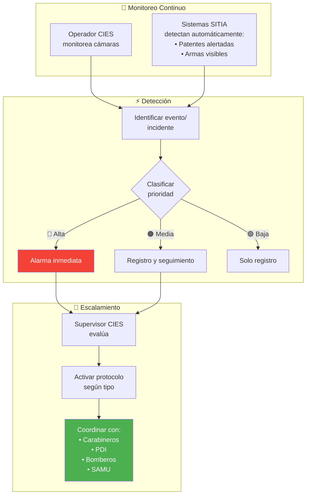
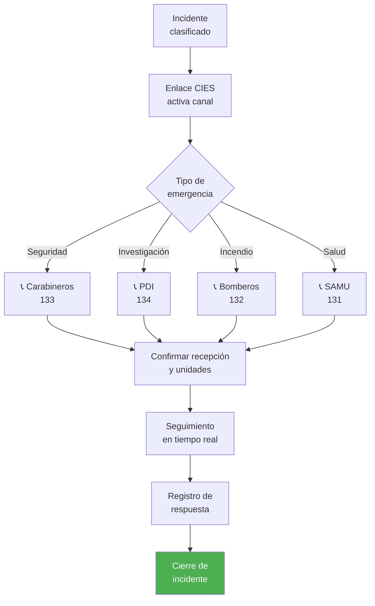
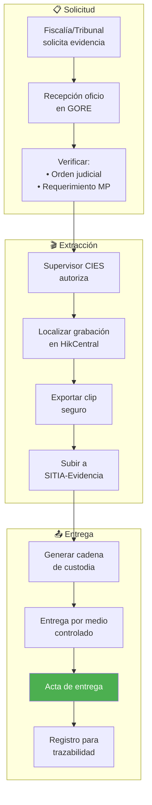
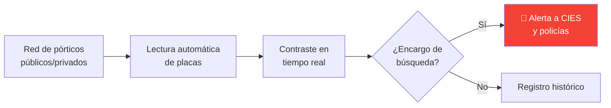
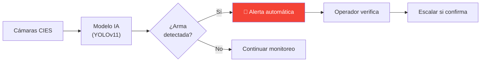
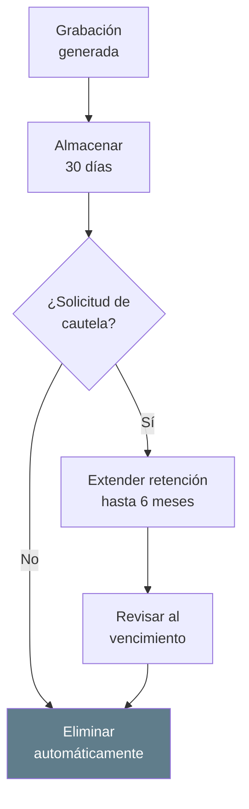
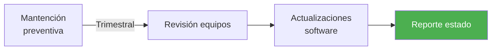

---
_manifest:
  urn: urn:gn:kb:bpmn-d09-cies-sitia
  provenance:
    created_by: gn_rebuild.py
    created_at: '2026-03-08'
    source: domains/gn/04_habilitadores/arquitectura/bpmn/D09_cies_sitia_koda.yml
version: 2.0.0
status: draft
tags:
- gore-nuble
- gobierno-regional
- seguridad-publica
- cies
- sitia
- bpmn
- gn
lang: es
extensions:
  gn:
    source_paths:
    - domains/gn/04_habilitadores/arquitectura/bpmn/D09_cies_sitia_koda.yml
    source_hashes:
      domains/gn/04_habilitadores/arquitectura/bpmn/D09_cies_sitia_koda.yml: 013b29d9cdd47f96f46a9ce994d9ddbbef0f24d73529039e0a67fa53a112e304
    source_type: koda_yaml
    transformation_mode: korafy_direct
    fs: 100
    cr: 1.17
    run_id: gn-smoke
    review_gate: auto
    scope_statement: null
    dependencies: []
    expected_sections:
    - Contenido
    skeleton_count: 16
    meat_count: 43
    fat_count: 0
    preserved_facts:
    - AI-Remediator=KODA-TRANSFORMER
    - "Body_MD.Content=\\# D09: Gestión Operativa CIES/SITIA (Seguridad Pública)\n\
      \n\\## Metadatos del Dominio\n\n| Campo           | Valor                  \
      \                                                                          \
      \                                                      |\n| ---------------\
      \ | ------------------------------------------------------------------------------------------------------------------------------------------------------\
      \ |\n| **ID**          | `DOM-CIES`                                        \
      \                                                                          \
      \                           |\n| **Criticidad**  | \U0001F7E0 Alta         \
      \                                                                          \
      \                                                              |\n| **Dueño**\
      \       | Supervisor CIES                                                  \
      \                                                                          \
      \            |\n| **Procesos**    | 3                                      \
      \                                                                          \
      \                                      |\n| **Subprocesos** | ~8           \
      \                                                                          \
      \                                                                |\n| **Ref.\
      \ Fuente** | [kb_gn_054_bpmn_c4_koda.yml](file:///Users/felixsanhueza/Developer/gorenuble/knowledge/domains/gn/arquitectura/kb_gn_054_bpmn_c4_koda.yml)\
      \ L.4142-4306 |\n\n---\n\n\\## Mapa General del Dominio\n\n```mermaid\nflowchart\
      \ LR\n    subgraph CIES[\"\U0001F3A5 Centro CIES-ÑUBLE\"]\n        P1[\"P1:\
      \ Monitoreo y<br/>Detección\"]\n        P2[\"P2: Coordinación<br/>Interinstitucional\"\
      ]\n        P3[\"P3: Gestión de<br/>Evidencias\"]\n    end\n\n    subgraph SITIA[\"\
      \U0001F916 Integración SITIA\"]\n        S1[\"SITIA-Patentes\"]\n        S2[\"\
      SITIA-Armas\"]\n        S3[\"SITIA-Evidencia\"]\n        S4[\"SITIA-Unificación\"\
      ]\n    end\n\n    P1 --> P2\n    P1 --> P3\n    P1 <--> S1 & S2 & S4\n    P3\
      \ <--> S3\n\n    style P1 fill:#2196F3,color:#fff\n    style P2 fill:#FF9800,color:#fff\n\
      \    style P3 fill:#9C27B0,color:#fff\n```\n\n---\n\n\\## Contexto Operativo\n\
      \n| Aspecto          | Detalle                                 |\n| ----------------\
      \ | --------------------------------------- |\n| **Cobertura**    | 16 horas\
      \ (08:00-00:00), proyección 24/7 |\n| **Ubicación**    | Sala de monitoreo GORE\
      \ Ñuble            |\n| **Coordinación** | Policías, emergencias, 21 municipios\
      \    |\n| **Marco legal**  | Ley 21.427, Ley 20.965, Ley 20.502      |\n\n---\n\
      \n\\## P1: Monitoreo, Detección y Escalamiento\n\n| Campo       | Valor    \
      \                         |\n| ----------- | ---------------------------------\
      \ |\n| **ID**      | `BPMN-GN-CIES-SITIA-MONITOREO-01` |\n| **Sistema** | HikCentral\
      \ VMS                    |\n\n\\### Diagrama de Flujo\n\n```mermaid\nflowchart\
      \ TD\n    subgraph MONITOREO[\"\U0001F3A5 Monitoreo Continuo\"]\n        A[\"\
      Operador CIES<br/>monitorea cámaras\"]\n        B[\"Sistemas SITIA<br/>detectan\
      \ automáticamente:<br/>• Patentes alertadas<br/>• Armas visibles\"]\n    end\n\
      \n    subgraph DETECCION[\"⚡ Detección\"]\n        C[\"Identificar evento/<br/>incidente\"\
      ]\n        D{\"Clasificar<br/>prioridad\"}\n        D -->|\"\U0001F534 Alta\"\
      | E[\"Alarma inmediata\"]\n        D -->|\"\U0001F7E0 Media\"| F[\"Registro\
      \ y seguimiento\"]\n        D -->|\"\U0001F7E2 Baja\"| G[\"Solo registro\"]\n\
      \    end\n\n    subgraph ESCALAMIENTO[\"\U0001F4E2 Escalamiento\"]\n       \
      \ E --> H[\"Supervisor CIES<br/>evalúa\"]\n        H --> I[\"Activar protocolo<br/>según\
      \ tipo\"]\n        I --> J[\"Coordinar con:<br/>• Carabineros<br/>• PDI<br/>•\
      \ Bomberos<br/>• SAMU\"]\n    end\n\n    A --> C\n    B --> C\n    C --> D\n\
      \    F --> H\n\n    style E fill:#f44336,color:#fff\n    style J fill:#4CAF50,color:#fff\n\
      ```\n\n\\### Clasificación de Incidentes\n\n| Prioridad   | Tipo           \
      \                   | Acción                   |\n| ----------- | ---------------------------------\
      \ | ------------------------ |\n| \U0001F534 **Alta**  | Delito en curso, emergencia\
      \ vital | Activación inmediata     |\n| \U0001F7E0 **Media** | Sospecha, situación\
      \ anómala       | Seguimiento y evaluación |\n| \U0001F7E2 **Baja**  | Evento\
      \ menor, registro            | Solo documentar          |\n\n---\n\n\\## P2:\
      \ Coordinación Interinstitucional\n\n| Campo         | Valor               \
      \                         |\n| ------------- | --------------------------------------------\
      \ |\n| **ID**        | `BPMN-GN-CIES-SITIA-COORD-01`                |\n| **Entidades**\
      \ | Carabineros, PDI, Bomberos, SAMU, Municipios |\n\n\\### Diagrama de Flujo\n\
      \n```mermaid\nflowchart TD\n    A[\"Incidente<br/>clasificado\"] --> B[\"Enlace\
      \ CIES<br/>activa canal\"]\n    B --> C{\"Tipo de<br/>emergencia\"}\n    \n\
      \    C -->|\"Seguridad\"| D[\"\U0001F4DE Carabineros<br/>133\"]\n    C -->|\"\
      Investigación\"| E[\"\U0001F4DE PDI<br/>134\"]\n    C -->|\"Incendio\"| F[\"\
      \U0001F4DE Bomberos<br/>132\"]\n    C -->|\"Salud\"| G[\"\U0001F4DE SAMU<br/>131\"\
      ]\n    \n    D & E & F & G --> H[\"Confirmar recepción<br/>y unidades\"]\n \
      \   H --> I[\"Seguimiento<br/>en tiempo real\"]\n    I --> J[\"Registro de<br/>respuesta\"\
      ]\n    J --> K[\"Cierre de<br/>incidente\"]\n\n    style K fill:#4CAF50,color:#fff\n\
      ```\n\n\\### Protocolos de Comunicación\n\n| Canal                  | Uso  \
      \                         |\n| ---------------------- | -----------------------------\
      \ |\n| Radio VHF              | Comunicación directa policías |\n| Líneas directas\
      \        | Centrales de emergencia       |\n| WhatsApp institucional | Coordinación\
      \ municipal        |\n| Plataforma SITIA       | Integración nacional      \
      \    |\n\n---\n\n\\## P3: Gestión de Evidencias Digitales\n\n| Campo       \
      \   | Valor                               |\n| -------------- | -----------------------------------\
      \ |\n| **ID**         | `BPMN-GN-CIES-SITIA-EVIDENCIA-01`   |\n| **Plataforma**\
      \ | SITIA-Evidencia (Genetec Clearance) |\n\n\\### Diagrama de Flujo\n\n```mermaid\n\
      flowchart TD\n    subgraph SOLICITUD[\"\U0001F4CB Solicitud\"]\n        A[\"\
      Fiscalía/Tribunal<br/>solicita evidencia\"]\n        B[\"Recepción oficio<br/>en\
      \ GORE\"]\n        C[\"Verificar:<br/>• Orden judicial<br/>• Requerimiento MP\"\
      ]\n    end\n\n    subgraph EXTRACCION[\"\U0001F3AC Extracción\"]\n        D[\"\
      Supervisor CIES<br/>autoriza\"]\n        E[\"Localizar grabación<br/>en HikCentral\"\
      ]\n        F[\"Exportar clip<br/>seguro\"]\n        G[\"Subir a<br/>SITIA-Evidencia\"\
      ]\n    end\n\n    subgraph ENTREGA[\"\U0001F4E4 Entrega\"]\n        H[\"Generar\
      \ cadena<br/>de custodia\"]\n        I[\"Entrega por medio<br/>controlado\"\
      ]\n        J[\"Acta de entrega\"]\n        K[\"Registro para<br/>trazabilidad\"\
      ]\n    end\n\n    A --> B --> C --> D --> E --> F --> G --> H --> I --> J -->\
      \ K\n\n    style J fill:#4CAF50,color:#fff\n```\n\n\\### Cadena de Custodia\
      \ Digital\n\n| Elemento        | Verificación      |\n| --------------- | -----------------\
      \ |\n| Hash de archivo | Integridad        |\n| Metadatos       | Fecha/hora/cámara\
      \ |\n| Log de accesos  | Quién manipuló    |\n| Firma digital   | Autenticidad\
      \      |\n\n---\n\n\\## Capacidades SITIA\n\n\\### SITIA-Patentes\n\n```mermaid\n\
      flowchart LR\n    A[\"Red de pórticos<br/>públicos/privados\"] --> B[\"Lectura\
      \ automática<br/>de placas\"]\n    B --> C[\"Contraste en<br/>tiempo real\"\
      ]\n    C --> D{\"¿Encargo de<br/>búsqueda?\"}\n    D -->|\"Sí\"| E[\"\U0001F6A8\
      \ Alerta a CIES<br/>y policías\"]\n    D -->|\"No\"| F[\"Registro histórico\"\
      ]\n\n    style E fill:#f44336,color:#fff\n```\n\n\\### SITIA-Armas\n\n```mermaid\n\
      flowchart LR\n    A[\"Cámaras CIES\"] --> B[\"Modelo IA<br/>(YOLOv11)\"]\n \
      \   B --> C{\"¿Arma<br/>detectada?\"}\n    C -->|\"Sí\"| D[\"\U0001F6A8 Alerta\
      \ automática\"]\n    C -->|\"No\"| E[\"Continuar monitoreo\"]\n    D --> F[\"\
      Operador verifica\"]\n    F --> G[\"Escalar si confirma\"]\n\n    style D fill:#f44336,color:#fff\n\
      ```\n\n---\n\n\\## Gestión de Privacidad y Retención\n\n\\### Política de Retención\n\
      \n| Aspecto               | Regla                           |\n| ---------------------\
      \ | ------------------------------- |\n| **Retención normal**  | 30 días   \
      \                      |\n| **Eliminación**       | Segura e irreversible  \
      \         |\n| **Cautela ciudadana** | Hasta 6 meses (víctima/testigo) |\n\n\
      \\### Cumplimiento Normativo\n\n```mermaid\nflowchart TD\n    A[\"Grabación<br/>generada\"\
      ] --> B[\"Almacenar<br/>30 días\"]\n    B --> C{\"¿Solicitud de<br/>cautela?\"\
      }\n    C -->|\"Sí\"| D[\"Extender retención<br/>hasta 6 meses\"]\n    C -->|\"\
      No\"| E[\"Eliminar<br/>automáticamente\"]\n    D --> F[\"Revisar al<br/>vencimiento\"\
      ]\n    F --> E\n\n    style E fill:#607D8B,color:#fff\n```\n\n> ⚠️ **Ley 19.628**:\
      \ Tratamiento de datos personales debe respetar licitud, finalidad y proporcionalidad.\n\
      \n---\n\n\\## Sostenibilidad Operativa\n\n\\### Modelo de Financiamiento\n\n\
      | Componente         | Fuente                          |\n| ------------------\
      \ | ------------------------------- |\n| Personal CIES      | Presupuesto anual\
      \ GORE          |\n| Mantención equipos | Garantía 22 meses + presupuesto |\n\
      | Servicios SITIA    | Convenio marco con SPD          |\n\n\\### Mantención\n\
      \n```mermaid\nflowchart LR\n    A[\"Mantención<br/>preventiva\"] -->|\"Trimestral\"\
      | B[\"Revisión equipos\"]\n    B --> C[\"Actualizaciones<br/>software\"]\n \
      \   C --> D[\"Reporte estado\"]\n\n    style D fill:#4CAF50,color:#fff\n```\n\
      \n---\n\n\\## Sistemas Involucrados\n\n| Sistema               | Función   \
      \          |\n| --------------------- | ------------------- |\n| `SYS-HIKCENTRAL`\
      \      | VMS gestión cámaras |\n| `SYS-SITIA`           | Plataforma nacional\
      \ |\n| `SYS-SITIA-EVIDENCIA` | Gestión evidencias  |\n| `SYS-SITIA-PATENTES`\
      \  | Lectura placas      |\n| `SYS-SITIA-ARMAS`     | Detección IA        |\n\
      \n---\n\n\\## Normativa Aplicable\n\n| Norma          | Alcance            \
      \        |\n| -------------- | -------------------------- |\n| **Ley 21.427**\
      \ | Sistema Nacional Seguridad |\n| **Ley 20.965** | Cámaras vigilancia    \
      \     |\n| **Ley 20.502** | ONEMI/funcionamiento       |\n| **Ley 19.628** |\
      \ Protección vida privada    |\n| **Ley 21.719** | Datos personales        \
      \   |\n\n---\n\n\\## Referencias Cruzadas\n\n| Dominio Relacionado         \
      \                                                                          \
      \                                           | Vínculo                 |\n| ------------------------------------------------------------------------------------------------------------------------------------------------\
      \ | ----------------------- |\n| [D01 Actos Administrativos](file:///Users/felixsanhueza/Developer/gorenuble/knowledge/domains/gn/arquitectura/bpmn/D01_actos_administrativos.md)\
      \ | Convenios con entidades |\n\n---\n\n*Última actualización: 2025-12-16*\n"
    - Body_MD.ID=BPMN-GN-D09-CIES-SITIA-BODY-01
    - Body_MD.Src=sources/gn/arquitectura/bpmn/D09_cies_sitia.md
    - Creation-Date=2025-12-22
    - 'Ctx=Especificación STS del dominio D09: Gestión Operativa CIES/SITIA (Seguridad
      Pública) del GORE Ñuble, modelado en BPMN.'
    - Format=KODA/Spec
    - Human-Creator=FS
    - Human-Editor=FS
    - ID=BPMN-GN-D09-CIES-SITIA-KODA
    - 'LLM_Parsing_Instructions.Content=BEGIN_LLM_INSTRUCTIONS

      You are an AI agent consuming a KODA artifact. Parse with absolute fidelity.


      FIDELITY: Preserve meat (essential information) and skeleton (structure: headers,
      IDs, lists, tables) with zero loss. Ignore fat (filler words, rhetoric, stylistic
      prose).


      LEXICON (expand before processing): Act->Action, Cond->Condition, Cpt->Concept,
      Ctx->Context, Def->Definition, Fnd->Foundation, ID->ID, Mech->Mechanism, Mssn->Mission,
      Nat->Nature, Obj->Objective, Proc->Process, Prohib->Prohibition, Purp->Purpose,
      Ref->Reference, Req->Requirement, Res->Result, Resp->Responsible, Src->Source,
      Warn->Warning.


      REFERENCE POLICY: Ref: is internal only—must point to existing ID within THIS
      document. External documents and legal sources are mentioned as contextual information
      under Ctx: or Src:.


      LANGUAGE POLICY: Keywords in English (and abbreviated forms as listed), content
      in original language (Spanish). Never translate content.

      END_LLM_INSTRUCTIONS

      '
    - LLM_Parsing_Instructions.ID=KODA-LLM-PARSER-01
    - LLM_Parsing_Instructions.Prohib=Using for artifact creation or translation.
    - LLM_Parsing_Instructions.Req=Mandatory block following Metadata.
    - Metadatos_Dominio.Criticidad=🟠 Alta
    - Metadatos_Dominio.Dueno=Supervisor CIES
    - Metadatos_Dominio.ID=DOM-CIES
    - Metadatos_Dominio.Procesos=3
    - Metadatos_Dominio.Ref_Fuente.Ctx_Required[0]=knowledge/domains/gn/arquitectura/kb_gn_054_bpmn_c4_koda.yml
      L.4142-4306
    - Metadatos_Dominio.Subprocesos=~8
    - Model-Collaborator[0]=Cascade
    - Modification-Date=2025-12-22
    - Source.Ctx_Required[0]=knowledge/domains/gn/arquitectura/kb_gn_054_bpmn_c4_koda.yml
    - Source.Primary-Source=sources/gn/arquitectura/bpmn/D09_cies_sitia.md
    - Status=Draft
    - Version=1.0.0
    - _manifest.compatibility.breaking_changes_from=null
    - _manifest.compatibility.min_consumer_version=1.0.0
    - _manifest.dependencies.requires[0].reason=KODA/Spec format compliance
    - _manifest.dependencies.requires[0].urn=urn:knowledge:koda:core:spec:1.0.0
    - _manifest.dependencies.requires[1].reason=Transformation methodology reference
    - _manifest.dependencies.requires[1].urn=urn:knowledge:koda:core:transform:1.0.0
    - _manifest.dependencies.requires[2].reason=Marco integrado BPMN/C4
    - _manifest.dependencies.requires[2].urn=urn:knowledge:gorenuble:gn:bpmn-c4:1.0.0
    - _manifest.federation.license=Institutional Use
    - _manifest.federation.visibility=internal
    - _manifest.provenance.created_at=2025-12-22
    - _manifest.provenance.created_by=FS
    - _manifest.provenance.last_modified_at=2025-12-22
    - _manifest.provenance.model_collaborators[0]=Cascade
    - _manifest.provenance.model_collaborators[1]=KODA-TRANSFORMER
    - _manifest.resolution.canonical_url=file://knowledge/domains/gn/arquitectura/bpmn/D09_cies_sitia_koda.yml
    - _manifest.urn=urn:knowledge:gorenuble:gn:bpmn-d09-cies-sitia:1.0.0
    cr_justification: Fuente altamente estructurada o derivacion de alcance acotado.
---

# BPMN D09: Gestión Operativa CIES/SITIA (Seguridad Pública)
## ID
BPMN-GN-D09-CIES-SITIA-KODA

## Version
1.0.0

## Status
Draft

## Format
KODA/Spec

## Human Creator
FS

## Human Editor
FS

## Model Collaborator
- Cascade

## AI Remediator
KODA-TRANSFORMER

## Creation Date
2025-12-22

## Modification Date
2025-12-22

## Ctx
Especificación STS del dominio D09: Gestión Operativa CIES/SITIA (Seguridad Pública) del GORE Ñuble, modelado en BPMN.

## Source
### Ctx Required
- knowledge/domains/gn/arquitectura/kb_gn_054_bpmn_c4_koda.yml
### Primary Source
sources/gn/arquitectura/bpmn/D09_cies_sitia.md

## LLM Parsing Instructions
### ID
KODA-LLM-PARSER-01
### Req
Mandatory block following Metadata.
### Prohib
Using for artifact creation or translation.
### Content
BEGIN_LLM_INSTRUCTIONS
You are an AI agent consuming a KODA artifact. Parse with absolute fidelity.

FIDELITY: Preserve meat (essential information) and skeleton (structure: headers, IDs, lists, tables) with zero loss. Ignore fat (filler words, rhetoric, stylistic prose).

LEXICON (expand before processing): Act->Action, Cond->Condition, Cpt->Concept, Ctx->Context, Def->Definition, Fnd->Foundation, ID->ID, Mech->Mechanism, Mssn->Mission, Nat->Nature, Obj->Objective, Proc->Process, Prohib->Prohibition, Purp->Purpose, Ref->Reference, Req->Requirement, Res->Result, Resp->Responsible, Src->Source, Warn->Warning.

REFERENCE POLICY: Ref: is internal only—must point to existing ID within THIS document. External documents and legal sources are mentioned as contextual information under Ctx: or Src:.

LANGUAGE POLICY: Keywords in English (and abbreviated forms as listed), content in original language (Spanish). Never translate content.
END_LLM_INSTRUCTIONS


## Metadatos Dominio
### ID
DOM-CIES
### Criticidad
🟠 Alta
### Dueno
Supervisor CIES
### Procesos
3
### Subprocesos
~8
### Ref Fuente
#### Ctx Required
- knowledge/domains/gn/arquitectura/kb_gn_054_bpmn_c4_koda.yml L.4142-4306

## Body MD
### ID
BPMN-GN-D09-CIES-SITIA-BODY-01
### Src
sources/gn/arquitectura/bpmn/D09_cies_sitia.md
### Content
\# D09: Gestión Operativa CIES/SITIA (Seguridad Pública)

\## Metadatos del Dominio

| Campo           | Valor                                                                                                                                                  |
| --------------- | ------------------------------------------------------------------------------------------------------------------------------------------------------ |
| **ID**          | `DOM-CIES`                                                                                                                                             |
| **Criticidad**  | 🟠 Alta                                                                                                                                                 |
| **Dueño**       | Supervisor CIES                                                                                                                                        |
| **Procesos**    | 3                                                                                                                                                      |
| **Subprocesos** | ~8                                                                                                                                                     |
| **Ref. Fuente** | [kb_gn_054_bpmn_c4_koda.yml](file:///Users/felixsanhueza/Developer/gorenuble/knowledge/domains/gn/arquitectura/kb_gn_054_bpmn_c4_koda.yml) L.4142-4306 |

---

\## Mapa General del Dominio



---

\## Contexto Operativo

| Aspecto          | Detalle                                 |
| ---------------- | --------------------------------------- |
| **Cobertura**    | 16 horas (08:00-00:00), proyección 24/7 |
| **Ubicación**    | Sala de monitoreo GORE Ñuble            |
| **Coordinación** | Policías, emergencias, 21 municipios    |
| **Marco legal**  | Ley 21.427, Ley 20.965, Ley 20.502      |

---

\## P1: Monitoreo, Detección y Escalamiento

| Campo       | Valor                             |
| ----------- | --------------------------------- |
| **ID**      | `BPMN-GN-CIES-SITIA-MONITOREO-01` |
| **Sistema** | HikCentral VMS                    |

\### Diagrama de Flujo



\### Clasificación de Incidentes

| Prioridad   | Tipo                              | Acción                   |
| ----------- | --------------------------------- | ------------------------ |
| 🔴 **Alta**  | Delito en curso, emergencia vital | Activación inmediata     |
| 🟠 **Media** | Sospecha, situación anómala       | Seguimiento y evaluación |
| 🟢 **Baja**  | Evento menor, registro            | Solo documentar          |

---

\## P2: Coordinación Interinstitucional

| Campo         | Valor                                        |
| ------------- | -------------------------------------------- |
| **ID**        | `BPMN-GN-CIES-SITIA-COORD-01`                |
| **Entidades** | Carabineros, PDI, Bomberos, SAMU, Municipios |

\### Diagrama de Flujo



\### Protocolos de Comunicación

| Canal                  | Uso                           |
| ---------------------- | ----------------------------- |
| Radio VHF              | Comunicación directa policías |
| Líneas directas        | Centrales de emergencia       |
| WhatsApp institucional | Coordinación municipal        |
| Plataforma SITIA       | Integración nacional          |

---

\## P3: Gestión de Evidencias Digitales

| Campo          | Valor                               |
| -------------- | ----------------------------------- |
| **ID**         | `BPMN-GN-CIES-SITIA-EVIDENCIA-01`   |
| **Plataforma** | SITIA-Evidencia (Genetec Clearance) |

\### Diagrama de Flujo



\### Cadena de Custodia Digital

| Elemento        | Verificación      |
| --------------- | ----------------- |
| Hash de archivo | Integridad        |
| Metadatos       | Fecha/hora/cámara |
| Log de accesos  | Quién manipuló    |
| Firma digital   | Autenticidad      |

---

\## Capacidades SITIA

\### SITIA-Patentes



\### SITIA-Armas



---

\## Gestión de Privacidad y Retención

\### Política de Retención

| Aspecto               | Regla                           |
| --------------------- | ------------------------------- |
| **Retención normal**  | 30 días                         |
| **Eliminación**       | Segura e irreversible           |
| **Cautela ciudadana** | Hasta 6 meses (víctima/testigo) |

\### Cumplimiento Normativo



> ⚠️ **Ley 19.628**: Tratamiento de datos personales debe respetar licitud, finalidad y proporcionalidad.

---

\## Sostenibilidad Operativa

\### Modelo de Financiamiento

| Componente         | Fuente                          |
| ------------------ | ------------------------------- |
| Personal CIES      | Presupuesto anual GORE          |
| Mantención equipos | Garantía 22 meses + presupuesto |
| Servicios SITIA    | Convenio marco con SPD          |

\### Mantención



---

\## Sistemas Involucrados

| Sistema               | Función             |
| --------------------- | ------------------- |
| `SYS-HIKCENTRAL`      | VMS gestión cámaras |
| `SYS-SITIA`           | Plataforma nacional |
| `SYS-SITIA-EVIDENCIA` | Gestión evidencias  |
| `SYS-SITIA-PATENTES`  | Lectura placas      |
| `SYS-SITIA-ARMAS`     | Detección IA        |

---

\## Normativa Aplicable

| Norma          | Alcance                    |
| -------------- | -------------------------- |
| **Ley 21.427** | Sistema Nacional Seguridad |
| **Ley 20.965** | Cámaras vigilancia         |
| **Ley 20.502** | ONEMI/funcionamiento       |
| **Ley 19.628** | Protección vida privada    |
| **Ley 21.719** | Datos personales           |

---

\## Referencias Cruzadas

| Dominio Relacionado                                                                                                                              | Vínculo                 |
| ------------------------------------------------------------------------------------------------------------------------------------------------ | ----------------------- |
| [D01 Actos Administrativos](file:///Users/felixsanhueza/Developer/gorenuble/knowledge/domains/gn/arquitectura/bpmn/D01_actos_administrativos.md) | Convenios con entidades |

---

*Última actualización: 2025-12-16*
