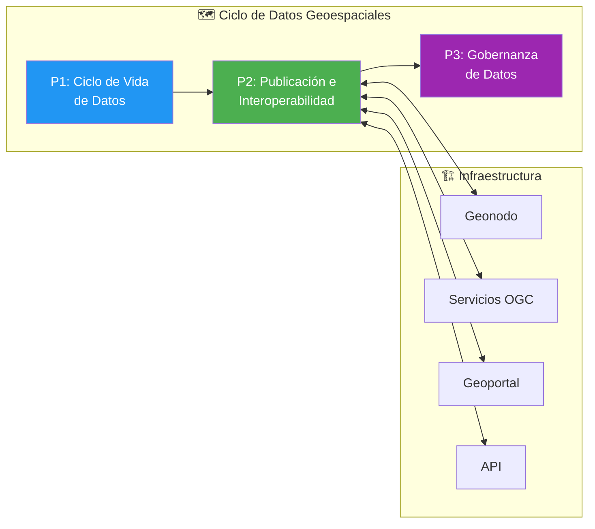
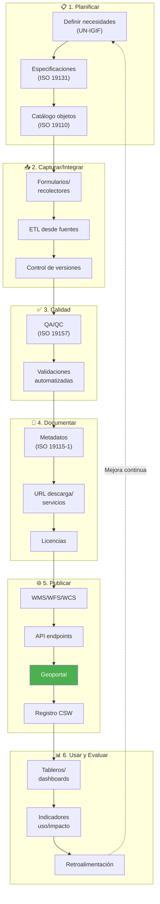
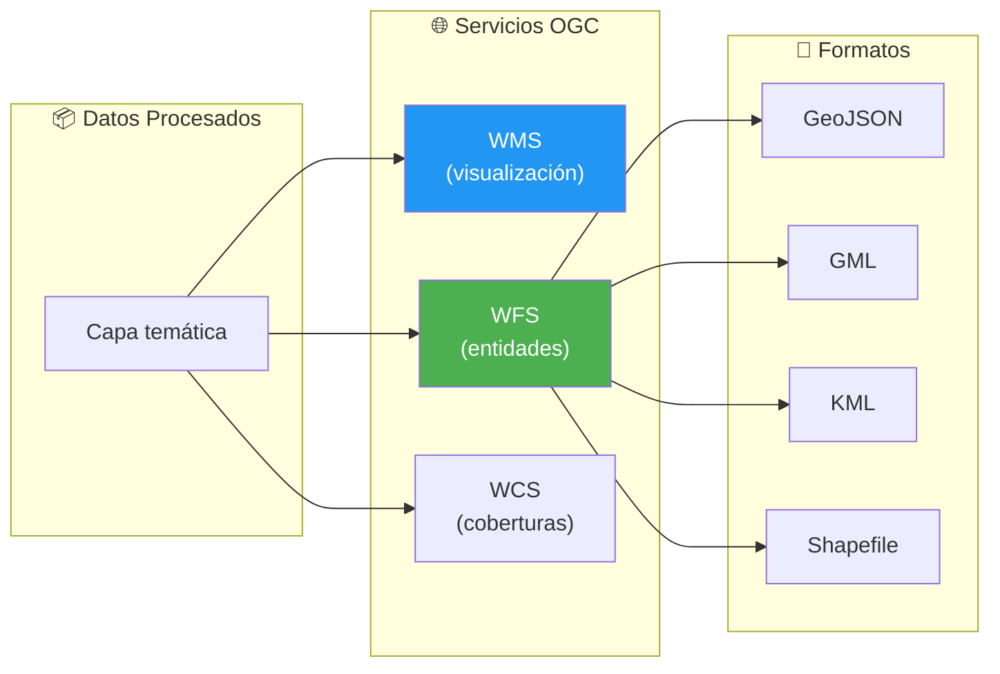
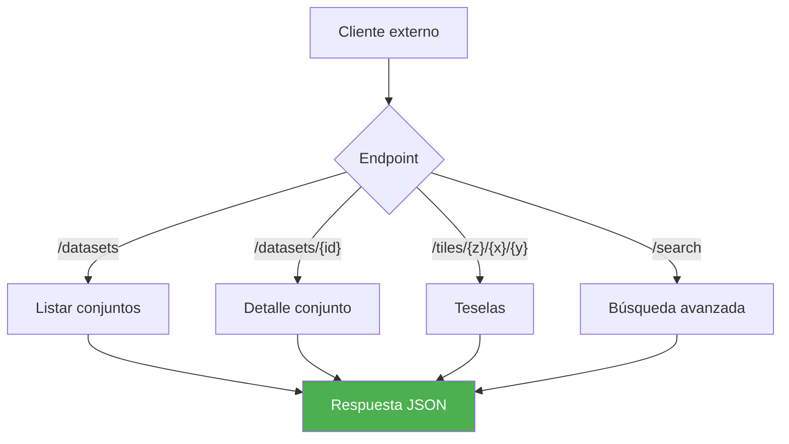
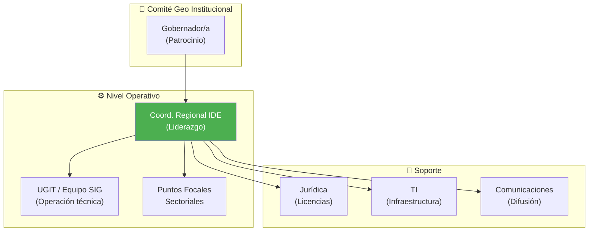
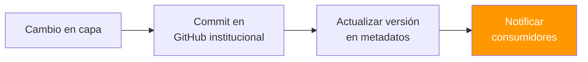
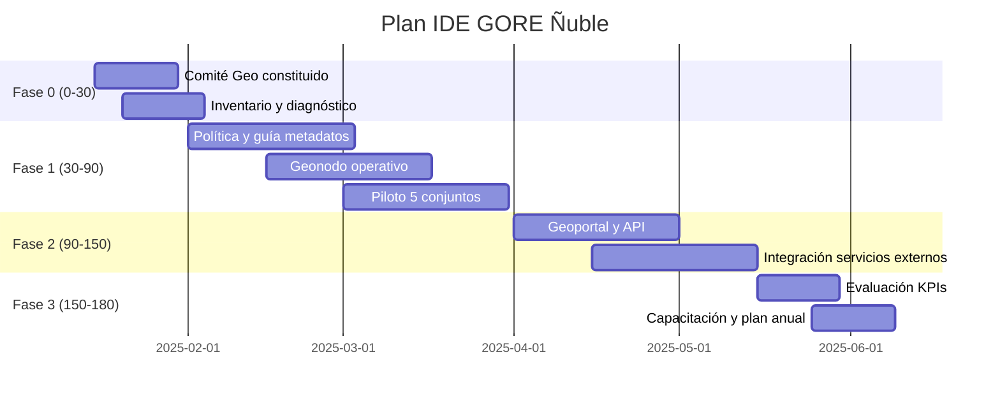

---
_manifest:
  urn: urn:gn:kb:bpmn-d10-geoespacial-ide
  provenance:
    created_by: gn_rebuild.py
    created_at: '2026-03-08'
    source: domains/gn/04_habilitadores/arquitectura/bpmn/D10_geoespacial_ide_koda.yml
version: 2.0.0
status: draft
tags:
- gore-nuble
- gobierno-regional
- geoespacial
- ide
- bpmn
- gn
lang: es
extensions:
  gn:
    source_paths:
    - domains/gn/04_habilitadores/arquitectura/bpmn/D10_geoespacial_ide_koda.yml
    source_hashes:
      domains/gn/04_habilitadores/arquitectura/bpmn/D10_geoespacial_ide_koda.yml: c7aed58a04063ab80e5e43dbb12003236eef581694c4330a58040ce480848294
    source_type: koda_yaml
    transformation_mode: korafy_direct
    fs: 100
    cr: 1.18
    run_id: gn-smoke
    review_gate: auto
    scope_statement: null
    dependencies: []
    expected_sections:
    - Contenido
    skeleton_count: 16
    meat_count: 43
    fat_count: 0
    preserved_facts:
    - AI-Remediator=KODA-TRANSFORMER
    - "Body_MD.Content=\\# D10: Gestión de Información Geoespacial (IDE/Geonodo)\n\
      \n\\## Metadatos del Dominio\n\n| Campo           | Valor                  \
      \                                                                          \
      \                                                      |\n| ---------------\
      \ | ------------------------------------------------------------------------------------------------------------------------------------------------------\
      \ |\n| **ID**          | `DOM-GEO`                                         \
      \                                                                          \
      \                           |\n| **Criticidad**  | \U0001F7E1 Media        \
      \                                                                          \
      \                                                              |\n| **Dueño**\
      \       | Coordinador Regional IDE                                         \
      \                                                                          \
      \            |\n| **Procesos**    | 3                                      \
      \                                                                          \
      \                                      |\n| **Subprocesos** | ~10          \
      \                                                                          \
      \                                                                |\n| **Ref.\
      \ Fuente** | [kb_gn_054_bpmn_c4_koda.yml](file:///Users/felixsanhueza/Developer/gorenuble/knowledge/domains/gn/arquitectura/kb_gn_054_bpmn_c4_koda.yml)\
      \ L.4308-4478 |\n\n---\n\n\\## Mapa General del Dominio\n\n```mermaid\nflowchart\
      \ LR\n    subgraph CICLO[\"\U0001F5FA️ Ciclo de Datos Geoespaciales\"]\n   \
      \     P1[\"P1: Ciclo de Vida<br/>de Datos\"]\n        P2[\"P2: Publicación e<br/>Interoperabilidad\"\
      ]\n        P3[\"P3: Gobernanza<br/>de Datos\"]\n    end\n\n    subgraph INFRAESTRUCTURA[\"\
      \U0001F3D7️ Infraestructura\"]\n        I1[\"Geonodo\"]\n        I2[\"Servicios\
      \ OGC\"]\n        I3[\"Geoportal\"]\n        I4[\"API\"]\n    end\n\n    P1\
      \ --> P2 --> P3\n    P2 <--> I1 & I2 & I3 & I4\n\n    style P1 fill:#2196F3,color:#fff\n\
      \    style P2 fill:#4CAF50,color:#fff\n    style P3 fill:#9C27B0,color:#fff\n\
      ```\n\n---\n\n\\## Marco Estratégico\n\n| Aspecto        | Alineamiento    \
      \              |\n| -------------- | ----------------------------- |\n| **ERD\
      \ Ñuble**  | Gestión territorial informada |\n| **IDE Chile**  | Interoperabilidad\
      \ nacional    |\n| **ISO/TC 211** | Estándares geoespaciales      |\n| **OGC**\
      \        | Servicios web abiertos        |\n\n---\n\n\\## P1: Ciclo de Vida\
      \ de Datos Geoespaciales\n\n| Campo     | Valor                       |\n| ---------\
      \ | --------------------------- |\n| **ID**    | `BPMN-GN-GEO-FLUJO-INST-01`\
      \ |\n| **Fases** | 6                           |\n\n\\### Diagrama de Flujo\n\
      \n```mermaid\nflowchart TD\n    subgraph PLANIFICAR[\"\U0001F4CB 1. Planificar\"\
      ]\n        A[\"Definir necesidades<br/>(UN-IGIF)\"]\n        B[\"Especificaciones<br/>(ISO\
      \ 19131)\"]\n        C[\"Catálogo objetos<br/>(ISO 19110)\"]\n    end\n\n  \
      \  subgraph CAPTURAR[\"\U0001F4E5 2. Capturar/Integrar\"]\n        D[\"Formularios/<br/>recolectores\"\
      ]\n        E[\"ETL desde fuentes\"]\n        F[\"Control de versiones\"]\n \
      \   end\n\n    subgraph CALIDAD[\"✅ 3. Calidad\"]\n        G[\"QA/QC<br/>(ISO\
      \ 19157)\"]\n        H[\"Validaciones<br/>automatizadas\"]\n    end\n\n    subgraph\
      \ DOCUMENTAR[\"\U0001F4DD 4. Documentar\"]\n        I[\"Metadatos<br/>(ISO 19115-1)\"\
      ]\n        J[\"URL descarga/<br/>servicios\"]\n        K[\"Licencias\"]\n  \
      \  end\n\n    subgraph PUBLICAR[\"\U0001F310 5. Publicar\"]\n        L[\"WMS/WFS/WCS\"\
      ]\n        M[\"API endpoints\"]\n        N[\"Geoportal\"]\n        O[\"Registro\
      \ CSW\"]\n    end\n\n    subgraph USAR[\"\U0001F4CA 6. Usar y Evaluar\"]\n \
      \       P[\"Tableros/<br/>dashboards\"]\n        Q[\"Indicadores<br/>uso/impacto\"\
      ]\n        R[\"Retroalimentación\"]\n    end\n\n    A --> B --> C --> D -->\
      \ E --> F --> G --> H --> I --> J --> K --> L --> M --> N --> O --> P --> Q\
      \ --> R\n    R -.->|\"Mejora continua\"| A\n\n    style N fill:#4CAF50,color:#fff\n\
      ```\n\n\\### Responsables por Etapa\n\n| Etapa               | Responsable \
      \        |\n| ------------------- | ------------------- |\n| Planificar    \
      \      | Coord. Regional IDE |\n| Capturar/Calidad    | UGIT / Equipo SIG  \
      \ |\n| Documentar/Publicar | UGIT / Equipo SIG   |\n| Usar y Evaluar      |\
      \ Divisiones usuarias |\n\n---\n\n\\## P2: Publicación e Interoperabilidad\n\
      \n| Campo  | Valor                                |\n| ------ | ------------------------------------\
      \ |\n| **ID** | `BPMN-GN-GEO-PUBLICACION-DETALLE-01` |\n\n\\### Servicios OGC\n\
      \n```mermaid\nflowchart LR\n    subgraph CAPAS[\"\U0001F4E6 Datos Procesados\"\
      ]\n        A[\"Capa temática\"]\n    end\n\n    subgraph SERVICIOS[\"\U0001F310\
      \ Servicios OGC\"]\n        B[\"WMS<br/>(visualización)\"]\n        C[\"WFS<br/>(entidades)\"\
      ]\n        D[\"WCS<br/>(coberturas)\"]\n    end\n\n    subgraph FORMATOS[\"\U0001F4C4\
      \ Formatos\"]\n        E[\"GeoJSON\"]\n        F[\"GML\"]\n        G[\"KML\"\
      ]\n        H[\"Shapefile\"]\n    end\n\n    A --> B & C & D\n    C --> E & F\
      \ & G & H\n\n    style B fill:#2196F3,color:#fff\n    style C fill:#4CAF50,color:#fff\n\
      ```\n\n\\### API Institucional\n\n```mermaid\nflowchart TD\n    A[\"Cliente\
      \ externo\"] --> B{\"Endpoint\"}\n    B -->|\"/datasets\"| C[\"Listar conjuntos\"\
      ]\n    B -->|\"/datasets/{id}\"| D[\"Detalle conjunto\"]\n    B -->|\"/tiles/{z}/{x}/{y}\"\
      | E[\"Teselas\"]\n    B -->|\"/search\"| F[\"Búsqueda avanzada\"]\n    C & D\
      \ & E & F --> G[\"Respuesta JSON\"]\n\n    style G fill:#4CAF50,color:#fff\n\
      ```\n\n\\### Geoportal\n\n| Funcionalidad    | Descripción                 \
      \       |\n| ---------------- | ---------------------------------- |\n| Búsqueda\
      \         | Por tema, palabra clave, ubicación |\n| Previsualización | Visor\
      \ WMS integrado                |\n| Descarga         | Múltiples formatos  \
      \               |\n| Tutoriales       | Guías por perfil de usuario        |\n\
      \n---\n\n\\## P3: Gobernanza de Datos Geoespaciales\n\n| Campo  | Valor    \
      \                   |\n| ------ | --------------------------- |\n| **ID** |\
      \ `BPMN-GN-GEO-GOBERNANZA-01` |\n\n\\### Roles de Gobernanza\n\n```mermaid\n\
      flowchart TD\n    subgraph COMITE[\"\U0001F465 Comité Geo Institucional\"]\n\
      \        A[\"Gobernador/a<br/>(Patrocinio)\"]\n    end\n\n    subgraph OPERATIVO[\"\
      ⚙️ Nivel Operativo\"]\n        B[\"Coord. Regional IDE<br/>(Liderazgo)\"]\n\
      \        C[\"UGIT / Equipo SIG<br/>(Operación técnica)\"]\n        D[\"Puntos\
      \ Focales<br/>Sectoriales\"]\n    end\n\n    subgraph SOPORTE[\"\U0001F527 Soporte\"\
      ]\n        E[\"Jurídica<br/>(Licencias)\"]\n        F[\"TI<br/>(Infraestructura)\"\
      ]\n        G[\"Comunicaciones<br/>(Difusión)\"]\n    end\n\n    A --> B -->\
      \ C & D\n    B --> E & F & G\n\n    style B fill:#4CAF50,color:#fff\n```\n\n\
      \\### Trazabilidad y Versionamiento\n\n```mermaid\nflowchart LR\n    A[\"Cambio\
      \ en capa\"] --> B[\"Commit en<br/>GitHub institucional\"]\n    B --> C[\"Actualizar\
      \ versión<br/>en metadatos\"]\n    C --> D[\"Notificar<br/>consumidores\"]\n\
      \n    style D fill:#FF9800,color:#fff\n```\n\n\\### Licenciamiento\n\n| Tipo\
      \ de Capa       | Licencia Recomendada |\n| ------------------ | --------------------\
      \ |\n| Datos abiertos     | CC BY 4.0            |\n| Bases de datos     | ODbL\
      \                 |\n| Datos restringidos | Acuerdo específico   |\n\n---\n\n\
      \\## Ética de Datos Geoespaciales\n\n\\### Principios\n\n| Principio       \
      \   | Aplicación                      |\n| ------------------ | -------------------------------\
      \ |\n| Minimización       | Evitar granularidad innecesaria |\n| Anonimización\
      \      | Cuando corresponda              |\n| Transparencia      | Declarar\
      \ origen y licencias     |\n| No estigmatización | Evitar visualizaciones dañinas\
      \  |\n| Calidad            | Tratarla como deber público     |\n\n---\n\n\\\
      ## Plan de Implementación (180 días)\n\n```mermaid\ngantt\n    title Plan IDE\
      \ GORE Ñuble\n    dateFormat  YYYY-MM-DD\n    section Fase 0 (0-30)\n    Comité\
      \ Geo constituido           :a1, 2025-01-15, 15d\n    Inventario y diagnóstico\
      \         :a2, 2025-01-20, 15d\n    section Fase 1 (30-90)\n    Política y guía\
      \ metadatos        :b1, 2025-02-01, 30d\n    Geonodo operativo             \
      \   :b2, 2025-02-15, 30d\n    Piloto 5 conjuntos               :b3, 2025-03-01,\
      \ 30d\n    section Fase 2 (90-150)\n    Geoportal y API                  :c1,\
      \ 2025-04-01, 30d\n    Integración servicios externos   :c2, 2025-04-15, 30d\n\
      \    section Fase 3 (150-180)\n    Evaluación KPIs                  :d1, 2025-05-15,\
      \ 15d\n    Capacitación y plan anual        :d2, 2025-05-25, 15d\n```\n\n---\n\
      \n\\## Sistemas Involucrados\n\n| Sistema                    | Función     \
      \           |\n| -------------------------- | ---------------------- |\n| `SYS-GEONODO`\
      \              | Plataforma geoespacial |\n| `SYS-CSW`                  | Catálogo\
      \ de metadatos  |\n| `SYS-OGC-SERVICES`         | WMS/WFS/WCS            |\n\
      | `SYS-GEO-PORTAL`           | Portal público         |\n| `SYS-GEO-API`   \
      \           | API REST               |\n| `SYS-GITHUB-INSTITUCIONAL` | Versionamiento\
      \         |\n\n---\n\n\\## Normativa Aplicable\n\n| Norma                  |\
      \ Alcance                    |\n| ---------------------- | --------------------------\
      \ |\n| **ISO 19115-1**        | Metadatos                  |\n| **ISO 19157**\
      \          | Calidad de datos           |\n| **ISO 19131**          | Especificaciones\
      \           |\n| **Política IDE Chile** | Interoperabilidad nacional |\n| **Ley\
      \ 21.455**         | Cambio climático (datos)   |\n\n---\n\n\\## Referencias\
      \ Cruzadas\n\n| Dominio Relacionado                                        \
      \                                                                  | Vínculo\
      \                      |\n| ----------------------------------------------------------------------------------------------------------------------------\
      \ | ---------------------------- |\n| [D03 Gestión IPR](file:///Users/felixsanhueza/Developer/gorenuble/knowledge/domains/gn/arquitectura/bpmn/D03_gestion_ipr.md)\
      \ | Georreferenciación proyectos |\n| [D09 CIES/SITIA](file:///Users/felixsanhueza/Developer/gorenuble/knowledge/domains/gn/arquitectura/bpmn/D09_cies_sitia.md)\
      \   | Ubicación cámaras            |\n\n---\n\n*Última actualización: 2025-12-16*\n"
    - Body_MD.ID=BPMN-GN-D10-GEOESPACIAL-IDE-BODY-01
    - Body_MD.Src=sources/gn/arquitectura/bpmn/D10_geoespacial_ide.md
    - Creation-Date=2025-12-22
    - 'Ctx=Especificación STS del dominio D10: Gestión de Información Geoespacial
      (IDE/Geonodo) del GORE Ñuble, modelado en BPMN.'
    - Format=KODA/Spec
    - Human-Creator=FS
    - Human-Editor=FS
    - ID=BPMN-GN-D10-GEOESPACIAL-IDE-KODA
    - 'LLM_Parsing_Instructions.Content=BEGIN_LLM_INSTRUCTIONS

      You are an AI agent consuming a KODA artifact. Parse with absolute fidelity.


      FIDELITY: Preserve meat (essential information) and skeleton (structure: headers,
      IDs, lists, tables) with zero loss. Ignore fat (filler words, rhetoric, stylistic
      prose).


      LEXICON (expand before processing): Act->Action, Cond->Condition, Cpt->Concept,
      Ctx->Context, Def->Definition, Fnd->Foundation, ID->ID, Mech->Mechanism, Mssn->Mission,
      Nat->Nature, Obj->Objective, Proc->Process, Prohib->Prohibition, Purp->Purpose,
      Ref->Reference, Req->Requirement, Res->Result, Resp->Responsible, Src->Source,
      Warn->Warning.


      REFERENCE POLICY: Ref: is internal only—must point to existing ID within THIS
      document. External documents and legal sources are mentioned as contextual information
      under Ctx: or Src:.


      LANGUAGE POLICY: Keywords in English (and abbreviated forms as listed), content
      in original language (Spanish). Never translate content.

      END_LLM_INSTRUCTIONS

      '
    - LLM_Parsing_Instructions.ID=KODA-LLM-PARSER-01
    - LLM_Parsing_Instructions.Prohib=Using for artifact creation or translation.
    - LLM_Parsing_Instructions.Req=Mandatory block following Metadata.
    - Metadatos_Dominio.Criticidad=🟡 Media
    - Metadatos_Dominio.Dueno=Coordinador Regional IDE
    - Metadatos_Dominio.ID=DOM-GEO
    - Metadatos_Dominio.Procesos=3
    - Metadatos_Dominio.Ref_Fuente.Ctx_Required[0]=knowledge/domains/gn/arquitectura/kb_gn_054_bpmn_c4_koda.yml
      L.4308-4478
    - Metadatos_Dominio.Subprocesos=~10
    - Model-Collaborator[0]=Cascade
    - Modification-Date=2025-12-22
    - Source.Ctx_Required[0]=knowledge/domains/gn/arquitectura/kb_gn_054_bpmn_c4_koda.yml
    - Source.Primary-Source=sources/gn/arquitectura/bpmn/D10_geoespacial_ide.md
    - Status=Draft
    - Version=1.0.0
    - _manifest.compatibility.breaking_changes_from=null
    - _manifest.compatibility.min_consumer_version=1.0.0
    - _manifest.dependencies.requires[0].reason=KODA/Spec format compliance
    - _manifest.dependencies.requires[0].urn=urn:knowledge:koda:core:spec:1.0.0
    - _manifest.dependencies.requires[1].reason=Transformation methodology reference
    - _manifest.dependencies.requires[1].urn=urn:knowledge:koda:core:transform:1.0.0
    - _manifest.dependencies.requires[2].reason=Marco integrado BPMN/C4
    - _manifest.dependencies.requires[2].urn=urn:knowledge:gorenuble:gn:bpmn-c4:1.0.0
    - _manifest.federation.license=Institutional Use
    - _manifest.federation.visibility=internal
    - _manifest.provenance.created_at=2025-12-22
    - _manifest.provenance.created_by=FS
    - _manifest.provenance.last_modified_at=2025-12-22
    - _manifest.provenance.model_collaborators[0]=Cascade
    - _manifest.provenance.model_collaborators[1]=KODA-TRANSFORMER
    - _manifest.resolution.canonical_url=file://knowledge/domains/gn/arquitectura/bpmn/D10_geoespacial_ide_koda.yml
    - _manifest.urn=urn:knowledge:gorenuble:gn:bpmn-d10-geoespacial-ide:1.0.0
    cr_justification: Fuente altamente estructurada o derivacion de alcance acotado.
---

# BPMN D10: Gestión de Información Geoespacial (IDE/Geonodo)
## ID
BPMN-GN-D10-GEOESPACIAL-IDE-KODA

## Version
1.0.0

## Status
Draft

## Format
KODA/Spec

## Human Creator
FS

## Human Editor
FS

## Model Collaborator
- Cascade

## AI Remediator
KODA-TRANSFORMER

## Creation Date
2025-12-22

## Modification Date
2025-12-22

## Ctx
Especificación STS del dominio D10: Gestión de Información Geoespacial (IDE/Geonodo) del GORE Ñuble, modelado en BPMN.

## Source
### Ctx Required
- knowledge/domains/gn/arquitectura/kb_gn_054_bpmn_c4_koda.yml
### Primary Source
sources/gn/arquitectura/bpmn/D10_geoespacial_ide.md

## LLM Parsing Instructions
### ID
KODA-LLM-PARSER-01
### Req
Mandatory block following Metadata.
### Prohib
Using for artifact creation or translation.
### Content
BEGIN_LLM_INSTRUCTIONS
You are an AI agent consuming a KODA artifact. Parse with absolute fidelity.

FIDELITY: Preserve meat (essential information) and skeleton (structure: headers, IDs, lists, tables) with zero loss. Ignore fat (filler words, rhetoric, stylistic prose).

LEXICON (expand before processing): Act->Action, Cond->Condition, Cpt->Concept, Ctx->Context, Def->Definition, Fnd->Foundation, ID->ID, Mech->Mechanism, Mssn->Mission, Nat->Nature, Obj->Objective, Proc->Process, Prohib->Prohibition, Purp->Purpose, Ref->Reference, Req->Requirement, Res->Result, Resp->Responsible, Src->Source, Warn->Warning.

REFERENCE POLICY: Ref: is internal only—must point to existing ID within THIS document. External documents and legal sources are mentioned as contextual information under Ctx: or Src:.

LANGUAGE POLICY: Keywords in English (and abbreviated forms as listed), content in original language (Spanish). Never translate content.
END_LLM_INSTRUCTIONS


## Metadatos Dominio
### ID
DOM-GEO
### Criticidad
🟡 Media
### Dueno
Coordinador Regional IDE
### Procesos
3
### Subprocesos
~10
### Ref Fuente
#### Ctx Required
- knowledge/domains/gn/arquitectura/kb_gn_054_bpmn_c4_koda.yml L.4308-4478

## Body MD
### ID
BPMN-GN-D10-GEOESPACIAL-IDE-BODY-01
### Src
sources/gn/arquitectura/bpmn/D10_geoespacial_ide.md
### Content
\# D10: Gestión de Información Geoespacial (IDE/Geonodo)

\## Metadatos del Dominio

| Campo           | Valor                                                                                                                                                  |
| --------------- | ------------------------------------------------------------------------------------------------------------------------------------------------------ |
| **ID**          | `DOM-GEO`                                                                                                                                              |
| **Criticidad**  | 🟡 Media                                                                                                                                                |
| **Dueño**       | Coordinador Regional IDE                                                                                                                               |
| **Procesos**    | 3                                                                                                                                                      |
| **Subprocesos** | ~10                                                                                                                                                    |
| **Ref. Fuente** | [kb_gn_054_bpmn_c4_koda.yml](file:///Users/felixsanhueza/Developer/gorenuble/knowledge/domains/gn/arquitectura/kb_gn_054_bpmn_c4_koda.yml) L.4308-4478 |

---

\## Mapa General del Dominio



---

\## Marco Estratégico

| Aspecto        | Alineamiento                  |
| -------------- | ----------------------------- |
| **ERD Ñuble**  | Gestión territorial informada |
| **IDE Chile**  | Interoperabilidad nacional    |
| **ISO/TC 211** | Estándares geoespaciales      |
| **OGC**        | Servicios web abiertos        |

---

\## P1: Ciclo de Vida de Datos Geoespaciales

| Campo     | Valor                       |
| --------- | --------------------------- |
| **ID**    | `BPMN-GN-GEO-FLUJO-INST-01` |
| **Fases** | 6                           |

\### Diagrama de Flujo



\### Responsables por Etapa

| Etapa               | Responsable         |
| ------------------- | ------------------- |
| Planificar          | Coord. Regional IDE |
| Capturar/Calidad    | UGIT / Equipo SIG   |
| Documentar/Publicar | UGIT / Equipo SIG   |
| Usar y Evaluar      | Divisiones usuarias |

---

\## P2: Publicación e Interoperabilidad

| Campo  | Valor                                |
| ------ | ------------------------------------ |
| **ID** | `BPMN-GN-GEO-PUBLICACION-DETALLE-01` |

\### Servicios OGC



\### API Institucional



\### Geoportal

| Funcionalidad    | Descripción                        |
| ---------------- | ---------------------------------- |
| Búsqueda         | Por tema, palabra clave, ubicación |
| Previsualización | Visor WMS integrado                |
| Descarga         | Múltiples formatos                 |
| Tutoriales       | Guías por perfil de usuario        |

---

\## P3: Gobernanza de Datos Geoespaciales

| Campo  | Valor                       |
| ------ | --------------------------- |
| **ID** | `BPMN-GN-GEO-GOBERNANZA-01` |

\### Roles de Gobernanza



\### Trazabilidad y Versionamiento



\### Licenciamiento

| Tipo de Capa       | Licencia Recomendada |
| ------------------ | -------------------- |
| Datos abiertos     | CC BY 4.0            |
| Bases de datos     | ODbL                 |
| Datos restringidos | Acuerdo específico   |

---

\## Ética de Datos Geoespaciales

\### Principios

| Principio          | Aplicación                      |
| ------------------ | ------------------------------- |
| Minimización       | Evitar granularidad innecesaria |
| Anonimización      | Cuando corresponda              |
| Transparencia      | Declarar origen y licencias     |
| No estigmatización | Evitar visualizaciones dañinas  |
| Calidad            | Tratarla como deber público     |

---

\## Plan de Implementación (180 días)



---

\## Sistemas Involucrados

| Sistema                    | Función                |
| -------------------------- | ---------------------- |
| `SYS-GEONODO`              | Plataforma geoespacial |
| `SYS-CSW`                  | Catálogo de metadatos  |
| `SYS-OGC-SERVICES`         | WMS/WFS/WCS            |
| `SYS-GEO-PORTAL`           | Portal público         |
| `SYS-GEO-API`              | API REST               |
| `SYS-GITHUB-INSTITUCIONAL` | Versionamiento         |

---

\## Normativa Aplicable

| Norma                  | Alcance                    |
| ---------------------- | -------------------------- |
| **ISO 19115-1**        | Metadatos                  |
| **ISO 19157**          | Calidad de datos           |
| **ISO 19131**          | Especificaciones           |
| **Política IDE Chile** | Interoperabilidad nacional |
| **Ley 21.455**         | Cambio climático (datos)   |

---

\## Referencias Cruzadas

| Dominio Relacionado                                                                                                          | Vínculo                      |
| ---------------------------------------------------------------------------------------------------------------------------- | ---------------------------- |
| [D03 Gestión IPR](file:///Users/felixsanhueza/Developer/gorenuble/knowledge/domains/gn/arquitectura/bpmn/D03_gestion_ipr.md) | Georreferenciación proyectos |
| [D09 CIES/SITIA](file:///Users/felixsanhueza/Developer/gorenuble/knowledge/domains/gn/arquitectura/bpmn/D09_cies_sitia.md)   | Ubicación cámaras            |

---

*Última actualización: 2025-12-16*
