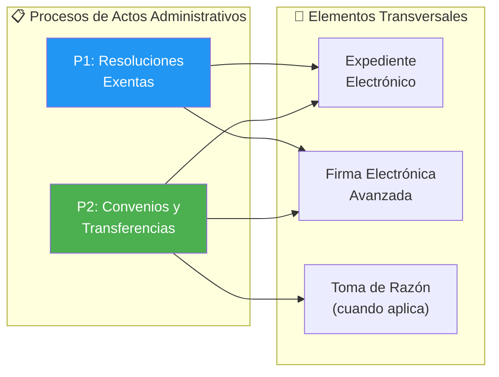
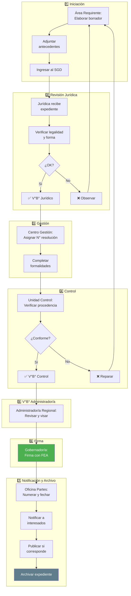
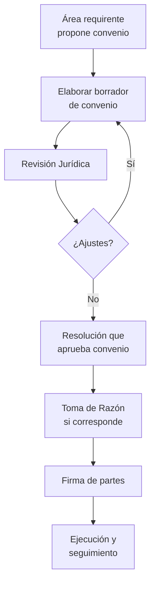
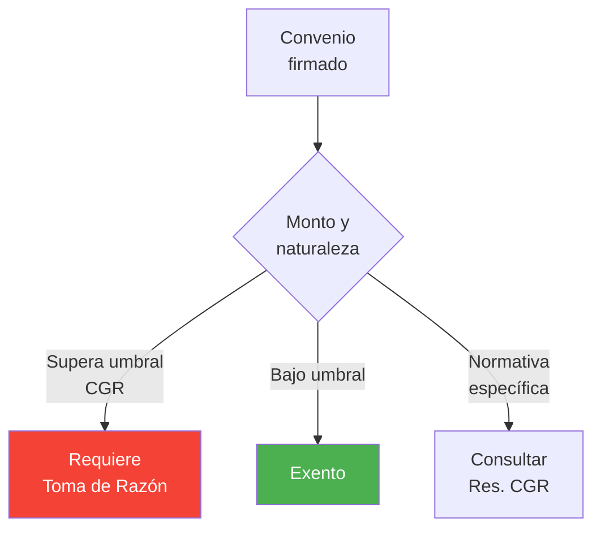
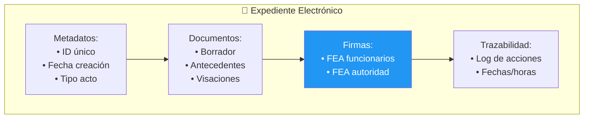

---
_manifest:
  urn: "urn:gn:kb:bpmn-d01-actos-administrativos"
  provenance:
    created_by: "FS"
    created_at: "2026-01-29"
    source: "GORE Ñuble"
version: "2.0.0"
status: published
tags: [gore-nuble, gobierno-regional, bpmn, actos-administrativos, ley-19880, ley-21180]
lang: es
---

# BPMN D01: Tramitación de Actos Administrativos

## Metadatos y Mapa General del Dominio

### Atributos de Dominio
| Atributo | Valor |
| :--- | :--- |
| ID | DOM-ACTOS-ADMIN |
| Criticidad | 🟠 Alta |
| Dueño | Unidad Jurídica |
| Procesos | 2 |
| Subprocesos | ~14 fases |

### Mapa General de Procesos

## Proceso P1: Resoluciones Exentas

### Flujo de Tramitación
- **ID**: BPMN-GN-RES-EXENTAS-FLUJO-01
- **Fases**: 7
- **SLA**: 15 días hábiles

### Roles y Responsabilidades P1
| Fase | Responsable |
| :--- | :--- |
| Iniciación | Área Requirente |
| Revisión Jurídica | Unidad Jurídica |
| Gestión | Centro de Gestión |
| Control | Unidad de Control |
| V°B° Administrador/a | Administrador/a Regional |
| Firma | Gobernador/a Regional |
| Notificación y Archivo | Oficina de Partes |

## Proceso P2: Convenios y Transferencias

### Flujo de Convenios

### Contenido Mínimo de Convenios
| Elemento | Descripción |
| :--- | :--- |
| Partes | GORE + Entidad receptora |
| Objeto | Descripción del programa/proyecto |
| Monto | Valor total y calendario |
| Plazos | Duración y fechas clave |
| Obligaciones | Deberes de cada parte |
| Rendición | Modalidad, plazos, SISREC |
| Restitución | Condiciones de devolución |
| Probidad | Cláusulas anticorrupción |

### Criterios de Toma de Razón

## Expediente Electrónico (Ley 21.180)

### Estructura del Expediente

### Principios de Transformación Digital (TDE)
| Principio | Aplicación |
| :--- | :--- |
| Equivalencia funcional | Documento digital = papel |
| Neutralidad tecnológica | Sin dependencia de proveedor |
| Interoperabilidad | Comunicación entre sistemas |
| Seguridad | Integridad, autenticidad, no repudio |

## Sistemas y Normativa

### Ecosistema de Sistemas
| Sistema | Función |
| :--- | :--- |
| SYS-DOCDIGITAL | Gestión documental, expediente |
| SYS-FIRMAGOB | Firma Electrónica Avanzada |
| SYS-SIGFE | Registro de compromisos |
| SYS-TRANSPARENCIA | Publicación |

### Marco Normativo
| Norma | Alcance |
| :--- | :--- |
| Ley 19.880 LBPA | Procedimiento administrativo |
| Ley 21.180 TDE | Expediente electrónico |
| Ley 19.799 | Firma electrónica |
| Resolución 30/2015 CGR | Rendiciones |
| Ley 19.886 | Contratación pública |

## Referencias Cruzadas

| Dominio Relacionado | Vínculo | Referencia |
| :--- | :--- | :--- |
| D03 Gestión IPR | Fase 4 Formalización | `D03_gestion_ipr.md` |
| D02 Ciclo Presupuestario | Modificaciones, resoluciones | `D02_ciclo_presupuestario.md` |
| D08 Rendiciones | Convenios de transferencia | `D08_rendiciones.md` |

---
**Última actualización**: 2025-12-16
