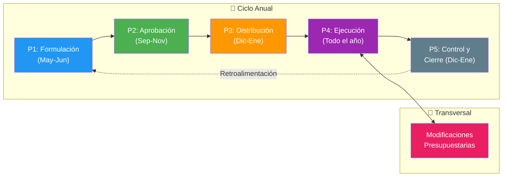
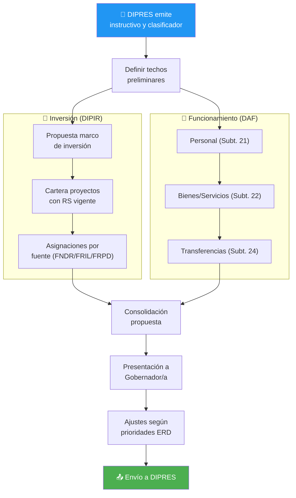
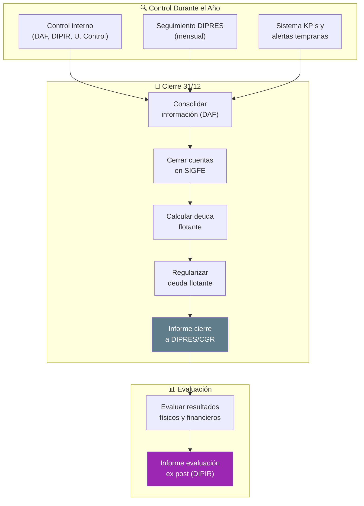
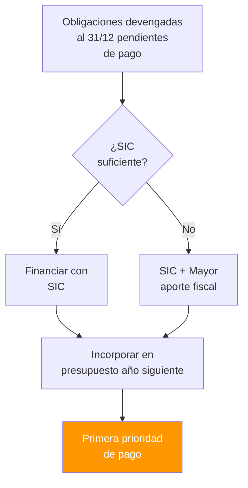

---
_manifest:
  urn: urn:gn:kb:bpmn-d02-ciclo-presupuestario
  provenance:
    created_by: FS
    created_at: '2026-01-29'
    source: "GORE \xD1uble"
version: 2.0.0
status: published
tags:
- gore-nuble
- gobierno-regional
- presupuesto
- bpmn
- finanzas
- gn
lang: es
---

# Ciclo Presupuestario Regional (BPMN D02)

## Metadatos y Estructura del Dominio
- **ID Dominio:** DOM-PRESUPUESTO
- **Criticidad:** Crítica (Rojo)
- **Responsables:** DAF (Funcionamiento) / DIPIR (Inversión)
- **Volumen:** 5 Procesos principales / ~15 Subprocesos
- **Referencia SSOT:** LOC 19.175 Art. 72-73

## Mapa General del Ciclo Anual

## P1: Formulación del Presupuesto (Mayo-Junio)
### Flujo de Formulación

### Estructura de Subtítulos y Responsables
| Subtítulo | Concepto | Responsable |
| :--- | :--- | :--- |
| 21 | Personal | DAF |
| 22 | Bienes y Servicios | DAF |
| 24 | Transferencias Corrientes | DAF/DIPIR |
| 29 | Activos No Financieros | DAF |
| 31 | Inversión (Iniciativas) | DIPIR |
| 33 | Transferencias de Capital | DIPIR |

## P2-P4: Aprobación, Distribución y Ejecución
- **P2 Aprobación (Sep-Nov):** Intervención de Gobernador, CORE, DIPRES y CGR.
- **P3 Distribución (Dic-Ene):** Distribución inicial del presupuesto aprobado y carga masiva en SIGFE.
- **P4 Ejecución (Anual):** Gestión de compromisos, devengos y pagos según calendario mensual.

## P5: Control y Cierre de Ejercicio (Diciembre-Enero)
### Flujo de Cierre y Evaluación

### Gestión de Deuda Flotante

## Reportería, Sistemas y Normativa
### Reportes Oficiales
| Reporte | Frecuencia | Destinatario |
| :--- | :--- | :--- |
| Informe Ejecución Mensual | Mensual | DIPRES, CORE |
| Informes por Glosas | Trimestral | Transparencia |
| Cartera de Proyectos | Mensual | Web institucional |
| Acuerdos CORE | 5 días hábiles | Web institucional |

### Ecosistema de Sistemas
| Sistema | Función |
| :--- | :--- |
| SYS-SIGFE | Gestión financiera central del Estado |
| SYS-BIP-SNI | Gestión de inversión pública |
| SYS-TRANSPARENCIA | Publicación de información activa |

### Marco Normativo Aplicable
| Norma | Alcance |
| :--- | :--- |
| LOC 19.175 Art. 72-73 | Competencias presupuestarias del GORE |
| Decreto 854/2004 Hacienda | Clasificador presupuestario vigente |
| Ley de Presupuestos (Anual) | Marco legal del ejercicio financiero |
| Glosa 14 Partida 31 | Uso de 3% para emergencias |
| Glosa 16 Partida 31 | Exigencias de transparencia |
| NICSP-CGR | Normas Internacionales de Contabilidad Sector Público |
| Resolución 30/2015 CGR | Procedimientos de rendiciones de cuentas |

## Referencias Cruzadas
| Dominio Relacionado | Vínculo / Dependencia |
| :--- | :--- |
| D03 Gestión IPR | CDP, financiamiento de proyectos de inversión |
| D08 Rendiciones | Contabilización, conciliación en SIGFE |
| D04 Compras | Órdenes de compra, contratos y devengos |
