---
_manifest:
  urn: "urn:gn:kb:bpmn-d03-gestion-ipr"
  provenance:
    created_by: "FS"
    created_at: "2026-01-29"
    source: "GORE Ñuble"
version: "2.0.0"
status: published
tags: [gore-nuble, gobierno-regional, bpmn, ipr, gestion-publica]
lang: es
---

# Gestión de Intervenciones Públicas Regionales (IPR)

## Metadatos del Dominio (D03)

| Atributo | Detalle |
| :--- | :--- |
| **ID** | BPMN-GN-D03-GESTION-IPR |
| **Criticidad** | 🔴 Crítica |
| **Dueño** | Jefatura DIPIR |
| **Procesos** | 9 |
| **Subprocesos** | ~25 |
| **Fuente Primaria** | D03_gestion_ipr.md (GORE Ñuble) |
| **Última Actualización** | 2025-12-16 |

## Mapa General del Ciclo de Vida IPR

#### Ciclo de Vida Completo (P0 a P7)

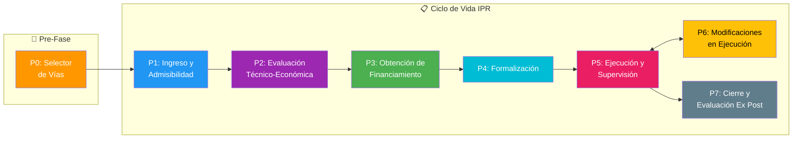

## Fase P0: Selector de Vías de Financiamiento

#### Flujo de Decisión Estratégica

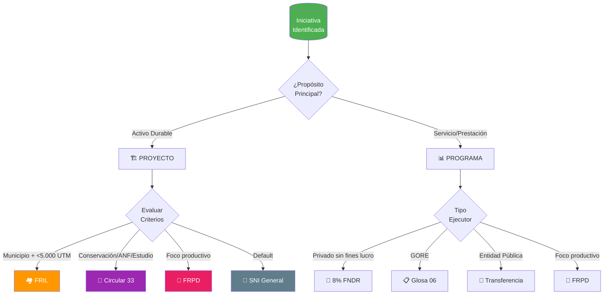

#### Matriz de Selección de Vías

| Vía | Tipo | Ejecutor | Monto | Condición Clave |
| :--- | :--- | :--- | :--- | :--- |
| **FRIL** | Proyecto | Municipalidad | < 5.000 UTM | Infraestructura menor |
| **Circular 33** | Proyecto | Variable | Variable | Conservación, ANF, estudios |
| **FRPD** | Ambos | Habilitado | Variable | Foco productivo/innovación |
| **SNI General** | Proyecto | Variable | Variable | Default |
| **8% FNDR** | Actividad | Privado s/f lucro | Variable | Concurso |
| **Glosa 06** | Programa | GORE | Variable | Ejecución directa |
| **Transferencia** | Programa | Entidad pública | Variable | ITF interno |

## Fase P1: Ingreso, Pertinencia y Admisibilidad

#### Flujo de Recepción y Evaluación Inicial

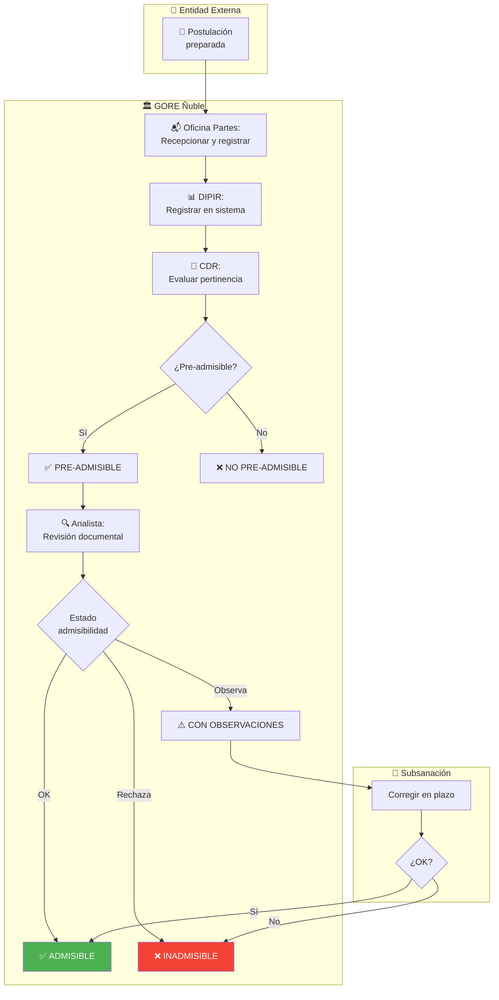

#### Roles y Responsabilidades P1

| Rol | Responsabilidad |
| :--- | :--- |
| **Oficina de Partes** | Recepcionar, registrar, derivar |
| **Jefatura DIPIR** | Registrar, convocar CDR |
| **CDR** | Evaluar pertinencia estratégica |
| **Analista Preinversión** | Revisión documental exhaustiva |

## Fase P2: Evaluación Técnico-Económica

#### Tracks de Evaluación por Tipo de Iniciativa

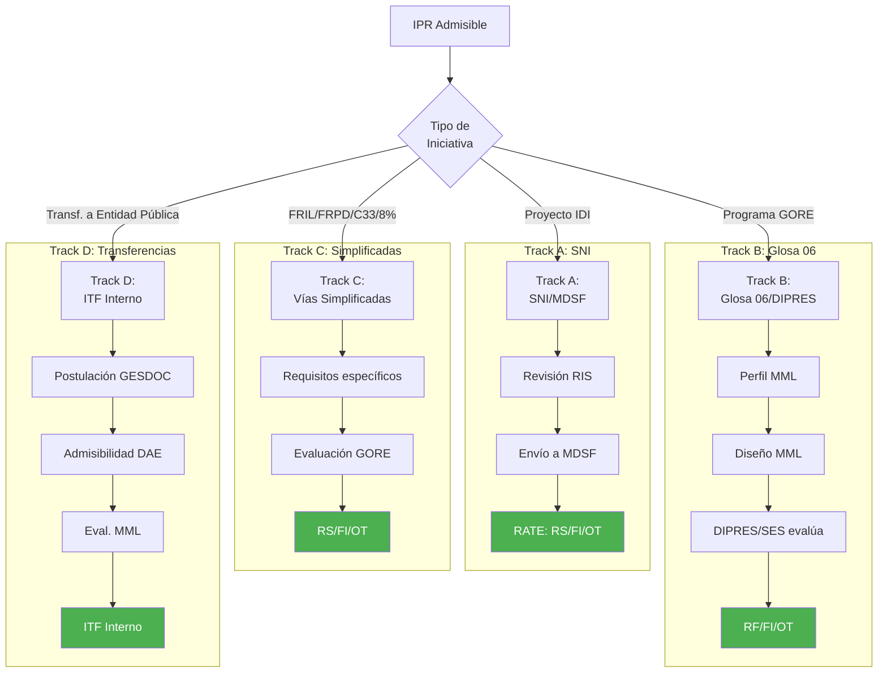

#### Track A: Sistema Nacional de Inversiones (MDSF)

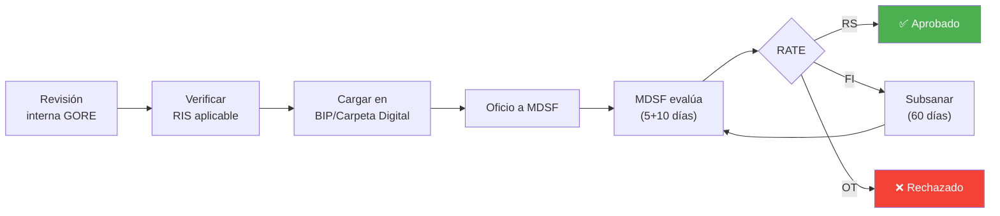

#### Track C: Vías Simplificadas (FRIL, FRPD, C33)

```mermaid
flowchart TD
    subgraph FRIL["FRIL"]
        F1["Postular<br/>GESDOC+BIP"]
        F2["Admisibilidad"]
        F3["Evaluación<br/>técnica"]
        F4["RS (60 días)"]
        F1 --> F2 --> F3 --> F4
    end

    subgraph FRPD["FRPD"]
        R1["Postular<br/>formulario online"]
        R2["Adm.<br/>Administrativa"]
        R3["Adm.<br/>Técnica/Ranking"]
        R4["Evaluación<br/>GORE"]
        R5["RS"]
        R1 --> R2 --> R3 --> R4 --> R5
    end

    subgraph C33["Circular 33"]
        C1["Postular<br/>GESDOC+BIP"]
        C2["Admisibilidad"]
        C3["Revisión<br/>técnica"]
        C4["RS/FI/OT"]
        C1 --> C2 --> C3 --> C4
    end
```

## Fase P3: Obtención de Financiamiento

#### Flujo de Asignación Presupuestaria

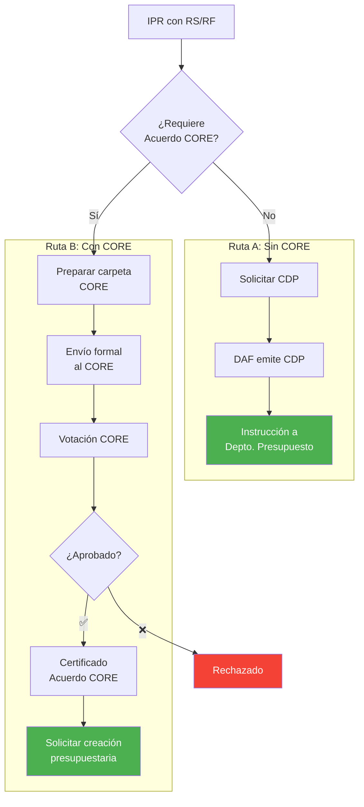

#### Criterios para Acuerdo CORE

| Condición | Requiere CORE |
| :--- | :--- |
| Monto > 7.000 UTM | ✅ Sí |
| Nuevo programa/proyecto | ✅ Sí |
| Aumento costo <= 10% (tope 7.000 UTM) | ❌ No |
| Uso 3% emergencia (Glosa 14) | ❌ No |
| Regularización de ingresos | ❌ No |

## Fase P4: Formalización

#### Flujo de Actos Administrativos y Convenios

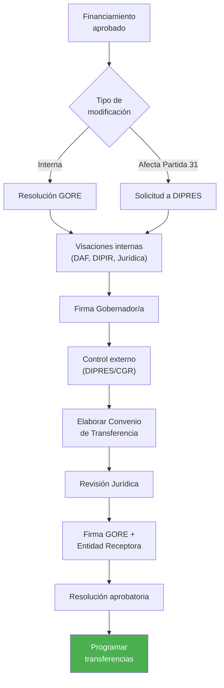

#### Regla de Devengo Presupuestario

| Tipo Receptor | Momento del Devengo |
| :--- | :--- |
| Privados y Municipios | Convenio tramitado |
| Servicios Públicos | Al aprobar rendición |

## Fase P5: Ejecución y Supervisión

#### Ciclo de Implementación y Control

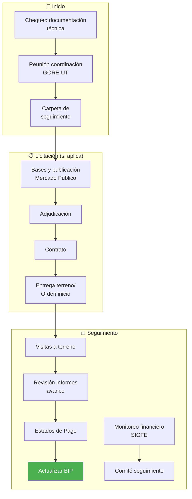

#### Hitos de Control en Ejecución

| Hito | Responsable |
| :--- | :--- |
| Inicio de obra | UT / ITO |
| Avances periódicos | Supervisor GORE |
| Recepción provisoria | UT |
| Recepción definitiva | UT |

## Fase P6: Modificaciones en Ejecución

#### Procedimiento de Modificación Contractual/Técnica

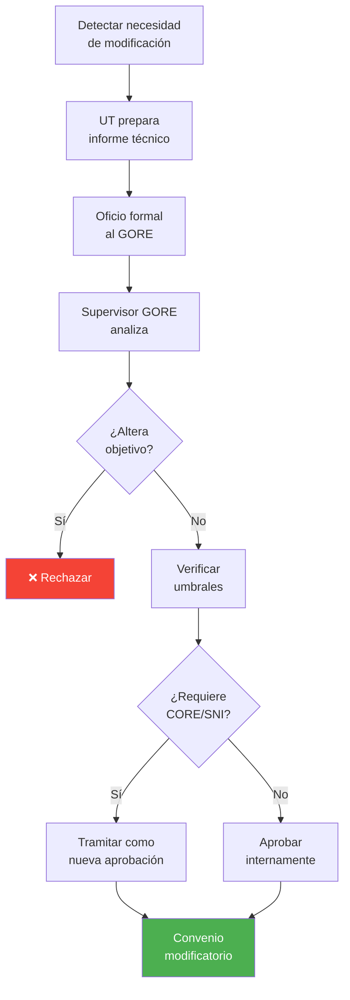

## Fase P7: Cierre Técnico-Financiero y Evaluación Ex Post

#### Flujo de Liquidación y Evaluación Ex Post

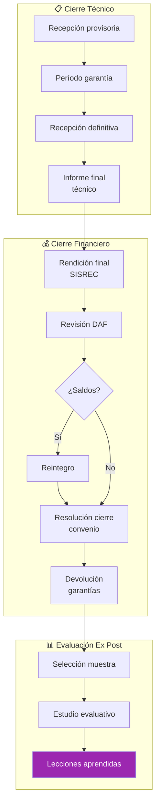

## Sistemas y Normativa Aplicable

#### Infraestructura Tecnológica (Sistemas)

| Sistema | Fases de Uso | Propósito |
| :--- | :--- | :--- |
| **SYS-BIP-SNI** | P1, P2, P5, P7 | Registro y evaluación SNI |
| **SYS-GESDOC** | P1, P2 | Gestión documental y postulación |
| **SYS-SIGFE** | P3, P4, P5, P7 | Gestión financiera y presupuestaria |
| **SYS-SISREC** | P7 | Rendiciones de cuentas |

#### Marco Normativo

| Norma | Alcance |
| :--- | :--- |
| LOC 19.175 | Competencias Generales GORE |
| Ley de Presupuestos | Glosas 06 (Programas), 14 (Emergencia), 16 (Transferencias) |
| Instructivo SUBDERE FRIL | Gestión de Proyectos FRIL |
| Circular 33 MDSF | Adquisición de Activos no Financieros y Conservación |
| Resolución 30/2015 CGR | Procedimientos de Rendiciones de Cuentas |
| Normas SNI/MDSF | Metodologías de Evaluación Social y Técnica |

## Referencias Cruzadas

| Dominio Relacionado | Vínculo / Intersección |
| :--- | :--- |
| **D02 Ciclo Presupuestario** | CDP, modificaciones presupuestarias, registro SIGFE |
| **D08 Rendiciones** | Cierre financiero, validación SISREC |
| **D01 Actos Administrativos** | Resoluciones de aprobación, Convenios de transferencia |
