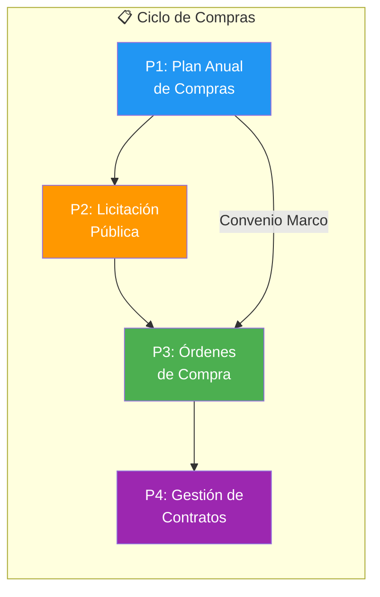
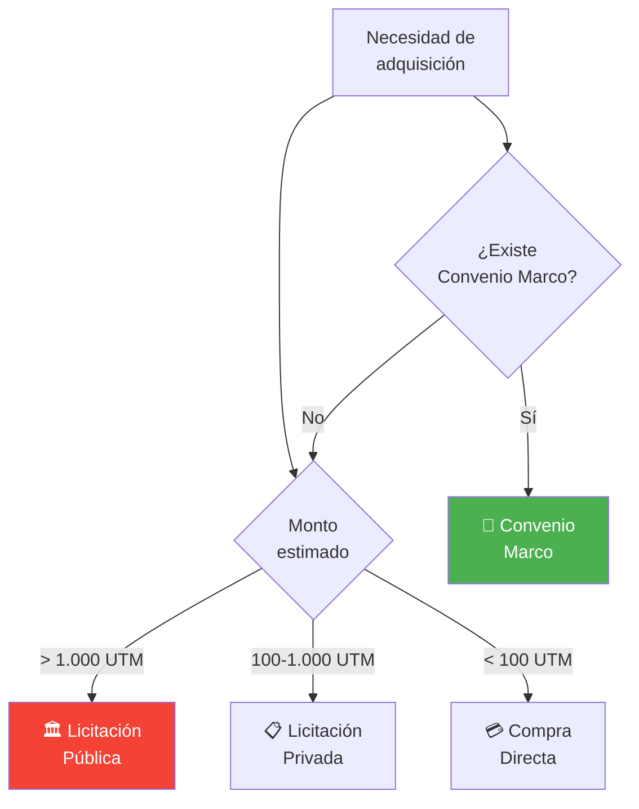

---
_manifest:
  urn: urn:gn:kb:bpmn-d04-compras-contrataciones
  provenance:
    created_by: FS
    created_at: '2026-01-29'
    source: "GORE \xD1uble"
version: 2.0.0
status: published
tags:
- gore-nuble
- gobierno-regional
- compras-publicas
- bpmn
- gn
lang: es
---

# D04: Compras Públicas y Contrataciones

## Metadatos y Características del Dominio D04

*   **ID**: `DOM-COMPRAS`
*   **Criticidad**: Alta (🟠)
*   **Dueño**: Unidad de Abastecimiento
*   **Alcance**: 4 procesos principales, ~12 subprocesos
*   **Referencia**: `urn:gn:kb:bpmn-index`

## Mapa de Procesos: Ciclo de Compras Públicas

## P1: Plan Anual de Compras (PAC) - Proceso y Contenido

*   **ID**: `BPMN-GN-COMPRAS-PAC-01`
*   **Período**: Anual (Diciembre-Enero)
*   **Frecuencia**: Ajustes trimestrales

### Flujo de Elaboración del PAC
1.  **Identificación**: Divisiones definen necesidades.
2.  **Requerimiento**: Unidades envían solicitudes.
3.  **Consolidación**: Abastecimiento centraliza datos.
4.  **Clasificación**: CM (Convenio Marco), LP (Licitación), CD (Compra Directa).
5.  **Validación**: DAF confirma presupuesto.
6.  **Aprobación**: Firma del Gobernador/a.
7.  **Publicación**: Mercado Público.

### Estructura de Datos PAC
| Elemento | Detalle |
| :--- | :--- |
| Producto/Servicio | Descripción técnica |
| Cantidad | Unidades estimadas |
| Monto | Valor estimado en CLP |
| Período | Trimestre de adquisición |
| Mecanismo | CM, LP, CD o TDP |

## P2: Proceso de Licitación Pública (> 1.000 UTM)

*   **ID**: `BPMN-GN-COMPRAS-MECANISMOS-01`
*   **Umbral**: Obligatorio para montos > 1.000 UTM

### Fases de Licitación
*   **Preparación**: Elaboración bases (técnicas/admin), revisión jurídica, resolución aprobatoria.
*   **Publicación**: Mercado Público, consultas/aclaraciones, recepción de ofertas.
*   **Evaluación**: Comisión evaluadora, criterios (Precio, Calidad, Experiencia), acta de evaluación, propuesta de adjudicación.
*   **Adjudicación**: Resolución, publicación de resultados, notificación, período de impugnación.

## Mecanismos y Umbrales de Adquisición

## P3: Ejecución y Estados de Órdenes de Compra (OC)

*   **ID**: `BPMN-GN-COMPRAS-OC-01`
*   **Plataforma**: Mercado Público

### Flujo de Ejecución OC
1.  **Generación**: Abastecimiento crea OC tras adjudicación.
2.  **Vinculación**: Asociación con CDP y partida presupuestaria.
3.  **Autorización**: Firma de jefatura.
4.  **Envío**: Notificación a proveedor.
5.  **Aceptación**: Confirmación del proveedor.
6.  **Recepción**: Entrega de bienes/servicios.
7.  **Conformidad**: Acta de recepción (si cumple) o Rechazo (si no cumple).
8.  **Cierre**: Facturación y Pago.

### Ciclo de Vida de la OC
| Estado | Condición |
| :--- | :--- |
| Generada | Creada en sistema |
| Enviada | Notificada formalmente |
| Aceptada | Proveedor conforme |
| Recepcionada | Bien/servicio entregado |
| Pagada | Ciclo financiero finalizado |

## P4: Gestión, Formalización y Cierre de Contratos

*   **ID**: `BPMN-GN-COMPRAS-CONTRATOS-01`
*   **Responsable**: Administrador de Contrato (Designado)

### Etapas Contractuales
*   **Formalización**: Elaboración, revisión jurídica, firma, resolución, gestión de garantías (Fiel cumplimiento, Anticipo).
*   **Ejecución**: Seguimiento de hitos, verificación técnica, estados de pago parciales.
*   **Cierre**: Recepción definitiva, acta de cierre, devolución de garantías, evaluación de desempeño del proveedor.

### Funciones del Administrador
*   Supervisión técnica del cumplimiento.
*   Enlace oficial con el proveedor.
*   Custodia y actualización del expediente.
*   Certificación de hitos y avances.
*   Autorización de estados de pago.

## Control, Transparencia y Prohibiciones en Compras

### Matriz de Transparencia
| Tipo Información | Plataforma Publicación |
| :--- | :--- |
| PAC | Mercado Público |
| Licitaciones | Mercado Público |
| Adjudicaciones | Mercado Público |
| Contratos | Transparencia Activa |
| Órdenes de Compra | Mercado Público |

### Restricciones Críticas
*   **Fraccionamiento**: Prohibido dividir compras para eludir umbrales de licitación.
*   **Conflictos de Interés**: Obligación de declaración de inhabilidades por funcionarios.
*   **Probidad**: Rigor en criterios de evaluación y actas de comisión.

## Ecosistema Tecnológico y Sistemas de Gestión

| Sistema | Sigla | Función Principal |
| :--- | :--- | :--- |
| ChileCompra | `ORG-CHILECOMPRA` | Mercado Público, OC, Licitaciones |
| SIGFE | `SYS-SIGFE` | CDP, compromisos presupuestarios, pagos |
| DocDigital | `SYS-DOCDIGITAL` | Contratos, resoluciones, actos admin. |

## Marco Normativo y Referencias de Compras Públicas

### Base Legal
*   **Ley 19.886**: Ley de Bases sobre Contratos Administrativos de Suministro y Prestación de Servicios.
*   **D.S. 250**: Reglamento de la Ley 19.886.
*   **Directivas ChileCompra**: Normas operativas y procedimentales.
*   **Ley 20.730**: Regulación del Lobby y gestión de intereses.

### Vínculos de Dominio (Referencias Cruzadas)
*   **D02 Ciclo Presupuestario**: Gestión de CDP y compromisos financieros.
*   **D05 Inventarios**: Recepción física de bienes y alta de activos.
*   **D01 Actos Administrativos**: Tramitación de resoluciones de bases y adjudicación.
