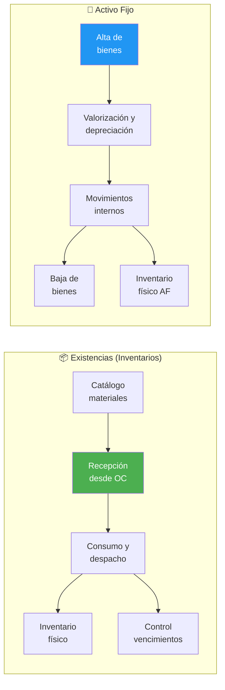

---
_manifest:
  urn: urn:gn:kb:bpmn-d05-inventarios-activo-fijo
  provenance:
    created_by: FS
    created_at: '2026-01-29'
    source: "GORE \xD1uble"
version: 2.0.0
status: published
tags:
- gore-nuble
- gobierno-regional
- bpmn
- inventarios
- activo-fijo
- sigas
- sigfe
- gn
lang: es
---

# BPMN D05: Gestión de Inventarios y Activo Fijo

## Metadatos del Dominio

| Atributo | Detalle |
| :--- | :--- |
| **Criticidad** | 🟡 Media |
| **Dueño** | DAF |
| **Procesos** | 2 |
| **Subprocesos** | ~10 |
| **Sistemas** | SIGAS, SIGFE, SIGFIN |

## Mapa General del Dominio

## P1: Gestión de Inventarios y Bodegas

### Catálogo de Materiales
- **Identificación:** Necesidad de nuevo ítem.
- **Verificación:** Existencia previa de código en sistema.
- **Creación:** Registro en SIGAS (Nombre, Unidad Medida, Categoría, Valorización).

### Recepción de Bienes desde OC
1. **Entrega:** Proveedor en bodega física.
2. **Validación:** Cantidad, calidad y guía de despacho.
3. **Decisión:** Conformidad -> Firma guía; Disconformidad -> Rechazo/Devolución.
4. **Registro:** Ingreso en SIGAS, actualización automática de stock.
5. **Notificación:** Aviso inmediato al área requirente.

### Consumo y Despacho
- **Solicitud:** Generación de vale de consumo por unidad.
- **Autorización:** Aprobación formal por Jefatura.
- **Preparación:** Picking por bodeguero.
- **Despacho:** Entrega física con firma de vale.
- **Actualización:** Rebaja de stock en SIGAS e imputación a centro de costo.

### Inventario Físico
- **Programación:** Frecuencia mensual o trimestral.
- **Protocolo:** Bloqueo de movimientos en SIGAS previo al conteo.
- **Conciliación:** Comparación conteo físico vs. saldo sistema.
- **Diferencias:** Investigación de causas.
- **Ajustes:** Actualización de sistema (si amerita) o inicio de responsabilidad administrativa.

### Control de Vencimientos (FEFO)
- **Registro:** Ingreso con fecha de caducidad obligatoria.
- **Alertas:** Notificaciones automáticas de SIGAS.
- **Despacho:** Prioridad a artículos próximos a vencer.
- **Excedentes:** Evaluación de uso urgente, donación o baja.

### Valorización de Existencias
| Método | Aplicación |
| :--- | :--- |
| **PPP (Precio Promedio Ponderado)** | Método por defecto |
| **FIFO (First In, First Out)** | Uso alternativo |
| **FEFO (First Expired, First Out)** | Artículos perecibles |

## P2: Gestión de Activo Fijo

### Criterios de Capitalización
- **Umbral:** Valor ≥ 3 UTM.
- **Vida Útil:** Superior a 1 año.
- **Normativa:** NICSP 17, 21, 31.

### Alta de Bienes
1. **Origen:** Compra, donación o transferencia.
2. **Clasificación:** Bien ≥ 3 UTM -> Activo Fijo; Bien < 3 UTM -> Gasto.
3. **Identificación:** Asignación de N° inventario y plaqueteo físico.
4. **Registro SIGAS:** Código, valor, ubicación, responsable.
5. **Integración:** Contabilización automática en SIGFE.

### Valorización y Depreciación
- **Parámetros:** Determinación de vida útil y valor residual.
- **Cálculo:** Depreciación mensual por método de línea recta.
- **Ejecución:** Proceso automático en SIGAS.
- **Contabilidad:** Generación mensual de asientos en SIGFE.
- **Valor Libro:** Costo histórico menos depreciación acumulada.

### Movimientos Internos
- **Autorización:** Visto bueno de jefatura de origen.
- **Traslado:** Movimiento físico del bien.
- **Actualización:** Cambio de ubicación y responsable en SIGAS.
- **Confirmación:** Recepción conforme por jefatura de destino.

### Baja de Bienes
| Causal | Requerimiento Documental |
| :--- | :--- |
| **Deterioro irreparable** | Informe técnico |
| **Obsolescencia** | Informe funcional |
| **Pérdida o Hurto** | Denuncia policial + Sumario administrativo |
| **Donación** | Autorización de Gobernador/a |

- **Finalización:** Resolución de baja, registro en SIGAS, egreso en SIGFE y destino físico (destrucción, remate o donación).

### Inventario Físico Activo Fijo
- **Frecuencia:** Anual obligatoria.
- **Proceso:** Corte de sistema, verificación física de placas/N° de inventario.
- **Cierre:** Investigación de diferencias y regularización administrativa.

## Casos Especiales y Normativa

### Bienes de Proyectos FNDR
- **Naturaleza:** Bienes adquiridos para terceros.
- **Registro:** Clasificados como Activos No Financieros (ANF) en el GORE.
- **Transferencia:** Traspaso formal vía resolución a entidad receptora.
- **Baja GORE:** Egreso patrimonial tras confirmación de recepción.

### Comodatos y Préstamos
| Tipo | Gestión |
| :--- | :--- |
| **Recibido** | Bien de tercero en custodia GORE; requiere convenio y control paralelo. |
| **Entregado** | Bien GORE en custodia de tercero; mantiene responsabilidad patrimonial. |

### Normativa y Marco Legal
| Norma | Alcance |
| :--- | :--- |
| **NICSP 17** | Propiedad, planta y equipo |
| **NICSP 21** | Deterioro de activos no generadores de efectivo |
| **NICSP 31** | Activos intangibles |
| **Res. CGR** | Procedimientos de baja y control de bienes públicos |
| **Ley 18.575** | Bases Generales de la Administración del Estado (Responsabilidad) |

## Referencias Cruzadas
- **D04 Compras:** Relación directa por recepción de bienes desde Órdenes de Compra.
- **D02 Ciclo Presupuestario:** Integración para contabilización de Activos Fijos en SIGFE.
