---
_manifest:
  urn: urn:gn:kb:bpmn-d05-inventarios-activo-fijo
  provenance:
    created_by: gn_rebuild.py
    created_at: '2026-03-08'
    source: domains/gn/04_habilitadores/arquitectura/bpmn/D05_inventarios_activo_fijo_koda.yml
version: 2.0.0
status: published
tags:
- gore-nuble
- gobierno-regional
- bpmn
- inventarios
- activo-fijo
- sigas
- sigfe
- gn
lang: es
extensions:
  gn:
    source_paths:
    - domains/gn/04_habilitadores/arquitectura/bpmn/D05_inventarios_activo_fijo_koda.yml
    source_hashes:
      domains/gn/04_habilitadores/arquitectura/bpmn/D05_inventarios_activo_fijo_koda.yml: 866b4cd7ee85542957200f88eb2a6f4dd9e97886a4eeb904c40ca0aa0751050c
    source_type: koda_yaml
    transformation_mode: korafy_direct
    fs: 100
    cr: 1.18
    run_id: gn-smoke
    review_gate: auto
    scope_statement: null
    dependencies: []
    expected_sections:
    - Contenido
    skeleton_count: 16
    meat_count: 43
    fat_count: 0
    cr_justification: Fuente altamente estructurada o derivacion de alcance acotado.
    evidence_path: build/gn-rebuild/gn-smoke/evidence/bpmn__bpmn-d05-inventarios-activo-fijo.md.json
---

# BPMN D05: Gestión de Inventarios y Activo Fijo
## ID
BPMN-GN-D05-INVENTARIOS-AF-KODA

## Version
1.0.0

## Status
Draft

## Format
KODA/Spec

## Human Creator
FS

## Human Editor
FS

## Model Collaborator
- Cascade

## AI Remediator
KODA-TRANSFORMER

## Creation Date
2025-12-22

## Modification Date
2025-12-22

## Ctx
Especificación STS del dominio D05: Gestión de Inventarios y Activo Fijo del GORE Ñuble, modelado en BPMN.

## Source
### Ctx Required
- knowledge/domains/gn/arquitectura/kb_gn_054_bpmn_c4_koda.yml
### Primary Source
sources/gn/arquitectura/bpmn/D05_inventarios_activo_fijo.md

## LLM Parsing Instructions
### ID
KODA-LLM-PARSER-01
### Req
Mandatory block following Metadata.
### Prohib
Using for artifact creation or translation.
### Content
BEGIN_LLM_INSTRUCTIONS
You are an AI agent consuming a KODA artifact. Parse with absolute fidelity.

FIDELITY: Preserve meat (essential information) and skeleton (structure: headers, IDs, lists, tables) with zero loss. Ignore fat (filler words, rhetoric, stylistic prose).

LEXICON (expand before processing): Act->Action, Cond->Condition, Cpt->Concept, Ctx->Context, Def->Definition, Fnd->Foundation, ID->ID, Mech->Mechanism, Mssn->Mission, Nat->Nature, Obj->Objective, Proc->Process, Prohib->Prohibition, Purp->Purpose, Ref->Reference, Req->Requirement, Res->Result, Resp->Responsible, Src->Source, Warn->Warning.

REFERENCE POLICY: Ref: is internal only—must point to existing ID within THIS document. External documents and legal sources are mentioned as contextual information under Ctx: or Src:.

LANGUAGE POLICY: Keywords in English (and abbreviated forms as listed), content in original language (Spanish). Never translate content.
END_LLM_INSTRUCTIONS

## Metadatos Dominio
### ID
DOM-INVENTARIOS-AF
### Criticidad
🟡 Media
### Dueno
DAF
### Procesos
2
### Subprocesos
~10
### Ref Fuente
#### Ctx Required
- knowledge/domains/gn/arquitectura/kb_gn_054_bpmn_c4_koda.yml L.960-1200

## Body MD
### ID
BPMN-GN-D05-INVENTARIOS-AF-BODY-01
### Src
sources/gn/arquitectura/bpmn/D05_inventarios_activo_fijo.md
### Content
\# D05: Gestión de Inventarios y Activo Fijo

\## Metadatos del Dominio

| Campo           | Valor                                                                                                                                                 |
| --------------- | ----------------------------------------------------------------------------------------------------------------------------------------------------- |
| **ID**          | `DOM-INVENTARIOS-AF`                                                                                                                                  |
| **Criticidad**  | 🟡 Media                                                                                                                                               |
| **Dueño**       | DAF                                                                                                                                                   |
| **Procesos**    | 2                                                                                                                                                     |
| **Subprocesos** | ~10                                                                                                                                                   |
| **Ref. Fuente** | [kb_gn_054_bpmn_c4_koda.yml](file:///Users/felixsanhueza/Developer/gorenuble/knowledge/domains/gn/arquitectura/kb_gn_054_bpmn_c4_koda.yml) L.960-1200 |

---

\## Mapa General del Dominio

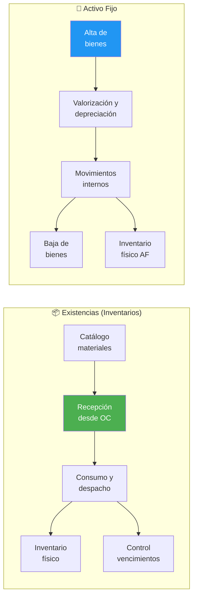
```mermaid
flowchart LR
    subgraph EXISTENCIAS["📦 Existencias (Inventarios)"]
        P1A["Catálogo<br/>materiales"]
        P1B["Recepción<br/>desde OC"]
        P1C["Consumo y<br/>despacho"]
        P1D["Inventario<br/>físico"]
        P1E["Control<br/>vencimientos"]
    end

    subgraph ACTIVO_FIJO["🏢 Activo Fijo"]
        P2A["Alta de<br/>bienes"]
        P2B["Valorización y<br/>depreciación"]
        P2C["Movimientos<br/>internos"]
        P2D["Baja de<br/>bienes"]
        P2E["Inventario<br/>físico AF"]
    end

    P1A --> P1B --> P1C --> P1D
    P1C --> P1E
    P2A --> P2B --> P2C
    P2C --> P2D
    P2C --> P2E

    style P1B fill:#4CAF50,color:#fff
    style P2A fill:#2196F3,color:#fff
```

---

\## P1: Gestión de Inventarios y Bodegas

| Campo       | Valor                            |
| ----------- | -------------------------------- |
| **ID**      | `BPMN-GN-INVENTARIOS-BODEGAS-01` |
| **Sistema** | SIGAS                            |

\### Catálogo de Materiales

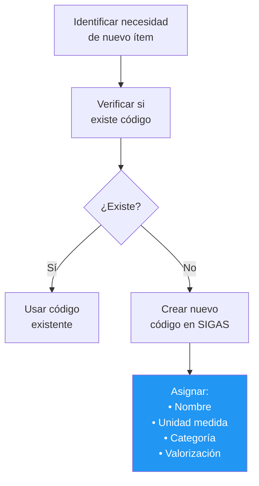
```mermaid
flowchart TD
    A["Identificar necesidad<br/>de nuevo ítem"] --> B["Verificar si<br/>existe código"]
    B --> C{"¿Existe?"}
    C -->|"Sí"| D["Usar código<br/>existente"]
    C -->|"No"| E["Crear nuevo<br/>código en SIGAS"]
    E --> F["Asignar:<br/>• Nombre<br/>• Unidad medida<br/>• Categoría<br/>• Valorización"]

    style F fill:#2196F3,color:#fff
```

\### Recepción de Bienes desde OC

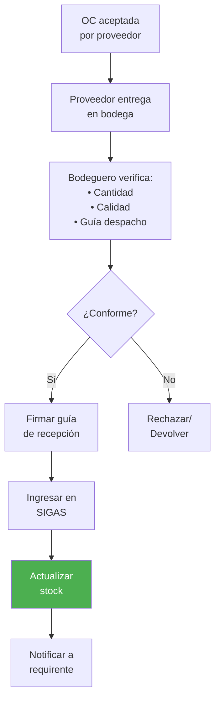
```mermaid
flowchart TD
    A["OC aceptada<br/>por proveedor"] --> B["Proveedor entrega<br/>en bodega"]
    B --> C["Bodeguero verifica:<br/>• Cantidad<br/>• Calidad<br/>• Guía despacho"]
    C --> D{"¿Conforme?"}
    D -->|"Sí"| E["Firmar guía<br/>de recepción"]
    D -->|"No"| F["Rechazar/<br/>Devolver"]
    E --> G["Ingresar en<br/>SIGAS"]
    G --> H["Actualizar<br/>stock"]
    H --> I["Notificar a<br/>requirente"]

    style H fill:#4CAF50,color:#fff
```

\### Consumo y Despacho

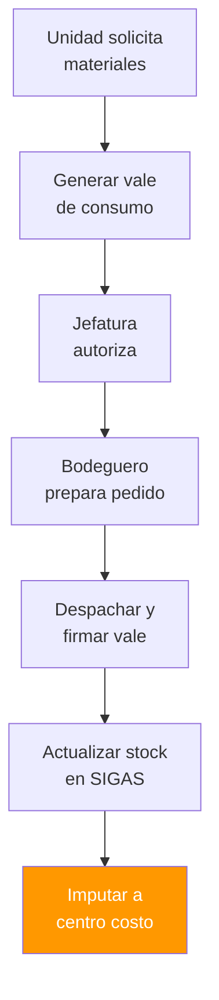
```mermaid
flowchart TD
    A["Unidad solicita<br/>materiales"] --> B["Generar vale<br/>de consumo"]
    B --> C["Jefatura<br/>autoriza"]
    C --> D["Bodeguero<br/>prepara pedido"]
    D --> E["Despachar y<br/>firmar vale"]
    E --> F["Actualizar stock<br/>en SIGAS"]
    F --> G["Imputar a<br/>centro costo"]

    style G fill:#FF9800,color:#fff
```

\### Inventario Físico

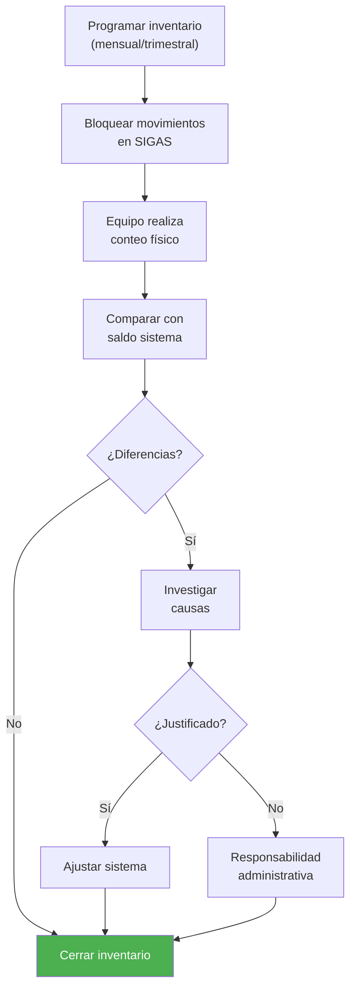
```mermaid
flowchart TD
    A["Programar inventario<br/>(mensual/trimestral)"] --> B["Bloquear movimientos<br/>en SIGAS"]
    B --> C["Equipo realiza<br/>conteo físico"]
    C --> D["Comparar con<br/>saldo sistema"]
    D --> E{"¿Diferencias?"}
    E -->|"Sí"| F["Investigar<br/>causas"]
    E -->|"No"| G["Cerrar inventario"]
    F --> H{"¿Justificado?"}
    H -->|"Sí"| I["Ajustar sistema"]
    H -->|"No"| J["Responsabilidad<br/>administrativa"]
    I --> G
    J --> G

    style G fill:#4CAF50,color:#fff
```

\### Control de Vencimientos (FEFO)

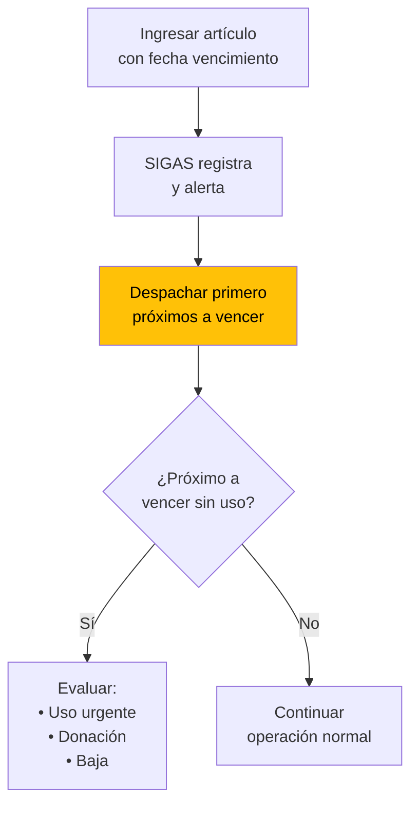
```mermaid
flowchart TD
    A["Ingresar artículo<br/>con fecha vencimiento"] --> B["SIGAS registra<br/>y alerta"]
    B --> C["Despachar primero<br/>próximos a vencer"]
    C --> D{"¿Próximo a<br/>vencer sin uso?"}
    D -->|"Sí"| E["Evaluar:<br/>• Uso urgente<br/>• Donación<br/>• Baja"]
    D -->|"No"| F["Continuar<br/>operación normal"]

    style C fill:#FFC107,color:#000
```

\### Valorización de Existencias

| Método   | Descripción               | Uso         |
| -------- | ------------------------- | ----------- |
| **PPP**  | Precio Promedio Ponderado | Default     |
| **FIFO** | First In, First Out       | Alternativo |
| **FEFO** | First Expired, First Out  | Perecibles  |

---

\## P2: Gestión de Activo Fijo

| Campo         | Valor                    |
| ------------- | ------------------------ |
| **ID**        | `BPMN-GN-ACTIVO-FIJO-01` |
| **Umbral**    | ≥ 3 UTM para capitalizar |
| **Normativa** | NICSP 17, 21, 31         |

\### Alta de Bienes

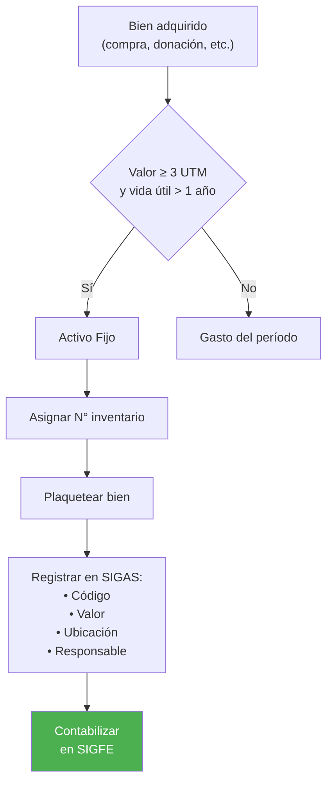
```mermaid
flowchart TD
    A["Bien adquirido<br/>(compra, donación, etc.)"] --> B{"Valor ≥ 3 UTM<br/>y vida útil > 1 año"}
    B -->|"Sí"| C["Activo Fijo"]
    B -->|"No"| D["Gasto del período"]
    C --> E["Asignar N° inventario"]
    E --> F["Plaquetear bien"]
    F --> G["Registrar en SIGAS:<br/>• Código<br/>• Valor<br/>• Ubicación<br/>• Responsable"]
    G --> H["Contabilizar<br/>en SIGFE"]

    style H fill:#4CAF50,color:#fff
```

\### Valorización y Depreciación

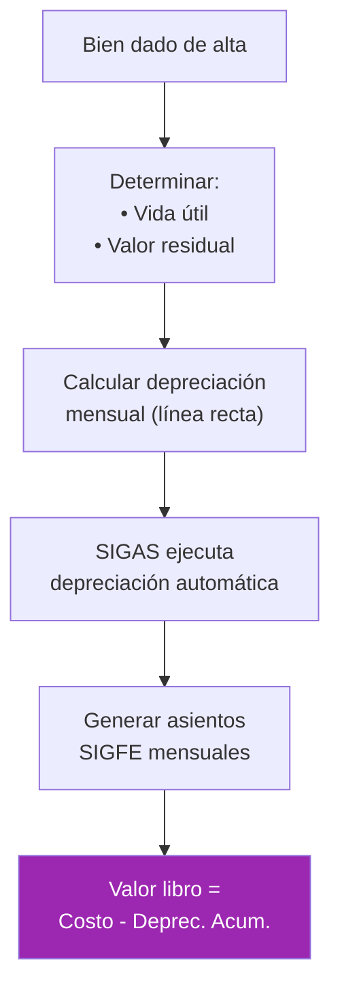
```mermaid
flowchart TD
    A["Bien dado de alta"] --> B["Determinar:<br/>• Vida útil<br/>• Valor residual"]
    B --> C["Calcular depreciación<br/>mensual (línea recta)"]
    C --> D["SIGAS ejecuta<br/>depreciación automática"]
    D --> E["Generar asientos<br/>SIGFE mensuales"]
    E --> F["Valor libro =<br/>Costo - Deprec. Acum."]

    style F fill:#9C27B0,color:#fff
```

\### Movimientos Internos

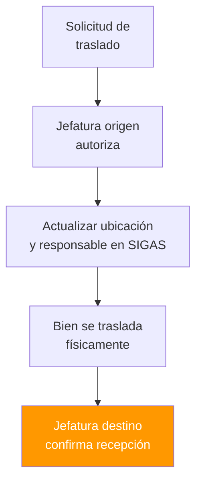
```mermaid
flowchart TD
    A["Solicitud de<br/>traslado"] --> B["Jefatura origen<br/>autoriza"]
    B --> C["Actualizar ubicación<br/>y responsable en SIGAS"]
    C --> D["Bien se traslada<br/>físicamente"]
    D --> E["Jefatura destino<br/>confirma recepción"]

    style E fill:#FF9800,color:#fff
```

\### Baja de Bienes

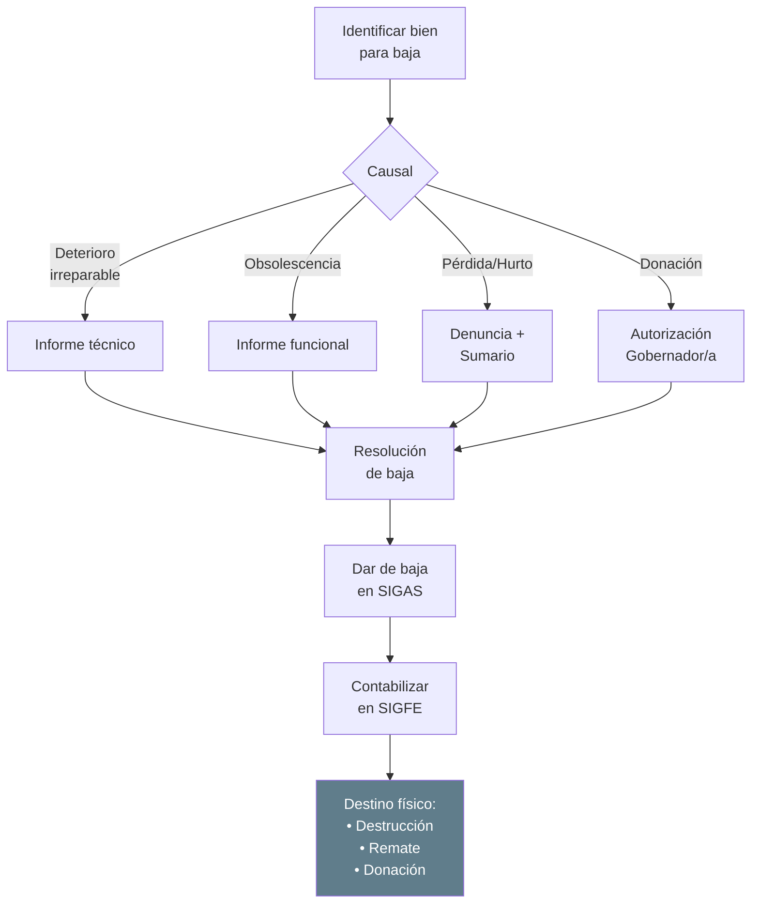
```mermaid
flowchart TD
    A["Identificar bien<br/>para baja"] --> B{"Causal"}
    B -->|"Deterioro<br/>irreparable"| C["Informe técnico"]
    B -->|"Obsolescencia"| D["Informe funcional"]
    B -->|"Pérdida/Hurto"| E["Denuncia +<br/>Sumario"]
    B -->|"Donación"| F["Autorización<br/>Gobernador/a"]
    
    C & D & E & F --> G["Resolución<br/>de baja"]
    G --> H["Dar de baja<br/>en SIGAS"]
    H --> I["Contabilizar<br/>en SIGFE"]
    I --> J["Destino físico:<br/>• Destrucción<br/>• Remate<br/>• Donación"]

    style J fill:#607D8B,color:#fff
```

\### Inventario Físico Activo Fijo

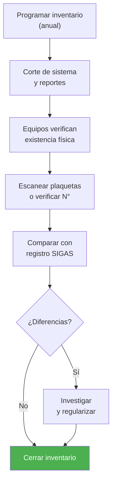
```mermaid
flowchart TD
    A["Programar inventario<br/>(anual)"] --> B["Corte de sistema<br/>y reportes"]
    B --> C["Equipos verifican<br/>existencia física"]
    C --> D["Escanear plaquetas<br/>o verificar N°"]
    D --> E["Comparar con<br/>registro SIGAS"]
    E --> F{"¿Diferencias?"}
    F -->|"Sí"| G["Investigar<br/>y regularizar"]
    F -->|"No"| H["Cerrar inventario"]
    G --> H

    style H fill:#4CAF50,color:#fff
```

---

\## Casos Especiales

\### Bienes de Proyectos FNDR

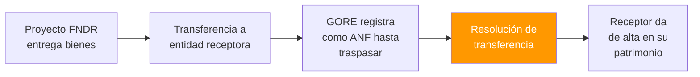
```mermaid
flowchart LR
    A["Proyecto FNDR<br/>entrega bienes"] --> B["Transferencia a<br/>entidad receptora"]
    B --> C["GORE registra<br/>como ANF hasta<br/>traspasar"]
    C --> D["Resolución de<br/>transferencia"]
    D --> E["Receptor da<br/>de alta en su<br/>patrimonio"]

    style D fill:#FF9800,color:#fff
```

\### Comodatos y Préstamos

| Tipo                   | Descripción                      |
| ---------------------- | -------------------------------- |
| **Comodato recibido**  | Bien de tercero en custodia GORE |
| **Comodato entregado** | Bien GORE en custodia de tercero |

> ⚠️ Ambos requieren convenio y registro separado en control paralelo.

---

\## Sistemas Involucrados

| Sistema      | Función                     |
| ------------ | --------------------------- |
| `SYS-SIGAS`  | Gestión de inventarios y AF |
| `SYS-SIGFE`  | Contabilización             |
| `SYS-SIGFIN` | Integración financiera      |

---

\## Normativa Aplicable

| Norma          | Alcance                          |
| -------------- | -------------------------------- |
| **NICSP 17**   | Propiedad, planta y equipo       |
| **NICSP 21**   | Deterioro activos no generadores |
| **NICSP 31**   | Activos intangibles              |
| **Res. CGR**   | Procedimientos de baja           |
| **Ley 18.575** | Responsabilidad patrimonial      |

---

\## Referencias Cruzadas

| Dominio Relacionado                                                                                                                            | Vínculo            |
| ---------------------------------------------------------------------------------------------------------------------------------------------- | ------------------ |
| [D04 Compras](file:///Users/felixsanhueza/Developer/gorenuble/knowledge/domains/gn/arquitectura/bpmn/D04_compras_contrataciones.md)            | Recepción desde OC |
| [D02 Ciclo Presupuestario](file:///Users/felixsanhueza/Developer/gorenuble/knowledge/domains/gn/arquitectura/bpmn/D02_ciclo_presupuestario.md) | Contabilización AF |

---

*Última actualización: 2025-12-16*
