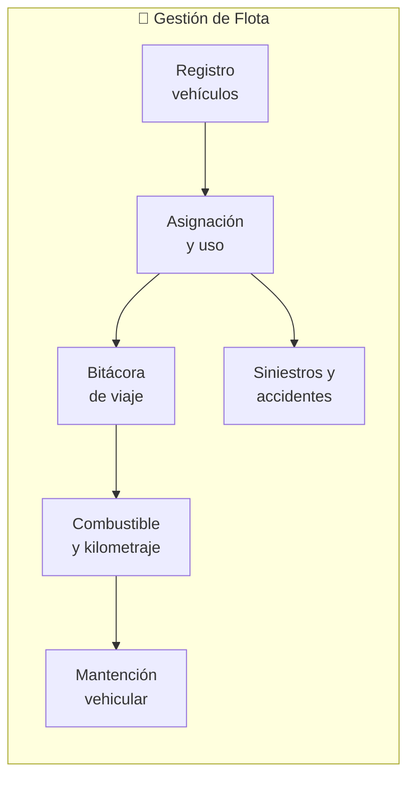

---
_manifest:
  urn: urn:gn:kb:bpmn-d06-flota-vehicular
  provenance:
    created_by: FS
    created_at: '2026-01-29'
    source: "GORE \xD1uble"
version: 2.0.0
status: published
tags:
- gore-nuble
- gobierno-regional
- flota-vehicular
- logistica
- bpmn
- gn
lang: es
---

# D06: Gestión de Flota Vehicular

## Metadatos del Dominio

| Campo | Detalle |
| :--- | :--- |
| **ID** | `DOM-FLOTA` |
| **Criticidad** | 🟡 Media |
| **Responsable** | Jefe Servicios Generales |
| **Alcance** | 1 Proceso, 6 Subprocesos |

## Mapa General del Dominio

## P1: Gestión de Flota Vehicular

| Atributo | Valor |
| :--- | :--- |
| **ID** | `BPMN-GN-FLOTA-VEHICULAR-01` |
| **Marco Legal** | D.L. 799 (Restricción de uso) |

### S1: Registro de Vehículos y Conductores

#### Registro de Vehículos
- **Adquisición**: Ingreso inicial.
- **Sistemas**: Registro en sistema interno.
- **Atributos**: Patente, modelo, año, tipo combustible.
- **Asignación**: Definición de división/área.
- **Legal**: Inscripción en Registro Automotor.

#### Registro de Conductores
- **Solicitud**: Petición de autorización por funcionario.
- **Validación**: Licencia vigente, clase apropiada, hoja de vida.
- **Aprobación**: Autorización Jefe Servicios Generales.
- **Formalización**: Registro en nómina de conductores.

### S2: Solicitud y Asignación
1. **Solicitud**: Fecha/hora, destino, motivo, pasajeros.
2. **Autorización**: Validación de jefatura directa.
3. **Disponibilidad**: Verificación por Servicios Generales.
4. **Asignación**: Entrega de vehículo, conductor (si aplica), llaves y bitácora.
5. **Contingencia**: Búsqueda de alternativa o reprogramación si no hay disponibilidad.

### S3: Bitácora de Viaje
- **Salida**: Registro fecha/hora, Km inicial, estado combustible.
- **Ejecución**: Realización del viaje programado.
- **Retorno**: Registro fecha/hora llegada, Km final, observaciones.
- **Cierre**: Firma de bitácora y devolución de llaves.

### S4: Gestión de Combustible
- **Requerimiento**: Solicitud de cupón/tarjeta por conductor.
- **Autorización**: Visación Servicios Generales.
- **Carga**: Registro de litros, monto y Km actual en estación.
- **Rendición**: Devolución de cupón con factura.
- **Control**: Consolidación mensual y análisis de rendimiento (Km/Lt).

### S5: Mantención Vehicular

#### Mantención Preventiva
- **Programación**: Basada en Km o tiempo transcurrido.
- **Alertas**: Notificación de mantención próxima.
- **Ejecución**: Gestión con taller y registro en historial.

#### Mantención Correctiva
- **Detección**: Reporte de falla a Servicios Generales.
- **Evaluación**: Definición entre taller interno o externo.
- **Reparación**: Ejecución y certificación de operatividad.

#### Programa de Mantención
| Tipo | Umbral | Acciones |
| :--- | :--- | :--- |
| **Básica** | 5.000 km | Cambio aceite, filtros |
| **Intermedia** | 15.000 km | Frenos, neumáticos |
| **Mayor** | 30.000 km | Revisión completa |
| **Legal** | Anual | Revisión técnica, permiso circulación |

### S6: Siniestros y Accidentes
1. **Inmediatez**: Medidas de seguridad del conductor.
2. **Policial**: Llamado a Carabineros y obtención de constancia/parte.
3. **Reporte**: Comunicación a Servicios Generales y levantamiento de acta.
4. **Evaluación**: Análisis de daños propios y a terceros.
5. **Seguros**: Activación de pólizas y seguimiento.
6. **Resolución**: Determinación de responsabilidades administrativas/patrimoniales.

#### Contenido Acta de Siniestro
- **Identificación**: Fecha, hora, lugar exacto.
- **Personal**: Conductor y testigos.
- **Detalle**: Circunstancias del accidente y descripción de daños.
- **Respaldo**: Número de parte de Carabineros.

## Restricciones Normativas (D.L. 799)

| Restricción | Condición de Cumplimiento |
| :--- | :--- |
| **Fines de semana** | Prohibido uso sin resolución/autorización especial. |
| **Uso particular** | Prohibición absoluta. |
| **Territorial** | Salidas fuera de la región requieren autorización expresa. |
| **Horario** | Restringido a jornada laboral, salvo excepciones fundadas. |

> [!CAUTION]
> El incumplimiento del D.L. 799 genera responsabilidad administrativa y patrimonial directa.

## Métricas de Control

| Indicador | Método de Cálculo | Meta |
| :--- | :--- | :--- |
| **Rendimiento** | Kilómetros / Litros | > 10 km/lt |
| **Cumplimiento Mantención** | (Mantenciones OK / Programadas) * 100 | > 95% |
| **Accidentabilidad** | (Accidentes / Vehículos) * 100 | < 5% |
| **Disponibilidad** | (Días operativos / Días totales) * 100 | > 90% |

## Sistemas Involucrados

| Código | Función |
| :--- | :--- |
| `SYS-SIGAS` | Inventario centralizado de vehículos. |
| `SISTEMA-FLOTA` | Registro de bitácoras, consumos y mantenciones. |

## Referencias Cruzadas

| Dominio | Relación |
| :--- | :--- |
| `D05 Inventarios y AF` | Gestión de vehículos como activos fijos institucionales. |
| `D04 Compras` | Adquisición de vehículos y contratos de suministro (combustible/taller). |
