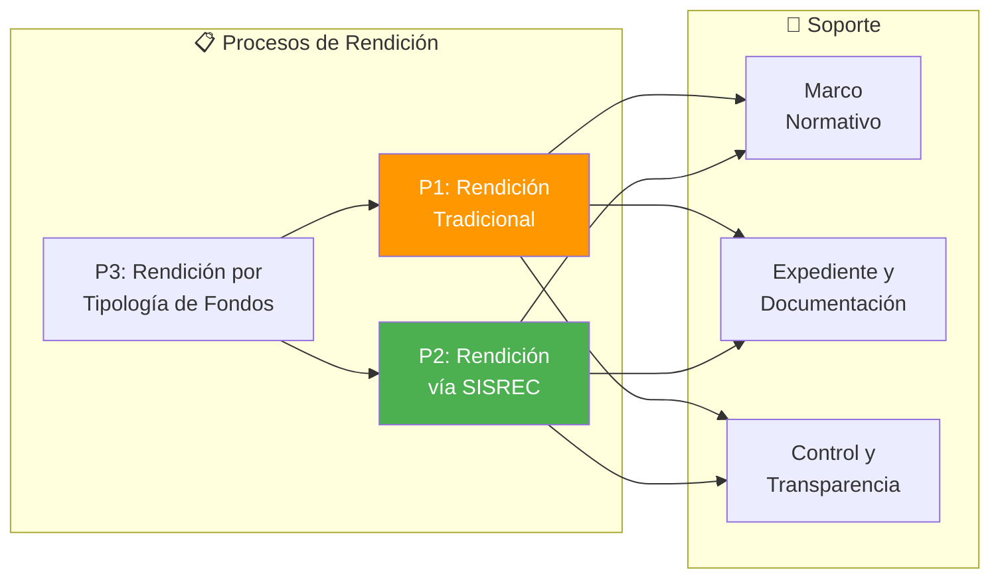
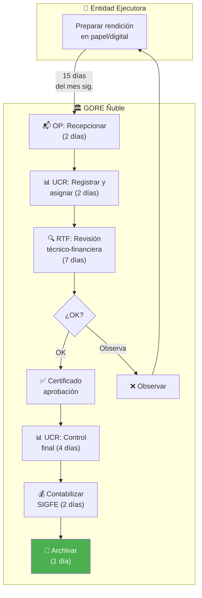
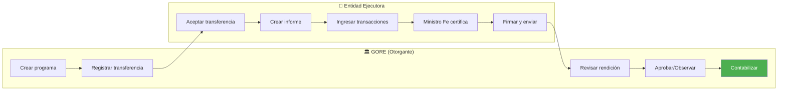
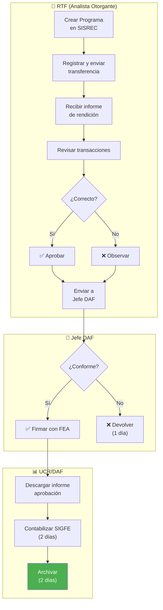
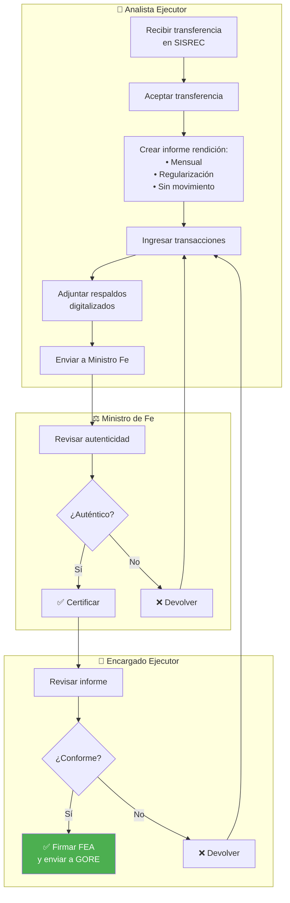
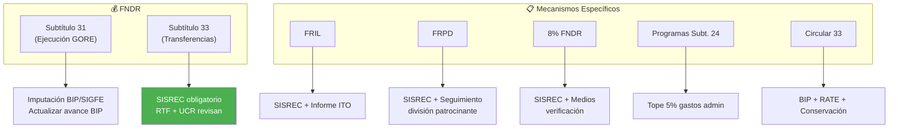
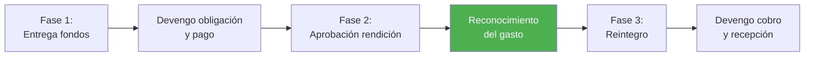
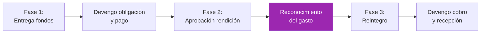
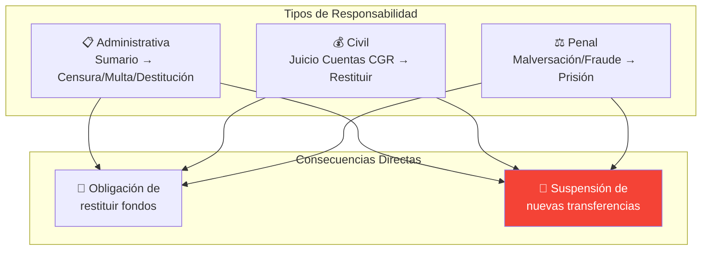

---
_manifest:
  urn: urn:gn:kb:bpmn-d08-rendiciones
  provenance:
    created_by: FS
    created_at: '2026-01-29'
    source: "GORE \xD1uble"
version: 2.0.0
status: published
tags:
- gore-nuble
- gobierno-regional
- bpmn
- rendiciones
- finanzas
- gn
lang: es
---

# D08: Gestión de Rendiciones de Cuentas

## Metadatos del Dominio

| Campo | Valor |
| :--- | :--- |
| **Criticidad** | 🔴 Crítica |
| **Dueño** | UCR/DAF |
| **Procesos** | 3 |
| **Subprocesos** | ~10 |

## Mapa General del Dominio

## P1: Rendición Tradicional (sin SISREC)

| Atributo | Detalle |
| :--- | :--- |
| **SLA** | 18 días hábiles GORE + 15 días EE |
| **Estado** | En transición a SISREC |

### Diagrama de Flujo P1

### Plazos por Etapa P1

| Etapa | Plazo | Responsable |
| :--- | :--- | :--- |
| Presentación | 15 días hábiles mes siguiente | Entidad Ejecutora |
| Recepción y registro | 2 días hábiles | Oficina de Partes |
| Asignación a revisor | 2 días hábiles | UCR/DAF |
| Revisión técnico-financiera | 7 días hábiles | RTF |
| Control final | 4 días hábiles | UCR/DAF |
| Contabilización | 2 días hábiles | UCR/DAF |
| Archivo | 1 día hábil | UCR/DAF |

## P2: Rendición vía SISREC

| Atributo | Detalle |
| :--- | :--- |
| **Plataforma** | SISREC CGR |
| **Obligatoriedad** | Resolución 1858/2023 CGR |

### Visión General SISREC

### Flujo Entidad Otorgante (GORE) SISREC

### Flujo Entidad Ejecutora SISREC

### Tipos de Informe SISREC

| Tipo | Uso |
| :--- | :--- |
| **Mensual** | Rendición regular con transacciones |
| **Regularización** | Corrección de observaciones |
| **Sin Movimiento** | Período sin gastos |

## P3: Rendición por Tipología de Fondos

| Atributo | Detalle |
| :--- | :--- |
| **Tipologías** | 7 tipos de fondos |

### Clasificación de Fondos

### Requisitos por Tipología

| Fondo | Vía | Requisitos Especiales |
| :--- | :--- | :--- |
| **FNDR Subt. 31** | BIP + SIGFE | Actualizar avance físico-financiero |
| **FNDR Subt. 33** | SISREC | RTF revisa coherencia técnica |
| **FRIL** | SISREC | Considerar informe ITO, SNI |
| **FRPD** | SISREC | Seguimiento metas por división |
| **8% FNDR** | SISREC | Medios verificación, gastos prohibidos |
| **Programas Subt. 24** | SISREC | Tope 5% gastos administración |
| **Circular 33** | BIP + SISREC | RATE conservación |

## Procedimientos Contables SIGFE

### F07: Transferencias a Sector Privado

### F08: Transferencias a Sector Público

> **Regla Específica**: Para servicios públicos no consolidables, el devengo del gasto ocurre al aprobar la rendición.

## Marco Normativo

| Norma | Alcance |
| :--- | :--- |
| **Resolución 30/2015 CGR** | Procedimiento general |
| **Resolución 1858/2023 CGR** | Uso obligatorio SISREC |
| **Ley 19.862** | Registro Colaboradores Estado |
| **Ley 21.719** | Protección Datos Personales |

### Artículos Clave Res. 30/2015

| Artículo | Contenido |
| :--- | :--- |
| Art. 2 | Constitución expediente |
| Art. 4-5 | Documentación auténtica |
| Art. 10 | Expediente de rendición |
| Art. 13 | Gastos post-tramitación |
| **Art. 18** | Prohibe nuevos fondos si hay rendiciones pendientes |
| **Art. 31** | Obligación de restituir fondos |

## Expediente de Rendición

### Componentes del Expediente

| Componente | Descripción |
| :--- | :--- |
| Informe de Rendición | Documento formal del ejecutor |
| Comprobantes de Ingreso | Recepción de fondos |
| Comprobantes de Egreso | Facturas, boletas, contratos |
| Comprobantes de Traspaso | Operaciones sin efectivo |
| Registro Ley 19.862 | Aplicable a privados |
| Medios de Verificación | Fotos, listas, informes |

### Requisitos de Documentación Auténtica

| Soporte | Requisito |
| :--- | :--- |
| **Papel** | Original o copia autentificada |
| **Electrónico** | Firma electrónica según Ley 19.799 |
| **Digitalizado** | Autentificado por Ministro de Fe |

## Responsabilidades y Sanciones

## Control y Transparencia

### Mecanismos de Control Interno

| Mecanismo | Responsable |
| :--- | :--- |
| Auditorías selectivas | Unidad de Control |
| Listas de chequeo | UCR/RTF |
| Seguimiento físico-financiero | RTF |

### Fiscalización Externa

| Organismo | Función |
| :--- | :--- |
| **CGR** | Juzgamiento cuentas, auditorías, SISREC |
| **DIPRES** | Monitoreo ejecución vía SIGFE |

### Obligaciones de Transparencia

| Obligación | Detalle |
| :--- | :--- |
| Glosa 08 | Información corporaciones y fundaciones |
| Glosa 16 | Cartera proyectos, acuerdos CORE |

## Sistemas Involucrados

| Sistema | Función |
| :--- | :--- |
| `SYS-SISREC` | Rendición electrónica CGR |
| `SYS-SIGFE` | Contabilización |
| `SYS-BIP-SNI` | Avance físico-financiero |
| `SYS-FIRMAGOB` | Firma Electrónica Avanzada |
