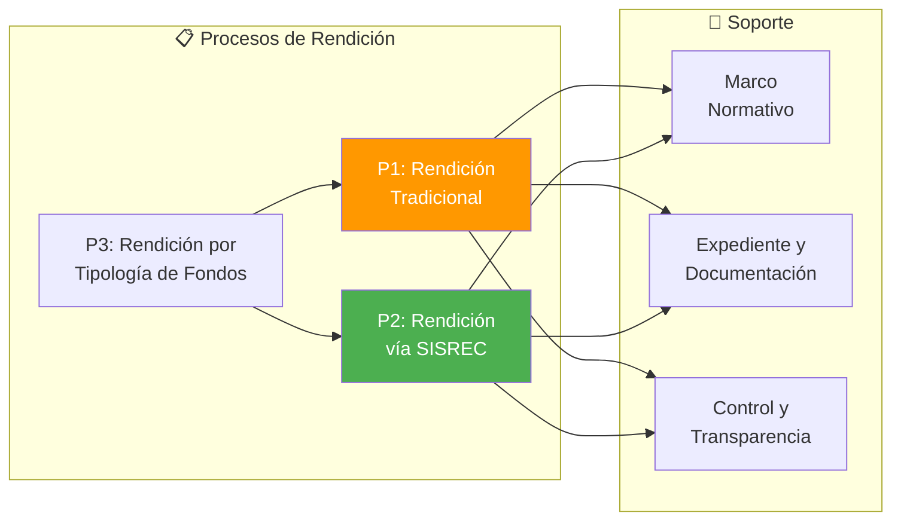
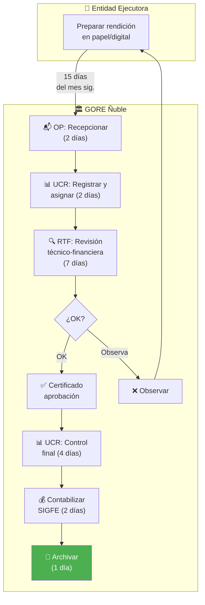
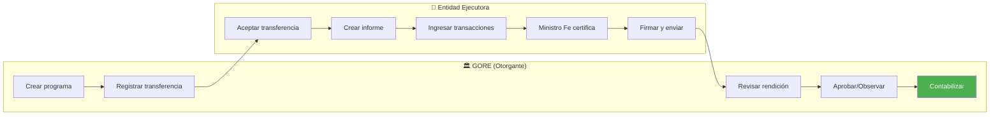
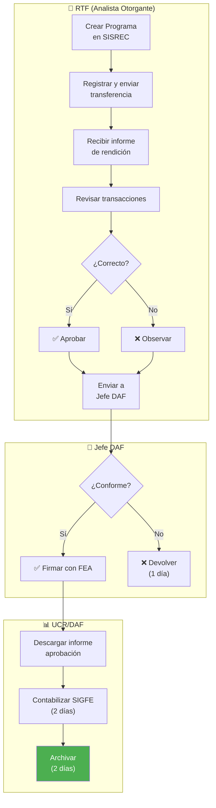
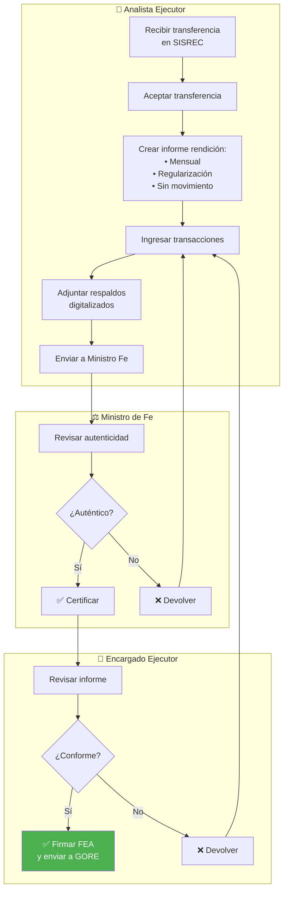
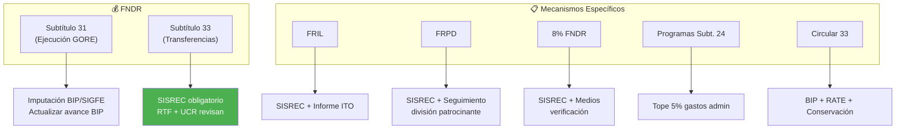
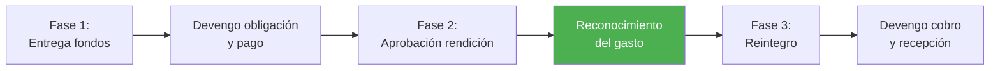
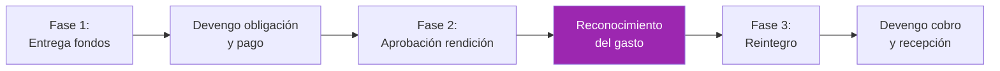
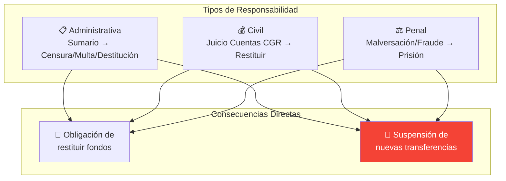

---
_manifest:
  urn: urn:gn:kb:bpmn-d08-rendiciones
  provenance:
    created_by: gn_rebuild.py
    created_at: '2026-03-09'
    source: domains/gn/04_habilitadores/arquitectura/bpmn/D08_rendiciones_koda.yml
version: 2.0.0
status: published
tags:
- gore-nuble
- gobierno-regional
- bpmn
- rendiciones
- finanzas
- gn
lang: es
extensions:
  gn:
    source_paths:
    - domains/gn/04_habilitadores/arquitectura/bpmn/D08_rendiciones_koda.yml
    source_hashes:
      domains/gn/04_habilitadores/arquitectura/bpmn/D08_rendiciones_koda.yml: 07c56ac7ee69f6a94324af64f09082686f9e5623274fcdf1f9ae1a527b770c22
    source_type: koda_yaml
    transformation_mode: korafy_direct
    fs: 100
    cr: 1.03
    run_id: gn-smoke
    review_gate: auto
    scope_statement: null
    dependencies: []
    expected_sections:
    - Contenido
    document_family: generic
    publication_class: knowledge
    skeleton_count: 3
    meat_count: 11
    fat_count: 0
    cr_justification: Fuente altamente estructurada o derivacion de alcance acotado.
    evidence_path: build/gn-rebuild/gn-smoke/evidence/bpmn__bpmn-d08-rendiciones.md.json
---

# BPMN D08: Gestión de Rendiciones de Cuentas

## Metadatos Dominio

### Criticidad
🔴 Crítica

### Dueno
UCR/DAF

### Procesos
3

### Subprocesos
~10

## Body MD
\# D08: Gestión de Rendiciones de Cuentas
\## Metadatos del Dominio
| Campo           | Valor                                                                                                                                                  |
| --------------- | ------------------------------------------------------------------------------------------------------------------------------------------------------ |
| **ID**          | `DOM-RENDICIONES`                                                                                                                                      |
| **Criticidad**  | 🔴 Crítica                                                                                                                                              |
| **Dueño**       | UCR/DAF                                                                                                                                                |
| **Procesos**    | 3                                                                                                                                                      |
| **Subprocesos** | ~10                                                                                                                                                    |
| **Ref. Fuente** | [kb_gn_054_bpmn_c4_koda.yml](file:///Users/felixsanhueza/Developer/gorenuble/knowledge/domains/gn/arquitectura/kb_gn_054_bpmn_c4_koda.yml) L.3735-4140 |
---
\## Mapa General del Dominio

```mermaid
flowchart LR
    subgraph PROCESOS["📋 Procesos de Rendición"]
        P1["P1: Rendición<br/>Tradicional"]
        P2["P2: Rendición<br/>vía SISREC"]
        P3["P3: Rendición por<br/>Tipología de Fondos"]
    end
    subgraph SOPORTE["🔧 Soporte"]
        S1["Marco<br/>Normativo"]
        S2["Expediente y<br/>Documentación"]
        S3["Control y<br/>Transparencia"]
    end
    P1 --> S1 & S2 & S3
    P2 --> S1 & S2 & S3
    P3 --> P1 & P2
    style P2 fill:#4CAF50,color:#fff
    style P1 fill:#FF9800,color:#fff
```
---
\## P1: Rendición Tradicional (sin SISREC)
| Campo      | Valor                                |
| ---------- | ------------------------------------ |
| **ID**     | `BPMN-GN-RENDICIONES-TRADICIONAL-01` |
| **SLA**    | 18 días hábiles GORE + 15 días EE    |
| **Estado** | En transición a SISREC               |
\### Diagrama de Flujo

```mermaid
flowchart TD
    subgraph EE["🏢 Entidad Ejecutora"]
        A["Preparar rendición<br/>en papel/digital"]
    end
    subgraph GORE["🏛️ GORE Ñuble"]
        B["📬 OP: Recepcionar<br/>(2 días)"]
        C["📊 UCR: Registrar y<br/>asignar (2 días)"]
        D["🔍 RTF: Revisión<br/>técnico-financiera<br/>(7 días)"]
        E{"¿OK?"}
        F["✅ Certificado<br/>aprobación"]
        G["❌ Observar"]
        H["📊 UCR: Control<br/>final (4 días)"]
        I["💰 Contabilizar<br/>SIGFE (2 días)"]
        J["📁 Archivar<br/>(1 día)"]
    end
    A -->|"15 días<br/>del mes sig."| B --> C --> D --> E
    E -->|"OK"| F --> H --> I --> J
    E -->|"Observa"| G --> A
    style J fill:#4CAF50,color:#fff
```
\### Plazos por Etapa
| Etapa                       | Plazo                         | Responsable       |
| --------------------------- | ----------------------------- | ----------------- |
| Presentación                | 15 días hábiles mes siguiente | Entidad Ejecutora |
| Recepción y registro        | 2 días hábiles                | Oficina de Partes |
| Asignación a revisor        | 2 días hábiles                | UCR/DAF           |
| Revisión técnico-financiera | 7 días hábiles                | RTF               |
| Control final               | 4 días hábiles                | UCR/DAF           |
| Contabilización             | 2 días hábiles                | UCR/DAF           |
| Archivo                     | 1 día hábil                   | UCR/DAF           |
---
\## P2: Rendición vía SISREC
| Campo           | Valor                    |
| --------------- | ------------------------ |
| **ID**          | `BPMN-GN-REND-SISREC-01` |
| **Plataforma**  | SISREC CGR               |
| **Obligatorio** | Sí (Res. 1858/2023 CGR)  |
\### Visión General

```mermaid
flowchart LR
    subgraph GORE["🏛️ GORE (Otorgante)"]
        G1["Crear programa"]
        G2["Registrar transferencia"]
        G3["Revisar rendición"]
        G4["Aprobar/Observar"]
        G5["Contabilizar"]
    end
    subgraph EE["🏢 Entidad Ejecutora"]
        E1["Aceptar transferencia"]
        E2["Crear informe"]
        E3["Ingresar transacciones"]
        E4["Ministro Fe certifica"]
        E5["Firmar y enviar"]
    end
    G1 --> G2 --> E1 --> E2 --> E3 --> E4 --> E5 --> G3 --> G4 --> G5
    style G5 fill:#4CAF50,color:#fff
```
\### Flujo Entidad Otorgante (GORE)

```mermaid
flowchart TD
    subgraph RTF["👤 RTF (Analista Otorgante)"]
        A["Crear Programa<br/>en SISREC"]
        B["Registrar y enviar<br/>transferencia"]
        C["Recibir informe<br/>de rendición"]
        D["Revisar transacciones"]
        E{"¿Correcto?"}
        F["✅ Aprobar"]
        G["❌ Observar"]
        H["Enviar a<br/>Jefe DAF"]
    end
    subgraph JEFE_DAF["👔 Jefe DAF"]
        I{"¿Conforme?"}
        J["✅ Firmar con FEA"]
        K["❌ Devolver<br/>(1 día)"]
    end
    subgraph UCR["📊 UCR/DAF"]
        L["Descargar informe<br/>aprobación"]
        M["Contabilizar SIGFE<br/>(2 días)"]
        N["Archivar<br/>(2 días)"]
    end
    A --> B --> C --> D --> E
    E -->|"Sí"| F --> H
    E -->|"No"| G --> H
    H --> I
    I -->|"Sí"| J --> L --> M --> N
    I -->|"No"| K
    style N fill:#4CAF50,color:#fff
```
\### Flujo Entidad Ejecutora

```mermaid
flowchart TD
    subgraph ANALISTA["👤 Analista Ejecutor"]
        A["Recibir transferencia<br/>en SISREC"]
        B["Aceptar transferencia"]
        C["Crear informe rendición:<br/>• Mensual<br/>• Regularización<br/>• Sin movimiento"]
        D["Ingresar transacciones"]
        E["Adjuntar respaldos<br/>digitalizados"]
        F["Enviar a Ministro Fe"]
    end
    subgraph MF["⚖️ Ministro de Fe"]
        G["Revisar autenticidad"]
        H{"¿Auténtico?"}
        I["✅ Certificar"]
        J["❌ Devolver"]
    end
    subgraph ENCARGADO["👔 Encargado Ejecutor"]
        K["Revisar informe"]
        L{"¿Conforme?"}
        M["✅ Firmar FEA<br/>y enviar a GORE"]
        N["❌ Devolver"]
    end
    A --> B --> C --> D --> E --> F --> G --> H
    H -->|"Sí"| I --> K --> L
    H -->|"No"| J --> D
    L -->|"Sí"| M
    L -->|"No"| N --> D
    style M fill:#4CAF50,color:#fff
```
\### Tipos de Informe
| Tipo               | Uso                                 |
| ------------------ | ----------------------------------- |
| **Mensual**        | Rendición regular con transacciones |
| **Regularización** | Corrección de observaciones         |
| **Sin Movimiento** | Período sin gastos                  |
---
\## P3: Rendición por Tipología de Fondos
| Campo          | Valor                       |
| -------------- | --------------------------- |
| **ID**         | `BPMN-GN-REND-TIPOLOGIA-01` |
| **Tipologías** | 7 tipos de fondos           |
\### Tipologías de Fondos

```mermaid
flowchart TD
    subgraph FNDR["💰 FNDR"]
        F1["Subtítulo 31<br/>(Ejecución GORE)"]
        F2["Subtítulo 33<br/>(Transferencias)"]
    end
    subgraph MECANISMOS["📋 Mecanismos Específicos"]
        M1["FRIL"]
        M2["FRPD"]
        M3["8% FNDR"]
        M4["Programas Subt. 24"]
        M5["Circular 33"]
    end
    F1 --> R1["Imputación BIP/SIGFE<br/>Actualizar avance BIP"]
    F2 --> R2["SISREC obligatorio<br/>RTF + UCR revisan"]
    M1 --> R3["SISREC + Informe ITO"]
    M2 --> R4["SISREC + Seguimiento<br/>división patrocinante"]
    M3 --> R5["SISREC + Medios<br/>verificación"]
    M4 --> R6["Tope 5% gastos admin"]
    M5 --> R7["BIP + RATE + Conservación"]
    style R2 fill:#4CAF50,color:#fff
```
\### Requisitos por Tipología
| Fondo                  | Vía          | Requisitos Especiales                  |
| ---------------------- | ------------ | -------------------------------------- |
| **FNDR Subt. 31**      | BIP + SIGFE  | Actualizar avance físico-financiero    |
| **FNDR Subt. 33**      | SISREC       | RTF revisa coherencia técnica          |
| **FRIL**               | SISREC       | Considerar informe ITO, SNI            |
| **FRPD**               | SISREC       | Seguimiento metas por división         |
| **8% FNDR**            | SISREC       | Medios verificación, gastos prohibidos |
| **Programas Subt. 24** | SISREC       | Tope 5% gastos administración          |
| **Circular 33**        | BIP + SISREC | RATE conservación                      |
---
\## Procedimientos Contables SIGFE
\### F07: Transferencias a Sector Privado

```mermaid
flowchart LR
    A["Fase 1:<br/>Entrega fondos"] --> B["Devengo obligación<br/>y pago"]
    B --> C["Fase 2:<br/>Aprobación rendición"]
    C --> D["Reconocimiento<br/>del gasto"]
    D --> E["Fase 3:<br/>Reintegro"]
    E --> F["Devengo cobro<br/>y recepción"]
    style D fill:#4CAF50,color:#fff
```
\### F08: Transferencias a Sector Público

```mermaid
flowchart LR
    A["Fase 1:<br/>Entrega fondos"] --> B["Devengo obligación<br/>y pago"]
    B --> C["Fase 2:<br/>Aprobación rendición"]
    C --> D["Reconocimiento<br/>del gasto"]
    D --> E["Fase 3:<br/>Reintegro"]
    E --> F["Devengo cobro<br/>y recepción"]
    style D fill:#9C27B0,color:#fff
```
> ⚠️ **Nota**: Para servicios públicos no consolidables, el devengo del gasto ocurre al aprobar la rendición.
---
\## Marco Normativo
| Norma                        | Alcance                       |
| ---------------------------- | ----------------------------- |
| **Resolución 30/2015 CGR**   | Procedimiento general         |
| **Resolución 1858/2023 CGR** | Uso obligatorio SISREC        |
| **Ley 19.862**               | Registro Colaboradores Estado |
| **Ley 21.719**               | Protección Datos Personales   |
\### Artículos Clave Res. 30/2015
| Artículo    | Contenido                                             |
| ----------- | ----------------------------------------------------- |
| Art. 2      | Constitución expediente                               |
| Art. 4-5    | Documentación auténtica                               |
| Art. 10     | Expediente de rendición                               |
| Art. 13     | Gastos post-tramitación                               |
| **Art. 18** | ⚠️ Prohibe nuevos fondos si hay rendiciones pendientes |
| **Art. 31** | Obligación de restituir fondos                        |
---
\## Expediente de Rendición
\### Componentes
| Componente               | Descripción                   |
| ------------------------ | ----------------------------- |
| Informe de Rendición     | Documento formal del ejecutor |
| Comprobantes de Ingreso  | Recepción de fondos           |
| Comprobantes de Egreso   | Facturas, boletas, contratos  |
| Comprobantes de Traspaso | Operaciones sin efectivo      |
| Registro Ley 19.862      | Si aplica (privados)          |
| Medios de Verificación   | Fotos, listas, informes       |
\### Documentación Auténtica
| Soporte          | Requisito                          |
| ---------------- | ---------------------------------- |
| **Papel**        | Original o copia autentificada     |
| **Electrónico**  | Firma electrónica según Ley 19.799 |
| **Digitalizado** | Autentificado por Ministro de Fe   |
---
\## Responsabilidades y Sanciones

```mermaid
flowchart TD
    subgraph TIPOS["Tipos de Responsabilidad"]
        R1["📋 Administrativa<br/>Sumario → Censura/Multa/Destitución"]
        R2["💰 Civil<br/>Juicio Cuentas CGR → Restituir"]
        R3["⚖️ Penal<br/>Malversación/Fraude → Prisión"]
    end
    subgraph CONSECUENCIAS["Consecuencias Directas"]
        C1["🔄 Obligación de<br/>restituir fondos"]
        C2["🚫 Suspensión de<br/>nuevas transferencias"]
    end
    R1 & R2 & R3 --> C1 & C2
    style C2 fill:#f44336,color:#fff
```
---
\## Control y Transparencia
\### Control Interno
| Mecanismo                     | Responsable       |
| ----------------------------- | ----------------- |
| Auditorías selectivas         | Unidad de Control |
| Listas de chequeo             | UCR/RTF           |
| Seguimiento físico-financiero | RTF               |
\### Fiscalización Externa
| Organismo  | Función                                 |
| ---------- | --------------------------------------- |
| **CGR**    | Juzgamiento cuentas, auditorías, SISREC |
| **DIPRES** | Monitoreo ejecución vía SIGFE           |
\### Transparencia
| Obligación | Detalle                          |
| ---------- | -------------------------------- |
| Glosa 08   | Info corporaciones/fundaciones   |
| Glosa 16   | Cartera proyectos, acuerdos CORE |
---
\## Sistemas Involucrados
| Sistema        | Función                    |
| -------------- | -------------------------- |
| `SYS-SISREC`   | Rendición electrónica CGR  |
| `SYS-SIGFE`    | Contabilización            |
| `SYS-BIP-SNI`  | Avance físico-financiero   |
| `SYS-FIRMAGOB` | Firma Electrónica Avanzada |
---
\## Referencias Cruzadas
| Dominio Relacionado                                                                                                                            | Vínculo                  |
| ---------------------------------------------------------------------------------------------------------------------------------------------- | ------------------------ |
| [D03 Gestión IPR](file:///Users/felixsanhueza/Developer/gorenuble/knowledge/domains/gn/arquitectura/bpmn/D03_gestion_ipr.md)                   | Cierre financiero Fase 7 |
| [D02 Ciclo Presupuestario](file:///Users/felixsanhueza/Developer/gorenuble/knowledge/domains/gn/arquitectura/bpmn/D02_ciclo_presupuestario.md) | Contabilización, devengo |
---
*Última actualización: 2025-12-16*
