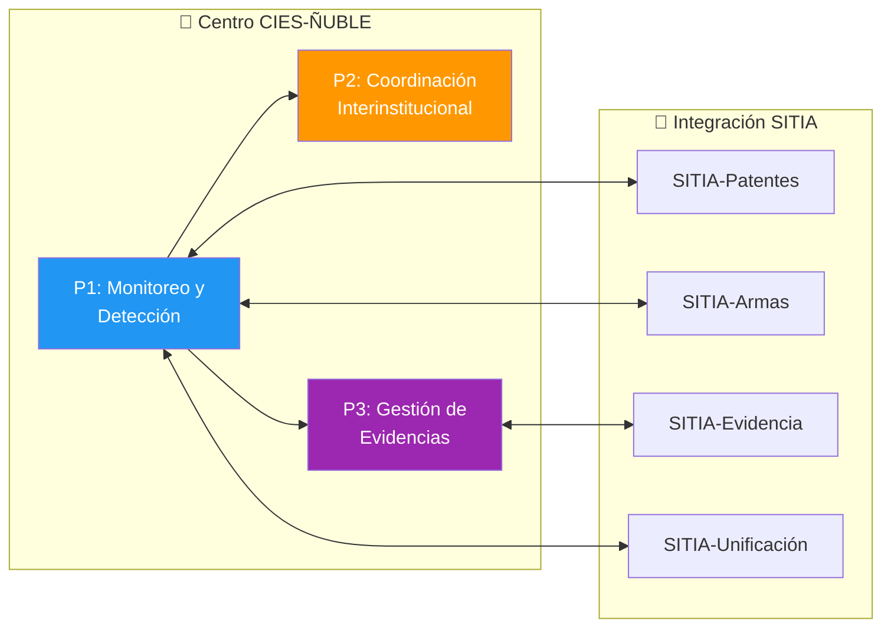
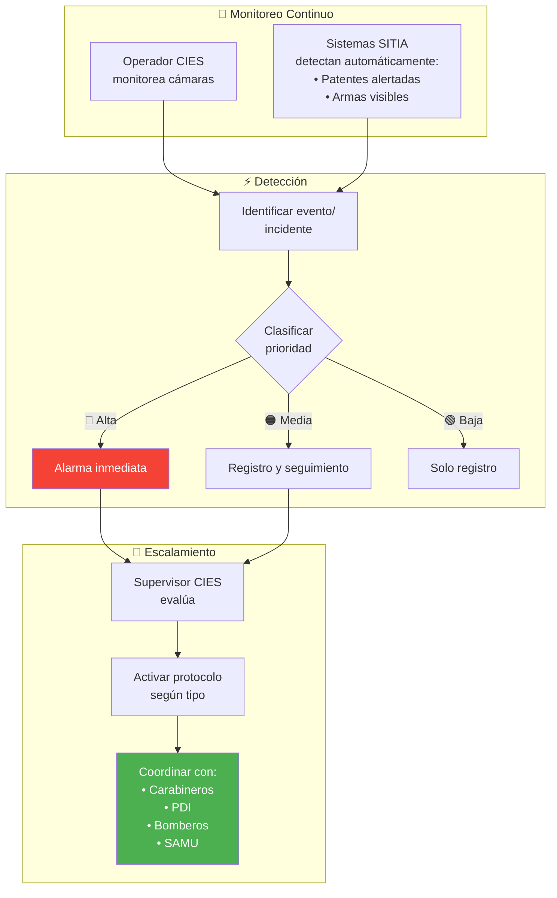
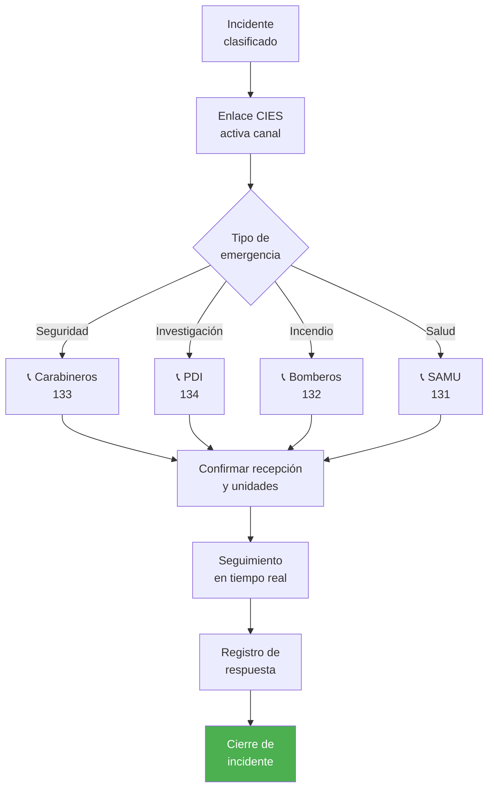
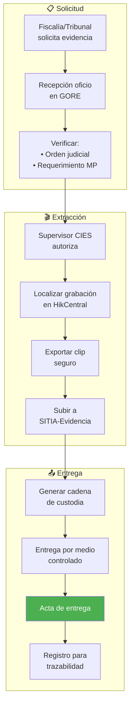
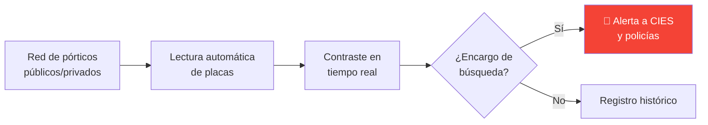
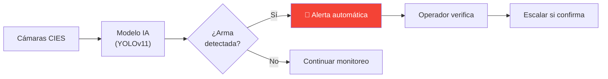
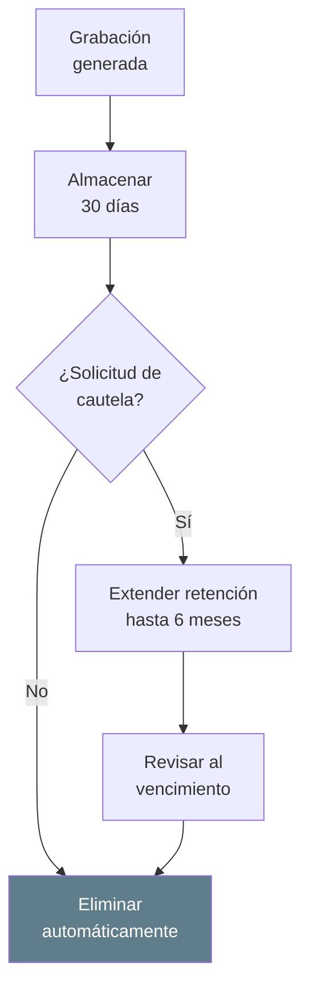

---
_manifest:
  urn: "urn:gn:kb:bpmn-d09-cies-sitia"
  provenance:
    created_by: "FS"
    created_at: "2026-01-29"
    source: "GORE Ñuble"
version: "2.0.0"
status: published
tags: [gore-nuble, gobierno-regional, seguridad-publica, cies, sitia, bpmn]
lang: es
---

# D09: Gestión Operativa CIES-SITIA (Seguridad Pública)

## Metadatos del Dominio

| Atributo | Detalle |
| :--- | :--- |
| **Identificador** | `DOM-CIES` |
| **Criticidad** | 🟠 Alta |
| **Responsable** | Supervisor CIES |
| **Alcance** | 3 Procesos principales / ~8 Subprocesos |
| **Referencia** | kb_gn_054_bpmn_c4_koda.yml (L.4142-4306) |

## Mapa General del Dominio

## Contexto Operativo

| Dimensión | Especificación |
| :--- | :--- |
| **Horario** | 16 horas (08:00-00:00) / Proyección 24/7 |
| **Localización** | Sala de monitoreo GORE Ñuble |
| **Interoperabilidad** | Policías, emergencias, 21 municipios |
| **Base Legal** | Ley 21.427 (Seguridad), Ley 20.965 (Cámaras), Ley 20.502 (Ministerio Interior) |

## P1: Monitoreo, Detección y Escalamiento

| Control | Valor |
| :--- | :--- |
| **ID Proceso** | `BPMN-GN-CIES-SITIA-MONITOREO-01` |
| **Plataforma Base** | HikCentral VMS |

### Flujo de Monitoreo

### Clasificación de Incidentes

| Prioridad | Criterio | Acción Requerida |
| :--- | :--- | :--- |
| 🔴 **Alta** | Delito flagrante / Riesgo vital | Activación y despacho inmediato |
| 🟠 **Media** | Comportamiento anómalo / Sospecha | Monitoreo activo y evaluación |
| 🟢 **Baja** | Evento administrativo / Registro | Documentación en bitácora |

## P2: Coordinación Interinstitucional

| Control | Valor |
| :--- | :--- |
| **ID Proceso** | `BPMN-GN-CIES-SITIA-COORD-01` |
| **Contrapartes** | Carabineros, PDI, Bomberos, SAMU, Municipios |

### Flujo de Despacho

### Canales de Comunicación

| Medio | Aplicación Operativa |
| :--- | :--- |
| **Radio VHF** | Enlace directo con cuadrantes policiales |
| **Líneas CENCO** | Comunicación con centrales de emergencia |
| **WhatsApp Inst.** | Coordinación con seguridad municipal |
| **SITIA** | Notificación e integración nacional |

## P3: Gestión de Evidencias Digitales

| Control | Valor |
| :--- | :--- |
| **ID Proceso** | `BPMN-GN-CIES-SITIA-EVIDENCIA-01` |
| **Repositorio** | SITIA-Evidencia (Genetec Clearance) |

### Ciclo de Vida de Evidencia

### Estándares de Cadena de Custodia

| Componente | Verificación de Integridad |
| :--- | :--- |
| **Algoritmo Hash** | Garantía de no alteración de bits |
| **Metadatos** | Estampado de tiempo y georreferencia (cámara) |
| **Logs de Acceso** | Trazabilidad completa de manipulación |
| **Firma Digital** | Certificación de origen y autenticidad |

## Capacidades SITIA

### SITIA-Patentes: Lectura y Contraste

### SITIA-Armas: Detección Mediante IA

## Privacidad y Retención de Datos

### Políticas de Almacenamiento

| Concepto | Regla Aplicable |
| :--- | :--- |
| **Retención Estándar** | 30 días corridos |
| **Disposición Final** | Eliminación segura irreversible |
| **Cautela Ciudadana** | Extensión hasta 6 meses (solicitud víctima/testigo) |

### Flujo de Cumplimiento Normativo

### Restricciones Legales (Ley 19.628)

*   **Licitud:** Solo fines de seguridad pública y persecución penal.
*   **Finalidad:** Uso exclusivo según convenios interinstitucionales.
*   **Proporcionalidad:** Captación limitada al espacio público autorizado.

## Sostenibilidad Operativa

### Estructura de Financiamiento

| Componente | Origen de Fondos |
| :--- | :--- |
| **Personal CIES** | Presupuesto anual GORE (Subtítulo 21) |
| **Mantenimiento HW** | Garantía técnica (22 meses) / Mantención GORE |
| **Soporte SITIA** | Convenio marco Subsecretaría Prevención del Delito (SPD) |

### Ciclo de Mantenimiento

## Ecosistema de Sistemas

| Sistema | Funcionalidad Clave |
| :--- | :--- |
| `SYS-HIKCENTRAL` | VMS para gestión de videovigilancia regional |
| `SYS-SITIA` | Plataforma nacional de integración de datos |
| `SYS-SITIA-EVIDENCIA` | Portal de gestión y entrega de clips judiciales |
| `SYS-SITIA-PATENTES` | Motor de lectura y alerta de placas vehiculares |
| `SYS-SITIA-ARMAS` | Módulo de inteligencia artificial para detección de armas |

## Marco Normativo Aplicable

| Norma | Ámbito de Aplicación |
| :--- | :--- |
| **Ley 21.427** | Modernización de la gestión policial y seguridad |
| **Ley 20.965** | Regulación de cámaras de vigilancia en espacios públicos |
| **Ley 20.502** | Funcionamiento de servicios de seguridad y emergencias |
| **Ley 19.628** | Protección de la vida privada y datos sensibles |
| **Ley 21.719** | Nueva ley de protección de datos personales |

## Referencias Cruzadas

| Dominio Relacionado | Vínculo Operativo |
| :--- | :--- |
| D01 Actos Administrativos | Formalización de convenios GORE-Policiales |
| D12 Gestión Territorial | Ubicación estratégica de puntos de monitoreo |
