---
_manifest:
  urn: urn:gn:kb:bpmn-d10-geoespacial-ide
  provenance:
    created_by: FS
    created_at: '2026-01-29'
    source: "GORE \xD1uble"
version: 2.0.0
status: published
tags:
- gore-nuble
- gobierno-regional
- geoespacial
- ide
- bpmn
- gn
lang: es
---

# D10: Gestión de Información Geoespacial (IDE/Geonodo)

## Metadatos del Dominio

| Campo | Valor |
| :--- | :--- |
| ID | `DOM-GEO` |
| Criticidad | 🟡 Media |
| Dueño | Coordinador Regional IDE |
| Procesos | 3 (P1: Ciclo Vida, P2: Publicación, P3: Gobernanza) |
| Subprocesos | ~10 |
| Fuente | kb_gn_054_bpmn_c4_koda.yml L.4308-4478 |

## Mapa General del Dominio

```mermaid
flowchart LR
    subgraph CICLO["🗺️ Ciclo de Datos Geoespaciales"]
        P1["P1: Ciclo de Vida<br/>de Datos"]
        P2["P2: Publicación e<br/>Interoperabilidad"]
        P3["P3: Gobernanza<br/>de Datos"]
    end

    subgraph INFRAESTRUCTURA["🏗️ Infraestructura"]
        I1["Geonodo"]
        I2["Servicios OGC"]
        I3["Geoportal"]
        I4["API"]
    end

    P1 --> P2 --> P3
    P2 <--> I1 & I2 & I3 & I4

    style P1 fill:#2196F3,color:#fff
    style P2 fill:#4CAF50,color:#fff
    style P3 fill:#9C27B0,color:#fff
```

## Marco Estratégico

| Aspecto | Alineamiento |
| :--- | :--- |
| ERD Ñuble | Gestión territorial informada |
| IDE Chile | Interoperabilidad nacional |
| ISO/TC 211 | Estándares geoespaciales |
| OGC | Servicios web abiertos |

## P1: Ciclo de Vida de Datos Geoespaciales

| Atributo | Detalle |
| :--- | :--- |
| ID | `BPMN-GN-GEO-FLUJO-INST-01` |
| Fases | 6 (Planificar, Capturar, Calidad, Documentar, Publicar, Usar) |

### Flujo de Trabajo

```mermaid
flowchart TD
    subgraph PLANIFICAR["📋 1. Planificar"]
        A["Definir necesidades<br/>(UN-IGIF)"]
        B["Especificaciones<br/>(ISO 19131)"]
        C["Catálogo objetos<br/>(ISO 19110)"]
    end

    subgraph CAPTURAR["📥 2. Capturar/Integrar"]
        D["Formularios/<br/>recolectores"]
        E["ETL desde fuentes"]
        F["Control de versiones"]
    end

    subgraph CALIDAD["✅ 3. Calidad"]
        G["QA/QC<br/>(ISO 19157)"]
        H["Validaciones<br/>automatizadas"]
    end

    subgraph DOCUMENTAR["📝 4. Documentar"]
        I["Metadatos<br/>(ISO 19115-1)"]
        J["URL descarga/<br/>servicios"]
        K["Licencias"]
    end

    subgraph PUBLICAR["🌐 5. Publicar"]
        L["WMS/WFS/WCS"]
        M["API endpoints"]
        N["Geoportal"]
        O["Registro CSW"]
    end

    subgraph USAR["📊 6. Usar y Evaluar"]
        P["Tableros/<br/>dashboards"]
        Q["Indicadores<br/>uso/impacto"]
        R["Retroalimentación"]
    end

    A --> B --> C --> D --> E --> F --> G --> H --> I --> J --> K --> L --> M --> N --> O --> P --> Q --> R
    R -.->|"Mejora continua"| A

    style N fill:#4CAF50,color:#fff
```

### Responsabilidades por Etapa

| Etapa | Responsable |
| :--- | :--- |
| Planificar | Coord. Regional IDE |
| Capturar/Calidad | UGIT / Equipo SIG |
| Documentar/Publicar | UGIT / Equipo SIG |
| Usar y Evaluar | Divisiones usuarias |

## P2: Publicación e Interoperabilidad

| Atributo | Detalle |
| :--- | :--- |
| ID | `BPMN-GN-GEO-PUBLICACION-DETALLE-01` |

### Servicios OGC y Formatos

```mermaid
flowchart LR
    subgraph CAPAS["📦 Datos Procesados"]
        A["Capa temática"]
    end

    subgraph SERVICIOS["🌐 Servicios OGC"]
        B["WMS<br/>(visualización)"]
        C["WFS<br/>(entidades)"]
        D["WCS<br/>(coberturas)"]
    end

    subgraph FORMATOS["📄 Formatos"]
        E["GeoJSON"]
        F["GML"]
        G["KML"]
        H["Shapefile"]
    end

    A --> B & C & D
    C --> E & F & G & H

    style B fill:#2196F3,color:#fff
    style C fill:#4CAF50,color:#fff
```

### Arquitectura API Institucional

```mermaid
flowchart TD
    A["Cliente externo"] --> B{"Endpoint"}
    B -->|"/datasets"| C["Listar conjuntos"]
    B -->|"/datasets/{id}"| D["Detalle conjunto"]
    B -->|"/tiles/{z}/{x}/{y}"| E["Teselas"]
    B -->|"/search"| F["Búsqueda avanzada"]
    C & D & E & F --> G["Respuesta JSON"]

    style G fill:#4CAF50,color:#fff
```

### Funcionalidades del Geoportal

| Función | Descripción |
| :--- | :--- |
| Búsqueda | Filtro por tema, palabra clave, ubicación |
| Previsualización | Visor WMS integrado |
| Descarga | Múltiples formatos (GeoJSON, KML, SHP) |
| Soporte | Tutoriales y guías por perfil de usuario |

## P3: Gobernanza de Datos Geoespaciales

| Atributo | Detalle |
| :--- | :--- |
| ID | `BPMN-GN-GEO-GOBERNANZA-01` |

### Estructura de Roles

```mermaid
flowchart TD
    subgraph COMITE["👥 Comité Geo Institucional"]
        A["Gobernador/a<br/>(Patrocinio)"]
    end

    subgraph OPERATIVO["⚙️ Nivel Operativo"]
        B["Coord. Regional IDE<br/>(Liderazgo)"]
        C["UGIT / Equipo SIG<br/>(Operación técnica)"]
        D["Puntos Focales<br/>Sectoriales"]
    end

    subgraph SOPORTE["🔧 Soporte"]
        E["Jurídica<br/>(Licencias)"]
        F["TI<br/>(Infraestructura)"]
        G["Comunicaciones<br/>(Difusión)"]
    end

    A --> B --> C & D
    B --> E & F & G

    style B fill:#4CAF50,color:#fff
```

### Trazabilidad y Licenciamiento

| Tipo de Capa | Licencia Recomendada | Proceso de Cambio |
| :--- | :--- | :--- |
| Datos abiertos | CC BY 4.0 | Cambio en capa detectado |
| Bases de datos | ODbL | Commit en GitHub institucional |
| Restringidos | Acuerdo específico | Actualización de metadatos |
| Todos | N/A | Notificación a consumidores |

## Ética de Datos Geoespaciales

| Principio | Aplicación |
| :--- | :--- |
| Minimización | Evitar granularidad innecesaria |
| Anonimización | Obligatoria en datos sensibles |
| Transparencia | Declaración de origen y licencias |
| No estigmatización | Prevención de visualizaciones dañinas |
| Calidad | Tratamiento como deber público |

## Plan de Implementación (180 días)

```mermaid
gantt
    title Plan IDE GORE Ñuble
    dateFormat  YYYY-MM-DD
    section Fase 0 (0-30)
    Comité Geo constituido           :a1, 2025-01-15, 15d
    Inventario y diagnóstico         :a2, 2025-01-20, 15d
    section Fase 1 (30-90)
    Política y guía metadatos        :b1, 2025-02-01, 30d
    Geonodo operativo                :b2, 2025-02-15, 30d
    Piloto 5 conjuntos               :b3, 2025-03-01, 30d
    section Fase 2 (90-150)
    Geoportal y API                  :c1, 2025-04-01, 30d
    Integración servicios externos   :c2, 2025-04-15, 30d
    section Fase 3 (150-180)
    Evaluación KPIs                  :d1, 2025-05-15, 15d
    Capacitación y plan anual        :d2, 2025-05-25, 15d
```

## Ecosistema Tecnológico y Normativo

### Sistemas Involucrados

| Sistema | Función |
| :--- | :--- |
| `SYS-GEONODO` | Plataforma geoespacial base |
| `SYS-CSW` | Catálogo de metadatos |
| `SYS-OGC-SERVICES` | Servidor WMS/WFS/WCS |
| `SYS-GEO-PORTAL` | Interfaz pública |
| `SYS-GEO-API` | Punto de acceso REST |
| `SYS-GITHUB-INSTITUCIONAL` | Control de versiones |

### Normativa Aplicable

| Norma | Alcance |
| :--- | :--- |
| ISO 19115-1 | Estándar de Metadatos |
| ISO 19157 | Control de Calidad de datos |
| ISO 19131 | Especificaciones de producto |
| Política IDE Chile | Marco de Interoperabilidad nacional |
| Ley 21.455 | Datos relativos a Cambio Climático |

## Referencias Cruzadas

| Dominio Relacionado | Vínculo Funcional |
| :--- | :--- |
| D03 Gestión IPR | Georreferenciación de proyectos de inversión |
| D09 CIES/SITIA | Ubicación de infraestructura (cámaras) |
